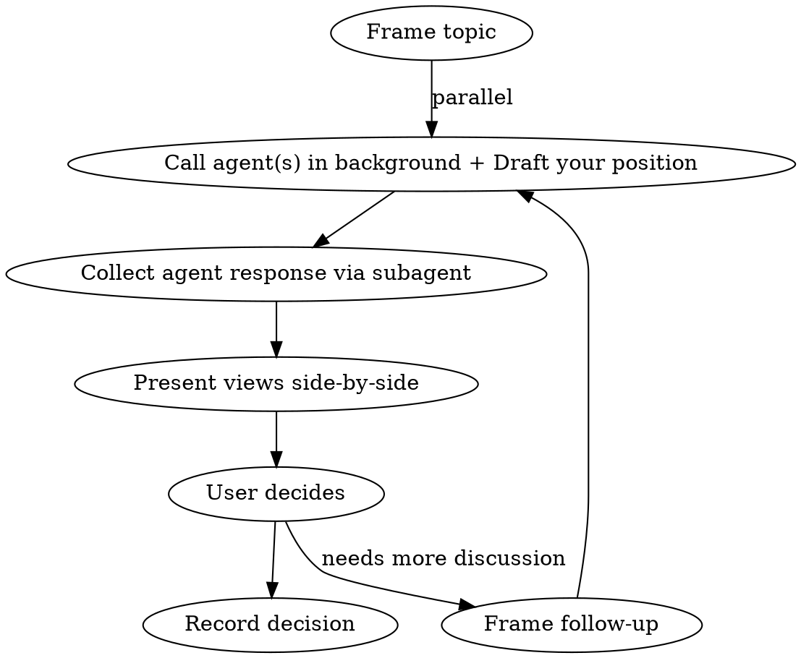

# Meeting

Structured multi-party deliberation within Claude Code. You moderate, external agents contribute via CLI, the user decides.

## Roles

| Role | Who | Responsibility |
|------|-----|----------------|
| Moderator | You (Claude Code) | Frame topics, synthesize views, drive toward decisions |
| Participant(s) | External agent(s) via CLI | Provide independent analysis on the same question |
| Decision Maker | User | Reviews all perspectives, makes final call |

## Workflow



**Key execution principle:** Call external agents FIRST (async), then draft your own position while they work. This maximizes parallelism and prevents your thinking from being blocked.

### 1. Frame the topic

State clearly:
- **Question**: What decision needs to be made?
- **Context**: What constraints or prior decisions apply?
- **Options** (if known): What are the candidate answers?

### 2. Call agent(s) + Draft your position (parallel)

**Do both at the same time:**

**2a. Launch agent call in background** using Bash with `run_in_background: true`:

```bash
codex exec --ephemeral -o /tmp/meeting_response.txt "
[CONTEXT]
Brief project context and any prior decisions already made.

[QUESTION]
The specific question being discussed.

[CONSTRAINTS]
- Only analyze, do not modify any files
- Be specific and opinionated
- If you disagree with any premise, say so
"
```

**2b. While agent runs**, draft your own position in the same message to the user.

**Tips for agent prompts:**
- Use `--ephemeral` to avoid polluting session history
- Always include "do not modify any files"
- Give enough context for the agent to form an independent opinion
- Ask for specific, opinionated answers, not hedged summaries

### 3. Collect agent response via subagent

Use a **Task subagent** to read and summarize the agent's response. This keeps the raw output (which can be very long) out of the main conversation context.

```
Task(subagent_type="general-purpose", prompt="
Read /tmp/meeting_response.txt. Summarize the agent's position on [topic]:
1. Which option did they pick?
2. Key arguments (3-5 bullet points)
3. Any concerns or caveats they raised
4. Any points that differ from or challenge this position: [your position summary]
Return a concise summary, not the raw text.
")
```

### 4. Present views side-by-side

Format for the user:

```
## Topic: [question]

### Claude Code's view
[your position + reasoning]

### Codex's view
[summarized from subagent]

### Points of agreement
- ...

### Points of disagreement
- ...

### My recommendation
[your synthesis, noting where you updated your view based on the other agent's input]
```

### 5. User decides

Use `AskUserQuestion` if the decision maps to discrete options. Otherwise let the user respond freely.

### 6. Record decision

Append to the relevant document or decision log. Format:

```markdown
**Decision: [topic]**
Decided: [chosen option]
Rationale: [why]
Alternatives considered: [what was rejected and why]
```

## Multi-topic sessions

For sequential decisions where later topics depend on earlier ones:
- Feed prior decisions as context into each new round
- The agent prompt must include all prior decisions so it reasons from the same baseline
- Number topics for easy reference

## Adding more agents

The pattern works with any CLI-accessible agent. To add another:
1. Identify the CLI invocation (e.g., `other-agent exec "prompt"`)
2. Call each agent in parallel when possible (separate Bash calls)
3. Add their view as another section in the presentation

## When NOT to use

- Trivial decisions with obvious answers
- Pure implementation tasks with no design trade-offs
- When the user has already decided and just wants execution
