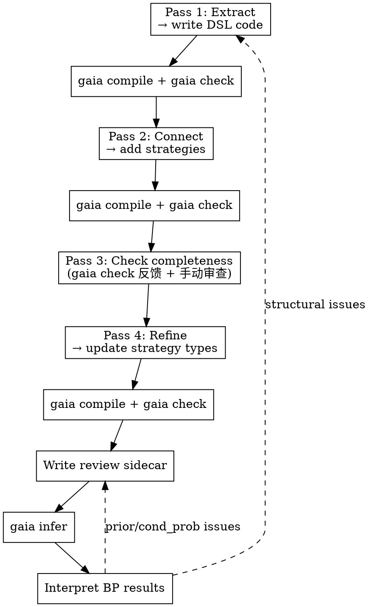
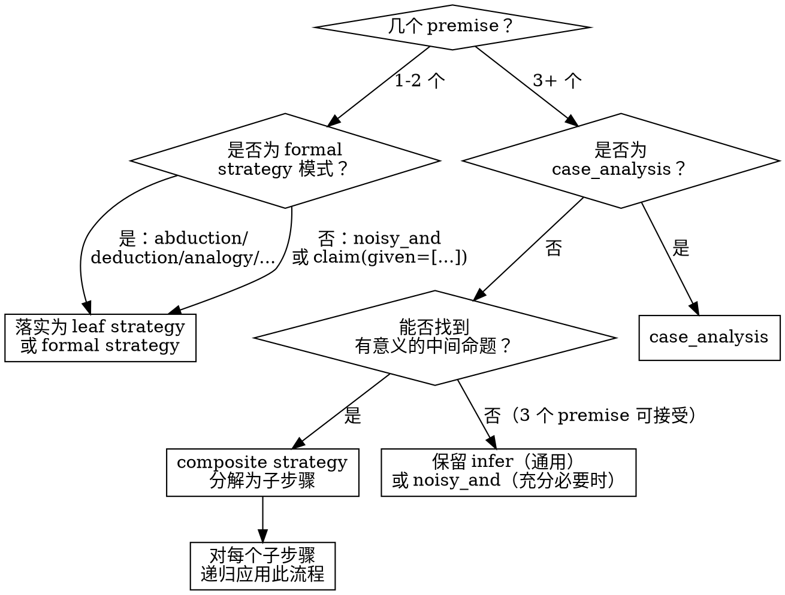

# Paper Formalization

Extract the knowledge structure from a scientific paper into a Gaia knowledge package with claims, reasoning strategies, and review sidecars.

**REQUIRED:** Use gaia-ir-authoring for compilation, validation, and registration mechanics. This skill covers the intellectual process upstream of that.

## Overview

Paper formalization is a **four-pass** process. Each pass builds on the previous one. Do NOT skip passes or combine them.

**关键原则：Formalization 是渐进的。** 每完成一个 pass 就写代码、编译、检查。不要把所有 pass 做完才开始写代码。`gaia compile` 和 `gaia check` 的反馈是下一个 pass 的重要输入。



## Pass 0: Prepare Artifacts

将论文的原始材料拷贝到 package 的 `artifacts/` 目录：

```
my-package-gaia/
├── artifacts/              # 论文原始材料
│   ├── paper.pdf           # 论文 PDF 原文，或
│   └── paper.md            # markdown 版本（如有）
├── src/
│   └── my_package/
│       ├── __init__.py
│       ├── motivation.py
│       └── ...
└── pyproject.toml
```

支持 PDF 或 markdown 格式。Formalization 过程中应始终参考 `artifacts/` 中的原文，确保数值、公式、论证步骤都与论文一致。

## Pass 1: Extract Knowledge Nodes

Read the paper **section by section**. For each section, identify:

| Type | Criterion | Examples |
|------|-----------|---------|
| **setting** | 不可被质疑的背景事实 | 教科书定义、实验装置描述、物理常数 |
| **claim** | 可被质疑、可被还原的命题 | 计算结果、理论推导、预测、实验观测 |
| **question** | 论文要回答的问题 | 研究问题 |

### Organizing by Module

每篇论文的章节对应一个 Gaia module（Python 文件）：

- Introduction → `motivation.py`
- Section II → `s2_xxx.py`
- Section III → `s3_xxx.py`
- ...

Module 的 docstring 用作该章节的标题。每个 knowledge 都应有 `title` 参数。

### Knowledge 放在最早出现的 module

每个 knowledge 放在论文中**最早出现**的 section 对应的 module。Introduction 中的内容放在 `motivation.py`。

motivation 中的 claim 完全可以被后面的 module 作为 premise 或 background 引用——它们不受 module 归属的限制。setting 和 question 通常通过 `background=` 引用。

### The Claim Principle

**如果不确定是 setting 还是 claim，标记为 claim。**

判断标准：该命题是否可以被质疑、被推翻、或需要论文提供论证？如果是，就是 claim。只有真正不可能被质疑的事实（如数学定义、已确立的物理常数、实验装置描述）才是 setting。

论文自己推导的内容——即使推导很严格——也应该是 claim，因为推导过程本身可能有误。

### Atomicity Principle

每个 claim 必须是**原子命题**——一个 claim 只表达一件事。

**核心规则：理论预言必须与实验结果分离。**

```python
# ❌ 混合理论和实验
tc_al = claim("铝的 Tc 预测为 0.96 K，实验值为 1.2 K，误差 20%。")

# ✅ 分离为三个原子 claim
tc_al_predicted = claim(
    "基于 ab initio 工作流（vDiagMC μ* + DFPT λ + PCF），"
    "铝在常压下的超导转变温度预测为 $T_c^{\\mathrm{EFT}} \\approx 0.96$ K。",
    title="Al Tc prediction",
)
tc_al_experimental = claim(
    "铝的实验超导转变温度为 $T_c^{\\mathrm{exp}} = 1.2$ K。",
    title="Al Tc experimental",
)
tc_al_agreement = claim(
    "铝的 ab initio 预测 $T_c = 0.96$ K 与实验值 $1.2$ K 的偏差为 20%，"
    "相比唯象方法（McMillan + μ*=0.1 给出 1.9 K，偏差 58%）显著改善。",
    title="Al Tc theory-experiment agreement",
)
```

类似地，**方法描述**和**方法应用结果**应该分离：

```python
# ❌ 方法和结果混在一起
mu_claim = claim("vDiagMC 用 homotopic expansion 计算 μ，得到 rs=1 时 0.28(1)。")

# ✅ 分离
vdiagmc_method = claim("vDiagMC 采用 ... 策略 ...", title="vDiagMC method")
mu_values = claim("μ_EF 的数值结果：rs=1 时 0.28(1)，...", title="μ_EF values")
```

### Theory-Experiment Comparison → Abduction

当论文的理论预测与实验数据进行比较时，使用 **abduction** 模式：

- **observation**: 实验结果（如 Al 的 Tc_exp = 1.2 K）
- **hypothesis**: 理论框架/预测是正确的（如 ab initio workflow 给出 Tc = 0.96 K，偏差 20%）

```python
# 实验结果和理论预测分别是独立的 claim
tc_al_exp = claim("铝的实验超导转变温度 $T_c^{\\mathrm{exp}} = 1.2$ K。")
tc_al_pred = claim("ab initio 工作流预测铝 $T_c^{\\mathrm{EFT}} = 0.96$ K。")

# 用 abduction 连接：实验观测支撑理论预测
abduction(observation=tc_al_exp, hypothesis=tc_al_pred,
          reason="理论预测偏差仅 20%，远优于唯象方法的 58% 偏差，"
          "支持 ab initio 工作流的有效性。")
```

### Content 必须自含

每个节点的 content 必须是完整的、独立可理解的命题。Reviewer 读到它不需要看上下文就能判断。

```python
# ❌ 需要上下文才能理解
mu_result = claim("计算得到的 μ 值显著超出 RPA 估计。")

# ✅ 自含的命题
mu_result = claim(
    "利用变分图形蒙特卡洛方法计算均匀电子气在 $r_s \\in [1,6]$ 区间的 "
    "$\\mu_{E_F}$，结果为：$r_s=1$ 时 $\\mu_{E_F} = 0.28(1)$，$r_s=5$ 时 "
    "$1.3(2)$。这些值显著超出 Morel-Anderson 静态 RPA 估计值。",
    title="μ_EF numerical values",
)
```

### 公式用 LaTeX

```python
claim("绝热近似要求 $\\omega_D / E_F \\ll 1$。")
```

### Pass 1 Review Checklist

提取完所有 module 后，逐个 claim 检查以下内容：

**符号自解释：**
- 每个数学符号在该 claim 中首次出现时必须有简要说明
- 例：不写 "$\omega_D / E_F \ll 1$"，写 "Debye 频率 $\omega_D$ 远小于费米能 $E_F$"
- 下标/上标的物理含义必须明确：$z^e$ 是什么？$\Gamma_3^e$ 是什么？

**缩写展开：**
- 每个缩写在该 claim 中首次出现时必须展开
- 例：不写 "DFPT 计算 $\lambda$"，写 "密度泛函微扰理论（DFPT）计算电子-声子耦合常数 $\lambda$"
- 即使缩写在其他 claim 中已经展开过，每个 claim 独立，必须重新展开

**无比较性断言：**
- 不写"显著大于 X"——读者不知道比较对象是什么
- 不写"近乎精确一致"——读者不知道跟什么一致
- 数值比较必须同时给出双方数据

**细节充分：**
- 读者只看这一个 claim，能否理解它在说什么？
- 条件、适用范围是否清楚？
- 数值是否带单位和误差？

### Marking Exported Conclusions

论文的**新贡献**（新理论结果、新数值计算结果、新实验发现）应在 `__all__` 中标记为 exported conclusion。这些是这个 knowledge package 对外的接口——其他 package 可以引用它们。

判断标准：如果这个结果从论文中移除，论文就失去了核心价值。

### Pass 1 Deliverable

每个 module 一个 claim/setting/question 列表，类似：

```
## s3_downfolding.py

settings:
  (none)

claims:
  - pair_propagator_decomposition: 配对传播子可分解为 ΠBCS + φ ...
  - cross_term_suppressed: 交叉项被等离子体频率压制 ...
  - downfolded_bse: 得到频率-only BSE ...
  - pseudopotential_scale_relation: BTS 重整化关系 ...

questions:
  (none)

exported: downfolded_bse
```

Pass 1 只提取原子化、自含的 knowledge 节点。**不要标注哪��是"推导结论"**——一个 claim 是独立前提还是被推导的，取��于 Pass 2 中如何建立推理连接，不是 claim 本身的属性。

## Pass 2: Connect — Write Infer Strategies

`infer` 是 Gaia 中**最通用的** strategy type——它不预设任何特定推理模式（如 deduction、abduction），仅表达"从 premises 推出 conclusion"。Pass 2 使用 `infer` 作为所有推理连接的草稿形式；具体的 strategy type 在 Pass 4 中细化。

对 Pass 1 中标注为 `[DERIVED]` 的每个 claim，写一个 `infer` strategy：

1. **写详细的 reason**：从论文中总结推导过程，不是一句话概括，而是完整的推理链路。reason 应该让一个领域内的读者能够理解"为什么这些前提能推出这个结论"。

2. **识别 premises 和 background**：
   - 推导过程中用到的 **claim** → `premises`
   - 推导过程中用到的 **setting/question** → `background`

```python
# reason 应该详细，这是知识图谱的核心价值
derive_downfolded_bse = infer(
    premises=[pair_propagator_decomposition, cross_term_suppressed],
    conclusion=downfolded_bse,
    background=[bcs_framework, adiabatic_approx],
    reason=[
        Step(
            reason="从 full BSE 出发，将配对传播子分解为低能相干部分 ΠBCS 和高能非相干部分 φ。"
            "利用绝热条件 ωD/EF ≪ 1 和等离子体频率压制条件 ωc²/ωp² ≪ 1，"
            "证明交叉项（混合 Coulomb 和 phonon 通道的贡献）被参数化地压制。"
            "消去高能自由度后，对 Fermi 面做投影，得到频率-only BSE。",
            premises=[pair_propagator_decomposition, cross_term_suppressed],
        ),
    ],
)
```

### Reason 中用 @label 引用 knowledge 节点

在 reason 文本中，用 `@label` 语法显式引用推导过程中用到的 knowledge 节点：

```python
reason=(
    "从 BSE 出发，其核可分解为纯电子顶点与声子介导相互作用之和"
    "（@bse_kernel_decomposition）。将配对传播子分解为低能和高能部分"
    "（@pair_propagator_decomposition），交叉项被等离子体频率压制"
    "（@cross_term_suppressed），在绝热条件（@adiabatic_approx）下"
    "得到频率-only 的 downfolded BSE。"
)
```

`@label` 中引用的节点必须出现在该 strategy 的 `premises` 或 `background` 列表中。Pass 3 中逐一检查这一点。

### Pass 2 的关键：不要遗漏隐含前提

论文中经常有些前提是隐含的（如"由绝热近似可知..."）。在写 reason 时，如果发现推导依赖了某个 Pass 1 中已经提取的 knowledge，一定要把它加入 premises 或 background，并在 reason 中用 `@label` 引用。

## Pass 3: Check Completeness

**前置条件：** Pass 1-2 的代码已写好并通过 `gaia compile` 和 `gaia check`。Pass 3 结合 `gaia check` 的反馈和手动审查。

### 3a. 检查 @label 引用一致性

逐一审查每个 infer strategy 的 reason：

1. **re-read reason**：仔细阅读 reason 中的每一句话
2. **检查 @label 覆盖**：reason 中每个 `@label` 都必须出现在 premises 或 background 中
3. **反向检查**：premises/background 中的每个 node 都应该在 reason 中被 `@label` 引用（否则为什么它是 premise？）
4. **检查是否需要补充 knowledge**：如果 reason 中提到了一个重要事实但没有对应 `@label`，回到 Pass 1 补充

### 3b. 检查是否有 claim 缺少 reasoning

利用 `gaia check` 的输出，检查是否有 claim 应该有推理支撑但还没有 strategy：

- `gaia check` 会报告没有被任何 strategy 作为 conclusion 的 claim（即叶节点）
- 逐一审视每个叶节点：它真的是独立前提吗？还是应该有一个 infer strategy？
- 判断标准：如果论文中对这个 claim 有论证过程（而不仅仅是陈述），它就应该有 strategy

### 3c. 检查孤立节点

- 有没有 claim 既不是任何 strategy 的 premise/background，也不是任何 strategy 的 conclusion？
- 孤立节点说明它没有参与推理图——要么它不应该存在，要么遗漏了引用它的 strategy

这一步最容易犯的错误是**默认某些知识不需要显式引用**。在 Gaia 中，如果推理过程依赖了某个事实，那个事实必须是 knowledge graph 中的一个节点。

## Pass 4: Refine Strategy Types

Pass 2-3 产出的是通用 `infer` strategy。Pass 4 将每个 `infer` 细化为具体的 strategy type。

### Decision Tree



### Case 1: 1-2 个 premise

优先考虑 formal strategy，按以下顺序检查是否匹配：

| Pattern | Strategy | Example |
|---------|----------|---------|
| 观察 → 假说 | `abduction` | "观测到大的 μ 值 → 假设 vertex corrections 是原因" |
| 数学前提 → 定理 | `deduction` | "分解 + 压制条件 → downfolded BSE" |
| 源系统 → 目标系统 | `analogy` | "UEG 结果 → 真实金属" |
| 已知区间 → 未知区间 | `extrapolation` | "常压 Tc → 高压 Tc" |
| 基础情况 + 递推 → 通则 | `mathematical_induction` | 数学归纳 |

如果不匹配任何 formal strategy pattern，使用 `noisy_and` 或 `claim(given=[...])` 作为 leaf strategy。

### Case 2: 3+ 个 premise

**首先检查**：是否为 `case_analysis` 模式？

```python
# case_analysis 模式：穷举 + 每个 case 分别支撑
case_analysis(
    exhaustiveness_claim,
    [(case_1, support_1), (case_2, support_2)],
    conclusion,
)
```

**如果不是 case_analysis**：尝试分解为 `composite` strategy。

```python
# 分解为 composite
# 子步骤 1: method + convergence_proof → method_is_sound
s1 = noisy_and(premises=[method, convergence_proof], conclusion=method_is_sound)
# 子步骤 2: method_is_sound + numerical_validation → mu_values
s2 = noisy_and(premises=[method_is_sound, numerical_validation], conclusion=mu_values)
composite(premises=[method, convergence_proof, numerical_validation],
          conclusion=mu_values, sub_strategies=[s1, s2])
```

分解时引入的中间 claim 应该是有意义的命题，不是纯粹为了拆分而造的。

**如果找不到有意义的中间命题**（即分解会很牵强）：
- **3 个 premise**：可以保留为 `infer`（通用）或 `noisy_and`（当所有 premise 都是充分必要条件时）
- **4+ 个 premise**：必须分解，否则 BP 乘法效应会严重压低 belief

### Operator 用法（不变）

Operators 编码确定性逻辑约束，与 strategy 正交：

| Operator | Meaning | When |
|----------|---------|------|
| `contradiction(a, b)` | ¬(A ∧ B) | 两个互斥的理论/预测 |
| `equivalence(a, b)` | A = B | 两种表述等价 |
| `complement(a, b)` | A ⊕ B | 互补命题 |
| `disjunction(*args)` | ∨ | 穷举候选 |

## Write DSL Code

四遍完成后，用 Gaia DSL 写代码。参考 gaia-ir-authoring skill。

## Write Review Sidecar

### 核心原则：只对独立前提给 prior

| Node Type | Prior | Notes |
|-----------|-------|-------|
| 独立前提（叶节点） | reviewer 判断（0.5–0.95） | 反映证据强度 |
| 推导结论 | 不设 prior | belief 完全由 BP 传播决定 |
| Strategy | conditional_probability | 反映推理强度 |
| Generated claims | reviewer 判断 | `review_generated_claim` |

```python
from gaia.review import ReviewBundle, review_claim, review_strategy, review_generated_claim

REVIEW = ReviewBundle(
    source_id="self_review",
    objects=[
        # 独立前提 — 根据证据强度给 prior
        review_claim(observation_a, prior=0.90, justification="直接观测结果。"),

        # 策略 — 条件概率
        review_strategy(my_strategy, conditional_probability=0.88,
                        justification="如果前提成立，结论大概率成立。"),

        # abduction 生成的 interface claim
        review_generated_claim(abduction_strategy, "alternative_explanation",
                               prior=0.25, justification="替代解释不太可能。"),
    ],
)
```

## Interpret BP Results

编译并运行推理后，检查：

| Check | Normal | Abnormal |
|-------|--------|----------|
| 独立前提 | belief ≈ prior（变化小） | belief 被显著拉低 → 下游约束冲突 |
| 推导结论 | belief > 0.5（被拉高） | belief < 0.5 → 见下文 |
| Contradiction | 一边高一边低（"选边"） | 两边都低 → prior 分配有问题 |

### 常见问题与修复

**推导结论的 belief 过低（< 0.3）：**
- **原因 A：** 推理链太深，乘法效应压低。检查 Pass 4 是否用了 composite 来控制层级。
- **原因 B：** premise 的 prior 不够高。重新审视 review sidecar。
- **原因 C：** strategy 的 conditional_probability 不合理。

**Contradiction 没有正确"选边"：**
- **原因：** 两边的 prior 设置没有反映实际证据强度差异。
- **修复：** 降低应被推翻那一方的 prior。

**推导结论 belief ≈ 0.5（没有被拉高）：**
- **原因：** 推理链断裂，某个 strategy 缺少 conditional_probability。
- **修复：** 检查 review sidecar 是否遗漏了 strategy review。

## Common Mistakes

| Mistake | Consequence | Fix |
|---------|-------------|-----|
| 理论预测与实验结果混在一个 claim | 无法用 equivalence 建模验证关系 | 分离为两个 claim |
| reason 写得太简略（一句话） | 推理过程不可追溯 | 详细总结推导步骤 |
| 3+ premise 的 flat noisy_and | BP 乘法效应严重 | 用 composite 分解 |
| Content 不自含 | Reviewer 无法独立判断 | 完整陈述命题 |
| 将可质疑的命题标为 setting | 该命题无法通过 BP 更新 | 疑则标 claim |
| 给推导结论高 prior（如 0.85） | BP 传播效果被掩盖 | 推导结论不设 prior |
| contradiction 两边 prior 都高 | BP 两边都压低 | 降低被质疑一方 |
| 遗漏推理中的隐含前提 | knowledge graph 不完整 | Pass 3 仔细检查 |
| 数值不核实 | 数据错误 | 每个数值对照论文原文 |

## Spec Pointers

- **gaia-ir-authoring** — 编译、验证、注册的操作指南
- `docs/foundations/gaia-lang/dsl.md` — DSL 完整参考
- `docs/foundations/gaia-lang/knowledge-and-reasoning.md` — 知识类型与推理语义
- `docs/foundations/cli/inference.md` — 推理管线（review sidecar、BP）
