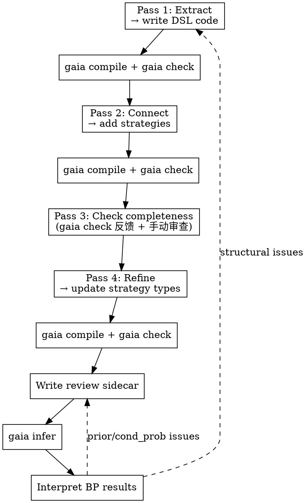
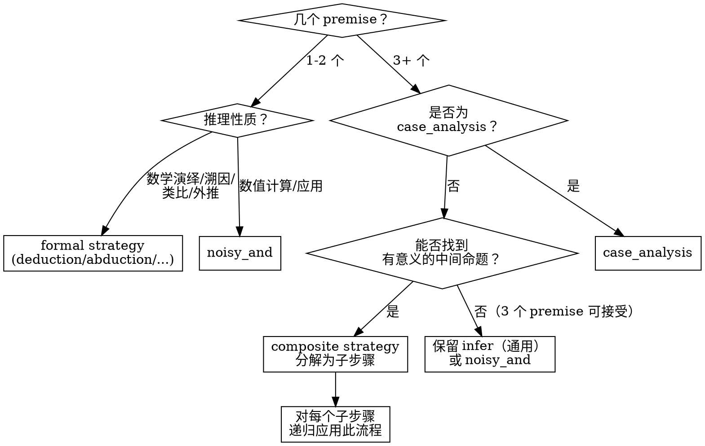

# Paper Formalization

Extract the knowledge structure from a scientific paper into a Gaia knowledge package with claims, reasoning strategies, and review sidecars.

**REQUIRED:** Use gaia-ir-authoring for compilation, validation, and registration mechanics. This skill covers the intellectual process upstream of that.

## Overview

Paper formalization is a **four-pass** process. Each pass builds on the previous one. Do NOT skip passes or combine them.

**关键原则：Formalization 是渐进的。** 每完成一个 pass 就写代码、编译、检查。不要把所有 pass 做完才开始写代码。`gaia compile` 和 `gaia check` 的反馈是下一个 pass 的重要输入。



## Pass 0: Prepare Artifacts

将论文的原始材料拷贝到 package 的 `artifacts/` 目录：

```
my-package-gaia/
├── artifacts/              # 论文原始材料
│   ├── paper.pdf           # 论文 PDF 原文，或
│   └── paper.md            # markdown 版本（如有）
├── src/
│   └── my_package/
│       ├── __init__.py
│       ├── motivation.py
│       └── ...
└── pyproject.toml
```

支持 PDF 或 markdown 格式。Formalization 过程中应始终参考 `artifacts/` 中的原文，确保数值、公式、论证步骤都与论文一致。

## Pass 1: Extract Knowledge Nodes

Read the paper **section by section**. For each section, identify:

| Type | Criterion | Examples |
|------|-----------|---------|
| **setting** | 不可被质疑的背景事实 | 数学定义、形式设定、基本原理 |
| **claim** | 可被质疑、可被还原的命题 | 计算结果、理论推导、预测、实验观测 |
| **question** | 论文要回答的问题 | 研究问题 |

### Organizing by Module

每篇论文的章节对应一个 Gaia module（Python 文件）：

- Introduction → `motivation.py`
- Section II → `s2_xxx.py`
- ...

Module 的 docstring 用作该章节的标题。每个 knowledge 都应有 `title` 参数。

### Knowledge 放在最早出现的 module

每个 knowledge 放在论文中**最早出现**的 section 对应的 module。Introduction 中的内容放在 `motivation.py`。

motivation 中的 claim 完全可以被后面的 module 作为 premise 或 background 引用——它们不受 module 归属的限制。setting 和 question 通常通过 `background=` 引用。

### Setting vs Claim 分类指南

**原则：如果不确定是 setting 还是 claim，标记为 claim。**

| Category | Type | Examples |
|----------|------|---------|
| 数学定义/形式设定 | **setting** | 坐标系选择、变量分解定义、势函数的数学形式 |
| 已确立的基本原理 | **setting** | 守恒律、不相容原理、热力学定律 |
| 标准近似/方法的定义（不含适用性断言） | **setting** | 某种近似的数学表达式（仅定义，不断言其适用） |
| 适用条件是否成立 | **claim** | 某种近似是否对特定系统适用 |
| 依赖条件的理论框架 | **claim** | 当 A 成立时 B 定理成立 |
| 理论推导结果 | **claim** | 重整化关系、标度律、渐近行为 |
| 数值计算结果 | **claim** | 从计算方法得到的数值 |
| 实验观测 | **claim** | 实验测量值 |

**关键判断标准：** 该命题是否可以被质疑？是 → claim。只有数学定义和形式设定才是 setting。

**注意区分定义和断言：** 某种近似的数学定义是 setting，但"该近似在某些条件下不可靠"是 claim。"将变量分解为高低频部分"是 setting（数学操作），但"高频部分的贡献可忽略"是 claim（物理断言）。

**依赖链：** 如果 A 是 setting，B 依赖 A 成立且包含物理断言——B 通常是 claim。

论文自己推导的内容——即使推导很严格——也应该是 claim，因为推导过程本身可能有误。

### Atomicity Principle

每个 claim 必须是**原子命题**——一个 claim 只表达一件事。

**核心规则：理论预言必须与实验结果分离。**

```python
# ❌ 混合理论和实验
result = claim("模型预测值为 X，实验值为 Y，偏差 Z%。")

# ✅ 分离为独立的 claim
prediction = claim("基于 XX 方法，模型预测某物理量为 X。", title="Model prediction")
experiment = claim("某物理量的实验测量值为 Y。", title="Experimental value")
```

类似地，**方法描述**和**方法应用结果**应该分离：

```python
# ❌ 方法和结果混在一起
result = claim("用 XX 方法计算 YY，得到 ZZ。")

# ✅ 分离
method = claim("XX 方法采用 ... 策略 ...", title="Method description")
result = claim("YY 的数值结果为 ZZ ± δ。", title="Numerical result")
```

### Theory-Experiment Comparison → Abduction

当论文的理论预测与实验数据进行比较时，使用 **abduction** 模式：

- **observation**: 实验结果
- **hypothesis**: 新理论的预测
- **alternative**: 传统/已有理论的预测（替代解释）

```python
# abduction 必须提供 alternative_explanation（替代理论）
_strat = abduction(
    observation=experimental_value,
    hypothesis=new_theory_prediction,
    alternative=old_theory_prediction,  # 传统理论作为替代解释
    reason="新理论偏差仅 X%，远优于旧理论的 Y% 偏差。")
```

**注意：** `abduction()` 返回 Strategy（不是 Knowledge）。需要将返回值赋给变量（如 `_strat`）以便 review sidecar 中引用。

### Content 必须自含

每个节点的 content 必须是完整的、独立可理解的命题。Reviewer 读到它不需要看上下文就能判断。

```python
# ❌ 需要上下文才能理解
result = claim("计算结果显著超出传统估计。")

# ✅ 自含的命题
result = claim(
    "利用 XX 方法计算 YY 在 ZZ 条件下的值为 A ± δ，"
    "相比传统方法 WW 的估计值 B，偏差约 C 倍。",
    title="Result description",
)
```

### Pass 1 Review Checklist

提取完所有 module 后，逐个 claim 检查以下内容：

**符号自解释：**
- 每个数学符号在该 claim 中首次出现时必须有简要说明
- 例：不写 "$\alpha \ll 1$"，写 "参数 $\alpha$（表示 XX 与 YY 之比）远小于 1"
- 下标/上标的物理含义必须明确

**缩写展开：**
- 每个缩写在该 claim 中首次出现时必须展开
- 例：不写 "XXX 计算 $\lambda$"，写 "某某方法（XXX）计算耦合常数 $\lambda$"
- 即使缩写在其他 claim 中已经展开过，每个 claim 独立，必须重新展开

**无比较性断言：**
- 不写"显著大于 X"——读者不知道比较对象是什么
- 不写"近乎精确一致"——读者不知道跟什么一致
- 数值比较必须同时给出双方数据

**细节充分：**
- 读者只看这一个 claim，能否理解它在说什么？
- 条件、适用范围是否清楚？
- 数值是否带单位和误差？

### Marking Exported Conclusions

论文的**新贡献**（新理论结果、新数值计算结果、新实验发现）应在 `__all__` 中标记为 exported conclusion。这些是这个 knowledge package 对外的接口——其他 package 可以引用它们。

判断标准：如果这个结果从论文中移除，论文就失去了核心价值。

### Pass 1 Deliverable

每个 module 一个 claim/setting/question 列表。

Pass 1 只提取原子化、自含的 knowledge 节点。**不要预判哪些是"推导结论"**——一个 claim 是独立前提还是被推导的，取决于 Pass 2 中如何建立推理连接，不是 claim 本身的属性。

## Pass 2: Connect — Write Infer Strategies

`infer` 是 Gaia 中**最通用的** strategy type——它不预设任何特定推理模式（如 deduction、abduction），仅表达"从 premises 推出 conclusion"。Pass 2 使用 `infer` 作为所有推理连接的草稿形式；具体的 strategy type 在 Pass 4 中细化。

对每个"由其他 claim 支撑"的 claim，写一个 `infer` strategy（哪些 claim 需要 strategy 在 Pass 2 中逐个判断——如果论文中对它有论证过程，它就需要）：

1. **写详细的 reason**：从论文中总结推导过程，不是一句话概括，而是完整的推理链路。reason 应该让一个领域内的读者能够理解"为什么这些前提能推出这个结论"。

2. **识别 premises 和 background**：
   - 推导过程中用到的 **claim** → `premises`
   - 推导过程中���到的 **setting/question** → `background`

### Reason 中用 @label 引用 knowledge 节点

在 reason 文本中，用 `@label` 语法显式引用推导过程中用到的 knowledge 节点：

```python
reason=(
    "基于 XX 框架（@framework_claim），在 YY 条件下（@condition_claim），"
    "可以推导出 ZZ 结论。推导利用了 WW 的性质（@property_setting）。"
)
```

`@label` 中引用的节点必须出现在该 strategy 的 `premises` 或 `background` 列表中。Pass 3 中逐一检查这一点。

### Pass 2 的关键：不要遗漏隐含前提

论文中经常有些前提是隐含的。在写 reason 时，如果发现推导依赖了某个 Pass 1 中已经提取的 knowledge，一定要把它加入 premises 或 background，并在 reason 中用 `@label` 引用。

## Pass 3: Check Completeness

**前置条件：** Pass 1-2 的代码已写好并通过 `gaia compile` 和 `gaia check`。Pass 3 结合 `gaia check` ��反馈和手动审查。

### 3a. 检查 @label 引用一致性

逐一审查每个 infer strategy 的 reason：

1. **re-read reason**：仔细阅读 reason 中的每一句话
2. **检查 @label 覆盖**：reason 中每个 `@label` 都必须出现在 premises 或 background 中
3. **反向检查**：premises/background 中的每个 node 都应该在 reason 中被 `@label` 引用（否则为什么它是 premise？）
4. **检查是否需要补充 knowledge**：如果 reason 中提到了一个重要事实但没有对应 `@label`，回到 Pass 1 补充

### 3b. 检查是否有 claim 缺少 reasoning

利用 `gaia check` 的输出，检查是否有 claim 应该有推理支撑但还没有 strategy：

- `gaia check` 会报告没有被任何 strategy 作为 conclusion 的 claim（即叶节点）
- 逐一审视每个叶节点：它真的是独立前提吗？还是应该有一个 infer strategy？
- 判断标准：如果论文中对这个 claim 有论证过程（而不仅仅是陈述），它就应该有 strategy

### 3c. 检查孤立节点

- 有没有 claim 既不是任何 strategy 的 premise/background，也不是任何 strategy 的 conclusion？
- 孤立节点说明它没有参与推理图——要么它不应该存在，要么遗漏了引用它的 strategy

这一步最容易犯的错误是**默认某些知识不需要显式引用**。在 Gaia 中，如果推理过程依赖了某个事实，那个事实必须是 knowledge graph 中的一个节点。

## Pass 4: Refine Strategy Types

Pass 2-3 产出的是通用 `infer` strategy。Pass 4 将每个 `infer` 细化为具体的 strategy type。

### Decision Tree



### Case 1: 1-2 个 premise

先判断推理性质，再选择 strategy type：

| 推理性质 | Strategy | 条件概率 |
|----------|----------|---------|
| 严格数学推导（前提成立则结论必然成立） | `deduction` | 确定性（无需参数） |
| 数值计算/应用（有计算误差或经验不确定性） | `noisy_and` | 需要 conditional_prob |
| 观察 → 假说 | `abduction` | 由 formal_expr 确定 |
| 源 → 目标类比 | `analogy` | 由 formal_expr 确定 |
| 外推 | `extrapolation` | 由 formal_expr 确定 |
| 归纳（精确极限 + 数值→通则） | `infer`（暂） | 需要完整 CPT |

**关键区分：deduction vs noisy_and** — 如果前提成立时结论**必然**成立（数学定理、定义读出），用 `deduction`。如果有计算误差或经验不确定性，用 `noisy_and`。

**Strategy 变量命名：** 所有需要在 review sidecar 中引用的 strategy 必须赋给变量（`_strat_xxx = noisy_and(...)`）。deduction 不需要参数，可以匿名调用。

### Case 2: 3+ 个 premise

**首先检查**：是否为 `case_analysis` 模式？

**如果不是 case_analysis**：尝试分解为 `composite` strategy。分解时引入的中间 claim 应该是有意义的命题，不是纯粹为了拆分而造的。Composite 的粗图（top-level premises → conclusion）保留原始 `infer` 的视角，细图（sub-strategies）提供分步推导。

**如果找不到有意义的中间命题**（即分解会很牵强）：
- **3 个 premise**：可以保留为 `infer` 或 `noisy_and`
- **4+ 个 premise**：必须分解，否则 BP 乘法效应会严重压低 belief

### Operator 用法

Operators 编码确定性逻辑约束，与 strategy 正交：

| Operator | Meaning | When |
|----------|---------|------|
| `contradiction(a, b)` | ¬(A ∧ B) | 两个互斥的理论/预测 |
| `equivalence(a, b)` | A = B | 两种表述等价（如微观推导 = 历史公式） |
| `complement(a, b)` | A ⊕ B | 互补命题 |
| `disjunction(*args)` | ∨ | 穷举候选 |

## Write DSL Code

每个 pass 完成后就写代码、编译、检查。参考 gaia-ir-authoring skill。

### 实践要点

- **Labels 自动从变量名推断**——不要手动设置 `.label`
- **Strategy 变量名**：需要 review 参数的 strategy 必须赋给 `_strat_xxx` 变量；deduction 可匿名
- **Import 跨 module 的 claim**：后面的 module 可以 import motivation 中的 claim 作为 premise
- **`abduction()` 返回 Strategy**——赋给变量用于 review sidecar 引用
- **`contradiction()` 返回 Knowledge**（helper claim）——赋给变量并可被其他 strategy 引用

## Write Review Sidecar

### 核心原则

| Node Type | Prior | Notes |
|-----------|-------|-------|
| 独立前提（叶节点） | reviewer 判断（0.5–0.95） | 反映证据强度 |
| 推导结论 | 不设 prior | belief 完全由 BP 传播决定 |
| Orphaned claims（background-only） | 需要设 prior（validator 要求） | 通常 0.90–0.95 |
| deduction strategy | 确定性，不需要参数 | |
| noisy_and strategy | `conditional_probability`（单值） | 反映计算/推理可靠��� |
| infer strategy（N premises） | `conditional_probabilities`（2^N 个值，CPT） | 完整条件概率表 |
| composite strategy | top-level 需要 CPT（2^N 个值） | 用于折叠模式 |
| Generated claims（abduction alternative） | reviewer 判断 | `review_generated_claim` |

### 实践要点

1. **所有 claim 都需要 prior**——包括 orphaned/background-only 节点，否则 `gaia infer` 报错
2. **Strategy 必须有变量名**才能在 review 中引用：`_strat = noisy_and(...)` 而不是匿名调用
3. **`infer` 的 CPT**：N 个 premise 需要 $2^N$ 个条件概率值，顺序为 $[P(\text{conc}|F...F), ..., P(\text{conc}|T...T)]$
4. **Composite 的 top-level CPT**：sub-strategies 有自己的参数，但 composite 的 top-level `infer` 也需要 CPT
5. **`abduction` 返回 Strategy**（不是 Knowledge），需赋给变量以便 `review_generated_claim` 引用

## Interpret BP Results

编译并运行推理后，检查：

| Check | Normal | Abnormal |
|-------|--------|----------|
| 独立前提 | belief ≈ prior（变化小） | belief 被显著拉低 → 下游约束冲突 |
| 推导结论 | belief > 0.5（被拉高） | belief < 0.5 → 见下文 |
| Contradiction | 一边高一边低（"选边"） | 两边都低 → prior 分配有问题 |

### 常见问题与修复

**推导结论的 belief 过低（< 0.3）：**
- **原因 A：** 推理链太深，乘法效应压低。检查 Pass 4 是否用了 composite 来控制层级。
- **原因 B：** premise 的 prior 不够高。重新审视 review sidecar。
- **原因 C：** strategy 的 conditional_probability 不合理。

**Contradiction 没有正确"选边"：**
- **原因：** 两边的 prior 设置没有反映实际证据强度差异。
- **修复：** 降低应被推翻那一方的 prior。

**推导结论 belief ≈ 0.5（没有被拉高）：**
- **原因：** 推理链断裂，某个 strategy 缺少 conditional_probability。
- **修复：** 检查 review sidecar 是否遗漏了 strategy review。

## Common Mistakes

| Mistake | Consequence | Fix |
|---------|-------------|-----|
| 理论预测与实验结果混在一个 claim | 无法用 abduction 建模验证关系 | 分离为两个 claim + abduction |
| abduction 不提供 alternative | 缺少替代理论的比较 | 提供已有理论作为 alternative |
| reason 写得太简略（一句话） | 推理过程不可追溯 | 详细总结推导步骤，用 @label 引用 |
| 4+ premise 的 flat noisy_and | BP 乘法效应严重 | 用 composite 分解为 ≤3 premise 子步骤 |
| Content 不自含（符号/缩写未解释） | Reviewer 无法独立判断 | 每个 claim 独立解释所有符号和缩写 |
| 将可质疑的命题标为 setting | 该命题无法通过 BP 更新 | 疑则标 claim；只有数学定义才是 setting |
| 将依赖条件的理论框架标为 setting | 框架不参与 BP | 依赖条件的推论应为 claim |
| 数学演绎用 noisy_and | 确定性推导不应有概率参数 | 用 deduction（不需要 cond_prob） |
| 数值计算用 deduction | 计算有不确定性 | 用 noisy_and（需要 cond_prob） |
| Strategy 匿名调用 | review sidecar 无法引用 | 赋给 `_strat_xxx` 变量 |
| 手动设置 `.label` | 冗余且可能和变量名不一致 | 不设，由 `gaia compile` 自动推断 |
| 遗漏 orphaned claim 的 prior | `gaia infer` 报错 | 所有 claim（含 orphaned）都需要 prior |
| 遗漏推理中的隐含前提 | knowledge graph 不完整 | Pass 3 用 `gaia check` + 手动审查 |
| 数值不核实 | 数据错误 | 每个数值对照论文原文 |

## Spec Pointers

- **gaia-ir-authoring** — 编译、验证、注册的操作指南
- `docs/foundations/gaia-lang/dsl.md` — DSL 完整参考
- `docs/foundations/gaia-lang/knowledge-and-reasoning.md` — 知识类型与推理语义
- `docs/foundations/cli/inference.md` — 推理管线（review sidecar、BP）
