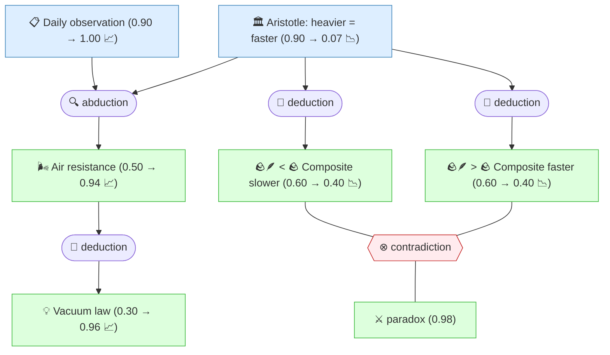

# Gaia Lang

[](https://github.com/SiliconEinstein/Gaia/actions/workflows/ci.yml)
[](https://codecov.io/gh/SiliconEinstein/Gaia)
[](https://pypi.org/project/gaia-lang/)
[](https://opensource.org/licenses/MIT)

Gaia is a formal language for scientific reasoning. It helps you uncover and organize the logical relationships between scientific propositions — deduction, abduction, induction, contradiction — and then computes the probability of each proposition being true. Following the Jaynesian program — built on Cox's theorem that consistent reasoning is uniquely isomorphic to probability theory — these probabilities are objective: once the reasoning structure is defined, they are mathematically determined.

## Quick Example

Galileo's thought experiment: tie a heavy stone to a light stone. Does the composite fall faster or slower?



The contradiction and abduction are independent subgraphs, yet belief propagation automatically combines both lines of evidence: the contradiction refutes Aristotle (0.90 → 0.07) while the abduction elevates air resistance (0.50 → 0.94), and together they lift the vacuum law from a speculative 0.30 to a near-certain **0.96** — no new experimental data needed, just the structure of the reasoning itself.

The code that produces this:

```python
from gaia.lang import claim, contradiction, deduction, abduction

# 📋 The observation everyone agrees on
obs_daily = claim("Heavy objects fall faster than light ones in air.")

# 🏛️ Two competing explanations
aristotle = claim("🏛️ Speed is proportional to weight — heavier = faster.")
air_resistance = claim("🌬️ The speed difference is caused by air resistance, not weight.")

# 🔍 Abduction: which explanation better accounts for the observation?
abduction(observation=obs_daily, hypothesis=air_resistance, alternative=aristotle,
    reason="Both explain why heavy objects fall faster in air.")

# 🤔 Meanwhile, Aristotle's doctrine implies contradictory predictions
composite_slower = claim("🪨🪶 The composite falls SLOWER than the heavy stone alone.")
composite_faster = claim("🪨🪶 The composite falls FASTER than either stone alone.")
deduction(premises=[aristotle], conclusion=composite_slower,
    reason="If heavier = faster, the light stone drags the heavy one back.")
deduction(premises=[aristotle], conclusion=composite_faster,
    reason="If heavier = faster, the heavier composite must fall faster.")

# ⚔️ Same premise, opposite conclusions — that's a contradiction!
paradox = contradiction(composite_slower, composite_faster,
    reason="Aristotle's own logic predicts both faster AND slower")

# 💡 Remove the air, remove the difference
vacuum_law = claim("💡 In vacuum, all bodies fall at the same rate.")
deduction(premises=[air_resistance], conclusion=vacuum_law,
    reason="If air resistance is the sole cause, removing it means all fall equally.")
```

## How it Works

```
Python DSL  →  gaia compile  →  Gaia IR (factor graph)  →  gaia infer  →  beliefs
```

1. **Declare** propositions and their logical relationships using the Python DSL
2. **Compile** to Gaia IR — a canonical intermediate representation encoding the reasoning structure as a factor graph
3. **Infer** — belief propagation computes the posterior probability of every proposition, automatically selecting the best algorithm (exact junction tree for small graphs, loopy BP for larger ones)

The system implements Jaynes' Robot architecture: you (or an AI agent) provide the reasoning structure (content layer); the engine strictly computes consistent beliefs (structural layer). Construction can be wrong — the engine will expose inconsistencies through counter-intuitive belief values.

## Use with AI Agent

Gaia is agent-ready. A [Claude Code](https://claude.ai/code) plugin provides skills that guide the full workflow — from reading a paper to publishing a knowledge package.

```bash
# Add the Gaia marketplace (one-time setup)
/plugin marketplace add SiliconEinstein/Gaia

# Install the gaia plugin
/plugin install gaia
```

### Formalize a Paper End-to-End

1. **`/gaia:formalization`** — Point Claude at your paper (PDF or text in `artifacts/`). The skill guides a six-pass process: extract knowledge nodes, connect reasoning strategies, check completeness, refine strategy types, verify structural integrity, and polish for readability. Output: a compilable Gaia package with review sidecar.

2. **`/gaia:publish`** — After `gaia render --target github` generates the skeleton, this skill fills in the narrative README, writes section summaries, and pushes to GitHub. Your repo gets a human-readable presentation of the formalized knowledge with interactive graphs.

3. **`gaia register`** — Submit the package to the [Gaia Official Registry](https://github.com/SiliconEinstein/gaia-registry) so others can `gaia add` it as a dependency.

### All Skills

| Skill | Purpose |
|-------|---------|
| `/gaia` | Entry point — routes to the right skill based on your request |
| `/gaia:formalization` | Six-pass paper formalization: extract nodes → connect strategies → check completeness → refine types → verify structure → polish |
| `/gaia:gaia-cli` | CLI reference — `gaia init`, `compile`, `infer`, `check`, `register`, `add` |
| `/gaia:gaia-lang` | DSL reference — knowledge types, operators, strategies, metadata, package structure |
| `/gaia:review` | Write review sidecars — assign priors, judge strategies, parameterize inference |
| `/gaia:publish` | Generate GitHub presentation (`render --target github` skeleton → narrative README → push) |

## Install

```bash
pip install gaia-lang
```

For development:

```bash
git clone https://github.com/SiliconEinstein/Gaia.git
cd Gaia && uv sync
```

## Gallery

Published Gaia knowledge packages:

| Package | Source | Knowledge nodes |
|---------|--------|-----------------|
| [SuperconductivityElectronLiquids.gaia](https://github.com/kunyuan/SuperconductivityElectronLiquids.gaia) | arXiv:2512.19382 — Superconductivity in Electron Liquids | 78 |
| [watson-rfdiffusion-2023-gaia](https://github.com/kunyuan/watson-rfdiffusion-2023-gaia) | Watson et al. 2023 — De novo design of protein structure and function with RFdiffusion | 128 |
| [GalileoFallingBodies.gaia](https://github.com/kunyuan/GalileoFallingBodies.gaia) | Galileo's falling bodies thought experiment | 7 |

## CLI Workflow

```
gaia init → gaia add → write package → gaia compile → write review → gaia infer → gaia render → /gaia:publish → gaia register
(scaffold)  (add deps)   (DSL code)     (DSL → IR)   (self-review)  (BP preview)  (present)     (fill narrative) (registry PR)
```

| Command | Purpose |
|---------|---------|
| `gaia init <name>` | Scaffold a new Gaia knowledge package |
| `gaia add <package>` | Install a registered Gaia package from the [official registry](https://github.com/SiliconEinstein/gaia-registry) |
| `gaia compile [path]` | Compile Python DSL to Gaia IR (`.gaia/ir.json`) |
| `gaia check [path]` | Validate package structure and IR consistency (used by registry CI) |
| `gaia infer [path]` | Run belief propagation with a review sidecar |
| `gaia render --target github [path]` | Generate GitHub presentation skeleton (`.github-output/`): wiki, README, React Pages, graph.json |
| `gaia render --target docs [path]` | Generate per-module detailed reasoning to `docs/detailed-reasoning.md` |
| `gaia render [path]` | Default: render both docs and github targets (`--target all`) |
| `gaia register [path]` | Submit package to the [Gaia Official Registry](https://github.com/SiliconEinstein/gaia-registry) |

## Quick Start

This walkthrough uses the Galileo example from above.

**1. Initialize and write code**

```bash
gaia init galileo-falling-bodies-gaia
cd galileo-falling-bodies-gaia
```

Place the DSL code from the Quick Example into `src/galileo_falling_bodies/__init__.py`.

**2. Compile and validate**

```bash
gaia compile .
gaia check .
```

**3. Write a review sidecar** to assign priors for inference.

`src/galileo_falling_bodies/reviews/self_review.py`:

```python
from gaia.review import ReviewBundle, review_claim
from .. import aristotle, obs_daily

REVIEW = ReviewBundle(
    source_id="self_review",
    objects=[
        review_claim(aristotle, prior=0.9,
            judgment="supporting",
            justification="Widely accepted for 2000 years, matches everyday experience."),
        review_claim(obs_daily, prior=0.9,
            judgment="supporting",
            justification="Well-documented observation in air."),
    ],
)
```

**4. Infer and publish**

```bash
gaia infer .                      # compute beliefs via belief propagation
gaia render . --target github     # generate GitHub presentation skeleton
```

Then use `/gaia:publish` to fill in the narrative, and `gaia register` to submit to the official registry.

For the full tutorial, see [CLI Workflow](docs/foundations/cli/workflow.md).

## DSL Surface

### Knowledge

| Function | Description |
|----------|-------------|
| `claim(content, *, title, background, parameters, provenance)` | Scientific assertion — the only type carrying probability |
| `setting(content)` | Background context — no probability, no BP participation |
| `question(content)` | Open research inquiry |

### Operators (deterministic constraints)

| Function | Semantics |
|----------|-----------|
| `contradiction(a, b)` | A and B cannot both be true |
| `equivalence(a, b)` | A and B share the same truth value |
| `complement(a, b)` | A and B have opposite truth values |
| `disjunction(*claims)` | At least one must be true |

### Strategies (reasoning declarations)

| Function | Description |
|----------|-------------|
| `noisy_and(premises, conclusion)` | All premises jointly support conclusion |
| `infer(premises, conclusion)` | General conditional probability table |
| `deduction(premises, conclusion)` | Deductive reasoning (conjunction → implication) |
| `abduction(observation, hypothesis)` | Inference to best explanation |
| `analogy(source, target, bridge)` | Analogical transfer |
| `extrapolation(source, target, continuity)` | Continuity-based prediction |
| `elimination(exhaustiveness, excluded, survivor)` | Process of elimination |
| `case_analysis(exhaustiveness, cases, conclusion)` | Case-by-case reasoning |
| `mathematical_induction(base, step, conclusion)` | Inductive proof |
| `induction(observations, law)` | Multiple observations supporting a general law |
| `composite(premises, conclusion, sub_strategies)` | Hierarchical composition |

## Architecture

```
gaia/
├── lang/       DSL runtime, declarations, and compiler
├── ir/         Gaia IR schema, validation, formalization
├── bp/         Belief propagation engine (loopy BP, junction tree, generalized BP)
├── cli/        CLI commands (init, compile, check, add, infer, register)
└── review/     Review sidecar model
```

## Documentation

- [Plausible Reasoning Theory](docs/foundations/theory/01-plausible-reasoning.md) — Polya, Cox, Jaynes: why probability is the unique formalism
- [DSL Reference](docs/foundations/gaia-lang/dsl.md)
- [Package Model](docs/foundations/gaia-lang/package.md)
- [Knowledge & Reasoning Semantics](docs/foundations/gaia-lang/knowledge-and-reasoning.md)
- [CLI Workflow](docs/foundations/cli/workflow.md)
- [Gaia IR Specification](docs/foundations/gaia-ir/02-gaia-ir.md)
- [Registry Design](docs/specs/2026-04-02-gaia-registry-design.md)

## Testing

```bash
pytest
ruff check .
ruff format --check .
```

## License

MIT
