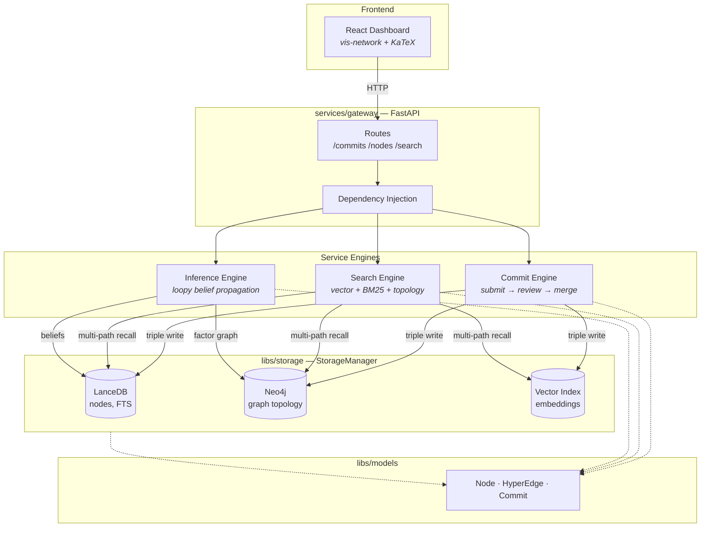

# Gaia

[](https://github.com/SiliconEinstein/Gaia/actions/workflows/ci.yml)
[](https://opensource.org/licenses/MIT)

Large Knowledge Model (LKM) — a billion-scale reasoning hypergraph for knowledge representation and inference.

Gaia stores propositions as **nodes** and reasoning relationships as **hyperedges**, with a Git-like commit workflow (submit → review → merge) and probabilistic inference via loopy belief propagation.

## Quick Start

```bash
# Install
pip install -e ".[dev]"

# Seed local databases (requires Neo4j running)
python scripts/seed_database.py \
  --fixtures-dir tests/fixtures \
  --db-path ./data/lancedb/gaia

# Run API server
GAIA_LANCEDB_PATH=./data/lancedb/gaia \
  uvicorn services.gateway.app:create_app --factory --reload --port 8000

# Run frontend dashboard
cd frontend && npm install && npm run dev
```

## Architecture



### Storage

| Backend | Purpose |
|---------|---------|
| **LanceDB** | Node content, metadata, BM25 full-text search |
| **Neo4j** | Graph topology, hyperedge relationships |
| **Vector Index** | Embedding similarity search (local impl uses LanceDB) |

### API

| Endpoint | Description |
|----------|-------------|
| `POST /commits` | Submit a batch of operations |
| `POST /commits/{id}/review` | Run review on a commit |
| `POST /commits/{id}/merge` | Merge commit to storage |
| `GET /nodes/{id}` | Read a node |
| `GET /nodes/{id}/subgraph/hydrated` | Fetch k-hop subgraph with full data |
| `POST /search/nodes` | Multi-path search (vector + BM25 + topology) |
| `POST /search/text` | BM25 text search |
| `GET /stats` | Database statistics |

## Testing

```bash
pytest                    # all tests (requires Neo4j)
pytest --cov=libs --cov=services tests  # with coverage
ruff check . && ruff format --check .   # lint
```

Tests use temporary directories for LanceDB and a real Neo4j instance. CI runs Neo4j as a Docker service container.

## Tech Stack

**Backend:** Python 3.12, FastAPI, Pydantic v2, LanceDB, Neo4j, NumPy, PyArrow

**Frontend:** React, TypeScript, Vite, Ant Design, React Query, vis-network, KaTeX
