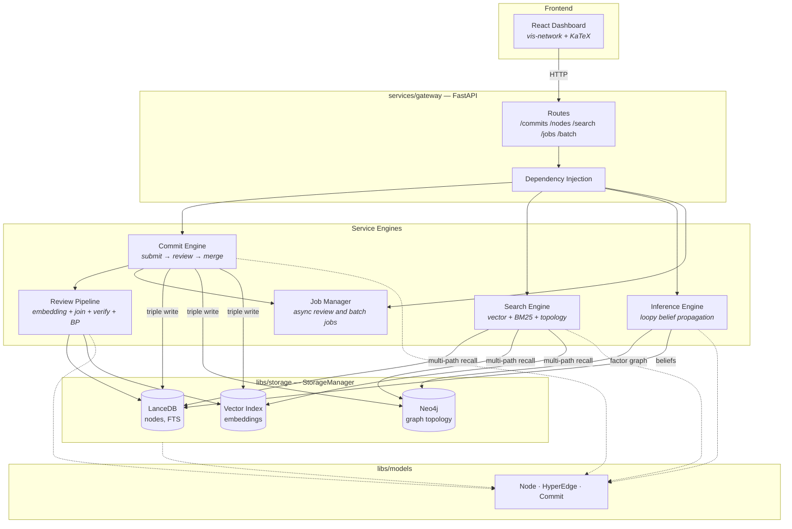

# Gaia

[](https://github.com/SiliconEinstein/Gaia/actions/workflows/ci.yml)
[](https://codecov.io/gh/SiliconEinstein/Gaia)
[](https://opensource.org/licenses/MIT)

大规模知识模型（Large Knowledge Model, LKM）—— 一个十亿级规模的推理超图，用于知识表示和推理。

Gaia 将命题存储为**节点**，将推理关系存储为**超边**，采用类似 Git 的提交工作流（submit → review → merge），并通过循环置信传播（loopy belief propagation）进行概率推理。

要了解当前的仓库/模块布局，请参阅 [docs/module-map.md](docs/module-map.md)。要查看完整的文档索引，请参阅 [docs/README.md](docs/README.md)。

## 快速开始

```bash
# 安装
pip install -e ".[dev]"

# 初始化本地数据库（需要运行 Neo4j）
python scripts/seed_database.py \
  --fixtures-dir tests/fixtures \
  --db-path ./data/lancedb/gaia

# 运行 API 服务器
GAIA_LANCEDB_PATH=./data/lancedb/gaia \
  uvicorn services.gateway.app:create_app --factory --reload --port 8000

# 运行前端仪表盘
cd frontend && npm install && npm run dev
```

## 架构



## 项目布局

| 路径 | 职责 |
|------|------|
| `libs/` | 共享模型、嵌入、存储后端、向量搜索抽象 |
| `services/` | 后端运行时模块：gateway、commit、search、inference、review pipeline、jobs |
| `frontend/` | React 仪表盘 |
| `scripts/` | 数据填充和迁移工具 |
| `tests/` | 单元测试和集成测试 |
| `docs/` | 当前模块地图、设计参考、示例、归档计划 |

### 存储

| 后端 | 用途 |
|------|------|
| **LanceDB** | 节点内容、元数据、BM25 全文搜索 |
| **Neo4j** | 图拓扑、超边关系 |
| **Vector Index** | 嵌入相似度搜索（本地实现使用 LanceDB） |

### API

| 区域 | 端点 |
|------|------|
| Commits | `GET/POST /commits`, `POST /commits/{id}/review`, `GET /commits/{id}/review`, `POST /commits/{id}/merge` |
| Read | `GET /nodes/{id}`, `GET /hyperedges/{id}`, `GET /nodes/{id}/subgraph`, `GET /nodes/{id}/subgraph/hydrated`, `GET /stats` |
| Search | `POST /search/nodes`, `POST /search/hyperedges` |
| Batch | `POST /commits/batch`, `POST /nodes/batch`, `POST /hyperedges/batch`, `POST /nodes/subgraph/batch`, `POST /search/nodes/batch`, `POST /search/hyperedges/batch` |
| Jobs | `GET /jobs/{job_id}`, `GET /jobs/{job_id}/result`, `DELETE /jobs/{job_id}` |

## 文档

| 路径 | 用途 |
|------|------|
| [docs/module-map.md](docs/module-map.md) | 当前仓库结构和模块边界 |
| [docs/architecture-rebaseline.md](docs/architecture-rebaseline.md) | 实现过程中暴露的结构问题及推荐的清理方向 |
| [docs/foundations/README.md](docs/foundations/README.md) | 基础优先规划区域，用于重新设计产品范围、图/模式、模块和 API |
| [docs/design/](docs/design/) | 设计和理论参考 |
| [docs/examples/](docs/examples/) | 推理示例 |
| [docs/plans/](docs/plans/) | 历史实现计划和 API 草案 |

## 测试

```bash
pytest                    # 所有测试（需要 Neo4j）
pytest --cov=libs --cov=services tests  # 带覆盖率
ruff check . && ruff format --check .   # 代码检查
```

测试使用临时目录存储 LanceDB，并使用真实的 Neo4j 实例。CI 将 Neo4j 作为 Docker 服务容器运行。

## 技术栈

**后端：** Python 3.12, FastAPI, Pydantic v2, LanceDB, Neo4j, NumPy, PyArrow

**前端：** React, TypeScript, Vite, Ant Design, React Query, vis-network, KaTeX