# Large Knowledge Model (LKM) Phase 1 系统设计文档

## 十亿级推理超图知识库

| 文档属性 | 值 |
|---------|---|
| 版本 | 1.6 |
| 日期 | 2026-03-02 |
| 状态 | Draft for CTO Review |
| 保密等级 | 内部机密 |
| 目标读者 | CTO / VP Engineering / Tech Lead |
| 变更记录 | v1.1: 按 API v2 重构 §3/§5/§7; v1.2: 存储架构重构为 Neo4j+LanceDB+ByteHouse 三层，去除 DuckDB 和 Redis; v1.3: 与模块详细设计对齐——移除 resolve 步骤和 merge_propositions 操作，统一命名 (/nodes, /hyperedges)，节点状态简化为 active/deleted; v1.4: Node 模型变更——text→content, confidence→prior, 新增 title/metadata 字段; v1.5: HyperEdge.reasoning 改为 list = []; v1.6: Node 移除 notations/assumptions (改用 extra)，content 类型改为 str\|dict\|list，type 改为 str；Node/HyperEdge 新增 extra: dict |

---

## 目录

1. [Executive Summary](#1-executive-summary)
2. [规模分析](#2-规模分析)
3. [系统架构](#3-系统架构)
4. [存储层详细设计](#4-存储层详细设计)
5. [构建 Pipeline 详细设计](#5-构建-pipeline-详细设计)
6. [推断引擎详细设计](#6-推断引擎详细设计)
7. [API 层与查询引擎详细设计](#7-api-层与查询引擎详细设计)
8. [基础设施需求](#8-基础设施需求)
9. [成本估算](#9-成本估算)
10. [团队配置](#10-团队配置)
11. [开发里程碑](#11-开发里程碑)
12. [风险矩阵](#12-风险矩阵)
13. [与 Phase 2 (百亿) 的演进路径](#13-与-phase-2-百亿-的演进路径)

> **关联文档**：
> - API v2 详细设计：`docs/plans/2026-03-02-lkm-api-design-v2.md`
> - 模块架构设计：`docs/plans/2026-03-02-phase1-module-architecture-design.md`


---

## 1. Executive Summary

Large Knowledge Model (LKM) 是一个基于推理超图 (reasoning hypergraph) 的大规模学术知识库系统。Phase 1 目标处理 1000 万篇论文，产生约 10 亿个命题节点和 50 亿条超边，嵌入向量总量约 4TB。

**核心设计决策**：

1. **API 架构**：采用两层 API 设计（详见 `docs/plans/2026-03-02-lkm-api-design-v2.md`）。Layer 1 (Knowledge Graph API) 提供 Git-like commit 写入模型（commit → review → merge）、精确读取和多路搜索；Layer 2 (Research API) 在 Layer 1 基础上编排 novelty/reliability/contradiction 等研究级查询。所有外部写入通过 commit 工作流入图，确保知识质量。
2. **存储层**：三层存储架构——**LanceDB** 存储命题文本与元数据（基于 Lance 列式格式）；**Neo4j** 存储图拓扑（超边建模为 reasoning 节点，通过 :TAIL/:HEAD 关系连接命题，原生图遍历支持毫秒级多跳查询）；**ByteHouse** 承担十亿级向量检索（embedding 副本，PQ 压缩，ms 级搜索延迟）。BP 消息在推理引擎进程内存中完成，无需独立缓存层。
3. **构建管线**：在 10^11 量级候选对中筛选有效关系，采用轻量级分类器预过滤 + LLM oracle 混合策略。外部论文注入通过 batch commit API 入图，内部知识发现（Abstraction/Induction/Verify）由 merge 操作异步触发。
4. **推断引擎**：在超大 factor graph 上进行局部 Bayesian belief propagation（消息传递在引擎进程内存中完成），同时通过异步全局 BP 维护一致性。Belief 值写回 LanceDB。

推荐技术路线：LanceDB + Neo4j + ByteHouse + Kafka + 自研 BP 引擎（进程内消息传递）。预计开发周期约 18 个月，需约 30 人团队，年度基础设施及 LLM API 成本约 ¥862 万（估算，不含人力成本；第 2 年运维约 ¥490 万）。

---

## 2. 规模分析

### 2.1 数据量详细分解

| 数据类别 | 数量 | 单条大小 | 总容量 |
|---------|------|---------|--------|
| **原始命题节点** (paper-extract) | 5 x 10^8 | ~2KB (content + metadata + extra) | ~1 TB |
| **Abstraction 衍生命题节点** | 1 x 10^8 | ~1.5KB | ~150 GB |
| **Induction 衍生命题节点** (deduction + conjecture) | 5 x 10^8 | ~1.5KB | ~750 GB |
| **命题节点总计** | **10^9** | - | **~1.9 TB** |
| **超边 (hyperedges)** | 5 x 10^9 | ~500B (tail/head列表 + metadata + probability) | **~2.5 TB** |
| **嵌入向量** (ByteHouse) | 10^9 x 1024d x 4B | 4KB/向量（PQ 压缩后 ~64B） | **~4 TB** 原始 / **~64 GB** PQ 压缩 |
| **论文元数据** (provenance) | 10^7 篇 | ~5KB (title, authors, DOI, sections) | ~50 GB |
| **Neo4j 图拓扑** | 6x10^9 节点 + 20x10^9 关系 | ~100B/节点, ~60B/关系 | **~1.8 TB** |
| **BP Messages** | 推理引擎进程内存 | 临时数据，算完即丢 | 不占持久存储 |
| **总存储需求** | - | - | **~9 TB**（热数据） |

### 2.2 读写吞吐量需求

| 指标 | 目标值 | 说明 |
|------|--------|------|
| **Commit API 吞吐** | 50 commits/秒（单 commit） | 含轻量检查（去重召回） |
| **Batch Commit 吞吐** | 5,000 commits/批次 | 批量注入，异步处理 |
| **论文注入速率** | 5,000 篇/小时（峰值） | 通过 batch commit API，每篇约 50 个命题 |
| **稳态注入速率** | 1,000 篇/小时 | 日常增量导入 |
| **Embedding 计算速率** | 10,000 向量/秒 | GPU 集群批量推理 |
| **ANN 搜索吞吐** | 1,000 QPS（构建时批量）| 候选对生成阶段 |
| **Layer 1 Search QPS** | 200 QPS | /search/nodes 多路召回 |
| **Layer 2 Research QPS** | 100 QPS | novelty/reliability/review 查询 |
| **LLM 调用速率** | 500 calls/秒（构建时峰值） | abstraction/induction/verify + commit review |
| **BP Message 更新** | 10^6 messages/秒 | 局部推断时的消息传播 |

### 2.3 延迟要求

| 操作类型 | P50 延迟 | P99 延迟 | 说明 |
|---------|---------|---------|------|
| **POST /commits（轻量检查）** | < 500ms | < 2s | 结构校验 + 多路去重召回 |
| **POST /commits/{id}/review** | < 5s | < 15s | LLM 深度审核（含重合检测） |
| **POST /commits/{id}/merge** | < 200ms | < 1s | 图写入 + 局部 BP |
| **GET /nodes/{id}** | < 5ms | < 50ms | 强一致点查 |
| **POST /search/nodes** | < 100ms | < 500ms | 多路召回 |
| **Layer 2: novelty** | < 500ms | < 2s | ANN 搜索 + 局部 BP |
| **Layer 2: review/paper** | < 5s | < 15s | 需多轮 LLM 调用 |
| **局部 BP 推断** | < 200ms | < 1s | 3-hop 子图消息传播 |

---

## 3. 系统架构

### 3.1 整体架构图

> **与 API v2 的对齐说明**：本架构图反映了 API v2（`docs/plans/2026-03-02-lkm-api-design-v2.md`）定义的两层 API 结构和 Git-like commit 写入模型。

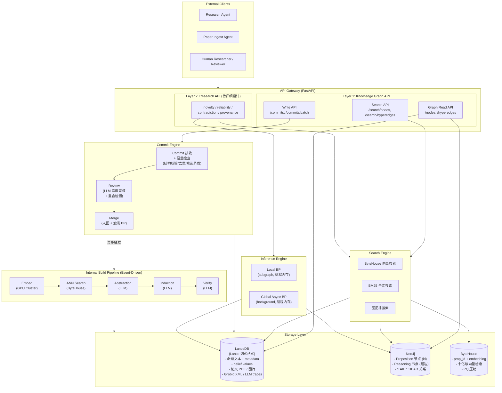

**架构说明**：

- **外部写入路径**：所有外部写入（Research Agent 提交新发现、Paper Ingest Agent 批量注入）通过 Layer 1 的 Commit API 进入系统，经过 commit → review → merge 三步工作流后入图。详见 API v2 文档。
- **内部构建管线**：Abstraction/Induction/Verify 是系统内部的知识发现流程，由 merge 操作异步触发，不经过外部 commit API。
- **查询路径**：Layer 1 提供精确读取和搜索，Layer 2 在 Layer 1 基础上编排多步查询（novelty/reliability 等），Layer 2 API 详细设计待后续文档。

### 3.2 组件职责

| 组件 | 职责 | 技术栈 |
|------|------|--------|
| **API Gateway** | 外部请求入口，路由到 Layer 1 / Layer 2 | FastAPI |
| **Commit Engine** | Git-like 写入工作流：commit → review → merge | Python + LLM API |
| **Search Engine** | 多路召回（ByteHouse 向量搜索 + BM25 + 图拓扑），合并排序 | Python + ByteHouse + Neo4j |
| **Layer 2 Research Engine** | novelty/reliability/contradiction 等研究级查询的编排 | Python + LLM（待详细设计） |
| **Inference Engine** | 在 factor graph 上执行 Belief Propagation，消息传递在进程内存中完成 | 自研 C++/Rust 引擎，Python binding |
| **LanceDB (主存储)** | 命题文本+metadata+belief、论文 PDF/图片/XML（不存 embedding） | LanceDB (Lance 列式格式) |
| **Neo4j (图拓扑)** | 超边建模为 reasoning 节点，:TAIL/:HEAD 关系连接命题，原生图遍历 | Neo4j Enterprise |
| **ByteHouse (向量检索)** | prop_id + embedding 副本，十亿级 ms 检索，PQ 压缩 | ByteHouse 云服务（火山引擎） |
| **Internal Build Pipeline** | 知识发现（Abstraction/Induction/Verify），merge 后异步触发 | Kafka + GPU 集群 + LLM API |

### 3.3 同步 vs 异步边界

| 操作 | 模式 | 理由 |
|------|------|------|
| **写入路径 (Commit API)** | | |
| POST /commits（提交 + 轻量检查） | **同步** | 结构校验和去重候选召回秒级完成 |
| POST /commits/{id}/review（LLM 审核） | **异步 (streaming)** | LLM 调用耗时 5-15s，SSE 流式返回 |
| POST /commits/{id}/merge（入图） | **同步** | 三写（LanceDB + Neo4j + ByteHouse）+ 局部 BP；索引更新异步 |
| POST /commits/batch（批量提交） | **异步** | 返回 batch_id，通过 poll 查询进度 |
| **查询路径** | | |
| Layer 1 精确读取 (GET /nodes/{id}) | **同步** | 强一致，延迟 < 10ms |
| Layer 1 搜索 (POST /search/*) | **同步** | 多路召回，P50 < 100ms |
| Layer 2 Research API (novelty/reliability) | **同步/异步** | 简单查询同步返回；review 等重查询 SSE 流式 |
| **内部管线** | | |
| merge → Abstraction/Induction/Verify 触发 | **异步 (Kafka)** | 解耦写入和知识发现 |
| ANN 候选对 → LLM 分类 | **异步 (Kafka)** | 大规模批量处理，错误重试 |
| BP 全局一致性维护 | **异步 (后台)** | 非实时，可接受分钟级延迟 |

---

## 4. 存储层详细设计

### 4.0 存储层架构总览与选型决策

**当前状态**：原型系统使用本地 JSON 文件分片存储（`_SHARD_SIZE=1000`，三级分片），SQLite 存储节点状态索引，FAISS flat 索引。这一方案在千级规模运行良好，但完全无法扩展到十亿级。

**核心设计决策：三层存储架构**

```
┌─────────────────────────────────────────────────────┐
│           Neo4j  — 图拓扑层                          │
│  Proposition 节点(id) + Reasoning 节点(超边)          │
│  :TAIL / :HEAD 关系，原生 Cypher 图遍历              │
├─────────────────────────────────────────────────────┤
│         LanceDB  — 主存储层                          │
│  命题文本 + metadata + belief + quality_scores        │
│  论文内容、审核记录（不存 embedding）                  │
├─────────────────────────────────────────────────────┤
│       ByteHouse  — 向量检索层                        │
│  prop_id + 1024d embedding（PQ 压缩）                │
│  十亿级 ms 检索，recall ≥ 95% 时 QPS 4200+          │
└─────────────────────────────────────────────────────┘

BP 引擎：进程内存完成消息传递，结果(belief)写回 LanceDB
```

**各层选型理由**：

| 层 | 选型 | 替代方案 | 选型理由 |
|----|------|---------|---------|
| **图拓扑** | Neo4j | DuckDB (递归 CTE) | 超边建模为 reasoning 节点后，Neo4j 原生图遍历在 5-hop 查询上比 SQL 递归 CTE 快 10-100x；Cypher 查询更直观 |
| **主存储** | LanceDB | FoundationDB / PostgreSQL | Lance 列式格式，append-heavy 友好，zero-copy 读取，开源免费。不再存 embedding（由 ByteHouse 接管），存储量从 ~5.7TB 降至 ~1.7TB |
| **向量检索** | ByteHouse | LanceDB DiskANN / Milvus | ByteHouse 12 亿级实测验证（150-200ms Top1000），PQ 压缩到 1/4 内存；ICDE 2025 最佳工业论文。云托管，免运维 |
| **BP 消息** | 引擎进程内存 | Redis Cluster (原方案) | BP 消息是单次计算的临时中间状态，算完即丢；无需跨进程共享。去掉 Redis 省 20 节点 |

**LanceDB 已知限制与应对**：

| 限制 | 影响 | 应对策略 |
|------|------|---------|
| 更新需 rewrite segment | belief 值需定期更新 | belief 更新频率低（全局 BP 每 30 分钟一次），可接受 segment rewrite；或使用 upsert 模式 |
| 无原生图遍历 | 超边邻接查询无法用 LanceDB | 图拓扑独立存储在 Neo4j |
| 单表并发写入需协调 | 多 Pipeline worker 并发写入 | 使用 LanceDB 的 merge-on-read 策略 + 定期 compaction |
| 分布式分片尚在发展中 | Phase 2 扩展到 10^10 需要分片 | Phase 1 单机/少量节点可覆盖；Phase 2 时评估 Lance 的分布式方案或分表策略 |

### 4.1 命题存储：LanceDB

**LanceDB Table Schema**（不含 embedding，向量检索由 ByteHouse 承担）：

```python
import lancedb
import pyarrow as pa

# 连接 LanceDB（本地 SSD 路径）
db = lancedb.connect("/data/lancedb/lkm")

# 命题表 schema（无 embedding 列——向量存储在 ByteHouse）
propositions_schema = pa.schema([
    # 主键与分类
    pa.field("id", pa.int64()),                          # 命题 ID（全局唯一）
    pa.field("type", pa.utf8()),                         # paper-extract | abstraction | deduction | conjecture
    pa.field("subtype", pa.utf8()),                      # subsumption | partial_overlap | ...
    pa.field("round", pa.int32()),                       # 创建轮次

    # 命题内容
    pa.field("title", pa.utf8()),                        # 命题标题（可选）
    pa.field("content", pa.utf8()),                      # 命题文本（~500 chars avg）；也可存 JSON (dict/list)
    pa.field("keywords", pa.list_(pa.utf8())),           # 关键词列表

    # 来源信息
    pa.field("paper_id", pa.utf8()),                     # 关联论文 ID
    pa.field("section", pa.utf8()),                      # 论文章节
    pa.field("prior", pa.float32()),                     # LLM 提取先验置信度
    pa.field("metadata", pa.utf8()),                     # JSON 格式扩展元数据
    pa.field("extra", pa.utf8()),                        # JSON 格式自定义扩展字段（原 notations/assumptions 等移入此处）

    # BP 推理结果
    pa.field("belief", pa.float64()),                    # 当前置信度（由 BP 引擎写回）

    # 状态与时间
    pa.field("status", pa.utf8()),                       # active | deleted
    pa.field("created_at", pa.timestamp("ms")),          # 创建时间
    pa.field("updated_at", pa.timestamp("ms")),          # 最后更新时间
])

# 创建表（无向量索引——向量检索走 ByteHouse）
tbl = db.create_table("propositions", schema=propositions_schema)
```

**论文元数据表 schema**：

```python
papers_schema = pa.schema([
    pa.field("paper_id", pa.utf8()),                     # arxiv:2301.12345
    pa.field("title", pa.utf8()),
    pa.field("authors", pa.list_(pa.utf8())),
    pa.field("doi", pa.utf8()),
    pa.field("year", pa.int32()),
    pa.field("venue", pa.utf8()),
    pa.field("abstract", pa.utf8()),
    pa.field("ingested_at", pa.timestamp("ms")),
    pa.field("node_count", pa.int32()),                  # 该论文提取的命题数
])

papers_tbl = db.create_table("papers", schema=papers_schema)
```

**存储量估算**（不含 embedding，向量存储在 ByteHouse）：

| 数据列 | 单条大小 | 10^9 条总量 | 说明 |
|--------|---------|------------|------|
| id + type + subtype + round + status | ~50B | ~50 GB | 固定长度字段 |
| title + content + keywords + metadata + extra | ~1.6KB | ~1.6 TB | 变长文本，Lance 使用字典编码压缩 |
| paper_id + section + prior + belief + timestamps | ~110B | ~110 GB | 固定/短字段 |
| **命题表总计** | ~1.7KB | **~1.7 TB** (原始) | Lance 压缩后预计 ~1.0 TB |

### 4.2 图拓扑存储：Neo4j（超边建模为 Reasoning 节点）

**设计决策**：超图中的超边 (hyperedge) 连接多个命题节点，但 Neo4j 只支持二元边。解决方案：**将超边建模为 Reasoning 节点**——每条超边对应一个中间节点，通过 `:TAIL`（前提）和 `:HEAD`（结论）关系连接到命题节点。

**超图建模**：

```
Induction (多个前提 → 一个结论):

  (:Proposition {id:"A"}) -[:TAIL]→ (:Hyperedge:Induction {id:"e1", commit_id:"c1"}) -[:HEAD]→ (:Proposition {id:"D"})
  (:Proposition {id:"B"}) -[:TAIL]→ (:Hyperedge:Induction ...)
  (:Proposition {id:"C"}) -[:TAIL]→ (:Hyperedge:Induction ...)


Abstraction (一个弱命题 → 多个强命题):

  (:Proposition {id:"A"}) -[:TAIL]→ (:Hyperedge:Abstraction {id:"e2", commit_id:"c2"}) -[:HEAD]→ (:Proposition {id:"B1"})
                                                                                        -[:HEAD]→ (:Proposition {id:"B2"})
                                                                                        -[:HEAD]→ (:Proposition {id:"B3"})
```

**节点与关系定义 (Cypher)**：

```cypher
-- 命题节点（只存 ID，详情在 LanceDB）
CREATE CONSTRAINT FOR (p:Proposition) REQUIRE p.id IS UNIQUE;

-- 超边节点（Reasoning 节点），用双 Label 区分类型
-- :Hyperedge 是通用标签，:Induction / :Abstraction 是类型标签
CREATE CONSTRAINT FOR (e:Hyperedge) REQUIRE e.id IS UNIQUE;

-- 创建 Induction 超边示例
CREATE (e:Hyperedge:Induction {id: 'e1', commit_id: 'c1', probability: 0.95, verified: false, created_at: datetime()})

-- 连接前提（TAIL）和结论（HEAD）
MATCH (a:Proposition {id: 'A'}), (b:Proposition {id: 'B'}), (c:Proposition {id: 'C'}), (d:Proposition {id: 'D'})
MATCH (e:Hyperedge {id: 'e1'})
CREATE (a)-[:TAIL]->(e), (b)-[:TAIL]->(e), (c)-[:TAIL]->(e), (e)-[:HEAD]->(d)

-- 论文-命题关联
CREATE INDEX FOR (p:Proposition) ON (p.paper_id);
```

**典型查询 (Cypher)**：

```cypher
-- 从命题 A 出发，找所有能推出的结论（知识图 1-hop = Neo4j 2-hop）
MATCH (a:Proposition {id: $id})-[:TAIL]->(e:Hyperedge)-[:HEAD]->(conclusion:Proposition)
RETURN conclusion, e

-- 从命题 D 出发，找所有支撑它的前提
MATCH (premise:Proposition)-[:TAIL]->(e:Hyperedge)-[:HEAD]->(d:Proposition {id: $id})
RETURN premise, e

-- BP 用的 3-hop 邻域提取（知识图 3-hop = Neo4j 6-hop）
MATCH path = (start:Proposition {id: $id})-[:TAIL|HEAD*1..6]-(node)
WHERE node:Proposition
RETURN DISTINCT node

-- 论文的所有命题
MATCH (p:Proposition {paper_id: $paper_id})
RETURN p
```

**Neo4j 存储规模估算**：

| 实体 | 数量 | 单条大小 | 总容量 | 说明 |
|------|------|---------|--------|------|
| :Proposition 节点 | 10^9 | ~80B (id + paper_id) | ~80 GB | 只存 ID 和轻量索引属性 |
| :Hyperedge 节点 | 5x10^9 | ~120B (id + commit_id + probability + type) | ~600 GB | Reasoning 节点 |
| :TAIL 关系 | ~10x10^9 | ~60B | ~600 GB | Induction 平均 3 条 + Abstraction 1 条 |
| :HEAD 关系 | ~10x10^9 | ~60B | ~600 GB | Induction 1 条 + Abstraction 平均 3 条 |
| 索引开销 | - | - | ~200 GB | 唯一约束 + 属性索引 |
| **Neo4j 总计** | 6x10^9 节点, 20x10^9 关系 | - | **~2.1 TB** (磁盘) | 需 ~800 GB 堆外内存（page cache） |

**Neo4j 部署配置**：

| 配置项 | 值 | 说明 |
|--------|---|------|
| 版本 | Neo4j 5.x Enterprise | 支持 fabric（联邦查询）和 causal cluster |
| 部署模式 | 单实例（Phase 1），Phase 2 迁移到 causal cluster | 6x10^9 节点在单实例验证范围内 |
| JVM Heap | 64 GB | 用于事务处理和查询缓存 |
| Page Cache | 800 GB | 尽量将全部图数据缓存在内存中 |
| 硬件 | 64C / 1TB 内存 / 4TB NVMe | 高内存实例 |

**为什么选 Neo4j 而非 DuckDB**：

| 维度 | DuckDB (原方案) | Neo4j (新方案) |
|------|----------------|---------------|
| 图遍历 (3-hop) | 递归 CTE，深度增加性能急剧下降 | 原生 Cypher，5-hop 毫秒级 |
| 超边建模 | 需要 4 张关系表 + 邻接索引表 | 自然建模为节点 + 关系 |
| BP 子图提取 | 多表 JOIN + 递归查询 | 单条 Cypher 路径查询 |
| 运维 | 嵌入式，零运维 | 需独立进程，需高内存实例 |
| 成本 | 几乎为零 | 高内存实例 + Enterprise 授权 |

### 4.3 向量检索：ByteHouse

**选型分析**：

| 候选方案 | 优势 | 劣势 | 结论 |
|---------|------|------|------|
| **ByteHouse** | 12 亿级实测验证（150-200ms Top1000）；PQ 压缩 1/4 内存；ICDE 2025 最佳工业论文；标量+向量混合查询深度优化 | 云托管服务（非本地）；依赖火山引擎生态 | **选定** |
| **LanceDB DiskANN** | 磁盘索引支持十亿级；与数据同表存储；开源免费 | 无公开十亿级 benchmark；分布式搜索尚在发展中 | 本地开发/测试用 |
| **Milvus 2.x** | 原生分布式、支持 GPU、万亿级验证 | 运维复杂度高（22+ 节点） | 备选 (Phase 2 评估) |

**选择理由**：ByteHouse 基于 ClickHouse 扩展，在 12 亿数据实测中以 64 核/256GB 硬件实现 Top1000 检索 150-200ms。其 BlendHouse 框架获 ICDE 2025 最佳工业论文，验证了云原生 OLAP 上高性能向量检索的可行性。在 VectorDBBench (Cohere 1M) 测试中，recall ≥ 95% 时 QPS 达 4200+，p99 < 15ms。

**ByteHouse 只存向量+ID**（所有业务数据在 LanceDB）：

```sql
-- ByteHouse 表 schema（仅存 ID + 向量）
CREATE TABLE lkm.proposition_vectors (
    prop_id   Int64,
    embedding Array(Float32)    -- 1024d
) ENGINE = HaMergeTree
ORDER BY prop_id;

-- 创建 HNSW 向量索引
ALTER TABLE lkm.proposition_vectors
ADD INDEX vec_idx embedding TYPE HNSW('metric_type=Cosine');
```

**向量检索示例**：

```sql
-- 语义搜索：返回 Top-50 相似命题 ID
SELECT prop_id, cosineDistance(embedding, [query_vector]) AS distance
FROM lkm.proposition_vectors
ORDER BY distance
LIMIT 50;

-- 检索结果的 prop_ids → 再去 LanceDB 补全详情
```

**ByteHouse 配置与性能预期**：

| 配置项 | 值 | 说明 |
|--------|---|------|
| 索引类型 | HNSW (主) / IVF_PQ (备选) | HNSW 召回高；IVF_PQ 更省内存 |
| 向量维度 | 1024d | BGE-M3 / E5-mistral 输出 |
| PQ 压缩 | m=64, bits=8 → 64 bytes/向量 | 10^9 x 64B = ~64 GB（内存中的压缩向量） |
| 原始向量磁盘 | 10^9 x 4KB = ~4 TB | ByteHouse 磁盘存储 |
| 搜索延迟 (P50) | < 15ms (Top-50) | 基于 VectorDBBench 结果 |
| QPS | 4200+ (recall ≥ 95%) | 基于 Cohere 1M benchmark |

**本地/小规模 Fallback 部署方案**：

生产环境和本地环境使用同一套代码，通过配置切换存储后端：

```
生产环境:  Neo4j Enterprise  +  LanceDB (文本+元数据)  +  ByteHouse (向量检索)
本地环境:  Neo4j Community   +  LanceDB (文本+元数据+embedding+向量检索)
```

| 组件 | 生产环境 | 本地 Fallback | 切换方式 |
|------|---------|-------------|---------|
| 图拓扑 | Neo4j Enterprise (集群) | Neo4j Community (单实例) | 同一 Cypher 接口，无代码变更 |
| 主存储 | LanceDB (不含 embedding) | LanceDB (含 embedding 列) | 配置项控制是否写入 embedding 列 |
| 向量检索 | ByteHouse 云服务 | LanceDB 内置 DiskANN 索引 | `VectorSearchClient` 抽象层 |

**LanceDB Fallback 时的 Schema 变化**：本地模式下 LanceDB `propositions` 表增加 `embedding` 列（1024d float32），并创建 DiskANN/IVF_PQ 向量索引。向量数据不再需要写入 ByteHouse。

**抽象层接口设计**：

```python
class VectorSearchClient(ABC):
    """向量检索抽象层——生产用 ByteHouse，本地用 LanceDB"""

    @abstractmethod
    async def insert_batch(self, node_ids: list[int], embeddings: list[list[float]]) -> None: ...

    @abstractmethod
    async def search(self, query: list[float], k: int = 50) -> list[tuple[int, float]]:
        """返回 [(node_id, distance), ...]"""
        ...

    @abstractmethod
    async def search_batch(self, queries: list[list[float]], k: int = 50) -> list[list[tuple[int, float]]]: ...

class ByteHouseVectorClient(VectorSearchClient):
    """生产环境：ByteHouse 云服务"""
    ...

class LanceDBVectorClient(VectorSearchClient):
    """本地 Fallback：LanceDB 内置 DiskANN"""
    ...
```

**适用场景**：
- 本地开发调试（< 10^6 命题）
- 单机演示部署
- CI/CD 集成测试（无需云服务依赖）
- 小团队独立部署（无 ByteHouse 预算）

### 4.4 文件存储：论文 PDF 与图片

**策略：Lance binary 列 + 大文件 OSS 混合**

Lance 格式原生支持 binary 列（`pa.binary()` 或 `pa.large_binary()`），可直接存储文件内容。但对于大文件（如完整 PDF > 50MB），列式存储的效率会下降。因此采用混合策略：

| 文件类型 | 平均大小 | 存储位置 | 理由 |
|---------|---------|---------|------|
| Grobid XML | 50-200 KB | LanceDB `papers_files` 表 | 小文件，zero-copy 读取高效 |
| 论文图片/图表 | 100-500 KB | LanceDB `papers_files` 表 | 小文件，与命题关联查询方便 |
| LLM 调用日志 | 1-10 KB | LanceDB `llm_traces` 表 | 小文件，便于审计查询 |
| 论文 PDF 原文 | 1-50 MB | OSS (S3/MinIO) | 大文件，顺序读取场景，OSS 更经济 |
| 历史 BP 快照 | 变长 | OSS (S3/MinIO) | 冷数据，归档场景 |

```python
# 论文文件表 schema
papers_files_schema = pa.schema([
    pa.field("file_id", pa.utf8()),              # {paper_id}_{file_type}
    pa.field("paper_id", pa.utf8()),
    pa.field("file_type", pa.utf8()),            # xml | figure | table | trace
    pa.field("content", pa.large_binary()),      # 文件二进制内容
    pa.field("mime_type", pa.utf8()),
    pa.field("size_bytes", pa.int64()),
    pa.field("created_at", pa.timestamp("ms")),
])

# 大文件仅存引用
papers_pdf_refs_schema = pa.schema([
    pa.field("paper_id", pa.utf8()),
    pa.field("pdf_url", pa.utf8()),              # s3://lkm-papers/raw/{paper_id}.pdf
    pa.field("pdf_size_bytes", pa.int64()),
    pa.field("uploaded_at", pa.timestamp("ms")),
])
```

### 4.5 BP 消息：引擎进程内存

BP 过程中产生的 message 是单次计算的临时中间状态，**不需要跨进程共享或持久化**。

- **局部 BP**（merge 时触发）：500 节点子图，消息量 ~数千条，在引擎进程内存中 ~200ms 完成
- **全局 BP**（后台 daemon）：按分区处理，每个子任务 ~10^4 节点，消息量 ~10^5 条，在引擎进程内存中完成

**BP 引擎内存估算**：
- 单次局部 BP：500 节点 x 2000 边 x 6 messages x 16B = ~192 KB（可忽略）
- 全局 BP 单分区：10^4 节点 x ~10^5 messages x 16B = ~1.6 MB（可忽略）
- 全局 BP 并行 worker 峰值内存：32 workers x 1.6 MB = ~50 MB

**Belief 值持久化**：BP 计算完成后的最终 belief 值写回 LanceDB `propositions` 表的 `belief` 列。查询时直接从 LanceDB 读取，无需额外缓存层。

**与原方案（Redis Cluster）对比**：

| 维度 | Redis Cluster (原方案) | 引擎进程内存 (新方案) |
|------|----------------------|---------------------|
| 节点数 | 20 个 32GB 实例 | 0（无额外基础设施） |
| 月成本 | ¥70,000 | ¥0 |
| 消息读写延迟 | < 1ms（网络 I/O） | < 1μs（本地内存） |
| 运维负担 | Redis 集群管理 | 无 |

### 4.6 冷热分层策略

Lance 格式的 segment compaction 机制天然支持数据分层：旧 segment 可直接归档到低成本存储，无需数据格式转换。

| 层级 | 数据内容 | 存储介质 | 容量 | 访问延迟 |
|------|---------|---------|------|---------|
| **L0 Hot** | Neo4j 图拓扑（page cache）+ ByteHouse 向量索引 | 内存 + NVMe SSD | ~900 GB | < 1ms (Neo4j) / < 15ms (ByteHouse) |
| **L1 Warm** | 所有活跃节点 (LanceDB 主表) + Neo4j 磁盘存储 | NVMe SSD | ~4 TB | < 10ms |
| **L2 Cold** | 历史轮次 Lance segments、已删除的节点、LLM 调用日志 | SATA SSD / HDD | ~15 TB | < 100ms |
| **L3 Archive** | 原始 PDF、旧版 Lance segments | S3 / OSS | ~30 TB | 分钟级 |

**Lance segment compaction 与归档**：

```
Lance 数据目录结构：
/data/lancedb/lkm/propositions.lance/
  ├── _versions/           # 版本元数据（MVCC）
  │   ├── 1.manifest
  │   ├── 2.manifest
  │   └── ...
  ├── data/
  │   ├── segment-0001.lance   # 热 segment（新数据）
  │   ├── segment-0002.lance   # 热 segment
  │   ├── ...
  │   └── segment-1234.lance   # 冷 segment（可归档）

归档策略：
  1. 定期运行 compaction: tbl.compact_files() — 合并小 segment
  2. 超过 90 天未访问的 segment → 移动到 SATA SSD (L2)
  3. 超过 1 年的 segment → 归档到 S3 (L3)
  4. 归档的 segment 保持 Lance 格式，需要时可直接挂载恢复
```

**自动化分层规则**：
- 节点 status = "deleted" 且 inactive_round > 当前 round - 10 → compaction 到独立 segment 后降级到 L2
- 超边验证状态 = "fail" → 标记为 soft-delete，30 天后对应 segment 归档到 L3

### 4.7 容量规划总表

| 存储系统 | 热数据 | 温数据 | 冷数据 | 总容量 | 副本 | 总磁盘 |
|---------|--------|--------|--------|--------|------|--------|
| LanceDB (命题文本+metadata+belief) | 300 GB | 1.0 TB | 2 TB | 3.3 TB | 2x (本地 RAID) | 6.6 TB |
| LanceDB (文件: XML/图片/traces) | 50 GB | 200 GB | 1 TB | 1.25 TB | 2x | 2.5 TB |
| Neo4j (图拓扑) | 2.1 TB (含 page cache) | - | - | 2.1 TB | 2x (本地 RAID) | 4.2 TB |
| ByteHouse (向量检索) | ~4 TB (原始) / ~64 GB (PQ) | - | - | ~4 TB | 云服务内置 | 云服务 |
| OSS/S3 (PDF 原文 + 归档) | - | - | 30 TB | 30 TB | S3 内置 | 30 TB |
| **总计** | **~6.5 TB** | **~1.2 TB** | **~33 TB** | **~40.6 TB** | - | **~43 TB** |

**与原方案对比**：

| 指标 | 原方案 (FDB+Milvus+S3) | v1.1 (LanceDB+DuckDB+Redis) | v1.2 (LanceDB+Neo4j+ByteHouse) |
|------|------------------------|----------------------------|-------------------------------|
| 总磁盘容量 | ~103 TB | ~59 TB | **~43 TB** |
| 需要管理的存储系统数 | 4 (FDB+Milvus+Redis+S3) | 3 (LanceDB+DuckDB+Redis)+S3 | 3 (LanceDB+Neo4j+ByteHouse)+S3 |
| Redis 节点 | 20 | 20 | **0（已去除）** |
| 图遍历性能 | SQL 递归 CTE | SQL 递归 CTE | **原生 Cypher，ms 级** |
| 向量检索验证规模 | Milvus 万亿级 | DiskANN 十亿级理论 | **ByteHouse 12亿实测** |

---

## 5. 构建 Pipeline 详细设计

### 5.0 写入架构总览：Commit API 与内部 Pipeline 的关系

> **与 API v2 的对齐说明**：API v2 确立了 Git-like commit 写入模型，所有外部写入通过 commit → review → merge 工作流入图。本节描述的内部 Build Pipeline（Abstraction/Induction/Verify）是系统自主的知识发现流程，由 merge 操作异步触发。

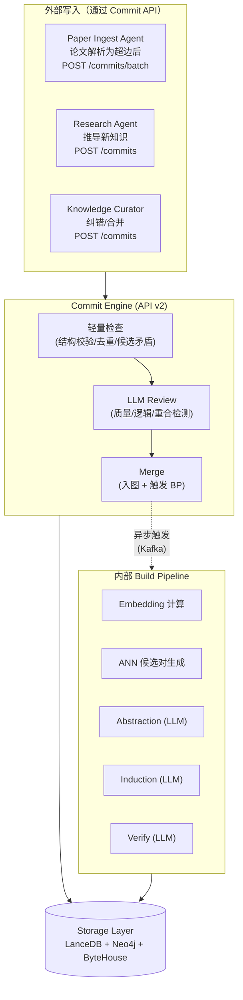

**关键设计决策**：

| 写入路径 | 触发方 | 经过 Commit API？ | 说明 |
|---------|--------|------------------|------|
| **论文注入** | Paper Ingest Agent | ✅ 通过 `/commits/batch` | 论文解析（Grobid + LLM）在 LKM 外部完成，解析后的超边通过 batch commit API 入图 |
| **Agent 推导** | Research Agent | ✅ 通过 `/commits` | Agent 检索已有知识 → 推理 → 提交新发现 |
| **纠错/修改** | Knowledge Curator | ✅ 通过 `/commits` | modify_edge, modify_node 等操作 |
| **Abstraction/Induction/Verify** | 系统内部 | ❌ 直接写入存储 | 可信的内部流程，无需外部 review |

### 5.1 论文注入流程

论文注入分为两个阶段：**论文解析**（LKM 外部）和**超边入图**（通过 Commit API）。

**阶段 1：论文解析（LKM 外部，Paper Ingest Agent 负责）**

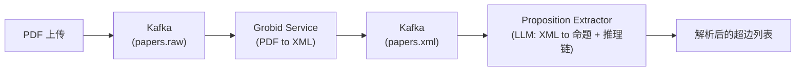

**阶段 2：超边入图（通过 Commit API）**

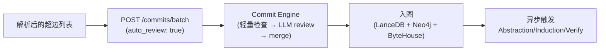

**Grobid 集群**：
- 4 个 Grobid 实例，每个 8C/16GB
- 吞吐量：约 50 PDF/min/实例 = 200 PDF/min 总计
- 5000 篇/小时 ÷ 200 篇/min = 25 min，有 2.4x 余量

**Proposition Extractor (LLM)**：
- 使用中等规模 LLM（如 GPT-4o-mini 级别）提取推理链
- 每篇论文 1 次 LLM 调用，输入约 8K tokens，输出约 4K tokens
- 1000 万篇 x ¥0.02/call（估算，使用通义千问-plus 级别模型）= **¥200,000**（一次性成本）

**Batch Commit 优化**（详见 API v2 §3.7）：
- batch 内部有自己的批量优化实现，不分解为逐条单 commit 调用
- 跨 commit 去重、批量 LLM review、单次 BP 触发、单次索引重建
- 每个 commit 独立追踪状态（pass / merged / rejected）

### 5.2 Embedding 计算

**当前原型**：使用 DashScope 远程 API，异步 24 workers，最大 600 RPS。

**Phase 1 策略**：自建 GPU 推理集群。

| 配置项 | 值 |
|--------|---|
| 模型 | BGE-M3 或 E5-mistral（1024d 输出） |
| 推理框架 | vLLM / TensorRT |
| GPU | 4 x A100 80GB |
| 批量大小 | 512 sentences/batch |
| 吞吐量 | ~10,000 embeddings/sec/GPU = 40K/sec total |
| 10^9 向量总耗时 | 10^9 / 40,000 / 3600 = **~7 小时** |

**流式 vs 批量**：
- **初始构建**：批量模式。按 paper 分组，每 1000 篇论文 emit 一个 batch（50K 向量），通过 GPU 集群并行计算。
- **增量更新**：流式模式。新论文注入时实时计算 embedding，延迟 < 100ms/向量。

### 5.3 候选对生成

**规模分析**：

10^9 个命题，ANN 搜索 k=100，阈值 threshold=0.65（当前原型配置）。

- 原始候选对数量：10^9 x 100 = 10^11 对（上限）
- 经过 same-edge exclusion 和 same-chain exclusion 过滤后，估算有效候选对：~10^10 对
- 这是最大的成本瓶颈

**ANN 参数选择**：

| 参数 | 构建阶段 | 查询阶段 | 理由 |
|------|---------|---------|------|
| k | 100 | 50 | 构建时需要更高 recall 以发现弱关系 |
| 阈值 | 0.65 | 0.70 | 构建时稍宽松，查询时更严格以减少延迟 |
| nprobes | 128 | 64 | 构建时追求 recall，查询时追求延迟 |
| refine_factor | 5 | 3 | 加载原始向量重计算精确余弦相似度 |
| ANN 搜索总耗时 | 10^9 / 2000 QPS = ~5.8 天 | - | ByteHouse 并行查询 |

**优化**：将 ANN 搜索分为两阶段：
1. **粗筛**：ByteHouse PQ 压缩距离搜索 k=200，获取候选集（含误报）
2. **精排**：加载原始向量重新计算精确余弦相似度，过滤 threshold 以下的对

### 5.4 多级过滤策略（LLM 调用预算分析）

这是 Phase 1 最关键的设计决策之一。

**问题**：10^10 候选对全量送 LLM 判断不可行。

| 策略 | 调用次数 | 单价 (估算) | 总成本 | 可行性 |
|------|---------|------------|--------|--------|
| LLM 全量调用 | 10^10 | ¥0.01/call | **¥100,000,000** | 不可行 |
| Classifier 过滤 + LLM oracle | 10^8 (1% 通过率) | ¥0.01/call | **¥1,000,000** | 可行 |
| 纯 Classifier | 0 | - | ¥0 | 精度不足 |

**推荐混合策略（三级漏斗）**：

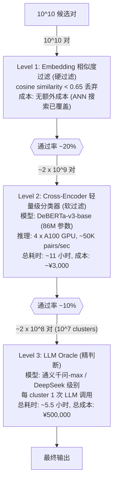

**Cross-Encoder 训练数据来源**：
- 使用当前原型系统累积的 LLM 分类结果作为训练标签
- 正样本：LLM 判定为 subsumption/partial_overlap 的对
- 负样本：LLM 判定为 no_relation 的对 + 低相似度随机对
- 估算训练数据需要 10 万+ 标注对（可从原型运行中自动收集）

### 5.5 Abstraction 流程详细设计

当前原型实现了三种 Abstraction 操作（`abstraction-cc`, `abstraction-cp`, `abstraction-jj`），Phase 1 保持相同的语义，但需要适配分布式处理。

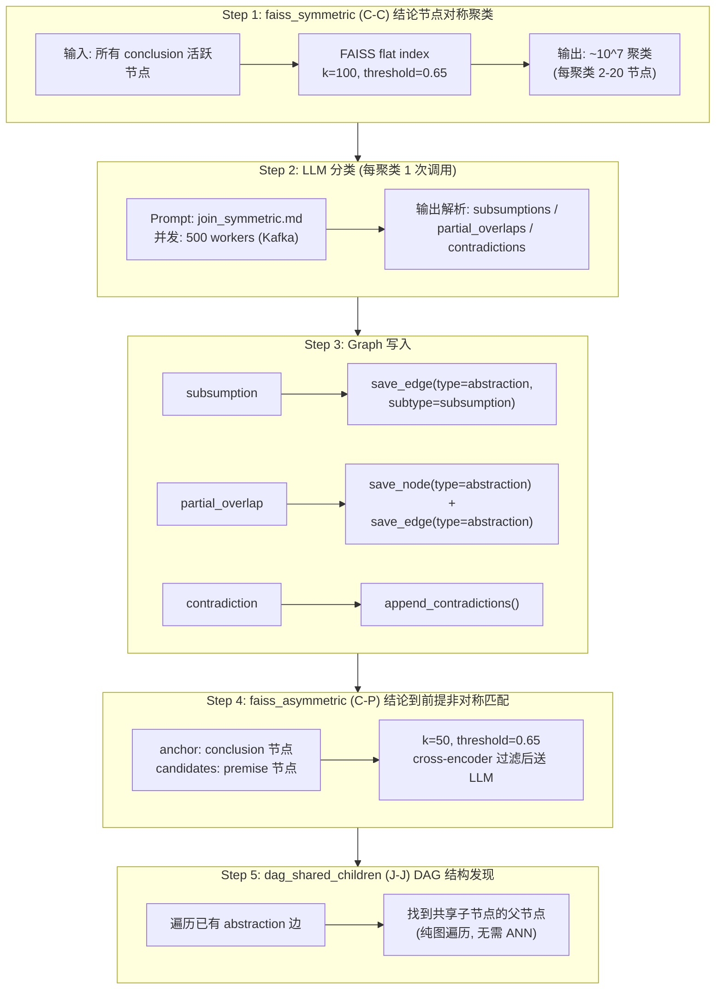

**Kafka Topic 设计**：

| Topic | 分区数 | 消息格式 | Consumer Group |
|-------|--------|---------|----------------|
| `abstraction.clusters.cc` | 64 | `{cluster_id, node_ids: [...]}` | `abstraction-cc-workers` (500 instances) |
| `abstraction.clusters.cp` | 64 | `{anchor_id, candidate_ids: [...]}` | `abstraction-cp-workers` (500 instances) |
| `abstraction.results` | 32 | `{cluster_id, edges: [...], nodes: [...]}` | `graph-writer` (16 instances) |
| `abstraction.errors` | 8 | `{cluster_id, error: "..."}` | `error-handler` (4 instances) |

### 5.6 Induction 流程详细设计

Induction 操作在 Abstraction 构建的 DAG 上运行，收集每个父节点的"兄弟组"（共享同一父节点的子节点），分析它们之间的关系。

```mermaid
graph TD
    subgraph S1["Step 1: 兄弟组收集"]
        S1A["遍历所有 type=abstraction 的超边"] --> S1B["按 parent 分组:<br/>parent_id to child_ids"]
        S1B --> S1C["过滤: 保留 >= 2 个兄弟的组<br/>预期组数: ~5 x 10^6"]
    end

    subgraph S2["Step 2: LLM 分析 (每组 1 次调用)"]
        S2A["Prompt: induction.md"] --> S2B["contradiction: 兄弟间矛盾"]
        S2A --> S2C["deduction (P=1.0): 必然推论"]
        S2A --> S2D["conjecture (P&lt;1.0): 猜想"]
    end

    subgraph S3["Step 3: Graph 写入"]
        S3A["contradiction"] --> S3AW["save_edge(type=contradiction)"]
        S3B["deduction"] --> S3BW["save_node(type=deduction) +<br/>save_edge(type=induction)"]
        S3C["conjecture"] --> S3CW["save_node(type=conjecture) +<br/>save_edge(type=induction)"]
    end

    subgraph S4["Step 4: Embedding 增量更新"]
        S4A["新建 deduction/conjecture 节点<br/>计算 embedding"] --> S4B["写入 LanceDB<br/>(命题 + 向量统一存储)"]
        S4B --> S4C["触发下一轮 Abstraction<br/>(新节点参与新聚类)"]
```

> **注**：§5.4 中的 "embedding 相似度过滤" 和 "ANN 搜索" 在 Phase 1 中由 ByteHouse 执行（而非 LanceDB DiskANN）。Induction 阶段产出的新节点写入三层存储（LanceDB + Neo4j + ByteHouse）。
    end

    S1 --> S2 --> S3 --> S4
```

### 5.7 Verify 流程详细设计

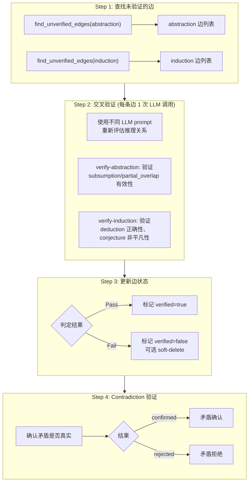

**成本估算**：
- Abstraction 边约 10^8 条 → 验证需 10^8 次 LLM 调用 → ¥3,000,000（估算，使用通义千问-plus 级别模型）
- Induction 边约 10^8 条 → 验证需 10^8 次 LLM 调用 → ¥3,000,000（估算）
- **优化**：采样验证 10% + 高置信度边自动 pass → 实际约 2x10^7 次调用 → **¥600,000**

### 5.8 Contradiction 检测流程

矛盾在两个阶段被发现：
1. **Abstraction 阶段**：相似命题聚类后，LLM 判断发现矛盾（被动发现）
2. **Induction 阶段**：兄弟命题组合分析时，LLM 发现前提矛盾（主动推理）

存储方案：
- 矛盾记录在 Neo4j 中作为 `:Hyperedge:Contradiction` 节点（详见 4.2 节）
- 矛盾边在图拓扑中作为 type="contradiction" 的超边
- 经 verify-induction 确认后标记 confirmed=true

### 5.9 事件驱动架构设计

**Kafka 集群配置**：

| 配置项 | 值 |
|--------|---|
| Broker 数量 | 5 |
| 每 Broker 磁盘 | 2 TB NVMe |
| 副本因子 | 3 |
| 日志保留 | 7 天 |
| 最大消息大小 | 1 MB |

**Topic 完整列表**：

| Topic | 分区 | 用途 |
|-------|------|------|
| **论文解析（LKM 外部）** | | |
| `papers.raw` | 16 | 原始 PDF 路径 |
| `papers.xml` | 16 | Grobid 解析后的 XML |
| `papers.extracted` | 32 | 提取的命题和推理链 |
| **Commit 处理** | | |
| `commits.review` | 16 | 待 LLM review 的 commit |
| `commits.batch` | 32 | 批量 commit 处理任务 |
| `commits.merged` | 32 | 已 merge 的 commit（触发下游 pipeline） |
| **内部 Build Pipeline** | | |
| `props.embedded` | 32 | 已计算 embedding 的命题 |
| `pairs.candidates` | 64 | ANN 搜索产生的候选对 |
| `pairs.classified` | 64 | Cross-encoder 过滤后的候选对 |
| `abstraction.clusters.*` | 64 | Abstraction 聚类任务 |
| `abstraction.results` | 32 | Abstraction 结果 |
| `induction.groups` | 32 | Induction 兄弟组任务 |
| `induction.results` | 32 | Induction 结果 |
| `verify.tasks` | 16 | 验证任务 |
| `verify.results` | 16 | 验证结果 |
| `bp.updates` | 32 | BP message 更新事件 |

### 5.10 错误处理与重试

| 错误类型 | 重试策略 | 死信队列 |
|---------|---------|---------|
| LLM API 超时 | 指数退避 3 次 (1s, 4s, 16s) | `dlq.llm.timeout` |
| LLM 输出解析失败 | 直接进入死信 | `dlq.llm.parse` |
| LanceDB 写入失败 | 重试 3 次（Lance append 操作幂等安全） | `dlq.lancedb.write` |
| Neo4j 写入失败 | 自动重试 5 次（事务级隔离） | `dlq.neo4j.write` |
| ByteHouse 写入失败 | 重试 3 次（异步补写，不阻塞主流程） | `dlq.bytehouse.write` |
| Embedding API 失败 | 重试 3 次 (当前原型配置) | `dlq.embed.fail` |

### 5.11 进度跟踪与监控

**Prometheus Metrics**：
- `lkm_commits_total` (counter, label: status=pending_review|reviewed|merged|rejected)
- `lkm_commits_batch_total` (counter, label: status)
- `lkm_commits_review_latency_seconds` (histogram)
- `lkm_commits_rejected_total` (counter, label: reason=overlap|quality)
- `lkm_papers_ingested_total` (counter)
- `lkm_props_created_total` (counter, label: type)
- `lkm_edges_created_total` (counter, label: type)
- `lkm_llm_calls_total` (counter, label: operation)
- `lkm_llm_latency_seconds` (histogram, label: operation)
- `lkm_ann_search_latency_seconds` (histogram)
- `lkm_bp_messages_updated_total` (counter)
- `lkm_kafka_consumer_lag` (gauge, label: topic)

**Grafana Dashboard**：
- Pipeline 整体进度：已处理论文数 / 总论文数
- 每阶段吞吐量趋势
- LLM 调用成功率和延迟分布
- Kafka consumer lag 报警
- 存储系统容量和 IOPS

---

## 6. 推断引擎详细设计

### 6.1 Factor Graph 上的 Belief Propagation 算法选择

**候选算法**：

| 算法 | 优势 | 劣势 | 结论 |
|------|------|------|------|
| **Loopy BP (Sum-Product)** | 标准算法，理论成熟，收敛性有保证（在树结构上精确） | 在有环图上可能不收敛 | **选定**（配合 damping） |
| **Max-Product BP** | 找到 MAP 估计 | 不给出边缘概率分布 | 不选 |
| **Generalized BP (Region-Based)** | 更好的近似精度 | 实现复杂，region 定义困难 | Phase 2 考虑 |
| **Variational Inference (Mean Field)** | 可扩展 | 忽略变量间相关性 | 不选 |

**Loopy BP + Damping 配置**：
- Damping factor: 0.5（新消息 = 0.5 * 计算值 + 0.5 * 旧值）
- 最大迭代次数: 50
- 收敛阈值: max message change < 10^-4
- 消息初始化: uniform distribution

**消息传递公式**：

对于超边（factor）$f$ 连接变量 $x_1, ..., x_n$，条件概率为 $P(\text{conclusion} | \text{premises})$：

- Variable → Factor: $\mu_{x_i \to f}(x_i) = \prod_{g \in \text{ne}(x_i) \setminus f} \mu_{g \to x_i}(x_i)$
- Factor → Variable: $\mu_{f \to x_i}(x_i) = \sum_{x_{\setminus i}} f(x_1,...,x_n) \prod_{j \neq i} \mu_{x_j \to f}(x_j)$
- Belief: $b(x_i) \propto \prod_{f \in \text{ne}(x_i)} \mu_{f \to x_i}(x_i)$

### 6.2 局部推断策略

**全图 BP 不可行**：10^9 节点 + 5x10^9 超边的完整 BP 即使收敛也需要数小时。用户查询需要实时响应。

**子图提取方法**：

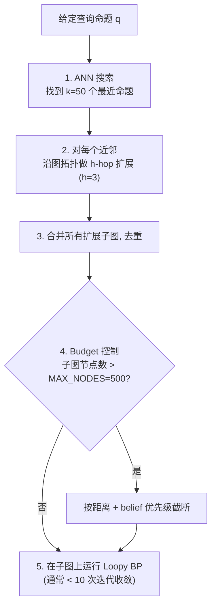

**Budget 控制参数**：

| 参数 | 值 | 理由 |
|------|---|------|
| ANN_k | 50 | 找到足够的邻域 |
| hop | 3 | 覆盖推理链的典型深度 |
| MAX_NODES | 500 | 保证 BP 在 200ms 内完成 |
| MAX_EDGES | 2000 | 限制消息传递数量 |
| BP_MAX_ITER | 10 | 局部子图通常 3-5 次收敛 |

**性能估算**：
- 子图 500 节点 x 2000 边 x 10 次迭代 = 20,000 次消息计算
- 每次消息计算 ~10us → 总计 ~200ms

### 6.3 全局一致性维护

**异步 Message Propagation**：

后台 daemon 持续运行全局 BP，但采用异步、分区的方式：

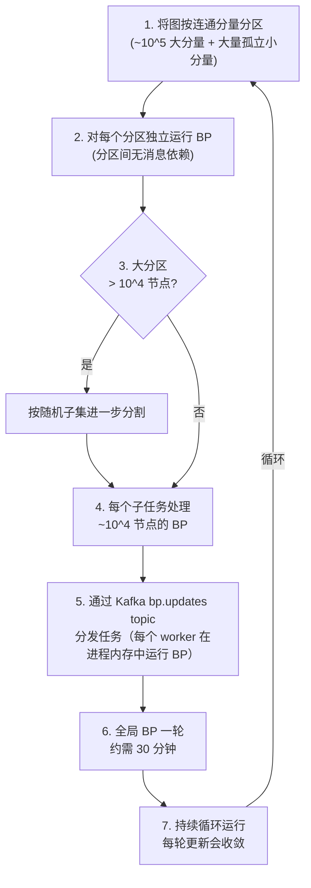

**一致性保证**：
- 全局 BP 每轮完成后将 belief 值写回 LanceDB `propositions.belief` 列
- 查询时的局部 BP 从 LanceDB 读取最新 belief 作为初始值
- 如果 belief 足够新（< 1 小时），可直接使用而不触发局部 BP 重算
- 全局 BP 和局部 BP 的结果可能有细微差异，但在 damping 机制下差异有界

### 6.4 Novelty Scoring 算法

给定新命题 $q$：

```python
def compute_novelty(q, graph, lancedb_index):
    # Step 1: ANN 搜索找到最近邻
    neighbors = lancedb_index.search(q.embedding, k=50, threshold=0.70)

    if len(neighbors) == 0:
        return 1.0  # 完全新颖

    # Step 2: 计算语义距离 novelty
    max_sim = max(n.similarity for n in neighbors)
    semantic_novelty = 1.0 - max_sim

    # Step 3: 检查是否已被 abstraction (已泛化)
    subsumed = False
    for n in neighbors:
        if has_abstraction_edge(n, q, graph):  # q 被某个 abstraction 节点 subsume
            subsumed = True
            break
    structural_novelty = 0.0 if subsumed else 0.5

    # Step 4: 综合评分
    novelty = 0.6 * semantic_novelty + 0.4 * structural_novelty
    return novelty
```

### 6.5 Reliability Scoring 算法

```python
def compute_reliability(q, graph, bp_engine):
    # Step 1: 提取局部子图
    subgraph = extract_subgraph(q, hop=3, max_nodes=500)

    # Step 2: 运行局部 BP
    beliefs = bp_engine.run_local(subgraph, query_node=q)

    # Step 3: reliability = belief(q = True)
    reliability = beliefs[q.id]

    # Step 4: 补充来源权重
    #   - 来自高影响力期刊 → 先验概率更高
    #   - 有多条独立推理路径支持 → 后验概率更高
    source_weight = compute_source_weight(q, graph)
    path_count = count_independent_paths(q, subgraph)

    adjusted_reliability = reliability * (0.8 + 0.1 * source_weight + 0.1 * min(path_count / 5, 1.0))
    return min(adjusted_reliability, 1.0)
```

### 6.6 Contradiction Detection 算法

```python
def detect_contradictions(q, graph, lancedb_index, llm):
    # Step 1: ANN 搜索找潜在矛盾对
    candidates = lancedb_index.search(q.embedding, k=100, threshold=0.60)

    # Step 2: Cross-encoder 过滤
    #   专门训练的矛盾检测 cross-encoder
    filtered = contradiction_classifier.predict(q, candidates, threshold=0.7)

    # Step 3: 检查图中已有的矛盾记录
    known_contradictions = graph.get_contradictions_involving(q.neighbors)

    # Step 4: LLM 精确验证 (仅对新发现的候选)
    new_candidates = [c for c in filtered if c not in known_contradictions]
    if new_candidates:
        verified = llm.verify_contradictions(q, new_candidates)
        return known_contradictions + verified
    return known_contradictions
```

### 6.7 预计算与缓存策略

| 预计算内容 | 更新频率 | 存储位置 | 大小 |
|-----------|---------|---------|------|
| 全局 belief values | 每 30 分钟 | LanceDB (`propositions.belief` 列) | ~8 GB |
| 热门节点的 3-hop 子图 | 每 1 小时 | Neo4j（原生缓存在 page cache） | 自动管理 |
| 每篇论文的 novelty/reliability 摘要 | 每日 | LanceDB (`papers` 表扩展列) | ~10 GB |
| 矛盾关系图的连通分量 | 每次 induction 操作后 | Neo4j（Cypher 连通分量查询） | 自动管理 |

---

## 7. API 层与查询引擎详细设计

> **与 API v2 的对齐说明**：本节与 API v2 文档（`docs/plans/2026-03-02-lkm-api-design-v2.md`）保持一致。API v2 定义了完整的接口规范（请求/响应格式、状态码、错误处理等），本节聚焦于系统设计层面：内部执行流程、性能目标、组件交互。

### 7.1 两层 API 架构

```
┌──────────────────────────────────────────────────────┐
│  Layer 2: Research API  (上层 — 面向研究问题)           │
│  POST /research/novelty                               │
│  POST /research/reliability                           │
│  POST /research/contradictions                        │
│  GET  /research/provenance/{id}                       │
│  POST /review/paper                                   │
│  内部编排: 多路召回 + 子图提取 + BP + LLM              │
│  （详细设计待后续文档）                                 │
├──────────────────────────────────────────────────────┤
│  Layer 1: Knowledge Graph API  (底层 — 面向图操作)      │
│  Write:  POST /commits, /commits/{id}/review,         │
│          /commits/{id}/merge, /commits/batch          │
│  Read:   GET /nodes/{id}, /hyperedges/{id},            │
│          /nodes/{id}/subgraph                         │
│  Search: POST /search/nodes, /search/hyperedges       │
│  （详见 API v2 文档）                                  │
└──────────────────────────────────────────────────────┘
                        │
                   共享存储层
         LanceDB + Neo4j + ByteHouse
```

### 7.2 Layer 1 API 完整列表

> 详细的请求/响应格式见 API v2 文档。本节仅列出端点概览和系统设计相关说明。

| API | 方法 | 功能 | 成本 | 内部流程 |
|-----|------|------|------|---------|
| **写入（Git-like commit 工作流）** | | | | |
| `/commits` | POST | 提交变更 + 轻量检查 | 低 | 结构校验 → 多路去重召回 → 候选矛盾召回 |
| `/commits/{id}` | GET | 查看 commit 状态和 review 结果 | 低 | 读取 commit 记录 |
| `/commits/{id}/review` | POST | LLM 深度审核（含重合检测） | 高 | LLM 验证推理链 + 重合 LLM 判断 |
| `/commits/{id}/merge` | POST | 入图 + 触发 BP（有重合时拒绝） | 中 | 图写入 → 局部 BP → 异步索引更新 |
| `/commits/batch` | POST | 批量提交多个 commit | 中 | 批量优化：跨 commit 去重、批量 LLM review |
| **精确读取** | | | | |
| `/nodes/{id}` | GET | 节点详情 | 低 | LanceDB 点查（含 belief） |
| `/hyperedges/{id}` | GET | 超边详情 | 低 | Neo4j 点查 |
| `/nodes/{id}/subgraph` | GET | 节点邻居子图 | 低 | Neo4j 图遍历 (h-hop Cypher) |
| **检索** | | | | |
| `/search/nodes` | POST | 找相似节点 | 低 | ByteHouse 向量搜索 + BM25 + Neo4j 图拓扑多路召回 |
| `/search/hyperedges` | POST | 找相似超边 | 低 | 先搜节点再展开到关联超边 |

### 7.3 Commit 写入引擎内部设计

```mermaid
graph TD
    subgraph SUBMIT["POST /commits"]
        A1["接收请求"] --> A2["结构校验<br/>(tail/head 非空, type 合法)"]
        A2 --> A3["多路去重召回<br/>(ByteHouse + BM25 + Neo4j 图拓扑)"]
        A3 --> A4["候选矛盾召回"]
        A4 --> A5["返回 commit_id + check_results"]
    end

    subgraph REVIEW["POST /commits/{id}/review"]
        B1["加载 commit 和 check_results"] --> B2["LLM 验证推理链<br/>(质量/逻辑/新颖度)"]
        B2 --> B3["LLM 重合检测<br/>(对 dedup 候选逐一判断)"]
        B3 --> B4{"有重合?"}
        B4 -->|"有"| B5["status → reviewed (has_overlap)<br/>merge 将拒绝"]
        B4 -->|"无"| B6["status → reviewed (pass)"]
    end

    subgraph MERGE["POST /commits/{id}/merge"]
        C1["校验 status = reviewed (pass)"] --> C2["创建新节点/边<br/>(LanceDB + Neo4j + ByteHouse)"]
        C2 --> C3["更新 Neo4j 图拓扑"]
        C3 --> C4["触发局部 BP<br/>(受影响节点重算 belief，写回 LanceDB)"]
        C4 --> C5["异步：更新 ByteHouse 向量 + BM25 索引"]
        C5 --> C6["异步：触发 Abstraction/Induction pipeline<br/>(新节点参与知识发现)"]
    end
```

**轻量检查 vs LLM Review 的分工**：

| 步骤 | 执行时机 | 是否涉及 LLM | 目的 |
|------|---------|-------------|------|
| 结构校验 | POST /commits | ❌ | 快速拦截格式错误 |
| 多路去重召回 | POST /commits | ❌ | 找到候选相似命题（embedding + BM25 + 图拓扑） |
| 候选矛盾召回 | POST /commits | ❌ | 找到可能矛盾的已有命题 |
| 推理链验证 | POST /review | ✅ | 验证前提是否能推出结论 |
| 重合检测 | POST /review | ✅ | 精确判断候选去重是否真正语义等价 |
| 质量评分 | POST /review | ✅ | tightness, substantiveness 评分 |

### 7.4 Search Engine 内部设计

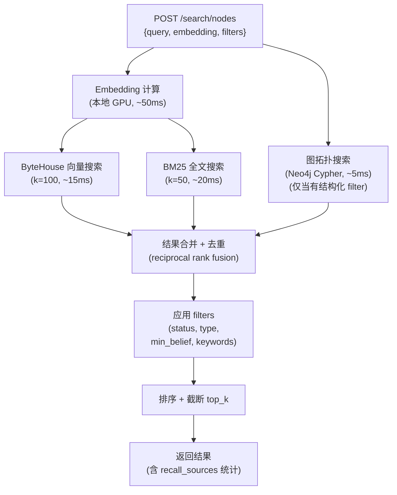

**多路召回策略**：

| 召回路径 | 适用场景 | 延迟 | 说明 |
|---------|---------|------|------|
| **ByteHouse** | 语义相似搜索 | ~15ms | 十亿级向量检索，PQ 压缩，返回 prop_ids |
| **BM25** | 关键词精确匹配 | ~20ms | 补充向量搜索对专有名词的不足 |
| **Neo4j 图拓扑** | 结构化查询 | ~5ms | 按 paper_id、edge_type 等 Cypher 查询 |

**特殊查询模式**：
- 当指定 `min_belief` 时：从 LanceDB 节点表的 `belief` 列过滤

### 7.5 Layer 2 Research API 执行流程

> Layer 2 API 的详细设计待后续文档。本节描述系统层面的执行流程设计。

**Novelty 查询 (POST /research/novelty, 目标 P50 < 500ms)**：
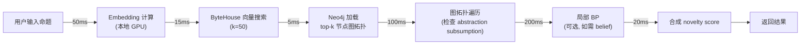

**Paper Review 查询 (POST /review/paper, 目标 P50 < 5s)**：
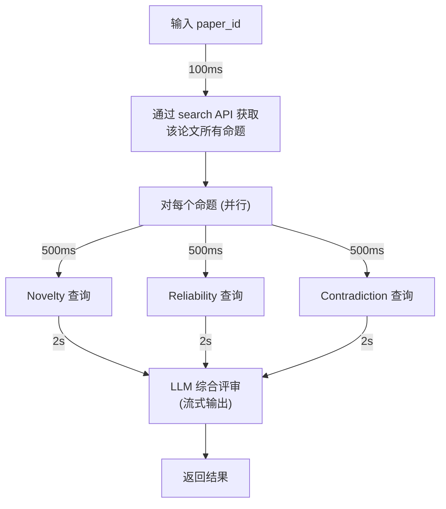

### 7.6 响应时间目标

| API | P50 | P95 | P99 | 说明 |
|-----|-----|-----|-----|------|
| **Layer 1** | | | | |
| POST /commits | 500ms | 1s | 2s | 包含多路去重召回 |
| POST /commits/{id}/review | 5s | 10s | 15s | 含多次 LLM 调用 |
| POST /commits/{id}/merge | 200ms | 500ms | 1s | 图写入 + 局部 BP |
| GET /nodes/{id} | 5ms | 10ms | 50ms | 强一致点查 |
| POST /search/nodes | 100ms | 200ms | 500ms | 多路召回 |
| **Layer 2（待详细设计）** | | | | |
| POST /research/novelty | 500ms | 1s | 2s | 不含 LLM |
| POST /research/reliability | 800ms | 1.5s | 3s | 含局部 BP |
| POST /research/contradictions | 600ms | 1.2s | 2.5s | 含 cross-encoder |
| POST /review/paper | 5s | 10s | 15s | 含多次 LLM 调用 |

---

## 8. 基础设施需求

### 8.1 计算资源

| 角色 | 规格 | 数量 | 用途 |
|------|------|------|------|
| **LanceDB 存储节点** | 32C/256GB/8TB NVMe (高 IOPS) | 2 | LanceDB 命题文本+metadata+文件存储 |
| **Neo4j 图数据库** | 64C/1TB/4TB NVMe | 1 | 图拓扑存储（6x10^9 节点，page cache ~800GB） |
| **ByteHouse** | 云服务（火山引擎） | - | 十亿级向量检索（托管，无需自建服务器） |
| **Kafka Broker** | 8C/32GB/2TB NVMe | 5 | 消息队列 |
| **GPU 计算节点** | 32C/256GB + 4xA100 80GB | 4 | Embedding + Cross-encoder |
| **Pipeline Worker** | 16C/64GB | 20 | LLM 调用 + 图写入 |
| **API Server** | 16C/64GB | 4 | 查询服务 |
| **Grobid Server** | 8C/16GB | 4 | PDF 解析 |
| **监控/调度** | 8C/32GB | 3 | Prometheus + Grafana + Airflow |
| **总计** | - | **43 台 + ByteHouse 云服务** | - |

### 8.2 存储资源

| 类型 | 总容量 | 用途 |
|------|--------|------|
| **NVMe SSD (高 IOPS)** | ~30 TB | LanceDB + Neo4j + Kafka |
| **SATA SSD** | ~15 TB | LanceDB 冷 segment |
| **对象存储 (S3/OSS)** | ~30 TB | PDF 原文 + 归档 |
| **总计** | **~90 TB** | - |

### 8.3 网络

| 需求 | 带宽 |
|------|------|
| 机器间网络 (LanceDB + Neo4j + API 节点) | 25 Gbps |
| GPU 节点 ↔ 存储 | 100 Gbps (InfiniBand / RoCE) |
| 外部 API 出口 | 10 Gbps |
| LLM API 出口（如果使用云端 LLM）| 1 Gbps |

### 8.4 GPU 需求

| 用途 | GPU 型号 | 数量 | 使用模式 |
|------|---------|------|---------|
| Embedding 计算 | A100 80GB | 4 | 初始构建：峰值 7 小时；增量：常驻 1 块 |
| Cross-encoder 推理 | A100 80GB | 4 | 初始构建：峰值 11 小时；增量：常驻 1 块 |
| 本地 LLM 推理 (可选) | A100 80GB | 8 | 如果自建 LLM 服务 |
| **总计** | A100 80GB | **8-16** | 视 LLM 部署策略 |

### 8.5 机器配置表

| 编号 | 角色 | CPU | 内存 | 存储 | GPU | 数量 |
|------|------|-----|------|------|-----|------|
| M1 | LanceDB Storage | AMD EPYC 7543 32C | 256 GB DDR4 | 4x 2TB NVMe RAID10 (高 IOPS) | - | 2 |
| M2 | Neo4j Graph DB | AMD EPYC 9654 64C | 1 TB DDR5 | 4x 1TB NVMe RAID10 | - | 1 |
| M3 | GPU Compute | AMD EPYC 7543 32C | 256 GB DDR4 | 2 TB NVMe | 4x A100 80GB | 4 |
| M4 | Kafka | Intel Xeon 8280 8C | 32 GB DDR4 | 2 TB NVMe | - | 5 |
| M5 | Pipeline Worker | AMD EPYC 7443 16C | 64 GB DDR4 | 500 GB NVMe | - | 20 |
| M6 | API Server | AMD EPYC 7443 16C | 64 GB DDR4 | 500 GB NVMe | - | 4 |
| M7 | Grobid | Intel Xeon 8280 8C | 16 GB DDR4 | 200 GB SSD | - | 4 |
| M8 | Monitoring | Intel Xeon 8280 8C | 32 GB DDR4 | 1 TB SSD | - | 3 |
| - | ByteHouse (云服务) | 托管 | 托管 | 托管 | - | - |

---

## 9. 成本估算

### 9.1 硬件/云资源月成本

以阿里云等价实例定价估算（包年价格，更符合实际采购方式）：

| 资源类别 | 实例类型（阿里云/火山引擎） | 数量 | 单价 (¥/月，包年) | 月成本 (¥) |
|---------|---------|------|------------|-----------|
| LanceDB 存储 (M1) | ecs.i3.8xlarge (32C/256GB/8TB NVMe) | 2 | ¥18,000 | ¥36,000 |
| Neo4j 图数据库 (M2) | ecs.r7.16xlarge (64C/512GB) + 扩展内存 | 1 | ¥45,000 | ¥45,000 |
| GPU Compute (M3) | ecs.gn7i-c32g1.32xlarge (4xA100 80GB) | 4 | ¥60,000 | ¥240,000 |
| ByteHouse 云服务 | 火山引擎 ByteHouse（向量检索实例） | 1 | ¥25,000 | ¥25,000 |
| Kafka (M4) | 消息队列 Kafka 版 (标准) | 5 | ¥3,000 | ¥15,000 |
| Pipeline Worker (M5) | ecs.c7.4xlarge (16C/32GB) | 20 | ¥3,500 | ¥70,000 |
| API Server (M6) | ecs.c7.4xlarge (16C/32GB) | 4 | ¥3,500 | ¥14,000 |
| Grobid (M7) | ecs.c7.2xlarge (8C/16GB) | 4 | ¥1,800 | ¥7,200 |
| Monitoring (M8) | ecs.g7.2xlarge (8C/32GB) | 3 | ¥3,000 | ¥9,000 |
| Neo4j Enterprise License | 年度授权 | 1 | ~¥8,000 | ¥8,000 |
| OSS 存储 (30TB) | OSS 标准存储 | - | ¥0.12/GB | ¥3,600 |
| 网络出口 (BGP 带宽) | - | - | - | ¥10,000 |
| **硬件月度总计** | - | - | - | **¥482,800** |

**年度硬件成本**：¥482,800 x 12 = **¥5,793,600**（约 ¥579 万/年，包年价格）

**与 v1.1 方案对比**：

| 成本项 | v1.1 (LanceDB+DuckDB+Redis) (¥/月) | v1.2 (LanceDB+Neo4j+ByteHouse) (¥/月) | 变化 |
|--------|-------------------------------------|---------------------------------------|------|
| 存储 (LanceDB) | ¥72,000 (4台) | ¥36,000 (2台，不存向量) | **-50%** |
| 图拓扑 (DuckDB→Neo4j) | ¥0 (嵌入式) | ¥53,000 (1台高配+License) | +¥53,000 |
| 向量检索 (DiskANN→ByteHouse) | ¥0 (LanceDB内置) | ¥25,000 (云服务) | +¥25,000 |
| Redis (BP消息) | ¥70,000 (20台) | **¥0（已去除）** | **-¥70,000** |
| GPU 计算 | ¥240,000 | ¥240,000 | 不变 |
| 其他 | ¥128,800 | ¥128,800 | 不变 |
| **合计** | **¥510,800** | **¥482,800** | **-5.5%** |

核心变化：去掉 Redis 20 节点（-¥70,000），增加 Neo4j 高配实例和 ByteHouse 云服务（+¥78,000），净节省约 ¥28,000/月。更重要的是**图遍历性能提升 10-100x**，向量检索有 12 亿级实测验证。

**按需 vs 包年对比**：按需价格约为包年的 1.5-2 倍，上述已按包年价格估算

**GPU 优化**：构建阶段结束后 GPU 可缩减到 1 台常驻 → 月度降低约 ¥180,000

### 9.2 LLM API 调用成本

以国内模型 API 为参考（通义千问、DeepSeek、GLM 等），按平均每次调用约 2000 tokens 估算：

| 步骤 | 调用次数 | 模型级别 | 单价 (¥/call，估算) | 总成本 (¥) |
|------|---------|---------|------------|--------|
| 论文命题提取 | 10^7 | 中端 (qwen-plus) | ¥0.02 | ¥200,000 |
| Cross-encoder 训练数据生成 | 10^5 | 高端 (qwen-max) | ¥0.10 | ¥10,000 |
| Abstraction 分类 (Level 3) | 10^7 | 高端 (qwen-max) | ¥0.05 | ¥500,000 |
| Induction 分析 | 5 x 10^6 | 高端 (qwen-max) | ¥0.05 | ¥250,000 |
| Verify (采样 10%) | 2 x 10^7 | 中端 (qwen-plus) | ¥0.02 | ¥400,000 |
| 增量维护 (年度) | 10^6 | 中端 (qwen-plus) | ¥0.03 | ¥30,000 |
| 查询时 LLM 调用 (review 等) | 10^6/年 | 高端 (qwen-max) | ¥0.10 | ¥100,000 |
| **LLM API 总计** | - | - | - | **¥1,360,000**（一次性构建） |
| **年度增量** | - | - | - | **¥130,000/年** |

### 9.3 总 TCO (Total Cost of Ownership)

> **注**：以下 TCO 仅包含基础设施和 LLM API 成本，不含人力成本。团队配置详见第 10 节。

| 费用项 | 第 1 年 (¥) | 第 2 年 (运维) (¥) |
|--------|--------|---------------|
| 硬件/云资源 | ¥5,794,000 | ¥3,634,000（GPU 缩减后） |
| LLM API (构建) | ¥1,360,000 | - |
| LLM API (增量) | ¥130,000 | ¥130,000 |
| 其他 (培训/工具/杂项) | ¥1,000,000 | ¥800,000 |
| **年度总计** | **¥8,284,000** | **¥4,564,000** |
| **约合** | **~¥828 万** | **~¥456 万** |

### 9.4 与 Phase 2/3 的基础设施成本对比

> **注**：以下仅为基础设施 + LLM API 成本，不含人力成本。

| Phase | 论文量 | 命题量 | 年度基础设施 TCO (估算) | 边际成本/论文 |
|-------|--------|--------|----------------|-------------|
| Phase 1 (十亿) | 10^7 | 10^9 | ¥862 万 | ¥0.86 |
| Phase 2 (百亿) | 10^8 | 10^10 | ¥2,500 万（估算） | ¥0.25 |
| Phase 3 (千亿) | 10^9 | 10^11 | ¥6,000 万（估算） | ¥0.06 |

随着规模增长，基础设施边际成本显著下降——这主要得益于：(1) Cross-encoder 预过滤的效率随训练数据增长而提升；(2) BP 的增量更新成本是 O(affected subgraph) 而非 O(全图)。

---

## 10. 团队配置

### 10.1 角色和人数

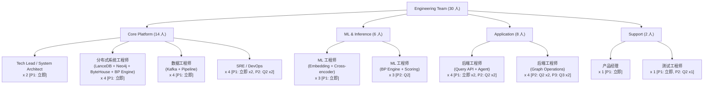

### 10.2 各角色职责

| 角色 | 核心职责 | 关键技能 |
|------|---------|---------|
| **System Architect** | 整体架构设计、技术选型决策、跨团队协调 | 分布式系统、图数据库、概率图模型 |
| **分布式系统工程师** | LanceDB + Neo4j 存储架构、ByteHouse 向量检索集成、BP 引擎 C++/Rust 开发 | Lance/Arrow 生态、Neo4j/Cypher、C++/Rust、概率推理 |
| **数据工程师** | Kafka Pipeline 开发、ETL 流程、LanceDB + Neo4j 数据管理 | Kafka/Flink、Python、LanceDB/Neo4j |
| **ML 工程师** | Embedding 模型选型和微调、Cross-encoder 训练、BP 算法实现 | PyTorch、Transformer、PGM |
| **后端工程师** | Layer 1 Commit/Search API 开发、Layer 2 Research API 开发、Graph Operation 实现 | FastAPI、Python 异步编程、LLM 集成 |
| **SRE** | 基础设施自动化、监控报警、容量规划 | K8s、Terraform、Prometheus |
| **产品经理** | 需求定义、用户验证、优先级排序 | 学术出版领域知识 |
| **测试工程师** | 集成测试、性能测试、数据质量验证 | 性能测试工具、数据验证 |

### 10.3 招聘优先级

| 优先级 | 角色 | 人数 | 理由 |
|--------|------|------|------|
| **P0 (立即)** | System Architect | 2 | 架构决策阻塞所有后续工作 |
| **P0 (立即)** | 分布式系统工程师 | 4 | LanceDB + Neo4j + ByteHouse + BP 引擎是核心交付物 |
| **P1 (1个月内)** | 数据工程师 | 4 | Pipeline 是最大的工程量 |
| **P1 (1个月内)** | ML 工程师 (Embedding) | 3 | Cross-encoder 训练阻塞构建 Pipeline |
| **P2 (3个月内)** | 后端工程师 | 4 | API 层可在存储层就绪后开发 |
| **P2 (3个月内)** | ML 工程师 (BP) | 3 | BP 引擎可在图存储就绪后开发 |
| **P3 (6个月内)** | SRE + 后端 | 4 | 生产化阶段需要 |

---

## 11. 开发里程碑

### Q1 2026 (Month 1-3): 基础设施与存储层

| 交付物 | 负责人 | 完成标准 |
|--------|--------|---------|
| LanceDB 存储节点部署 + Schema 实现 | 分布式系统组 | 命题表写入 50K TPS (10^8 规模) |
| Neo4j 图拓扑部署 + Cypher Schema | 分布式系统组 | Cypher 3-hop 遍历 P99 < 10ms (10^8 规模) |
| ByteHouse 向量检索实例接入 | 分布式系统组 | 向量搜索 P99 < 50ms (10^8 规模) |
| Layer 1 Graph Read API (GET /nodes, /hyperedges, /nodes/{id}/subgraph) | 后端组 | 通过现有单元测试 + API v2 规范 |
| Kafka 集群 + Topic 设计 | 数据工程组 | 完成 Topic 列表和 Schema |
| Neo4j Enterprise 部署 + 监控 | SRE | 单实例上线，page cache 调优 |
| CI/CD Pipeline | SRE | 自动化部署到 staging |

**关键依赖**：硬件采购/云资源开通（提前 2 周）

### Q2 2026 (Month 4-6): Pipeline 核心组件 + Commit API

| 交付物 | 负责人 | 完成标准 |
|--------|--------|---------|
| **Layer 1 Commit API** (commit/review/merge) | 后端组 | 单 commit 全流程 end-to-end |
| **Layer 1 Search API** (多路召回) | 后端组 | ByteHouse + BM25 + Neo4j 图拓扑，P50 < 100ms |
| Batch Commit API (/commits/batch) | 后端组 | 100 commits 批量处理 end-to-end |
| 论文注入 Pipeline (Grobid + LLM 提取) | 数据工程组 | 处理 100 篇论文 end-to-end |
| Embedding 计算 GPU 集群 + 服务化 | ML 组 | 10K embeddings/sec |
| Cross-encoder 训练 (v1) | ML 组 | F1 > 0.85 on validation set |
| ANN 候选对生成服务 | 数据工程组 | 处理 10^6 向量 end-to-end |
| Abstraction Pipeline (kafka-based) | 后端组 | 处理 10^4 clusters end-to-end |
| Induction Pipeline (kafka-based) | 后端组 | 处理 10^3 sibling groups end-to-end |

**关键依赖**：Cross-encoder 训练需要足够的标注数据（来自原型系统积累或人工标注）

### Q3 2026 (Month 7-9): 推断引擎与 Layer 2 API

| 交付物 | 负责人 | 完成标准 |
|--------|--------|---------|
| BP 引擎 v1 (C++/Rust, 局部推断) | 分布式系统组 + ML 组 | 500 节点子图 BP < 200ms |
| 全局 BP 后台 daemon | 分布式系统组 | 完成 10^6 节点子图一轮 BP < 30 min |
| **Layer 2**: POST /research/novelty | 后端组 | P50 < 500ms |
| **Layer 2**: POST /research/reliability | 后端组 | P50 < 800ms |
| **Layer 2**: POST /research/contradictions | 后端组 | P50 < 600ms |
| **Layer 2**: POST /review/paper | 后端组 | P50 < 5s |
| 监控 Dashboard | SRE | Grafana + PagerDuty alerts |

### Q4 2026 (Month 10-12): 初始数据加载与优化

| 交付物 | 负责人 | 完成标准 |
|--------|--------|---------|
| 批量加载 100 万篇论文（通过 batch commit API） | 全团队 | 完成度 > 95%，错误率 < 1% |
| 性能优化（瓶颈分析 + 调优） | 全团队 | Layer 1 + Layer 2 查询延迟达标 |
| Cross-encoder v2 (用构建数据再训练) | ML 组 | F1 > 0.90 |
| Verify Pipeline 全量运行 | 后端组 | 验证率 > 80%（按采样策略） |
| Research Agent 集成 | 后端组 | Agent 通过 commit API 提交推导结果 demo |

### Q1 2027 (Month 13-15): 全量构建

| 交付物 | 负责人 | 完成标准 |
|--------|--------|---------|
| 全量加载 1000 万篇论文 | 全团队 | 完成度 > 98% |
| 全图 BP 收敛 | 分布式系统组 | 全局 belief 收敛 |
| 生产化 (高可用、灾备) | SRE | RTO < 1h, RPO < 5min |
| 用户验收测试 | 产品 + 测试 | 核心场景通过 |

### Q2 2027 (Month 16-18): 稳定运营与 Phase 2 准备

| 交付物 | 负责人 | 完成标准 |
|--------|--------|---------|
| 增量更新 Pipeline 稳定运行 | 数据工程组 | 每日自动导入新论文 |
| Phase 2 扩展方案设计 | 架构师 | 设计文档完成 |
| 技术债务清理 | 全团队 | 代码质量指标达标 |

---

## 12. 风险矩阵

### 12.1 技术风险

| 风险 | 概率 | 影响 | 应对措施 |
|------|------|------|---------|
| **Loopy BP 不收敛** | 中 | 高 | 增加 damping factor；引入 convergence detection 后自动终止；备选算法：tree-reweighted BP |
| **ByteHouse 向量检索延迟不达标** | 低 | 中 | 已有 12 亿级实测；可调整 PQ 参数或升级实例规格；备选方案：回退到 LanceDB DiskANN |
| **Cross-encoder 预过滤 precision 不足** | 中 | 中 | 调整阈值 trade-off（precision vs recall）；增加训练数据；引入 active learning |
| **LanceDB 并发写入瓶颈** | 中 | 中 | 使用 merge-on-read 策略 + 定期 compaction；多 writer 写入不同 segment 后合并 |
| **Neo4j 高内存实例成本** | 低 | 中 | 6x10^9 节点需 ~800GB page cache；Phase 2 可迁移到 causal cluster 分担负载 |
| **ByteHouse 云服务依赖** | 低 | 中 | 接口通过 VectorSearchClient 抽象层隔离；备选方案：LanceDB DiskANN 或 Milvus |
| **LLM 输出解析失败率高** | 中 | 中 | 结构化输出模式（JSON mode）；增加 output schema 约束；错误自动重试 |
| **超边 factor 建模精度不足** | 低 | 中 | 引入更复杂的 factor function（如 noisy-OR）；结合领域专家校准 |

### 12.2 运营风险

| 风险 | 概率 | 影响 | 应对措施 |
|------|------|------|---------|
| **数据质量问题（Grobid 解析错误）** | 高 | 中 | 多源 PDF 解析（Grobid + PyMuPDF 互补）；质量抽检 pipeline |
| **论文获取受限（版权/API 限制）** | 中 | 高 | 优先处理 arXiv 开放获取论文；与出版商协商 API 合作 |
| **单点故障导致数据丢失** | 低 | 极高 | LanceDB 数据 RAID10 + 每日快照到 S3；Neo4j 每日备份 + 事务日志；Lance segment 可直接复制到异地 |
| **关键人员离职** | 中 | 高 | 完善文档和 code review 文化；核心模块至少 2 人 cover |

### 12.3 成本风险

| 风险 | 概率 | 影响 | 应对措施 |
|------|------|------|---------|
| **LLM API 价格上涨** | 中 | 中 | 自建 LLM 推理集群（额外 8 块 A100，约 ¥80,000-120,000/月）；使用开源模型（Qwen、DeepSeek、GLM） |
| **GPU 供应紧张/涨价** | 中 | 中 | 提前预留 GPU 实例；考虑 H100 替代 A100（性能/瓦特更优） |
| **数据量超出预期** | 低 | 中 | LanceDB 分片扩展；Neo4j 升级到 Causal Cluster；ByteHouse 升级实例；冷热分层提前实施 |
| **开发周期超出 18 个月** | 中 | 高 | 按季度 milestone 跟踪；优先级动态调整；MVP 可在 Q3 交付 |

---

## 13. 与 Phase 2 (百亿) 的演进路径

### 13.1 可平滑扩展的组件

| 组件 | Phase 1 配置 | Phase 2 扩展方式 | 预期成本 |
|------|-------------|-----------------|---------|
| **LanceDB** | 2 存储节点 (不含向量) | **水平分片**：按 paper_id hash 或学科领域分为 4-8 个 Lance 分片。存储节点增加到 4-8 台 | +¥36,000/月 |
| **Neo4j (图拓扑)** | 单实例 (64C/1TB) | 升级到 **Neo4j Causal Cluster** (3 节点)，支持读写分离和更高并发 | +¥90,000/月 |
| **ByteHouse (向量检索)** | 单实例云服务 | 升级 ByteHouse 实例规格，或分片为多个向量表 | +¥25,000/月 |
| **Kafka** | 5 brokers | 增加到 15 brokers；增加分区数 | +¥20,000/月 |
| **Pipeline Workers** | 20 nodes | 增加到 60+ nodes（无状态，弹性扩缩） | +¥80,000/月 |
| **BP 引擎** | 进程内存 | 保持进程内存；全局 BP 增加 worker 数量 | +¥0/月 |
| **Cross-encoder** | v2 模型 | 用更大数据重新训练 v3，性能更优 | 训练成本 ¥15,000 |

### 13.2 需要重新设计的组件

| 组件 | Phase 1 设计 | Phase 2 问题 | 重新设计方案 |
|------|-------------|-------------|-------------|
| **BP 引擎** | 单分区局部 BP + 后台全局 BP | 10^10 节点全局 BP 不可行（30 分钟 → 5 小时+） | 分层 BP：区域级 BP + 跨区域摘要消息传播 |
| **ANN 索引** | ByteHouse 单实例 | 10^10 向量可能超出单实例能力 | ByteHouse 多分片或迁移到 Milvus 分布式集群 |
| **图拓扑存储** | 单实例 Neo4j | 10^10 级节点超出单实例 page cache | Neo4j Causal Cluster 或 Neo4j Fabric 联邦查询 |
| **Cross-encoder** | DeBERTa-v3-base (86M) | 10^10 候选对需要更快的推理 | 蒸馏到更小模型 (TinyBERT) 或使用 ONNX Runtime 加速 |

### 13.3 避免的技术债务

| 技术债务 | 预防措施 | 检查点 |
|---------|---------|--------|
| **硬编码配置** | 所有阈值、参数通过 config.json 管理（当前原型已实现） | 每个 PR review 检查 |
| **单机假设** | 所有 ID 分配通过分布式序列号（Neo4j UUID 或独立 ID 生成服务） | 存储层 API 设计 review |
| **同步阻塞调用** | Pipeline 全部异步化（Kafka 驱动） | 架构 review |
| **无版本化的数据格式** | Node/Edge payload 增加 `schema_version` 字段 | Q1 交付物检查 |
| **缺失的可观测性** | 每个组件内置 metrics + trace ID 传播 | 每个模块的 DoD (Definition of Done) |
| **LLM provider 锁定** | 统一的 LLM 抽象层（当前原型的 `CallLLM` 已有此设计） | 接口定义 review |
| **存储层耦合** | 保持当前原型的 `GraphStore` 接口抽象，后端可替换 | Q1 存储层迁移验证 |
| **缺少数据回滚能力** | 保持当前原型的 round-based 历史机制，扩展到分布式环境 | Q2 验证回滚流程 |

---

## 附录 A: 与当前原型系统的迁移映射

| 原型组件 | Phase 1 对应 | 迁移策略 |
|---------|-------------|---------|
| `GraphStore` (storage.py, JSON 文件分片) | Neo4j (图拓扑) + LanceDB (命题内容) + GraphStore 接口层 | 保持接口不变，替换底层实现：图操作走 Neo4j Cypher，命题详情走 LanceDB |
| `EmbeddingComputer` (embedding.py, SQLite) | GPU 集群 + ByteHouse (向量存储) | 替换 `_save_embedding_to_db` 为 ByteHouse 写入（prop_id + embedding） |
| `FaissClusterer` (faiss_clusterer.py) | ByteHouse vector search + Cross-encoder | 替换 FAISS flat 为 ByteHouse 向量检索 |
| `JoinOperation` / `MeetOperation` | Kafka consumer + 相同的 LLM 逻辑 | 包装为 Kafka consumer，LLM 调用逻辑不变 |
| `CallLLM` (call_llm.py) | 相同接口，增加 rate limiter 和 circuit breaker | 增加生产化特性 |
| `config.json` | 分层配置 (环境变量 > etcd > 文件) | 保持格式兼容 |
| `node_status.db` (SQLite) | Neo4j :Proposition 节点 + LanceDB `propositions` 表 (status 列) | 数据迁移脚本 |
| `edge_status.db` (SQLite) | Neo4j :Hyperedge 节点 + :TAIL/:HEAD 关系 | 数据迁移脚本 |
| `embeddings.db` (SQLite) | ByteHouse `proposition_vectors` 表 (prop_id + embedding) | 批量导入脚本 |
| `graph.json` (内存加载) | Neo4j 实时 Cypher 查询 (无需全量加载) | 消除内存瓶颈 |

---

## 附录 B: 关键数学公式

### B.1 超边的条件概率定义

对于 paper-extract 类型超边（演绎推理链）：
$$P(\text{conclusion} = \text{true} \mid \text{premise}_1, ..., \text{premise}_n) = p$$

其中 $p$ 由 LLM 在提取时评估，或在 verify 阶段校准。

### B.2 Abstraction 超边的 Factor Function

对于 abstraction 类型超边（parent $\to$ children）：
$$f_{\text{abstraction}}(\text{parent}, c_1, ..., c_k) = \prod_{i=1}^{k} P(c_i \mid \text{parent})$$

含义：parent 为 true 蕴含所有 children 为 true（因为 parent 是更弱/更一般的命题）。

### B.3 Induction 超边的 Factor Function

对于 induction 类型超边（siblings $\to$ conclusion）：
$$f_{\text{induction}}(s_1, ..., s_k, \text{conclusion}) = P(\text{conclusion} \mid s_1, ..., s_k)$$

### B.4 Belief 更新公式

$$b(x_i) = \alpha \prod_{f \in \mathcal{N}(x_i)} \mu_{f \to x_i}(x_i)$$

其中 $\alpha$ 为归一化常数，$\mathcal{N}(x_i)$ 是 $x_i$ 参与的所有 factor 的集合。

---

*本文档为 Phase 1 系统设计初稿。各部分的详细设计将在团队到位后细化为独立的技术设计文档 (TDD)。所有数字标注"估算"的部分需要在 Q1 进行 benchmark 验证后更新。*
