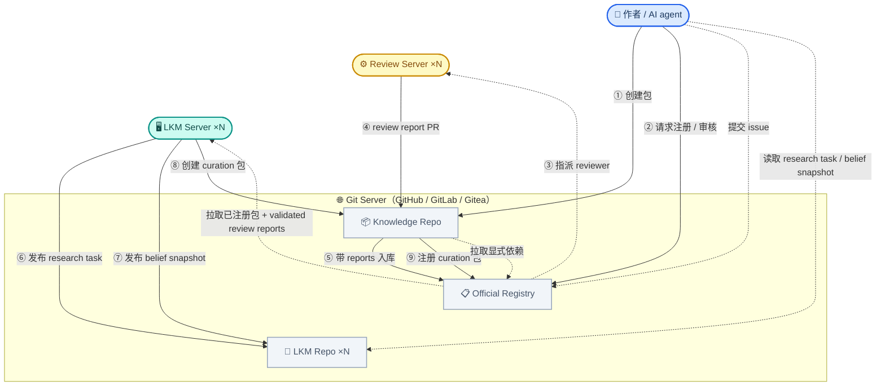

# 去中心化架构

> **Status:** Current canonical

本文档是 Gaia 去中心化架构的总纲——参与者、基础设施、以及从包创建到证据汇聚的完整业务流转。各环节的展开详见 03-06。

## 参与者与基础设施

| 实体 | 角色 | 职责概述 |
|------|------|---------|
| **作者**（人类 / AI agent） | 贡献者 | 创建知识包，声明依赖，编译，本地推理，发布 |
| **LKM Server** ×N | 贡献者 + 全局推理 | 全局推理；发布 research tasks 和 belief snapshots；必要时贡献 curation 包 |
| **Review Server** ×N | 审核员 | 为新命题给 prior，为推理链给条件概率，输出 review reports 并记录疑似跨包关系 findings |
| **Knowledge Repo** | 基础设施 | 托管包源码、编译产物、可选的本地 self-review 材料 |
| **Official Registry** | 基础设施 | 注册包 / reviewer / LKM，指派 reviewer 并校验 review report gate，托管人类 issue |
| **LKM Repo** ×N | 基础设施 | 各 LKM 各自的运营仓库，Issues 管理其 research tasks，并发布 belief snapshots |

两个关键设计点：

- **LKM 和人类是并列贡献者**，走完全相同的流程（创建包 → 请求 Registry → 获取 assigned review reports → 合并），没有捷径。LKM 的特殊之处在于它能看到整个知识网络，因此能发现跨包关系——但它的发现仍然要走标准流程。
- **一切通过 git 交互**——commit、PR、Issues。本文档以 GitHub 为例，但架构只依赖 git + PR 语义，GitLab、Gitea 等同样适用。

## 架构图

**连线说明：**

| 编号 | 方向 | 含义 |
|------|------|------|
| ① | 作者 → Knowledge Repo | 创建知识包 |
| ② | 作者 → Official Registry | 请求注册某个包版本并启动官方审核 |
| ③ | Official Registry → Review Server | 指派 reviewer |
| ④ | Review Server → Knowledge Repo | 以 PR 方式提交 review report |
| ⑤ | Knowledge Repo → Official Registry | 带 review reports 注册某个包版本 |
| ⑥ | LKM → LKM Repo | 发布 research task（Issues） |
| ⑦ | LKM → LKM Repo | 发布 belief snapshot |
| ⑧ | LKM → Knowledge Repo | 候选确认后，创建 curation 包 |
| ⑨ | Knowledge Repo → Official Registry | 注册 curation 包 |
| 虚线 | Registry → LKM | LKM 拉取已注册包和 validated review reports |
| 虚线 | Knowledge Repo → Registry | 包解析显式依赖时引用已注册包 |
| 虚线 | 作者 → LKM Repo | 浏览 research tasks，读取 belief snapshot |
| 虚线 | 作者 → Official Registry | 提交 open question / relation report |

## 架构分层

每一层都是可选增强。用户可以只用包层完全离线工作，逐层加入获得更多能力。

### 纯包层：两个 git 仓库就能推理

最简单的场景：作者创建一个知识包（git 仓库），用 Gaia Lang 编写命题和推理链，声明对其他包的依赖。两个包互相引用，就能在本地编译和推理中让可信度沿依赖图流动。

依赖的指向方式取决于对方是否已注册：

- **已注册** → 引用 Official Registry 中的包标识（推荐，有全局身份和 review 索引）
- **未注册** → 直接引用 git 仓库 URL + tag（纯去中心化，不依赖任何中心服务）

**能力：** 本地推理、版本化、完全离线、两个人就能协作。
**局限：** 只看到直接依赖图，没有跨包去重，没有独立审核，独立证据无法汇聚。

### + Review Server：推理链获得可信参数

Review Server 是独立部署的 LLM/agent 审核员。它审核包内部推理过程的逻辑可靠性，并为新命题给出初始 prior。不同机构可以各自部署 Review Server。进入官方流程时，由 Official Registry 指派 reviewer；这些 reviewer 再把结果写成 review report，并通过 PR 提交到作者自己的包仓库。

没有足够 assigned review reports 的包版本仍然可以存在于作者自己的仓库，但不能通过 Official Registry 的入库校验——review 是入库的前提条件，不是可选项。只有满足 minimal review policy 的版本，才会进入官方索引并被 LKM 消费。

**新增能力：** 独立的逻辑审核，推理链有可信的条件概率参数。
**局限：** 仍然只看到直接依赖图，不同包中相同结论的独立证据无法汇聚。

### + Official Registry：公共索引、reviewer 指派与 review gate 验收

Official Registry 是所有已注册包的公共索引。它记录包、版本、显式依赖、reviewer / LKM 身份；在作者请求注册时指派 reviewer；并在正式入库时校验包内 review reports 是否满足最低 policy。Registry 不在 package 注册阶段直接做 binding / equivalence / dedup 裁决，也不发布单一官方 belief。

带有足够 valid review reports 的包版本，会向后续的 LKM snapshot / global inference 提供官方 prior / strategy 输入。Registry 可以 fork、可以联邦：不同学科或机构可以维护自己的 Registry，没有单一的"真理权威"。

**新增能力：** 公共包索引、reviewer 指派、review report 验收、人类 issue（open question / relation report）、可 fork 的治理。
**局限：** 不直接做 belief 计算；不在注册时直接裁决跨包关系。

### + LKM Server：全局推理与跨包关系发现

LKM Server 拉取 Registry 的包索引和 validated review reports，运行十亿节点级的全局推理，处理长链传播和跨 Registry 关系。同时，在构建全局图的过程中，LKM 自然会发现跨包关系——两个命题语义等价、互相矛盾、或存在未声明的隐含连接。

这些发现以 research task（Issues）的形式发布到该 LKM 自己的 LKM Repo，供社区浏览和参与调查。LKM 还会把自己的 belief 结果发布成 snapshots，供人类 / agent 参考。确认后，LKM 创建 curation 包，经 Review Server 审核，注册到 Registry——和人类作者走完全相同的流程。

**新增能力：** belief snapshot、全局推理收敛、跨包关系自动发现。

## 端到端业务流转

以下用一个具体场景串联完整流程：作者 Alice 发布了一个超导研究包，之后 LKM 发现她的结论和另一个包的结论高度相似。

### 主线：包从创建到证据汇聚

**① Alice 创建包。** 她用 Gaia Lang 编写命题和推理链，声明对已注册包的依赖（引用 Registry 包标识）。包是一个 git 仓库，她拥有完全的控制权。
→ 详见 [03 包的创建与发布](03-authoring-and-publishing.md)

**② 编译 + 本地推理预览。** `gaia build` 将源码确定性地编译为结构化推理图。`gaia infer` 在本地运行推理，让 Alice 在发布前预览可信度——如果结论可信度很低，可能需要补充论证。
→ 详见 [03 包的创建与发布](03-authoring-and-publishing.md)

**③ Registry 指派 reviewer。** Alice 向 Official Registry 发起注册/审核请求后，Registry 为这个版本指派若干 Review Server。
→ 详见 [04 Registry 的运作](04-registry-operations.md)

**④ Review Server 审核。** 被指派的 Review Server 逐条检查推理链的逻辑有效性，为新命题给 prior、为推理链给条件概率，并以 PR 的形式把 review report 写进 Alice 仓库的 `.gaia/reviews/`。Alice 如果不同意，可以在这个 PR 里 rebuttal。
→ 详见 [05 审核与策展](05-review-and-curation.md)

**⑤ Registry 入库。** Alice 合并足够的 assigned review reports 后，Registry 校验编译重现、依赖、以及 review report 的存在性 / 来源 / 数量 / 格式。通过后，该版本进入官方索引。
→ 详见 [04 Registry 的运作](04-registry-operations.md)，[05 审核与策展](05-review-and-curation.md)

**⑥ LKM 发布 belief。** 某个 LKM 拉取已注册包和其 validated review reports，运行 snapshot / global inference，发布 belief snapshot，供其他人参考。
→ 详见 [06 多级推理与质量涌现](06-belief-flow-and-quality.md)

**⑦ LKM 发现跨包关系。** LKM 拉取全局图运行全局推理，发现 Alice 的结论和 Bob 包中的一个结论语义高度相似。LKM 在自己的 LKM Repo 创建 equivalence issue（research task）。
→ 详见 [05 审核与策展](05-review-and-curation.md)

**⑧ Curation 包走标准流程。** 调查确认后，LKM 创建 curation 包声明两者的关系（duplicate / independent evidence / refinement），经 Review Server 审核，注册到 Registry。对应的 LKM 后续发布新的 belief snapshot / global result。
→ 详见 [05 审核与策展](05-review-and-curation.md)，[06 多级推理与质量涌现](06-belief-flow-and-quality.md)

### 支线：社区协作

- **浏览 research tasks：** 作者可以浏览各 LKM Repo 的 Issues，认领调查任务或基于发现创建自己的知识包。
- **提交 open question / relation report：** 作者在 Official Registry Issues 提出研究问题、知识空白、或自己发现的跨包关系线索。
- **填补空白：** 其他作者看到 open question 或 research task，创建新包填补知识网络中的空白。

### 错误修正

系统不假设所有输入正确。发现错误后的策略是**回退到保守状态 → 重新评估 → 恢复**，全过程可审计：

- **迟发现的重复命题** → 合并，暂停受影响推理链的参数（防止 double counting），re-review 后恢复
- **矛盾发现** → 推理引擎自动保证矛盾双方不会同时具有高可信度，证据决定谁更可信
- **推理链撤回** → 标记撤回（不删除），重算下游可信度
- **依赖包重大更新** → 通知下游维护者，下游自主决定是否更新（去中心化，无强制）

→ 各场景的详细流程见 [06 多级推理与质量涌现](06-belief-flow-and-quality.md)

## 设计原则

| 原则 | 体现 |
|------|------|
| 包即 git 仓库 | 不依赖任何中心服务 |
| Git 是通用协议 | 所有参与者通过 commit / PR / Issues 交互 |
| 每一层可选增强 | 纯包可离线工作，Registry 和 LKM 是增值层 |
| 两类贡献者并列 | 人类/agent 和 LKM 走同样的流程，无特权 |
| 依赖优先引用 Registry | 已注册包通过 Registry 标识引用，未注册直接引用 git URL |
| Registry 指派 reviewer | 官方审核来源由 Registry 决定，防止 review shopping |
| review reports 进入包仓库 | 被指派 reviewer 以 PR 方式把 report 提交给作者 |
| Registry 负责验收而非代写 | 只有满足 minimal policy 的 assigned review reports 才能入库 |
| 新推理链需有参数才生效 | 没有足够 valid review reports = Registry 不入库 / LKM 跳过 |
| 两级推理 | 包级（本地）+ LKM（增量 + 全量收敛） |
| 错误可修正 | 暂停 → re-review → 恢复，全程可审计 |

## 各环节详解

- [03 包的创建与发布](03-authoring-and-publishing.md) — 作者从创建包到审核、发布的完整旅程
- [04 Registry 的运作](04-registry-operations.md) — 注册、review report 验收、human issue
- [05 审核与策展](05-review-and-curation.md) — Review Server 审核 + LKM curation 的业务逻辑
- [06 多级推理与质量涌现](06-belief-flow-and-quality.md) — 包级预览、belief snapshot、全局推理、质量如何涌现

## 参考文献

- [00-pipeline-overview.md](../gaia-ir/00-pipeline-overview.md) — 三层编译管线（Gaia Lang → Gaia IR → BP）
- [01-product-scope.md](01-product-scope.md) — 产品定位（CLI 优先，服务器增强）
