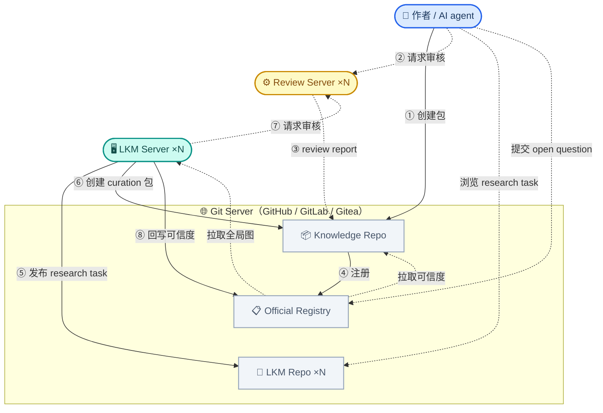

# 去中心化架构

> **Status:** Current canonical

本文档是 Gaia 去中心化架构的总纲——参与者、基础设施、以及从包创建到证据汇聚的完整业务流转。各环节的展开详见 04-07。

## 参与者与基础设施

| 实体 | 角色 | 职责概述 |
|------|------|---------|
| **作者**（人类 / AI agent） | 贡献者 | 创建知识包，声明依赖，编译，本地推理，发布 |
| **LKM Server** ×N | 贡献者 + 全局推理 | 全局推理；发现跨包关系后以 curation 包贡献 |
| **Review Server** ×N | 审核员 | 审核包内推理逻辑，给条件概率初始值 |
| **Knowledge Repo** | 基础设施 | 托管包源码、编译产物、review report |
| **Official Registry** | 基础设施 | 注册包 / reviewer / LKM，存储推理结果，去重 |
| **LKM Repo** ×N | 基础设施 | 各 LKM 各自的运营仓库，Issues 管理其 research tasks |

两个关键设计点：

- **LKM 和人类是并列贡献者**，走完全相同的流程（创建包 → 审核 → 注册），没有捷径。LKM 的特殊之处在于它能看到整个知识网络，因此能发现跨包关系——但它的发现仍然要走标准流程。
- **一切通过 git 交互**——commit、PR、Issues。本文档以 GitHub 为例，但架构只依赖 git + PR 语义，GitLab、Gitea 等同样适用。

## 架构图

**连线说明：**

| 编号 | 方向 | 含义 |
|------|------|------|
| ① | 作者 → Knowledge Repo | 创建知识包 |
| ② | 作者 → Review Server | 请求审核推理逻辑 |
| ③ | Review Server → Knowledge Repo | 审核完成，review report 存入包内 |
| ④ | Knowledge Repo → Official Registry | 带 review report 注册 |
| ⑤ | LKM → LKM Repo | 发布 research task（Issues） |
| ⑥ | LKM → Knowledge Repo | 候选确认后，创建 curation 包 |
| ⑦ | LKM → Review Server | curation 包审核（同作者流程） |
| ⑧ | LKM → Official Registry | 全局推理结果回写可信度 |
| 虚线 | Registry → LKM | LKM 拉取全局图数据 |
| 虚线 | Registry → Knowledge Repo | 下游包拉取最新可信度 |
| 虚线 | 作者 → LKM Repo | 浏览 research tasks，寻找研究机会 |
| 虚线 | 作者 → Official Registry | 提交 open question（Issues） |

## 架构分层

每一层都是可选增强。用户可以只用包层完全离线工作，逐层加入获得更多能力。

### 纯包层：两个 git 仓库就能推理

最简单的场景：作者创建一个知识包（git 仓库），用 Gaia Lang 编写命题和推理链，声明对其他包的依赖。两个包互相引用，就能在本地编译和推理中让可信度沿依赖图流动。

依赖的指向方式取决于对方是否已注册：

- **已注册** → 引用 Official Registry 中的包标识（推荐，有全局身份和可信度数据）
- **未注册** → 直接引用 git 仓库 URL + tag（纯去中心化，不依赖任何中心服务）

**能力：** 本地推理、版本化、完全离线、两个人就能协作。
**局限：** 只看到直接依赖图，没有跨包去重，没有独立审核，独立证据无法汇聚。

### + Review Server：推理链获得可信参数

Review Server 是独立部署的 LLM/agent 审核员。它审核包内部推理过程的逻辑可靠性——不判断前提本身是否正确，只评估"假设前提成立，推理过程有多可靠？"，并给出条件概率初始值。不同机构可以各自部署 Review Server，作者可以自由选择。

没有 review 的推理链也可以注册到 Registry，但推理引擎会跳过它们——相当于注册了但未激活。作者可以先注册后审，也可以先审后注册，顺序灵活。

**新增能力：** 独立的逻辑审核，推理链有可信的条件概率参数。
**局限：** 仍然只看到直接依赖图，不同包中相同结论的独立证据无法汇聚。

### + Official Registry：证据开始汇聚

Official Registry 是所有已注册包的聚合索引。包注册后，Registry 对其中的命题进行去重——区分"引用已有命题"和"独立推导出相同结论"。前者只是引用关系，后者是真正的新证据，建立等价关系后让独立证据汇聚增强可信度。

带 review 的推理链注册后立即激活，触发增量推理——只在受影响的局部子图上重算，秒级响应。Registry 可以 fork、可以联邦：不同学科或机构可以维护自己的 Registry，没有单一的"真理权威"。

**新增能力：** 跨包去重、独立证据汇聚、增量推理、社区 open questions（Registry Issues）。
**局限：** 去重靠 embedding 匹配，可能漏掉语义重复；看不到跨 Registry 的关系。

### + LKM Server：全局推理与跨包关系发现

LKM Server 拉取 Registry 的全局图，运行十亿节点级的全局推理，处理增量推理无法覆盖的长链传播和跨 Registry 关系。同时，在构建全局图的过程中，LKM 自然会发现跨包关系——两个命题语义等价、互相矛盾、或存在未声明的隐含连接。

这些发现以 research task（Issues）的形式发布到该 LKM 自己的 LKM Repo，供社区浏览和参与调查。确认后，LKM 创建 curation 包，经 Review Server 审核，注册到 Registry——和人类作者走完全相同的流程。

**新增能力：** 全局推理收敛、跨包关系自动发现、弥补注册时去重的遗漏。

## 端到端业务流转

以下用一个具体场景串联完整流程：作者 Alice 发布了一个超导研究包，之后 LKM 发现她的结论和另一个包的结论高度相似。

### 主线：包从创建到证据汇聚

**① Alice 创建包。** 她用 Gaia Lang 编写命题和推理链，声明对已注册包的依赖（引用 Registry 包标识）。包是一个 git 仓库，她拥有完全的控制权。
→ 详见 [04 包的创建与发布](04-authoring-and-publishing.md)

**② 编译 + 本地推理预览。** `gaia build` 将源码确定性地编译为结构化推理图。`gaia infer` 在本地运行推理，让 Alice 在发布前预览可信度——如果结论可信度很低，可能需要补充论证。
→ 详见 [04 包的创建与发布](04-authoring-and-publishing.md)

**③ Review Server 审核。** Alice 向 Review Server 提交审核请求。Review Server 逐条检查推理链的逻辑有效性，给出条件概率初始值，生成 review report 存入包内。Alice 如果不同意可以 rebuttal；僵局时可以换一个 Review Server 或提起仲裁。
→ 详见 [06 审核与策展](06-review-and-curation.md)

**④ 向 Registry 注册。** Alice 带着 review report 向 Official Registry 请求注册。CI 自动验证编译重现、依赖可解析、review report 合规。等待期（新包 3 天，版本更新 1 小时）后自动合并。
→ 详见 [05 Registry 的运作](05-registry-operations.md)

**⑤ 去重 + 推理链激活 + 增量推理。** Registry 识别 Alice 包中的命题和已有命题的关系：引用已有命题的直接绑定，独立推导出相同结论的建立等价关系让证据汇聚。带 review 的推理链立即激活，触发增量推理更新受影响命题的可信度。
→ 详见 [05 Registry 的运作](05-registry-operations.md)

**⑥ LKM 发现跨包关系。** LKM 拉取全局图运行全局推理，发现 Alice 的结论和 Bob 包中的一个结论语义高度相似，但注册时的 embedding 匹配没有捕捉到。LKM 在自己的 LKM Repo 创建 equivalence issue（research task）。
→ 详见 [06 审核与策展](06-review-and-curation.md)

**⑦ Curation 包走标准流程。** 调查确认后，LKM 创建 curation 包声明两者的关系（duplicate / independent evidence / refinement），经 Review Server 审核，注册到 Registry。合并后触发增量推理，更新受影响命题的可信度。
→ 详见 [06 审核与策展](06-review-and-curation.md)，[07 多级推理与质量涌现](07-belief-flow-and-quality.md)

### 支线：社区协作

- **浏览 research tasks：** 作者可以浏览各 LKM Repo 的 Issues，认领调查任务或基于发现创建自己的知识包。
- **提交 open question：** 作者在 Official Registry Issues 提出研究问题或知识空白（如"Y 领域缺少 Z 方面的包"），供社区讨论。
- **填补空白：** 其他作者看到 open question 或 research task，创建新包填补知识网络中的空白。

### 错误修正

系统不假设所有输入正确。发现错误后的策略是**回退到保守状态 → 重新评估 → 恢复**，全过程可审计：

- **迟发现的重复命题** → 合并，暂停受影响推理链的参数（防止 double counting），re-review 后恢复
- **矛盾发现** → 推理引擎自动保证矛盾双方不会同时具有高可信度，证据决定谁更可信
- **推理链撤回** → 标记撤回（不删除），重算下游可信度
- **依赖包重大更新** → 通知下游维护者，下游自主决定是否更新（去中心化，无强制）

→ 各场景的详细流程见 [07 多级推理与质量涌现](07-belief-flow-and-quality.md)

## 设计原则

| 原则 | 体现 |
|------|------|
| 包即 git 仓库 | 不依赖任何中心服务 |
| Git 是通用协议 | 所有参与者通过 commit / PR / Issues 交互 |
| 每一层可选增强 | 纯包可离线工作，Registry 和 LKM 是增值层 |
| 两类贡献者并列 | 人类/agent 和 LKM 走同样的流程，无特权 |
| 依赖优先引用 Registry | 已注册包通过 Registry 标识引用，未注册直接引用 git URL |
| Review 在包级别 | 审核发生在注册之前，report 存入包内 |
| 新推理链需有参数才生效 | 没有 review = 没有条件概率 = 推理引擎跳过 |
| 多级推理 | 包级 + Registry 增量 + LKM 全局 |
| 错误可修正 | 暂停 → re-review → 恢复，全程可审计 |

## 各环节详解

- [04 包的创建与发布](04-authoring-and-publishing.md) — 作者从创建包到审核、发布的完整旅程
- [05 Registry 的运作](05-registry-operations.md) — 注册、去重、推理链激活、增量推理
- [06 审核与策展](06-review-and-curation.md) — Review Server 审核 + LKM curation 的业务逻辑
- [07 多级推理与质量涌现](07-belief-flow-and-quality.md) — 三级推理、错误修正、质量如何涌现

## 参考文献

- [00-pipeline-overview.md](../gaia-ir/00-pipeline-overview.md) — 三层编译管线（Gaia Lang → Gaia IR → BP）
- [01-product-scope.md](01-product-scope.md) — 产品定位（CLI 优先，服务器增强）
