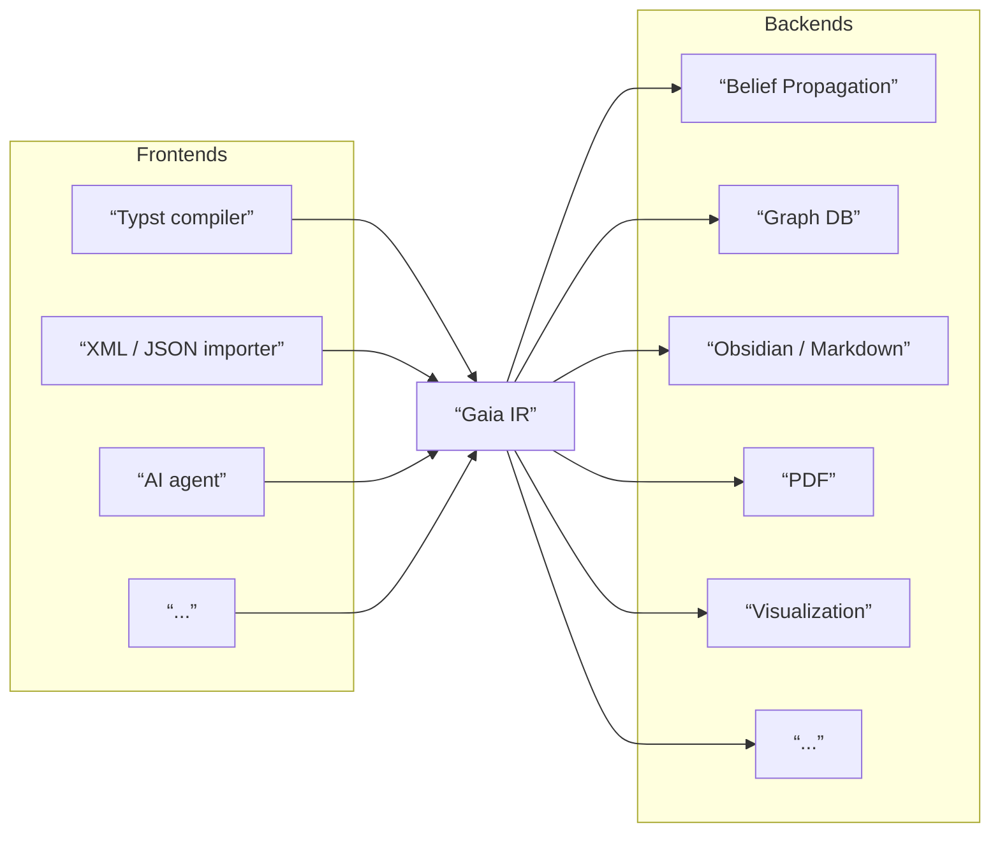
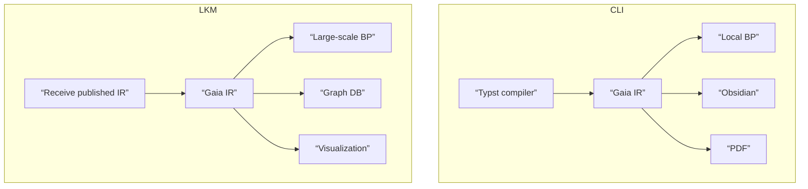

# Gaia IR 概述

> **Status:** Target design — 基于 [06-factor-graphs.md](../theory/06-factor-graphs.md) 和 [04-reasoning-strategies.md](../theory/04-reasoning-strategies.md) 设计
>
> **⚠️ Protected Contract Layer** — 本目录定义 CLI↔LKM 结构契约。变更需要独立 PR 并经负责人审查批准。详见 [documentation-policy.md](../../documentation-policy.md#12-变更控制)。

## 目的

Gaia IR 是 Gaia 推理超图的**中间表示**（Intermediate Representation）。

类比 LLVM：LLVM IR 将 M 个语言前端与 N 个硬件后端解耦，使得每一端只需要关心”如何编译到 / 消费 IR”，而不需要知道另一端的存在——没有 LLVM IR，M 个语言 × N 个后端需要 M×N 个转换器；有了 IR，只需要 M + N 个。Gaia IR 在知识推理领域扮演同样的角色——将**生产知识的前端**与**消费知识的后端**解耦。



### 前端与后端

- **前端**（Frontend）：任何将外部格式**编译为** Gaia IR 的组件。
- **后端**（Backend）：任何**消费** Gaia IR 并产出最终制品的组件。

| | 前端示例 | 说明 |
|---|---|---|
| 1 | Typst compiler | `.typ` 源文件 → `LocalCanonicalGraph` |
| 2 | XML / JSON importer | 结构化数据交换格式 → IR |
| 3 | AI agent | LLM 自动从文献中提取知识并生成 IR |

| | 后端示例 | 说明 |
|---|---|---|
| 1 | Belief Propagation | IR + Parameterization → 后验信念（概率推理） |
| 2 | 图数据库存储 | IR → Neo4j / Kuzu 持久化、拓扑查询 |
| 3 | Obsidian / Markdown | IR → 本地笔记系统持久化 |
| 4 | PDF 渲染 | IR → 可出版的文档格式 |
| 5 | 知识图谱可视化 | IR → 交互式图浏览 |

新增一个前端或后端时，只需实现”到 IR / 从 IR”的转换，无需关心其他前端或后端的实现细节。

### IR 作为内部架构中心

Gaia 生态系统中的参与者（本地用户 CLI、LKM 服务器、Review Server 等）互相之间交换的不一定是 Gaia IR 本身——例如用户发布包时传输的是打包后的制品，Review Server 返回的是参数化记录。但每个参与者的**内部架构**都以 IR 为中心：



无论本地还是服务端，IR 都是内部各组件的连接枢纽。这使得同一份 IR 可以同时服务于不同的使用场景——本地用户可以用高精度 BP 做推理、用 Obsidian 做笔记、编译成 PDF；LKM 服务器可以做大规模 BP、存入图数据库、提供可视化浏览——而所有这些后端共享同一个 IR 定义。

### IR 与 Parameterization

Gaia IR 本身只编码结构（什么连接什么），不包含任何概率值。概率信息由独立的 Parameterization 层提供：

```
Gaia IR（结构）    ×    Parameterization（参数）
什么连接什么               每个 Knowledge/Strategy 多可信
编译时确定                  review 产出
```

- **Gaia IR** 编码推理超图的拓扑——Knowledge 之间通过 Strategy 和 Operator 连接。
- **Parameterization** 是 canonical graph 上的概率参数层——review 过程为每个 Knowledge 和 Strategy 赋予可信度。

二者严格分离。后端（如 BP）同时消费 IR 和 Parameterization 来产出最终结果。

## 子图、合并与 Lowering

### Gaia IR 是子图

一个 Gaia IR 实例不是"整个知识图谱"，而是一个**子图**：

- **LocalCanonicalGraph**：来自单个 package 的编译产物，包含该 package 内的 Knowledge、Strategy、Operator。

每个 local 子图是独立编译、独立校验的单元。

### 封装边界

FormalStrategy 内部的 **private claims 必须保持封装**——它们不应与其他子图中的 claim 合并或被外部引用。

原因：private claim 的存在意义是服务于所属 FormalStrategy 的内部结构。如果把两个不同 FormalStrategy 的内部中间节点当作"语义等价"而合并，就破坏了各自的封装边界，导致折叠不再安全。

因此，FormalExpr 内部的 private claim 应保持其 FormalStrategy 归属不变，不做跨 FormalStrategy 合并。

### 从 IR 到概率推理：Lowering

Gaia IR 本身只编码拓扑结构，**不能直接用来计算概率**。要做概率推理，需要经过 **lowering**——把 IR 的多层嵌套结构展开为后端可执行的扁平运行时图：

```
CompositeStrategy
  └─ 展开 sub_strategies
       ├─ Strategy（叶子 ↝）→ 直接映射为概率因子，参数来自 StrategyParamRecord
       └─ FormalStrategy
            ├─ 折叠 → 对内部变量做 marginalization，等效为 P(conclusion | premises)
            └─ 展开 → 进入 FormalExpr，把 Operator 显式 lower 为确定性约束
```

只有经过这个展开过程，每个推理单元才有明确的概率语义：

- **叶子 Strategy**（`infer` / `noisy_and`）：参数直接来自 Parameterization 层的 `StrategyParamRecord`
- **FormalStrategy**：折叠时由内部 Operator 结构 + 相关 claim prior 导出等效条件概率；展开时 Operator 作为确定性硬约束进入 runtime graph
- **Operator**：纯确定性（真值表），不携带概率参数

最终，后端（如 BP）消费 lowering 的输出（如 `FactorGraph`）加上 Parameterization，产出后验信念。

Lowering 的详细契约见 [07-lowering.md](07-lowering.md)。

## 一、Gaia IR — 结构

Gaia IR 编码**什么连接什么**——推理超图的拓扑结构。它不包含任何概率值。

Gaia IR 由三种实体构成：**Knowledge**（命题）、**Strategy**（推理声明）、**Operator**（结构约束）。Strategy 有三种形态：基础 Strategy（↝ 叶子）、CompositeStrategy（含子策略，可递归嵌套）和 FormalStrategy（含确定性展开 FormalExpr）。

### 整体结构

**示例**（包内，存储完整内容）：

```json
{
  "scope": "local",
  "namespace": "reg",
  "ir_hash": "sha256:...",
  "knowledges": [
    {
      "id": "reg:ybco_superconductivity::sample_superconducts_90k",
      "label": "sample_superconducts_90k",
      "type": "claim",
      "content": "该样本在 90 K 以下表现出超导性"
    },
    {
      "id": "reg:ybco_superconductivity::tc_measurement",
      "label": "tc_measurement",
      "type": "claim",
      "content": "YBa₂Cu₃O₇ 的超导转变温度为 92 ± 1 K"
    },
    {
      "id": "reg:ybco_superconductivity::research_context",
      "label": "research_context",
      "type": "setting",
      "content": "高温超导研究的当前进展"
    },
    {
      "_comment": "全称 claim（原 template）— 通用定律，含量化变量，参与 BP",
      "id": "reg:ybco_superconductivity::superconductor_zero_resistance",
      "label": "superconductor_zero_resistance",
      "type": "claim",
      "content": "∀{x}. superconductor({x}) → zero_resistance({x})",
      "parameters": [{"name": "x", "type": "material"}]
    },
    {
      "_comment": "绑定 setting — 实例化时提供具体参数值",
      "id": "reg:ybco_superconductivity::binding_ybco",
      "label": "binding_ybco",
      "type": "setting",
      "content": "x = YBa₂Cu₃O₇（YBCO）"
    },
    {
      "_comment": "实例化后的封闭 claim",
      "id": "reg:ybco_superconductivity::ybco_zero_resistance",
      "label": "ybco_zero_resistance",
      "type": "claim",
      "content": "superconductor(YBCO) → zero_resistance(YBCO)"
    }
  ],
  "strategies": [
    {
      "strategy_id": "lcs_d2c8...",
      "type": "infer",
      "premises": ["reg:ybco_superconductivity::sample_superconducts_90k"],
      "conclusion": "reg:ybco_superconductivity::tc_measurement",
      "background": ["reg:ybco_superconductivity::research_context"],
      "steps": [{"reasoning": "基于超导样品的电阻率骤降..."}]
    },
    {
      "_comment": "全称 claim 的实例化 — deduction, p₁=1.0",
      "strategy_id": "lcs_h7ea...",
      "type": "deduction",
      "premises": ["reg:ybco_superconductivity::superconductor_zero_resistance"],
      "conclusion": "reg:ybco_superconductivity::ybco_zero_resistance",
      "background": ["reg:ybco_superconductivity::binding_ybco"]
    }
  ],
  "operators": []
}
```

除了对象 `id` 之外，Knowledge 还可以带一个跨包稳定的 `content_hash`。`id` 回答“这个节点是谁”，`content_hash` 回答“它代表的内容是什么”。完整规则见 [03-identity-and-hashing.md](03-identity-and-hashing.md)。

### Knowledge（命题）

表示命题。三种类型：

| type | 说明 | 参与 BP | 可作为 |
|------|------|---------|--------|
| **claim** | 科学断言（封闭或全称） | 是（唯一 BP 承载者） | premise, background, conclusion, refs |
| **setting** | 背景信息 | 否 | background, refs |
| **question** | 待研究方向 | 否 | background, refs |

其中 **helper claim 仍然是 `claim`**，不是新的 Knowledge 类型；当前术语主要指结构型 result claim。顶层 Operator 的 conclusion 是图中的普通可见节点；FormalExpr 内部的中间 claim 是该 FormalStrategy 的私有节点，禁止外部引用。详细约定见 [04-helper-claims.md](04-helper-claims.md)。

详细 schema 见 [02-gaia-ir.md](02-gaia-ir.md) §1。

### Strategy（推理声明）

表示推理算子，连接 Knowledge。Strategy 有三种形态（类层级）：

| 形态 | 说明 | 独有字段 |
|------|------|---------|
| **Strategy**（基类，可实例化） | 叶子推理，编译为 ↝ | — |
| **CompositeStrategy**(Strategy) | 含子策略，可递归嵌套 | `sub_strategies: list[str]`（child `strategy_id` 列表） |
| **FormalStrategy**(Strategy) | 含确定性 Operator 展开 | `formal_expr: FormalExpr` |

所有形态折叠时均编译为 ↝（概率参数来自 [parameterization](06-parameterization.md) 层）。展开时进入内部结构（子策略或确定性 Operator）。这支持**多分辨率 BP**——同一图在不同粒度做推理。

`type` 表示**推理语义家族**，`形态` 表示**展开程度/组织方式**。二者不是同一个维度；命名策略本体可以直接是 `FormalStrategy`，而 `CompositeStrategy` 用来组合这些子结构并保留 hierarchy。

直观地说：

- `FormalStrategy` 负责回答“一个命名推理单元内部的 canonical skeleton 是什么”
- `CompositeStrategy` 负责回答“多个推理单元如何组成更大的 hierarchy”

| type | 显式外部参数 | 典型形态 | 说明 |
|------|-------------|---------|------|
| **infer** | 完整 CPT：2^k 个参数 | Strategy | 未分类、尚未细化的粗推理 |
| **noisy_and** | `[p]` | Strategy | 前提联合必要的叶子推理 |
| **deduction / elimination / mathematical_induction / case_analysis** | 无独立 strategy-level 参数 | FormalStrategy | fully expanded 时由确定性 Operator skeleton 直接给出行为 |
| **abduction / analogy / extrapolation** | 无独立 strategy-level 参数 | FormalStrategy | 有效条件概率由 FormalExpr 与相关接口 claim prior 现算导出 |
| **reductio / induction** | deferred | 不作为当前 Gaia IR core primitive | theory 中保留；待 interface contract 收稳后可回引入 |
| **toolcall / proof**（deferred） | — | — | 未引入，待后续设计 |

详细 schema 见 [02-gaia-ir.md](02-gaia-ir.md) §3。

### Operator（结构约束）

确定性逻辑关系（equivalence, contradiction, complement, implication, disjunction, conjunction）。对应 theory Layer 3 的势函数，所有算子均确定性（ψ ∈ {0, 1}，无自由参数）。当前 contract 下，每个 Operator 都有 `conclusion`；对关系型 Operator，这个 `conclusion` 是结构型 helper claim。Schema 见 [02-gaia-ir.md](02-gaia-ir.md) §2 与 [04-helper-claims.md](04-helper-claims.md)。

### FormalExpr（data class，非顶层实体）

FormalStrategy 的确定性展开结构——由 Operator 列表构成。中间 Knowledge 不由 FormalExpr 自动创建，而需显式存在于图中；其中 private 结构结果按 helper claim 规则管理，而像 abduction 的 `AlternativeExplanationForObs` 这类可带 prior 的节点必须保持为 public interface claim。当前 Gaia IR core 里，`deduction`/`elimination`/`mathematical_induction`/`case_analysis` 以及 `abduction`/`analogy`/`extrapolation` 可以直接表现为 FormalStrategy；`reductio` 与 `induction` 当前 defer。`toolcall`/`proof` 暂无标准 FormalExpr 模板。Schema 见 [02-gaia-ir.md](02-gaia-ir.md) §3.2、§3.5 与 [04-helper-claims.md](04-helper-claims.md)。

backend 如何消费这些结构，见 [07-lowering.md](07-lowering.md)。

### 身份与哈希

Gaia IR 里至少要区分三件事：

- **对象身份**：Knowledge 使用 QID；Strategy 使用 `lcs_`；Operator 使用 `lco_`
- **内容指纹**：`Knowledge.content_hash`
- **图完整性哈希**：`LocalCanonicalGraph.ir_hash`

ID 命名空间如下：

| 范围 | Knowledge ID | Strategy/Operator ID | 内容 |
|------|-------------|---------------------|------|
| 单个包 | QID `{ns}:{pkg}::{label}` | `lcs_`, `lco_` | 存储完整 content + Strategy steps |

`Knowledge.content_hash` 独立于 QID：相同内容的 local 节点可以有不同 QID（不同包），但共享同一个 `content_hash`。`content_hash` 的角色和等价/独立证据的 IR 表达见 [05-canonicalization.md](05-canonicalization.md)，完整身份规则见 [03-identity-and-hashing.md](03-identity-and-hashing.md)。

### 图哈希

LocalCanonicalGraph 有确定性哈希 `ir_hash = SHA-256(canonical JSON)`，用于编译完整性校验——审查引擎重新编译并验证匹配。`ir_hash` 不等于任何 Knowledge 的 `id` 或 `content_hash`。

结构校验的分层视图见 [08-validation.md](08-validation.md)。

## 二、Parameterization — 参数

Parameterization 是 canonical graph 上的概率参数层。它由**原子记录**构成，不同 review 来源（不同模型、不同策略）产出不同的记录。

### 存储层

```json
// PriorRecord（每条一个 Knowledge）
{"knowledge_id": "reg:ybco_superconductivity::tc_measurement", "value": 0.7, "source_id": "src_001", "created_at": "..."}
{"knowledge_id": "reg:ybco_superconductivity::tc_measurement", "value": 0.8, "source_id": "src_002", "created_at": "..."}

// StrategyParamRecord（每条一个参数化 Strategy）
{"strategy_id": "lcs_d2c8...", "conditional_probabilities": [0.85], "source_id": "src_001", "created_at": "..."}

// ParameterizationSource（记录产出上下文）
{"source_id": "src_001", "model": "gpt-5-mini", "policy": "conservative", "created_at": "..."}
{"source_id": "src_002", "model": "claude-opus", "policy": null, "created_at": "..."}
```

### 参数组装摘要

运行时后端会按 resolution policy 从原子记录中选择每个 Knowledge/Strategy 的值，**现算不持久化**：

| policy | 说明 |
|--------|------|
| `latest` | 每个 Knowledge/Strategy 取最新记录 |
| `source:<source_id>` | 指定使用某个 source 的记录 |

关键规则：

- **claim_priors**：只有 `type=claim` 的 Knowledge 有 PriorRecord。
- **helper claims follow claim rules**：helper claim 仍是 `claim`；但当前 helper claim 术语主要只覆盖结构型 result claim，它们默认不单独引入 prior。
- **strategy_params**：只有参数化 Strategy 才有 conditional_probabilities（目前是 `infer`、`noisy_and`）。
- **derived conditional view**：直接 FormalStrategy 在运行时也可以得到一份等效 `conditional_probabilities`，但这是由 `FormalExpr` + 相关接口 claim prior 现算导出的视图，不是持久化输入。
- **Cromwell's rule**：所有概率钳制到 `[ε, 1-ε]`，ε = 1e-3。
- 组装时使用 `prior_cutoff` 时间戳过滤记录，确保可重现。
- 组装结果必须覆盖所有承载外生不确定性的 claim Knowledge、所有参数化 Strategy，以及直接 FormalStrategy 所依赖的相关显式 claim，否则 BP 拒绝运行。

详细设计见 [06-parameterization.md](06-parameterization.md)、[04-helper-claims.md](04-helper-claims.md) 与 [07-lowering.md](07-lowering.md)。

## 完备性

一个完整的 Gaia 知识体系需要以下信息：

| 对象 | 内容 | 变化频率 |
|------|------|---------|
| **LocalCanonicalGraph** | 包内 Knowledge + Strategy（含 steps）+ 完整文本 | 每次 build 更新 |
| **PriorRecord** | claim 的 prior（每条记录携带 source） | 每次 review 追加 |
| **StrategyParamRecord** | 参数化 Strategy 的 conditional_probabilities（每条记录携带 source） | 每次 review 追加 |
| **ParameterizationSource** | review 来源信息（模型、策略、配置） | 每次 review 创建 |

## 源代码

- `gaia/gaia_ir/knowledge.py` -- `Knowledge`, `KnowledgeType`, `make_qid`, `is_qid`
- `gaia/gaia_ir/graphs.py` -- `LocalCanonicalGraph`
- `gaia/gaia_ir/operator.py` -- `Operator`, `OperatorType`
- `gaia/gaia_ir/strategy.py` -- `Strategy`, `CompositeStrategy`, `FormalStrategy`, `FormalExpr`, `StrategyType`
- `gaia/gaia_ir/formalize.py` -- `formalize_named_strategy`, `FormalizationResult`
- `gaia/gaia_ir/parameterization.py` -- `PriorRecord`, `StrategyParamRecord`, `ParameterizationSource`
- `gaia/gaia_ir/validator.py` -- `validate_local_graph`, `validate_parameterization`
