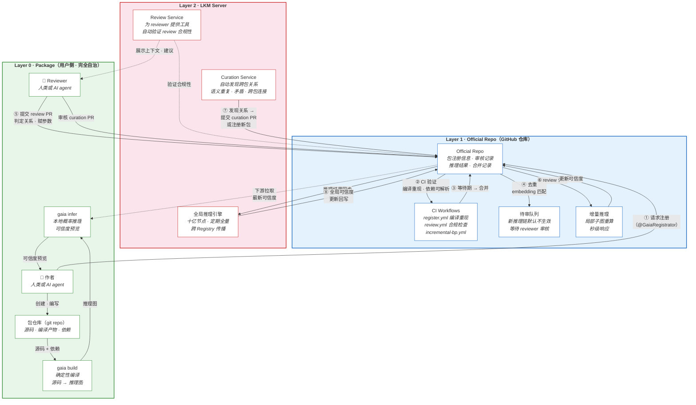

# 去中心化架构

> **Status:** Current canonical

本文档是 Gaia 去中心化包管理和推理架构的总纲。具体的业务流程见各子文档。

## 参与者

| 参与者 | 性质 | 职责 |
|--------|------|------|
| **作者**（人类或 AI agent） | 用户侧 | 创建知识包，声明依赖，编译，本地推理，发布 |
| **Reviewer**（人类或 AI agent） | 用户侧 | 审核新证据，判定推理关系，赋予参数 |
| **作者的 GitHub 仓库** | 用户侧 | 托管知识包源码和编译产物 |
| **Official Repo**（官方注册仓库） | GitHub | 注册所有包的元数据，存储审核记录和推理结果 |
| **Review Service** | LKM 服务器 | 为 reviewer 提供工具支持，自动化部分审核决策 |
| **Curation Service** | LKM 服务器 | 自动发现包之间的关系，以提交新包的方式维护 official repo |

## GitHub 作为通用交互面

所有参与者通过 GitHub 交互——一切都是 git commit，一切通过 PR，一切可审计：

| 参与者 | 交互方式 |
|--------|---------|
| 作者 | git push 到自己的包仓库；向 official repo 请求注册 |
| Reviewer | 向 official repo 提交 review PR |
| Review Service | 自动验证 review PR 的合规性；为 reviewer 提供建议 |
| Curation Service | 向 official repo 提交 curation PR（发现的关系、合并提议等） |

服务器上的 Review Service 和 Curation Service **没有特殊权限**——它们和普通贡献者一样通过 PR 与 official repo 交互。

## 整体架构图



**图例：** 实线箭头 = 数据/控制流，虚线箭头 = 辅助/拉取。编号 ①–⑧ 标注主流程顺序。

## 三层分离

```
Layer 0: Package（作者的 git 仓库，完全自治）
Layer 1: Official Repo（GitHub 仓库，可选的聚合层）
Layer 2: LKM Server（Review Service + Curation Service + 全局推理）
```

- **Layer 0** 是基础——两个人各建一个包，互相引用，就能在本地推理中让可信度流动。
- **Layer 1** 提供跨包的去重、审核记录和增量推理。
- **Layer 2** 提供自动化审核、策展和十亿节点的全局推理。

每一层都是可选增强。用户可以只用 Layer 0 完全离线工作。

## 业务流程总览

上图中的编号对应以下主流程：

| 步骤 | 描述 | 详见 |
|------|------|------|
| ① 请求注册 | 作者 release tag 后向 Official Repo 请求注册 | [authoring-and-publishing.md](authoring-and-publishing.md) |
| ② CI 验证 | 编译重现、依赖可解析、Schema 合法 | [registry-operations.md](registry-operations.md) |
| ③ 等待期 → 合并 | 新包 3 天，版本更新 1 小时 | [registry-operations.md](registry-operations.md) |
| ④ 去重 | embedding 匹配，区分前提引用 vs 独立结论 | [registry-operations.md](registry-operations.md) |
| ⑤ Reviewer 审核 | 判定独立/重复/细化，赋予推理参数 | [review-and-curation.md](review-and-curation.md) |
| ⑥ 触发增量推理 | 局部子图重算，秒级更新可信度 | [belief-flow-and-quality.md](belief-flow-and-quality.md) |
| ⑦ Curation 发现 | 语义重复、跨包连接、矛盾检测 | [review-and-curation.md](review-and-curation.md) |
| ⑧ 全局推理 | 十亿节点全量推理，跨 Registry 传播 | [belief-flow-and-quality.md](belief-flow-and-quality.md) |

各环节的详细业务逻辑：

- [包的创建与发布](authoring-and-publishing.md) — 作者从创建包到发布的完整旅程
- [Official Repo 的运作](registry-operations.md) — 注册、去重、待审队列
- [审核与策展](review-and-curation.md) — Review Service 和 Curation Service 的业务逻辑
- [多级推理与质量涌现](belief-flow-and-quality.md) — 三级推理、错误修正、质量如何涌现

## 设计原则

| 原则 | 体现 |
|------|------|
| 包即 git 仓库 | 不依赖任何中心服务 |
| GitHub 是通用协议 | 作者、reviewer、服务全部通过 PR 交互 |
| Official Repo 可选 | 增值服务，不是基础设施；可 fork 可联邦 |
| 服务器无特权 | Review Service 和 Curation Service 通过 PR 贡献，和人类一样 |
| 新证据默认静默 | 未经审核的推理不影响结果，reviewer 确认后激活 |
| 模糊判断归 review | 独立性、重复性等需要理解推理过程的判断由 reviewer 决定 |
| 多级推理 | 包级 + Official Repo 增量 + LKM 全局，各层各司其职 |
| 错误可修正 | 合并重复命题 + 暂停受影响的推理 + re-review |

## 参考文献

- [architecture-overview.md](architecture-overview.md) — 三层编译管线（Gaia Lang → Gaia IR → BP）
- [product-scope.md](product-scope.md) — 产品定位（CLI 优先，服务器增强）
