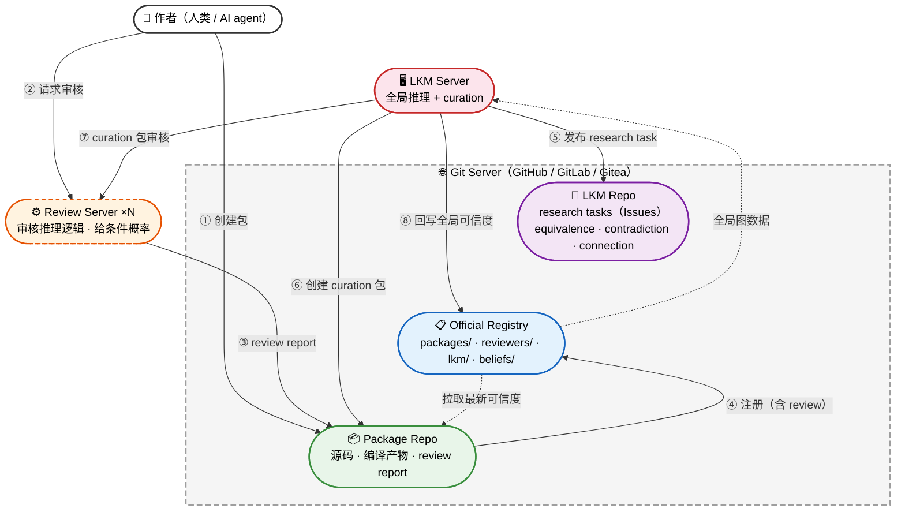

# 去中心化架构

> **Status:** Current canonical

本文档是 Gaia 去中心化包管理和推理架构的总纲。具体的业务流程见各子文档。

## 参与者

| 参与者 | 性质 | 职责 |
|--------|------|------|
| **作者**（人类或 AI agent） | 贡献者 | 创建知识包，声明依赖，编译，本地推理，发布 |
| **LKM Server** | 贡献者 + 全局推理 | 十亿节点全局推理；构建全局图时发现跨包关系，以 research task 发布候选，确认后以 curation 包贡献 |
| **Review Server** | 独立部署 | LLM/agent 自动审核员。审核包内部推理逻辑，给出条件概率初始值。可多实例 |
| **Git Repo（Package）** | 用户侧 | 托管知识包源码、编译产物和 review report |
| **Git Repo（LKM Repo）** | LKM 侧 | LKM 的运营仓库，通过 Issues 管理 research tasks（候选发现的发布、调查、分拣） |
| **Git Repo（Official Registry）** | 注册中心 | 注册包、reviewer、LKM 的元数据，存储推理结果 |

### 两类贡献者

Gaia 有两类并列的贡献者，走同样的流程（创建包 → review → 注册）：

| | 人类 / AI agent | LKM Server |
|---|---|---|
| **创建什么** | 知识包（从研究中得出的命题和推理链） | Curation 包（从全局图分析中发现的跨包关系） |
| **知识来源** | 实验、理论、分析 | 全局图构建过程中的发现（等价、矛盾、隐含连接），先以 research task 发布，确认后创建 curation 包 |
| **审核** | Review Server 审核推理逻辑 | 同样经 Review Server 审核 |
| **注册** | 向 Official Registry 提交 PR | 同样向 Official Registry 提交 PR |
| **特权** | 无 | 无——和普通贡献者走同样的流程 |

**LKM 是特殊地位的 research agent：** 它能看到整个知识网络（这是普通作者看不到的），因此能发现跨包关系。但它的发现仍然要走标准流程——创建 curation 包，经 Review Server 审核，注册到 Official Registry。没有捷径。

### Review Server 的定位

Review Server 是独立部署的 LLM/agent 审核员，为所有贡献者服务：

- **为人类/agent 的包审核推理逻辑，给条件概率**
- **同样为 LKM 的 curation 包审核**
- **可多实例：** 不同机构可以各自部署
- **无特权：** 通过标准流程贡献
- **格式约束：** 只要 review report 符合格式，任何实现都可以

## Git 作为通用交互面

所有参与者通过 git 交互——一切都是 git commit，一切通过 PR（merge request），一切可审计。本文档以 GitHub 为例描述流程，但架构本身只依赖 git + PR 语义，不绑定 GitHub。私有部署的 GitLab、Gitea 等同样适用——只需将 "GitHub Actions" 替换为对应的 CI 系统（GitLab CI、Drone 等），"GitHub App" 替换为对应的 webhook/bot 机制。

| 参与者 | 交互方式 |
|--------|---------|
| 作者 | git push 到自己的包仓库；向 Official Registry 请求注册 |
| LKM Server | 在 LKM Repo 发布 research task（Issues）；创建 curation 包；向 Official Registry 请求注册 |
| Review Server | 审核包内部推理 → review report 存入包仓库 |

## 整体架构图



**布局说明：**

```
第 1 层    👤 作者（人类/Agent）         ║    🖥 LKM Server
                    ↘                         ↙
第 2 层              ⚙ Review Server ×N（为两者服���）
                    ↓
         ┌─────── 🌐 Git Server（GitHub / GitLab / Gitea）───────┐
第 3 层  │  📦 Package Repo  ║  🔬 LKM Repo  ���  📋 Registry  │
         └──────────────────────────────────────────────────────┘
```

- 实线 = 数据推送，虚线 = 数据拉取
- 作者和 LKM 走**相同路径**：创建包 → Review Server 审核 → Package Repo → 注册到 Registry
- LKM 额外拥有 LKM Repo，通过 Issues 管理 research tasks（⑤）
- Research task 确认后，LKM 创建 curation 包到 Package Repo（⑥），走标准审核 + 注册流程
- Registry 向 LKM 提供全局图数据（虚线，拉取方向）
- Registry 向 Package Repo 提供最新可信度（虚线，下游拉取）

## 架构分层

| 层 | 组成 | 性质 |
|----|------|------|
| **Package** | 作者或 LKM 的 git 仓库 | 完全自治，可离线工作 |
| **LKM Repo** | LKM 的 git 仓库 | 通过 Issues 管理 research tasks，候选发现的发布、调查、分拣 |
| **Official Registry** | Git 仓库 | 可选的聚合层，注册包、reviewer、LKM，存储推理结果 |
| **Review Server** | 独立部署的 LLM/agent 审核员 | 可多实例，审核所有来源的包 |
| **LKM Server** | 全局推理 + curation | 全局 BP + 发现跨包关系，发布 research task，确认后以 curation 包贡献 |

- **Package** 是基础——两个人各建一个包，互相引用，就能在本地推理中让可信度流动。
- **Review Server** 审核所有包（人类的和 LKM 的），给出条件概率初始值。
- **Official Registry** 提供跨包的去重、审核记录和增量推理。
- **LKM Repo** 是 LKM 的运营仓库，research tasks 以 Issues 形式管理——轻量级、支持讨论、labels 分类、自动关闭过期候选。
- **LKM Server** 提供全局推理，同时在构建全局图的过程中发现跨包关系，先发布到 LKM Repo，确认后以 curation 包的形式贡献。

每一层都是可选增强。用户可以只用 Package 层完全离线工作。

## 注册

Official Registry 注册三类实体，全部采用相同的 PR 模型：

### 注册结构

```
official-registry/
├── packages/              # 知识包注册（人类和 LKM 的包都在这里）
│   ├── my-research/
│   │   ├── Package.toml
│   │   ├── Versions.toml
│   │   └── Deps.toml
│   └── curation-ybco-merge/      # LKM 提交的 curation 包
│       ├── Package.toml
│       ├── Versions.toml
│       └── Deps.toml
├── reviewers/             # Review Server 注册
│   ├── review-server-alpha/
│   │   └── Reviewer.toml
│   └── review-server-beta/
│       └── Reviewer.toml
├── lkm/                   # LKM Server 注册
│   └── lkm-gaia-official/
│       └── LKM.toml
├── reviews/               # 审核记录
├── beliefs/               # 推理结果
├── merges/                # 合并记录
└── .github/workflows/
```

### Reviewer.toml

```toml
[reviewer]
id = "uuid"
github = "review-server-alpha"
name = "Alpha Review Server"
operator = "MIT Physics Department"
registered = 2026-03-15

[specialization]
domains = ["condensed-matter", "superconductivity"]

[endorsement]
endorsed_by = ["review-server-beta"]
```

### LKM.toml

```toml
[lkm]
id = "uuid"
github = "lkm-gaia-official"
name = "Gaia Official LKM"
operator = "Gaia Foundation"
registered = 2026-03-15

[capabilities]
global_inference = true
curation = true           # 是否提交 curation 包
```

### 注册流程（对所有实体通用）

```
提交 PR：添加对应目录下的 TOML 文件
  ↓
CI 验证：格式合法、身份有效、担保方已注册
  ↓
等待期（社区审查）
  ↓
合并 → 该实体的贡献被 CI 认可
```

## LKM 的 Curation 流程

LKM 在构建全局图的过程中，自然会发现跨包关系。这些发现经过**两阶段流程**：先作为 research task 发布到 LKM Repo 的 Issues，确认后再以 curation 包的形式走标准流程。

### LKM Repo

LKM 拥有自己的 git 仓库（LKM Repo），research tasks 通过 **Issues** 管理：

- **Issue 模板：** 三类候选各有结构化模板，LKM 自动创建
- **Labels 两个维度：**
  - 类型：`equivalence` / `contradiction` / `connection`
  - 状态：`open` / `investigating` / `confirmed` / `rejected`
- **批量发现：** 一次全局推理可能发现多个候选，可以一个 issue 列一批同类发现
- **社区参与：** 人类研究者可以浏览 issues、参与调查、在评论区讨论
- **自动关闭：** 超过一定时间没人调查的低置信度候选自动 close

**为什么用 Issues 而非 git 文件：** Research tasks 是待跟踪的工作项，有生命周期（open → investigating → confirmed/rejected）。Issues 天然支持状态管理、讨论、labels 过滤，且不会因高频发现污染 git 树。一万个 issues 对 GitHub/GitLab 完全没有压力（大量 open source 项目有 10 万+ issues），关键是 open 的 issue 数量可控——大部分候选会被快速确认或拒绝后 close。

### 阶段一：发现 → Research Task（Issues）

LKM 全局推理过程中发现的候选关系，以 Issues 发布到 LKM Repo。三类候选：

| 候选类型 | 触发条件 | 调查后的可能结论 |
|---------|---------|----------------|
| **equivalence** | 两个命题语义接近 | duplicate（应合并）/ independent evidence（独立证据汇聚）/ refinement（细化关系） |
| **contradiction** | 两个命题互相冲突 | 确认矛盾 → 推理引擎压低双方可信度 |
| **connection** | 一个包的结论高度相关另一个包的前提，但未声明依赖 | 确认连接 → 建立跨包依赖 |

**关键区分：** equivalence 候选的调查结论决定了完全不同的处理方式——duplicate 应该合并（去重），independent evidence 不应合并而是识别为证据汇聚（增强可信度），refinement 建立细化关系。候选阶段只描述"发现了什么"，具体判定是 curation 包审核时的事。

### 阶段二：确认 → Curation 包 → 标准流程

```
LKM 在 LKM Repo 创建 Issue（research task）
  ↓
调查（LKM 自动分析 + 人类研究者在 issue 评论区讨论）
  ↓
确认 → LKM 创建 curation 包：
  - 声明发现的关系和调查结论
  - 附带检测依据和置信度
  - Issue 中贴上 curation 包链接，close
  ↓
curation 包经 Review Server 审核
  ↓
带 review report 注册到 Official Registry
  ↓
CI 验证 → 等待期 → 合并 → 增量推理
```

**LKM 没有捷径。** Research task 是轻量级的发现记录，不直接生效。确认后的关系必须走完建包 → 审核 → 注册的完整流程。这保证了所有知识变更都有审计记录，且经过独立审核。

## 业务流程总览

架构图中的编号对应以下主流程：

**人类/Agent 流：**

| 步骤 | 描述 | 详见 |
|------|------|------|
| ① 请求审核 | 作者向 Review Server 提交包的审核请求 | [review-and-curation.md](review-and-curation.md) |
| ② review report | Review Server 审核推理逻辑，给条件概率初始值，存入包内 | [review-and-curation.md](review-and-curation.md) |
| ③ 请求注册 | 作者带着 review report 向 Official Registry 请求注册 | [registry-operations.md](registry-operations.md) |

**LKM 流：**

| 步骤 | 描述 | 详见 |
|------|------|------|
| ④ 全局推理 | LKM 读取全局图，运行十亿节点 BP，回写可信度 | [belief-flow-and-quality.md](belief-flow-and-quality.md) |
| ⑤ Research Task + Curation | LKM 在构建全局图时发现跨包关系，发布 research task 候选，确认后创建 curation 包 | [review-and-curation.md](review-and-curation.md) |

**共同流：**

| 步骤 | 描述 | 详见 |
|------|------|------|
| ⑥ 去重 + 增量推理 | Registry CI 去重、验证、增量推理 | [registry-operations.md](registry-operations.md)，[belief-flow-and-quality.md](belief-flow-and-quality.md) |

各环节的详细业务逻辑：

- [包的创建与发布](authoring-and-publishing.md) — 作者从创建包到审核、发布的完整旅程
- [Official Repo 的运作](registry-operations.md) — 注册、去重、推理链激活
- [审核与策展](review-and-curation.md) — Review Server 审核 + LKM curation 的业务逻辑
- [多级推理与质量涌现](belief-flow-and-quality.md) — 三级推理、错误修正、质量如何涌现

## 设计原则

| 原则 | 体现 |
|------|------|
| 包即 git 仓库 | 不依赖任何中心服务 |
| Git 是通用协议 | 作者、LKM、Review Server 全部通过 PR / git 交互；兼容 GitHub、GitLab、Gitea |
| Official Registry 可选 | 增值服务，不是基础设施；可 fork 可联邦 |
| 两类贡献者并列 | 人类/agent 和 LKM 走同样的流程，LKM 没有捷径 |
| LKM = research agent | 全局推理 + curation 是同一个过程的两个产出 |
| Review 在包级别 | 审核发生在提交 Registry 之前，report 存入包内 |
| Review Server 就是 reviewer | LLM/agent 自动审核，作者可 rebuttal |
| 所有实体需注册 | 包、reviewer、LKM 都在 Registry 注册，审计可追溯 |
| 新推理链需有参数才生效 | 没有 review = 没有条件概率 = 推理引擎跳过 |
| 多级推理 | 包级 + Registry 增量 + LKM 全局 |
| 错误可修正 | 合并重复命题 + 暂停受影响的推理 + re-review |

## 参考文献

- [architecture-overview.md](architecture-overview.md) — 三层编译管线（Gaia Lang → Gaia IR → BP）
- [product-scope.md](product-scope.md) — 产品定位（CLI 优先，服务器增强）
