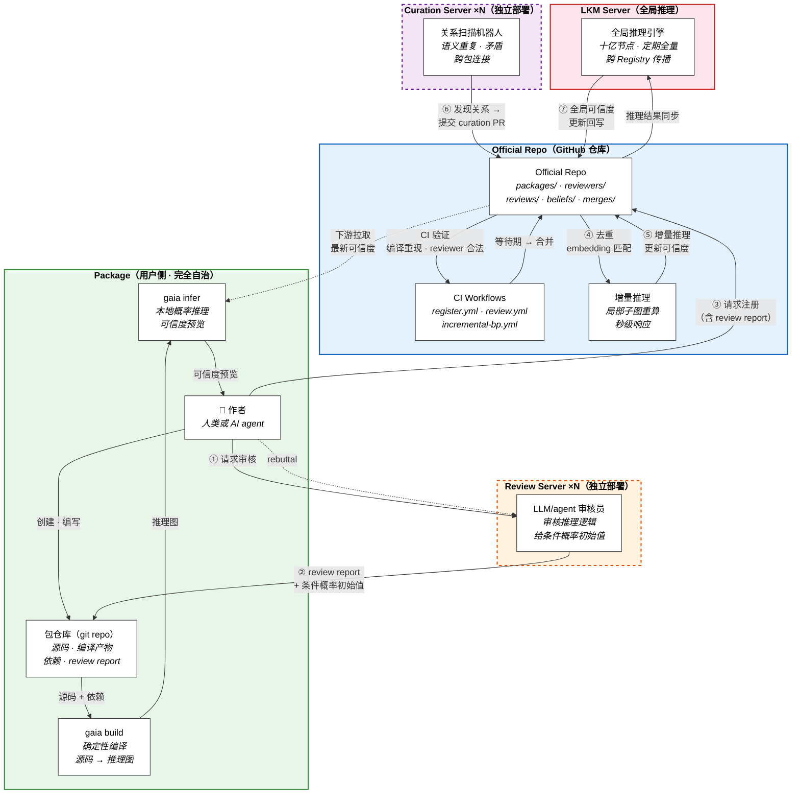

# 去中心化架构

> **Status:** Current canonical

本文档是 Gaia 去中心化包管理和推理架构的总纲。具体的业务流程见各子文档。

## 参与者

| 参与者 | 性质 | 职责 |
|--------|------|------|
| **作者**（人类或 AI agent） | 用户侧 | 创建知识包，声明依赖，编译，本地推理，发布 |
| **作者的 GitHub 仓库** | 用户侧 | 托管知识包源码、编译产物和 review report |
| **Official Repo**（官方注册仓库） | GitHub | 注册包和 reviewer 的元数据，存储推理结果 |
| **Review Server** | 独立部署 | LLM/agent 自动审核员。审核包内部推理逻辑，给出条件概率初始值。可多实例 |
| **Curation Server** | 独立部署 | 关系扫描机器人。自动发现跨包关系，通过 PR 贡献。可多实例 |
| **LKM Server** | 中心计算 | 十亿节点全局推理引擎 |

### Review Server 和 Curation Server 的定位

Review Server 和 Curation Server **不是 LKM Server 的组件**，而是独立部署的机器人：

- **Review Server 就是 reviewer：** 用 LLM/agent 实现的自动审核员，审核包内部推理过程的逻辑可靠性，给出条件概率初始值。作者可以和 Review Server 来回 rebuttal。
- **Curation Server 是扫描机器人：** 定期扫描 Official Repo，发现跨包关系（语义重复、矛盾、连接），以 PR 或注册新包的方式贡献。
- **可多实例：** 不同机构可以各自部署自己的 Review Server 或 Curation Server。
- **无特权：** 和普通贡献者一样，通过 PR 与 Official Repo 交互。
- **格式约束：** 只要输出符合 Official Repo 规定的格式，任何实现都可以参与。

## Git 作为通用交互面

所有参与者通过 git 交互——一切都是 git commit，一切通过 PR（merge request），一切可审计。本文档以 GitHub 为例描述流程，但架构本身只依赖 git + PR 语义，不绑定 GitHub。私有部署的 GitLab、Gitea 等同样适用——只需将 "GitHub Actions" 替换为对应的 CI 系统（GitLab CI、Drone 等），"GitHub App" 替换为对应的 webhook/bot 机制。

| 参与者 | 交互方式 |
|--------|---------|
| 作者 | git push 到自己的包仓库；向 official repo 请求注册 |
| Review Server | 审核包内部推理 → review report 存入包仓库 |
| Curation Server | 向 official repo 提交 curation PR（发现的关系、合并提议等） |
| LKM Server | 读取 official repo 的推理图，回写全局推理结果 |

## 整体架构图



**图例：** 实线 = 数据/控制流，虚线 = 辅助/拉取。虚线框 = 独立部署（可多实例），橙色 = Review Server，紫色 = Curation Server。

## 架构分层

| 层 | 组成 | 性质 |
|----|------|------|
| **Package** | 作者的 git 仓库 | 完全自治，可离线工作 |
| **Official Repo** | GitHub 仓库 | 可选的聚合层，注册包和 reviewer，存储推理结果 |
| **Review Server** | 独立部署的 LLM/agent 审核员 | 可多实例，审核包内部推理逻辑，给条件概率 |
| **Curation Server** | 独立部署的扫描机器人 | 可多实例，发现跨包关系 |
| **LKM Server** | 全局推理引擎 | 十亿节点 BP，定期全量 + 事件增量 |

- **Package** 是基础——两个人各建一个包，互相引用，就能在本地推理中让可信度流动。
- **Review Server** 在包发布前审核推理逻辑，给出条件概率初始值。
- **Official Repo** 提供跨包的去重、审核记录和增量推理。
- **Curation Server** 围绕 Official Repo 运行，发现跨包关系。
- **LKM Server** 提供十亿节点级别的全局推理。

每一层都是可选增强。用户可以只用 Package 层完全离线工作。

## Reviewer 注册

Official Repo 注册两类实体：包和 reviewer（Review Server 实例）。Reviewer 注册采用和包注册相同的 PR 模型：

```
official-repo/
├── packages/              # 包注册
│   └── my-package/
│       ├── Package.toml
│       ├── Versions.toml
│       └── Deps.toml
├── reviewers/             # reviewer（Review Server）注册
│   ├── review-server-alpha/
│   │   └── Reviewer.toml
│   └── review-server-beta/
│       └── Reviewer.toml
├── reviews/               # 审核记录
├── beliefs/               # 推理结果
├── merges/                # 合并记录
└── .github/workflows/
```

### Reviewer.toml

```toml
[reviewer]
id = "uuid"
github = "review-server-alpha"        # GitHub handle / bot account
name = "Alpha Review Server"
operator = "MIT Physics Department"   # 运营方
registered = 2026-03-15

[specialization]
domains = ["condensed-matter", "superconductivity"]

[endorsement]
endorsed_by = ["review-server-beta"]  # 担保方（已注册的 reviewer）
```

### 注册流程

```
运营方提交 PR：添加 reviewers/<name>/Reviewer.toml
  ↓
CI 验证：格式合法、GitHub handle 有效、担保方已注册
  ↓
等待期（社区审查）
  ↓
合并 → 该 Review Server 的 review report 被 CI 认可
```

### 为什么注册 reviewer

1. **审核有效性保证：** CI 在验证包的 review report 时检查 reviewer 是否已注册，未注册 reviewer 的 report 不被认可
2. **专长匹配：** `domains` 字段帮助作者选择合适的 Review Server
3. **审核历史可追溯：** 哪个 Review Server 审核过哪些包，从 git history 可查
4. **质量从历史涌现：** reviewer 的 track record 自然积累，不需要预设信任分

## 业务流程总览

架构图中的编号对应以下主流程：

| 步骤 | 描述 | 详见 |
|------|------|------|
| ① 请求审核 | 作者向 Review Server 提交包的审核请求 | [review-and-curation.md](review-and-curation.md) |
| ② review report | Review Server 审核推理逻辑，给出条件概率初始值，存入包内 | [review-and-curation.md](review-and-curation.md) |
| ③ 请求注册 | 作者带着 review report 向 Official Repo 请求注册 | [registry-operations.md](registry-operations.md) |
| ④ 去重 | embedding 匹配，区分前提引用 vs 独立结论 | [registry-operations.md](registry-operations.md) |
| ⑤ 增量推理 | 局部子图重算，秒级更新可信度 | [belief-flow-and-quality.md](belief-flow-and-quality.md) |
| ⑥ Curation 发现 | 语义重复、跨包连接、矛盾检测 | [review-and-curation.md](review-and-curation.md) |
| ⑦ 全局推理 | 十亿节点全量推理，跨 Registry 传播 | [belief-flow-and-quality.md](belief-flow-and-quality.md) |

各环节的详细业务逻辑：

- [包的创建与发布](authoring-and-publishing.md) — 作者从创建包到审核、发布的完整旅程
- [Official Repo 的运作](registry-operations.md) — 注册、去重、推理链激活
- [审核与策展](review-and-curation.md) — Review Server 和 Curation Server 的业务逻辑
- [多级推理与质量涌现](belief-flow-and-quality.md) — 三级推理、错误修正、质量如何涌现

## 设计原则

| 原则 | 体现 |
|------|------|
| 包即 git 仓库 | 不依赖任何中心服务 |
| GitHub 是通用协议 | 作者、机器人全部通过 PR / git 交互 |
| Official Repo 可选 | 增值服务，不是基础设施；可 fork 可联邦 |
| Review 在包级别 | 审核发生在提交 Official Repo 之前，report 存入包内 |
| Review Server 就是 reviewer | LLM/agent 自动审核，作者可 rebuttal |
| 机器人无特权 | Review Server 和 Curation Server 通过标准流程贡献 |
| 机器人可多实例 | 任何人可以部署自己的 Review / Curation Server |
| Reviewer 需注册 | 审核来源可追溯，质量从历史涌现 |
| 新推理链需有参数才生效 | 没有 review = 没有条件概率 = 推理引擎跳过 |
| 多级推理 | 包级 + Official Repo 增量 + LKM 全局 |
| 错误可修正 | 合并重复命题 + 暂停受影响的推理 + re-review |

## 参考文献

- [architecture-overview.md](architecture-overview.md) — 三层编译管线（Gaia Lang → Gaia IR → BP）
- [product-scope.md](product-scope.md) — 产品定位（CLI 优先，服务器增强）
