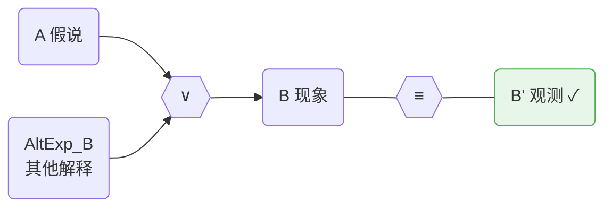
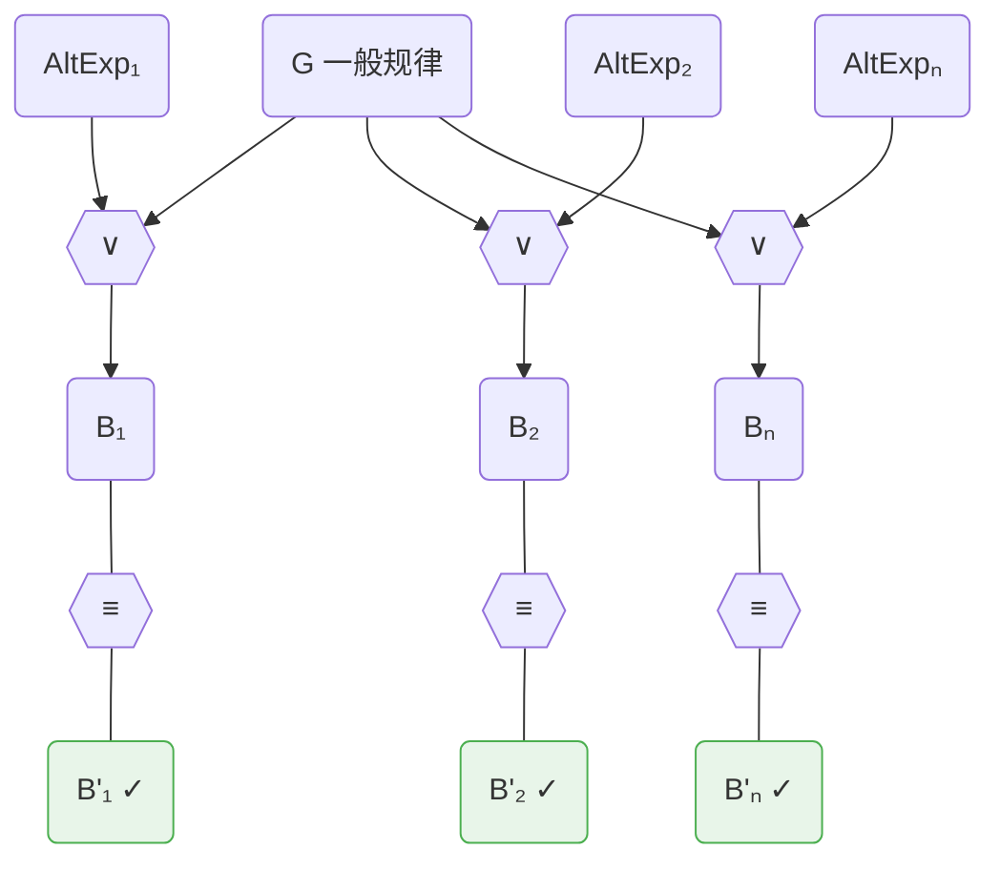
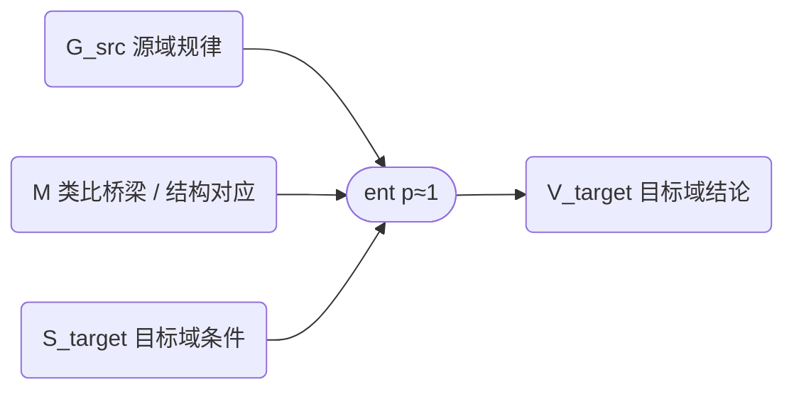
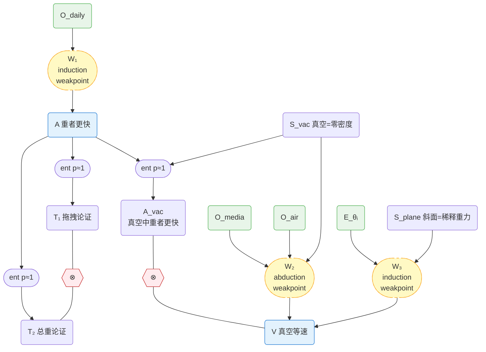
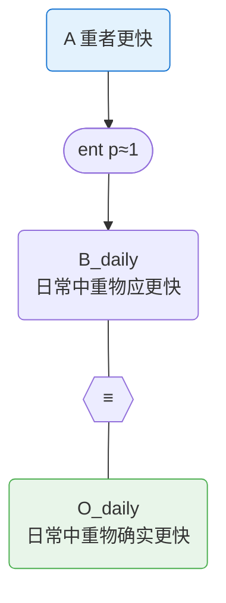
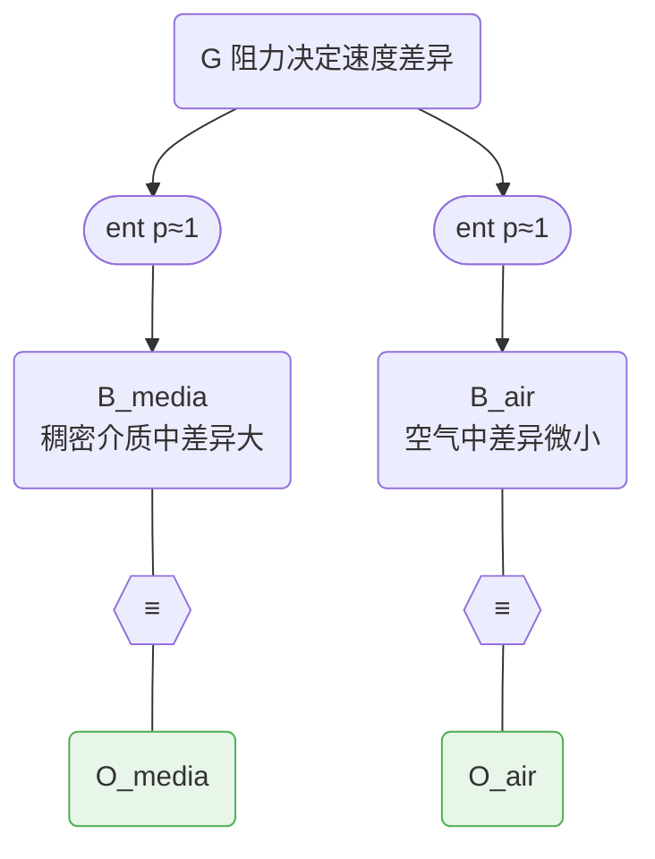
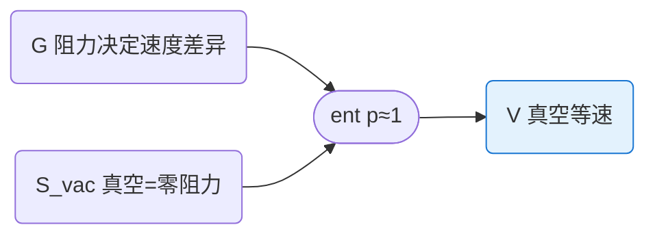
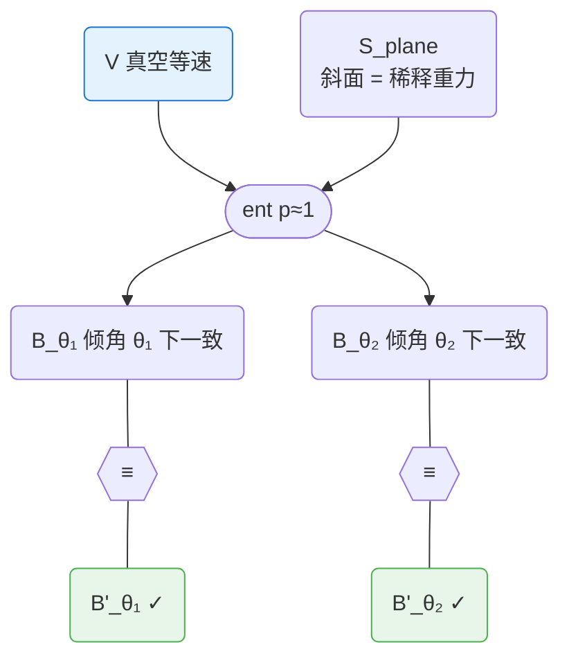
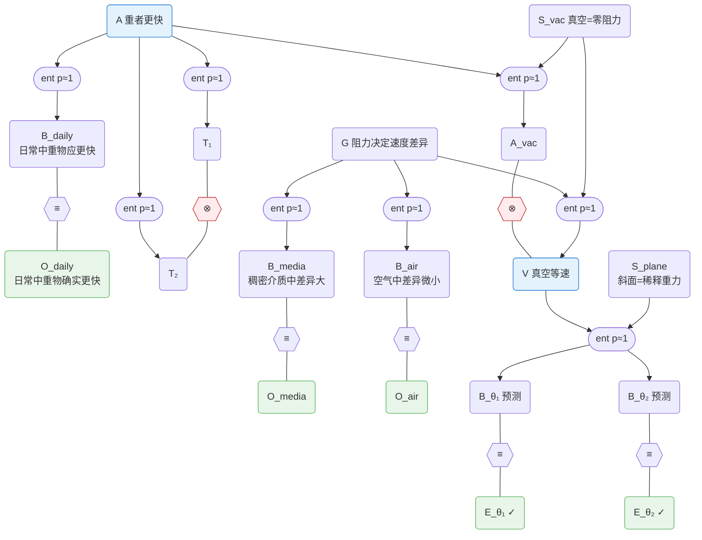

# 科学知识的形式化 — 从自然语言到命题网络

> **Derivation chain position:** Layer 2 — Scientific Ontology
> Reasoning Strategies → **[this document]** → [computational boundary] → Factor Graphs → ...
>
> 本文档提供将科学论证转化为命题网络的方法论。
> 依赖 `03-propositional-operators.md`（算子定义）和 `04-reasoning-strategies.md`（推理策略）。
>
> **本文档不涉及因子图或 BP** — 这些属于 Layer 3（计算方法）。

> **Status:** Target design — foundation baseline
>
> 本文档定义如何将科学论述形式化为命题网络，并论证形式化后的软蕴含参数 `(p₁, p₂)` 可以趋向客观。
> 前置依赖：
> - [01-plausible-reasoning.md](01-plausible-reasoning.md) — 为什么用概率（Cox 定理、Jaynes 框架）
> - [03-propositional-operators.md](03-propositional-operators.md) — 最小原料 {¬, ∧, π}、派生算子与 ↝（软蕴含）
> - [04-reasoning-strategies.md](04-reasoning-strategies.md) — 知识类型、关系类型、九种推理策略

## 1. 问题：软蕴含参数如何客观化

↝（软蕴含）算子文档（参见 [03-propositional-operators.md](03-propositional-operators.md)）指出，在**粗命题网络**层，最需要被进一步客观化的自由参数类是作者给出的 `(p₁, p₂)` — 也就是"这条尚未展开的支撑链在正向支持和前提缺席时各有多强"。  

需要区分两类输入：

- **节点先验 `π`**：附着在 claim 节点上的初始置信度输入
- **软蕴含参数 `(p₁, p₂)`**：附着在 weakpoint 边上的 coarse summary 参数

两者都属于模型输入，但 `(p₁, p₂)` 才是 Step 3 形式化要逐步消去的对象。随着网络展开，↝ 会被严格结构和中间命题替代，而 `(p₁, p₂)` 会退化为由微观结构、节点先验和边缘化导出的有效统计量。

这引出一个根本问题：**p 能否客观化？** 如果不能，那么整个系统的输出就依赖于个人判断，与传统的专家打分无异。如果能，Gaia 就是一个从科学文本到客观信念的机械推理系统。

本文档论证：通过充分的形式化，所有推理链最终归约为 entailment + equivalence + contradiction，从而消除 `(p₁, p₂)` 作为自由参数。

## 2. Formalization 方法论

形式化分为三步。每一步产生一张网络，后一步的网络比前一步更精细。

### 2.1 Step 1 — 提取 conclusion 与推理过程

从科学家的自然语言论述（论文、专著、实验报告）中提取：

- **Conclusion（结论节点）**：作者最终要论证的核心断言
- **推理过程中的 claim（变量节点）**：观测、假说、中间推断等。**每个 claim 必须 self-contained** — 不依赖其他 claim 的上下文，单独阅读就能理解

这一步只做提取 — 把自然语言拆成离散的 claim 节点，标注哪些是 conclusion、哪些是中间 claim。同时记录自然语言级别的粗推理脉络（"A 从 B 推出""C 支撑 D"），但不急于确定推理关系的正式类型或布线方向。

### 2.2 Step 2 — 识别弱点，构建粗命题网络

对 Step 1 得到的推理过程逐链检查。对于每个 conclusion，找出推理中的**弱点** — 隐含假设、归纳跳跃、溯因猜测等逻辑蕴含之外的步骤。

对每个弱点：

1. **写成独立的 self-contained claim** — 可判真假，不依赖上下文
2. **判断与 conclusion 的依赖关系**：如果这个 claim 为假，conclusion 是否必然不成立？
   - **是** → 标记为 **premise**（前提）。premise 通过 entailment 连接到 conclusion
   - **否** → 标记为 **weakpoint**（网络中的一个 ↝ 节点，带待确定的 `(p₁, p₂)`）。推理过程中存在尚未充分分解的支撑关系，将在 Step 3 进一步细化

完成这一步后，**粗命题网络**已经成形：

- Conclusion 与 premise 之间有 entailment 连接
- Contradiction 和 equivalence 关系已经就位
- 但 weakpoint 处的推理尚未展开 — 从原始证据到 premise 的路径上，存在 p 显著小于 1 的 ↝ 连接

粗命题网络忠实反映了当前的形式化程度：conclusion 的 belief 已经部分由网络结构决定，但 weakpoint 意味着部分信念仍依赖于未分解的主观判断。

### 2.3 Step 3 — 细化弱点，消除主观 `(p₁, p₂)`

对 Step 2 中的 weakpoint（以及任何尚未退化为严格蕴含的 ↝ 连接），使用**子网络模式**进一步分解。每种弱点对应一个可复用的子网络模式，由 entailment + observation + equivalence 组合而成。分解后不确定性从"边的软参数"转移到"命题是否为真"。

以下三种子网络模式对应 [04-reasoning-strategies.md](04-reasoning-strategies.md) §2 中定义的推理策略的细命题网络展开。

#### Abduction 模式（溯因）

认识论上，溯因是"观测到 B'，推断最佳解释 A"（参见 [04-reasoning-strategies.md](04-reasoning-strategies.md) §2.2）。在命题网络中分解为：

- A：假说（self-contained claim）
- `AltExp_B`：除 A 之外也能导致该现象的替代解释
- B：待解释的现象（self-contained claim）
- B'：实际观测到的事实（self-contained claim）
- `A ∨ AltExp_B -> B` 表示现象可能来自目标假说，也可能来自其他解释
- B 和 B' 内容相近但表述独立，通过 equivalence 连接

推理效果：B' 的高 belief 通过 equivalence 传递给 B，再与 `AltExp_B` 形成 explaining-away 竞争，最后提升 A 的 belief。

如果存在竞争假说 A'，也会通过自己的 `A' ∨ AltExp_B' -> B` 路径连接到同一组观测。explaining away 自动处理竞争 — 能解释更多观测、且替代解释 base rate 更低的假说获得更高 belief。

#### Induction 模式（归纳）

归纳是"从多个实例推断一般规律"（参见 [04-reasoning-strategies.md](04-reasoning-strategies.md) §2.3）。本质上是**重复的 abduction** — 一般规律是"假说"，每个实例是一个"现象+替代解释"对：

每个 Bᵢ 和 B'ᵢ 都是 self-contained claim，而 `AltExpᵢ` 表示该实例在没有一般规律时也可能成立的替代解释。推理效果：每个 equivalence 都通过 explaining-away 抑制 `AltExpᵢ`，进而支撑 G。实例越多，G 的 belief 越高。如果某个实例失败（B'ₖ 的 belief 低），对应的单元不再支撑 G — 系统自动处理反例。

#### Analogy 模式（类比）

类比不是在同一参数空间内做极限外推；那属于 induction / abduction 之后的 entailment。
类比是把源域中已经建立的结构规律迁移到目标域（参见 [04-reasoning-strategies.md](04-reasoning-strategies.md) §2.4）。其关键不是连续性，而是一个显式的桥梁主张 `M`：

> 在某个变量映射 `φ` 下，源域中真正起作用的关系在目标域中也保持成立。

分解为两部分：

**Part a — 在源域建立规律**：先在源域得到 `G_src`。这一步本身可以来自 deduction、induction 或 abduction（复用前述子网络模式）。

**Part b — Entailment 外推到目标域**：

- **G_src**：源域中已经建立的规律、机制或约束
- **M**：类比桥梁。声明源域与目标域在相关变量、约束或因果结构上可对应
- **S_target**：目标域的具体条件、边界条件或适用范围
- **V_target**：迁移到目标域后的结论

关键点是：类比中的不确定性通常不在 `G_src + M + S_target -> V_target` 这条 entailment 本身，而在 `M` 是否成立。formalization 的任务不是把这一步藏进一个模糊的 `(p₁, p₂)`，而是把 `M` 显式化，使它能够被独立支持、质疑、复用或反驳。

如果目标域后来获得了观测，还可以继续加入 `V_target ≡ O_target`，让目标域证据反过来约束 `M`。

### 2.4 组装：粗命题网络与细命题网络

Step 2 产生的粗命题网络已经具有推理价值——它捕捉了推理骨架，标注了哪些步骤已充分形式化（entailment）、哪些尚未充分形式化（weakpoint，仍需用 ↝ 的 `(p₁, p₂)` 摘要）。粗命题网络上可以直接运行推理，产生有意义的 belief 值（参见 [03-propositional-operators.md](03-propositional-operators.md) §6）。

Step 3 将粗命题网络中的 weakpoint 逐一展开为子网络模式，用逻辑算子组合 + 中间命题替代 ↝（软蕴含），形成细命题网络。再加上：

- **Contradiction**：互斥命题之间的约束
- **Equivalence**：不同路径得出相同结论时的约束（包括跨包引用）
- **多条独立路径**：同一命题被多条路径支撑

当所有 weakpoint 都被展开为严格结构后，系统中剩余的自由度只有原子命题的先验 π。Cox 定理保证：给定网络结构和局部约束，存在唯一的一致性 belief 赋值。当 equivalence 和 contradiction 足够多时，π 的初始选择变得无关紧要。

因此：**充分形式化 + 充分约束 → 客观信念**。

### 2.5 形式化工作流——从粗到细

科学知识的形式化是一个**从粗到细**的渐进过程，而非一步到位的精确建模。

**第一步：构建粗命题网络。** 从科学文本中提取命题和推理关系（Step 1-2），用 ↝（软蕴含，带 `(p₁, p₂)`）连接尚未充分形式化的推理步骤。粗命题网络忠实反映当前的形式化程度——哪些步骤是确定性蕴含，哪些是有待分解的弱点。

**第二步：细化为细命题网络。** 选择关键的 ↝ 连接（weakpoint），将其展开为逻辑算子组合 + 中间命题（Step 3 的子网络模式）。每次细化都是**局部操作**——只替换一个 ↝ 连接，不影响网络的其余部分。

**关键认识：粗命题网络本身有推理价值。** 粗命题网络不是"不完整的"网络——它是对知识现状的忠实表示。当推理过程确实没有被完全分解时，用带 `(p₁, p₂)` 的 ↝（软蕴含）来表示，比强行使用严格逻辑算子更诚实、更有用。细化是提高推理精度的**持续改进过程**，不需要一步到位。

关于 ↝ 算子与逻辑算子的形式定义及细化的局部性质，参见 [03-propositional-operators.md](03-propositional-operators.md) §6。

## 3. 走通例子：伽利略的落体

### 3.1 原文

**亚里士多德**，*De Caelo* I.6（Stocks 译）：

> "A given weight moves a given distance in a given time; a weight which is as great and more moves the same distance in a less time, the times being in inverse proportion to the weights. For instance, if one weight is twice another, it will take half as long over a given movement."
>
> 一个给定的重量在给定时间内移动给定的距离；一个更大的重量在更短的时间内移动同样的距离，时间与重量成反比。例如，如果一个重量是另一个的两倍，它通过同样的运动所需时间就是一半。

**伽利略**，*Discorsi e Dimostrazioni Matematiche intorno a due nuove scienze*（1638），连球悖论（Crew & de Salvio 译）：

> "If then we take two bodies whose natural speeds are different, it is clear that on uniting the two, the more rapid one will be partly retarded by the slower, and the slower will be somewhat hastened by the swifter. [...] But if this is true, and if a large stone moves with a speed of, say, eight while a smaller moves with a speed of four, then when they are united, the system will move with a speed less than eight; but the two stones when tied together make a stone larger than that which before moved with a speed of eight. Hence the heavier body moves with less speed than the lighter; an effect which is contrary to your supposition."
>
> 如果我们取两个自然速度不同的物体，显然将二者结合后，较快的会被较慢的部分拖慢，较慢的会被较快的部分加速。[……] 但如果这是对的，而且一块大石头以速度八下落、一块小石头以速度四下落，那么将它们绑在一起后，系统的速度将小于八；然而这两块绑在一起的石头比原来速度为八的那块更重。于是更重的物体反而比更轻的运动得更慢——这与你的假设恰恰相反。

**伽利略**，同上，介质观测：

> "I then began to combine these two facts and to consider what would happen if bodies of different weight were placed in media of different resistances; and I found that the differences in speed were greater in those media which were the more resistant."
>
> 于是我开始把这两个事实结合起来，考虑如果将不同重量的物体放入不同阻力的介质中会怎样；我发现，介质阻力越大，速度差异越大。

> "In a medium of quicksilver, gold not merely sinks to the bottom more rapidly than lead but it is the only substance that will descend at all; all other metals and stones rise to the surface and float. On the other hand the variation of speed in air between balls of gold, lead, copper, porphyry, and other heavy materials is so slight that in a fall of 100 cubits a ball of gold would surely not outstrip one of copper by as much as four fingers. Having observed this I came to the conclusion that in a medium totally devoid of resistance all bodies would fall with the same speed."
>
> 在水银介质中，金不仅比铅下沉得更快，而且是唯一能下沉的物质；所有其他金属和石头都浮到表面。另一方面，金球、铅球、铜球、斑岩球及其他重材料球在空气中的速度差异非常微小，以至于从一百腕尺高处落下，金球领先铜球绝不超过四指。观察到这些之后，我得出结论：在完全没有阻力的介质中，所有物体将以相同的速度下落。

**伽利略**，同上，斜面实验（Third Day）：

> "A piece of wooden moulding or scantling, about 12 cubits long, half a cubit wide, and three finger-breadths thick, was taken; on its edge was cut a channel a little more than one finger in breadth; having made this groove very straight, smooth, and polished, and having lined it with parchment, also as smooth and polished as possible, we rolled along it a hard, smooth, and very round bronze ball."
>
> 取一根木条，约十二腕尺长、半腕尺宽、三指厚；在其边缘切出一道略宽于一指的沟槽；将此沟槽打磨得非常直、光滑且抛光，并衬以同样光滑抛光的羊皮纸，然后沿沟槽滚下一个坚硬、光滑且非常圆的青铜球。

> "Having performed this operation and having assured ourselves of its reliability, we rolled the ball only one-quarter the length of the channel; and having measured the time of its descent, we found it precisely one-half of the former. Next, trying other distances, compared with one another and with that of the whole length, and with other experiments repeated a full hundred times, we always found that the spaces traversed were to each other as the squares of the times, and this was true for all inclinations of the plane."
>
> 完成此操作并确认其可靠性后，我们让球只滚过沟槽的四分之一长度；测量其下降时间，恰好是前者的一半。接着尝试其他距离，彼此比较并与全长比较，实验重复了整整一百次，我们始终发现：所经过的距离之比等于时间之比的平方，对斜面的所有倾角都成立。

### 3.2 Step 1 — 提取 conclusion 与推理过程

**Conclusion：**

| 节点 | 内容（self-contained） | 来源 |
|------|----------------------|------|
| **A** | 物体下落速度与其重量成正比：重物比轻物下落更快 | 亚里士多德 |
| **V** | 在真空（无阻力）环境中，不同重量的物体以相同速率下落 | 伽利略 |

**推理过程中的 claim：**

| 节点 | 内容（self-contained） | 类别 |
|------|----------------------|------|
| **O_daily** | 日常生活中，石头比羽毛下落更快，铁球比木球更快 | 观测 |
| **O_media** | 在不同介质中比较轻重物体的下落，介质越稠密，速度差异越明显；越稀薄，差异越不明显 | 观测 |
| **O_air** | 在空气中，金球、铅球、铜球等重材料球从 100 腕尺落下，金球领先铜球不超过四指 | 观测 |
| **T₁** | 假设重物下落更快，将重球 H 与轻球 L 绑在一起，L 拖拽 H，复合体 HL 的速度应慢于 H 单独下落 | 推导 |
| **T₂** | 假设重物下落更快，复合体 HL 的总重量大于 H，因此 HL 的速度应快于 H 单独下落 | 推导 |
| **E_θᵢ** | 在斜面倾角 θᵢ 下，不同重量的光滑球沿抛光沟槽滚下，所经距离之比等于时间之比的平方，与球的重量无关 | 实验观测 |
| **S_vac** | 真空是完全没有阻力的介质（介质密度为零） | setting |
| **S_plane** | 斜面沟槽经抛光处理，衬以羊皮纸，使用坚硬光滑的青铜球 — 摩擦和空气阻力可忽略 | setting |

**粗推理脉络**（自然语言级别，尚未确定正式推理类型）：

- 亚里士多德认为 O_daily 支撑 A — "a weight which is as great and more moves the same distance in a less time"（*De Caelo* I.6）
- 伽利略从 A 推出 T₁ 和 T₂，指出二者矛盾 — "the heavier body moves with less speed than the lighter; an effect which is contrary to your supposition"（*Discorsi*，连球悖论）
- 伽利略从 O_media + O_air 推出 V — "in a medium totally devoid of resistance all bodies would fall with the same speed"（*Discorsi*，介质观测）
- 伽利略用斜面实验 E_θᵢ 支撑 V — "the spaces traversed were to each other as the squares of the times, and this was true for all inclinations of the plane"（*Discorsi*，斜面实验）
- A 与 V 不兼容

### 3.3 Step 2 — 识别弱点，构建粗命题网络

#### Conclusion A（亚里士多德）

| 连接 | 节点 | 推理 | 类型 | p |
|------|------|------|------|---|
| **W₁** | O_daily → A | 日常经验中重物比轻物落得快，因此速度与重量成正比 | **weakpoint** | < 1 |
| ent | A → T₁ | 若重物更快，轻球拖拽重球，复合体应比重球更慢 | entailment | ≈ 1 |
| ent | A → T₂ | 若重物更快，复合体更重，应比重球更快 | entailment | ≈ 1 |
| ⊗ | T₁ ↔ T₂ | 同一复合体不能同时比重球更快和更慢 | contradiction | — |
| ent | A + S_vac → A_vac | 若速度∝重量是普遍规律，应用于真空（S_vac）则重者更快 | entailment | ≈ 1 |
| ⊗ | A_vac ↔ V | "真空中重者更快"与"真空中等速下落"互斥 | contradiction | — |

A_vac（"在真空中也应重者更快"）是将 A 的普遍规律应用于真空的推论。

A 是从日常观测直接归纳的规律，唯一支撑来自 W₁（归纳跳跃）。A 受到两重打击：T₁ ⊗ T₂（连球悖论，纯逻辑反驳）和 A_vac ⊗ V（与伽利略结论冲突，经验反驳）。T₁ ⊗ T₂ 的解决指向需要一个阻力机制 — 这正是 Step 3 中 W₂ 展开后 G 所编码的因果关系。

#### Conclusion V（伽利略）

V 有两条独立的支撑路径，各包含一个 weakpoint。

| 连接 | 节点 | 推理 | 类型 | p |
|------|------|------|------|---|
| **W₂** | O_media + O_air + S_vac → V | 介质越稀薄速度差异越小，推到极限（S_vac，真空）差异应为零 | **weakpoint** | < 1 |
| **W₃** | E_θᵢ + S_plane → V | 斜面实验中 s∝t² 与球的重量无关，对所有倾角成立 | **weakpoint** | < 1 |

**W₂**（abduction）：从介质观测推断因果假说 G（"阻力**决定**速度差异"），再结合 S_vac 推出 V。G 不是纯粹的 pattern 归纳（那只会得到"密度↓差异↓"的相关性），而是提出了一个因果机制 — 阻力是速度差异的**唯一原因**。这个因果主张超出了观测数据本身，是 abduction（最佳解释推断）。因此这条边在粗图中必须保留为 weakpoint，而不能直接收缩成严格蕴含。外推到真空不需要单独的连续性假设 — G 的因果机制加上 T₁ ⊗ T₂（排除 weight-intrinsic 的速度差异）保证了零阻力 → 零差异。

**W₃**（induction）：从多组斜面实验归纳支撑 V。S_plane（斜面=稀释重力）是 premise。

A_vac ⊗ V 的矛盾来源已在 Conclusion A 中通过 A_vac 显式推导。

#### 粗命题网络

**图例**：椭圆(stadium) = 推理连接节点；六边形 = binding（≡/⊗）；圆角矩形 = 变量节点（claim）。绿色 = 观测；蓝色 = conclusion；黄色虚线 = weakpoint（待 Step 3 细化的软蕴含）；红色 = contradiction。

三个 weakpoint 连接（W₁–W₃）都还没有被展开为严格结构 — 这正是 Step 3 要分解的目标。

### 3.4 Step 3 — 细化 weakpoint（将 ↝ 连接展开为子网络）

#### W₁：日常观测 → A（Induction 模式，参见 [04-reasoning-strategies.md](04-reasoning-strategies.md) §2.3）

A 是"假说"；在本文当前的 claim 粒度下，`O_daily` 作为聚合后的日常观测节点，是它的预测+观测对：

推理效果：`O_daily` 的高 belief 通过 equivalence + 反向消息提升 A。这里不再把 `O_daily` 进一步拆成石头/羽毛、铁球/木球等更细实例，而是保持与 Step 1、粗命题网络一致的节点粒度。

#### W₂：介质观测 → V（Abduction + Entailment，参见 [04-reasoning-strategies.md](04-reasoning-strategies.md) §2.2）

W₂ 分解为 abduction + entailment 两步。

**Abduction vs Induction：** W₁ 和 W₃ 是 induction — 假说只是观测 pattern 的泛化（A = "重者更快"，V 的斜面预测 = "s∝t²"），不超出数据本身。W₂ 是 abduction — G 不仅编码了"密度↓差异↓"的 pattern，还主张阻力是速度差异的**唯一原因**（因果机制）。这个因果主张超出了观测，是一个解释性假说。在命题网络层面，abduction 和 induction 都可写成“假说或规律 + 替代解释共同解释观测”的结构；区别在于假说内容是 pattern 还是 causal mechanism。

**Part a — Abduction：O_media + O_air → G**

G："不同重量物体的下落速度差异由介质阻力**决定** — 阻力越大差异越大，阻力越小差异越小"。下图画的是在强控制假设下、把 `AltExp_*` 视为已单独压低后的特例；完整 generic 模式仍是 `Obs ≡ (G ∨ AltExp_Obs)`：

推理效果：两个 equivalence 的反向消息共同提升 G 的 belief。

G 的因果主张来自伽利略原文："the differences in speed were greater in those media which were **the more resistant**" — "the more resistant" 不是在描述相关性，而是在指认原因。纯 induction 只会得到"密度↓差异↓"；abduction 进一步主张阻力**决定**差异。

**Part b — Entailment：G + S_vac → V（严格蕴含）**

推理链：G 说阻力是速度差异的唯一原因；S_vac 说真空阻力为零；因此真空中速度差异为零。

**为什么不需要连续性假设（C_cont）：** 外推到零阻力是否可能存在一个"底线"（即使阻力为零，重量本身仍造成速度差异）？T₁ ⊗ T₂（连球悖论）已经排除了这种可能 — 如果重量 intrinsically 影响速度，就会产生逻辑矛盾。因此 G（阻力是唯一原因）+ T₁ ⊗ T₂（没有其他原因）+ S_vac（阻力为零）→ V 是一个干净的 entailment，不依赖模糊的连续性假设。

**G 与 O_daily 的关系：** 语义上，G 也能解释 `O_daily` 中"日常里重物略快"的现象；但这条连接不属于 3.3 粗命题网络里 `W₂` 的输入，因此 3.5 的组装图不额外画出该路径。本文在此只保留从粗网络到细网络所必需的替换关系。

#### W₃：斜面实验 → V（Induction 模式，参见 [04-reasoning-strategies.md](04-reasoning-strategies.md) §2.3）

V 是"假说"。下图同样省略了 generic induction 模式中的 `AltExpᵢ` 节点，表示实验设计已尽量排除替代解释；完整 generic 模式仍是 `Obsᵢ ≡ (V ∨ AltExpᵢ)`：

注意 S_plane 是显式前提："斜面是稀释的重力"这个力学关系使得从 V 到具体实验预测的 entailment 成立。没有 S_plane，V 不直接蕴含斜面上的实验结果。

推理效果：100 次实验 x 所有倾角 x 多种材料 = 大量 equivalence，每个贡献一条反向消息支撑 V。

### 3.5 组装与 belief 收敛

将 3.3 粗命题网络中的三个 weakpoint 连接按 §3.4 的子网络模式逐一替换，得到组装后的细命题网络。此网络只展示从粗网络到细网络的替换结果，不额外加入新的观测路径或跨包约束：

**网络的结构说明：**

粗网络中的三个 weakpoint 都已被 §3.4 的子网络替换，不再有未展开的 ↝ 连接。W₁ 在这里保持 `O_daily` 这一聚合节点的粒度，与 Step 1 和粗命题网络一致；W₃ 仍用 θ₁、θ₂ 两个代表性实验条件示意 `E_θᵢ` 的多组实验。

**三条独立路径通向 V：**

1. **逻辑路径**：A → T₁ + T₂ → contradiction → A 的 belief 被压低；A → A_vac ⊗ V → A 低则 V 获得间接支撑
2. **观测路径**：abduction(→G，因果假说) + entailment(G+S_vac→V)
3. **实验路径**：induction — V + S_plane 的预测与多组斜面实验观测匹配，反向消息直接支撑 V

**约束关系：**

- **Contradiction**：T₁ ⊗ T₂（连球悖论，先验逻辑反驳）；A_vac ⊗ V（后验经验反驳）

**推理收敛结果：**

- A 有来自 `O_daily` 的日常观测支撑，但受到两重打击：T₁ ⊗ T₂ + A_vac ⊗ V → belief 被显著压低
- G 被 O_media、O_air 的 abduction 子网络支撑 → belief 高
- V 被观测路径与实验路径直接支撑，同时还通过 A_vac ⊗ V 间接受益于 A 的下降 → belief 趋向 1-ε
- π 的初始值无关紧要 — 多条独立证据链的推理消息远比 π 强

**所有链都已被展开为严格结构**。不确定性不在推理链的强度中，而在原子命题的真值中。而原子命题的真值由网络拓扑和约束关系唯一决定。

## 4. 为什么 p 可以客观化

### 4.1 所有推理归约为 entailment + equivalence + contradiction

通过 §2.3 的三种子网络模式：

| 原始推理类型 | 归约为 | p 值 |
|------------|-------|------|
| entailment | 不变 | ≈ 1（逻辑蕴含） |
| abduction | 替代解释 + disjunction + observation equivalence | ≈ 1（解释结构给定后） |
| induction | 重复 abduction | ≈ 1（每个实例都服从同一解释结构） |
| analogy | 源域规律 + 显式类比桥梁 + entailment | ≈ 1（桥梁与条件给定后） |
| contradiction | 不变 | 结构约束 |
| equivalence | 不变 | 结构约束 |

归约后，p 不再是自由参数 — 它在每条 entailment 链上都接近 1。如果某条 entailment 的 p 确实不接近 1，说明前提中还有隐含假设未显式化。将其显式化为新的 claim 节点，直到 p 真正接近 1。

### 4.2 Cox 定理 + 充分约束 → 唯一 belief

Cox 定理（参见 [01-plausible-reasoning.md](01-plausible-reasoning.md)）保证：在满足一致性条件的前提下，给定信息 I，每个命题的合理性 P(A|I) 是唯一确定的。

当命题网络中：

1. **所有关键推理链都可继续被细化为严格结构**（通过归约为 entailment 实现）
2. **存在足够多的 equivalence 和 contradiction**（科学知识的内在约束）
3. **存在多条独立路径指向同一命题**（科学验证的标准实践）

那么 π 的影响被推理消息淹没，belief 收敛到由网络拓扑唯一决定的值。**充分的形式化消除了参数选择的任意性，使得 belief 成为知识结构的客观函数。**

### 4.3 与科学实践的对应

| 形式化步骤 | 科学实践 |
|-----------|---------|
| Step 1：提取 conclusion 与 self-contained claim | 要求论文中每个论断清晰、独立、可验证 |
| Step 2：识别弱点，区分 premise 与 weakpoint | 同行评审质疑论证中的薄弱环节，判断哪些是核心假设 |
| Step 2：weakpoint 作为命题网络中的 ↝ 节点 | 审稿人要求论证结构清晰，标注每处推理的确定性 |
| Step 3：分解 weakpoint 为 entailment + equivalence 子网络 | 要求作者给出假说的可测预测，并与实际观测对照 |
| Step 3：显式化桥梁主张（如结构对应、变量映射、适用条件） | 审稿人要求作者明确类比为何成立、适用到哪里 |
| 添加竞争假说 | 要求讨论替代解释（alternative explanations） |
| 多路径 + contradiction + equivalence | 独立实验室复现、不同方法得到相同结论 |
| π 被推理消息淹没 | 科学共识从证据结构中涌现，而非从个人先验中产生 |

科学进步，在 Gaia 的视角下，就是**持续的 formalization 精炼** — 每一代科学家将上一代遗留的弱点分解为更精细的 entailment + equivalence 结构，添加更多约束关系，使得信念越来越由证据结构决定而非由个人判断决定。

## 参考文献

- Aristotle. *De Caelo*, Book I, Part 6. Trans. J.L. Stocks (Oxford, 1922)
- Aristotle. *Physics*, Book IV, Part 8. Trans. R.P. Hardie & R.K. Gaye (Oxford, 1930)
- Galileo Galilei. *Discorsi e Dimostrazioni Matematiche intorno a due nuove scienze* (1638). Trans. H. Crew & A. de Salvio (Macmillan, 1914)
- Jaynes, E.T. *Probability Theory: The Logic of Science* (2003)
- Cox, R.T. "Probability, Frequency, and Reasonable Expectation" (1946)
