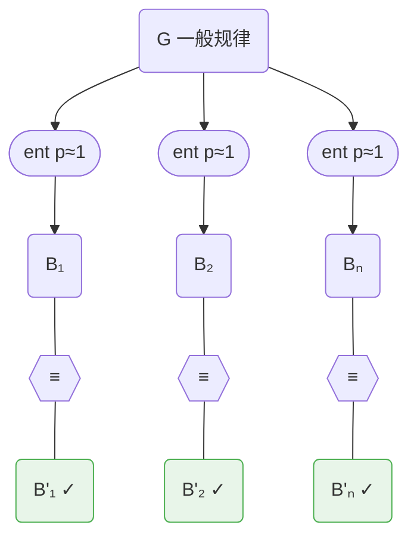
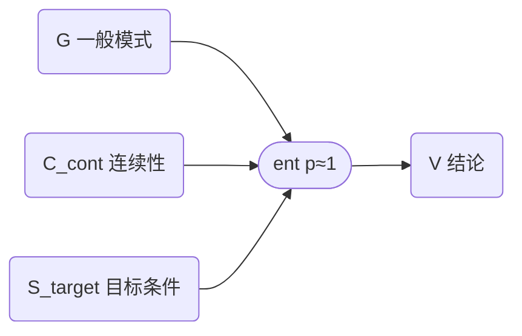
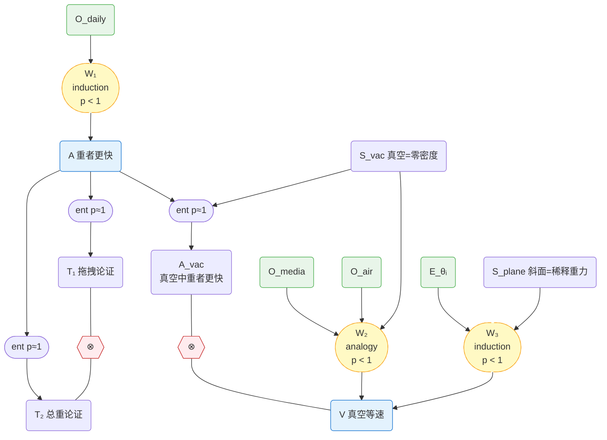
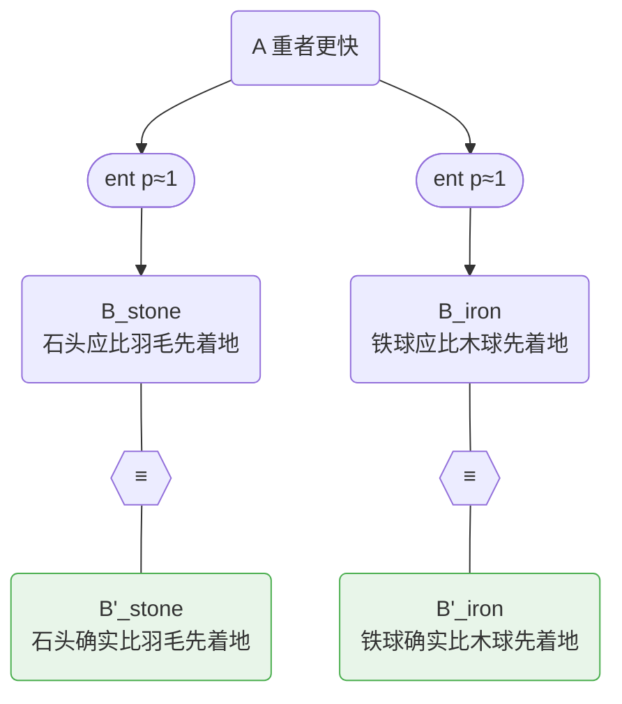
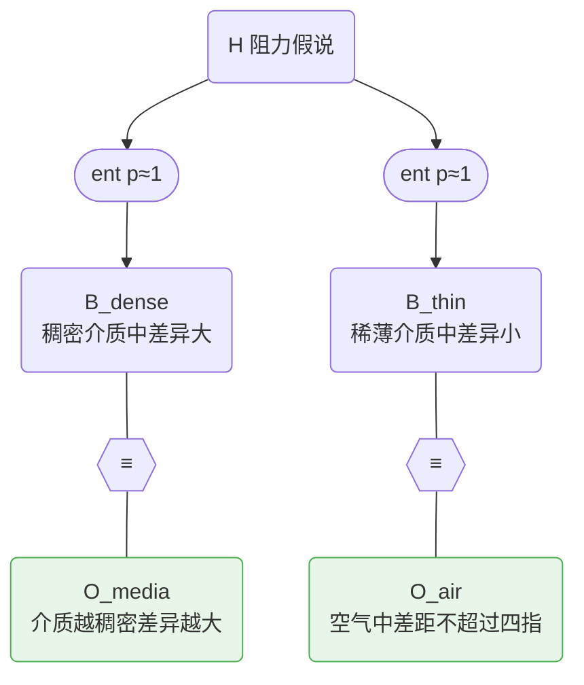
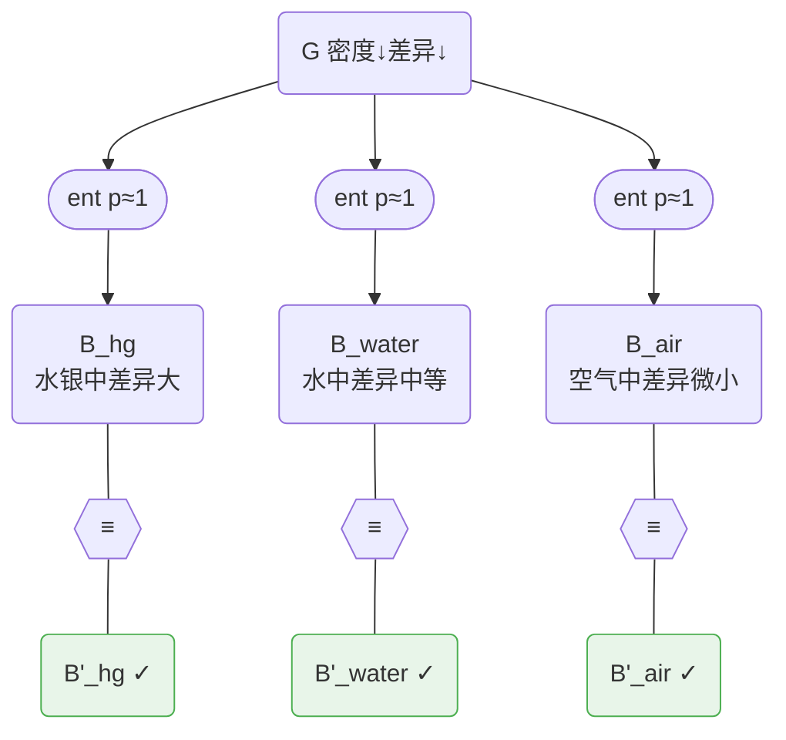
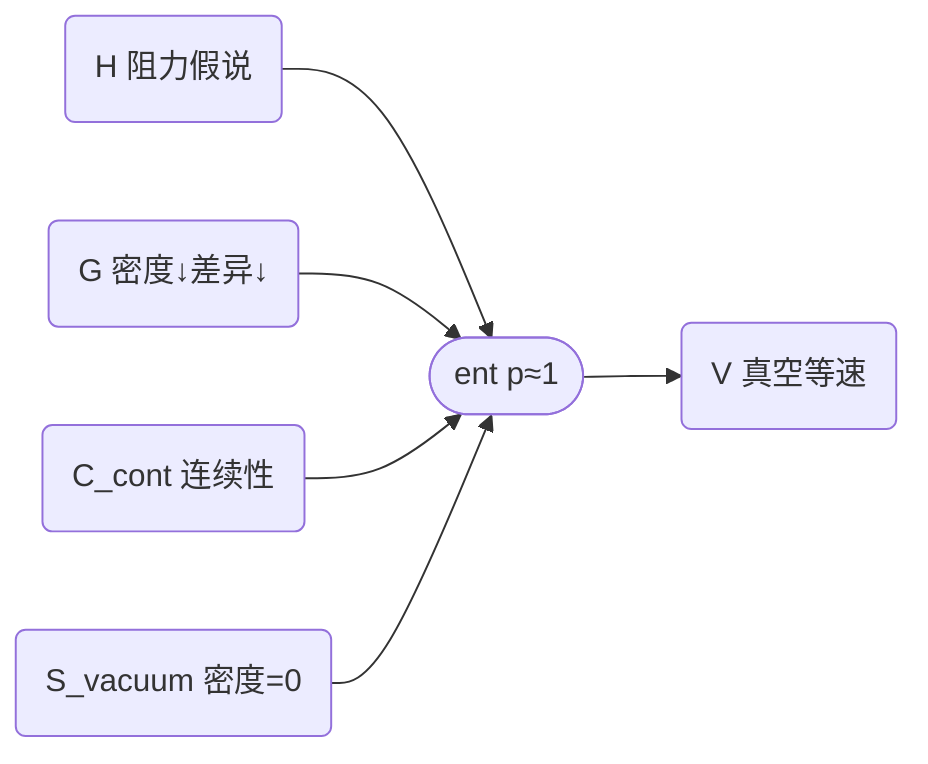
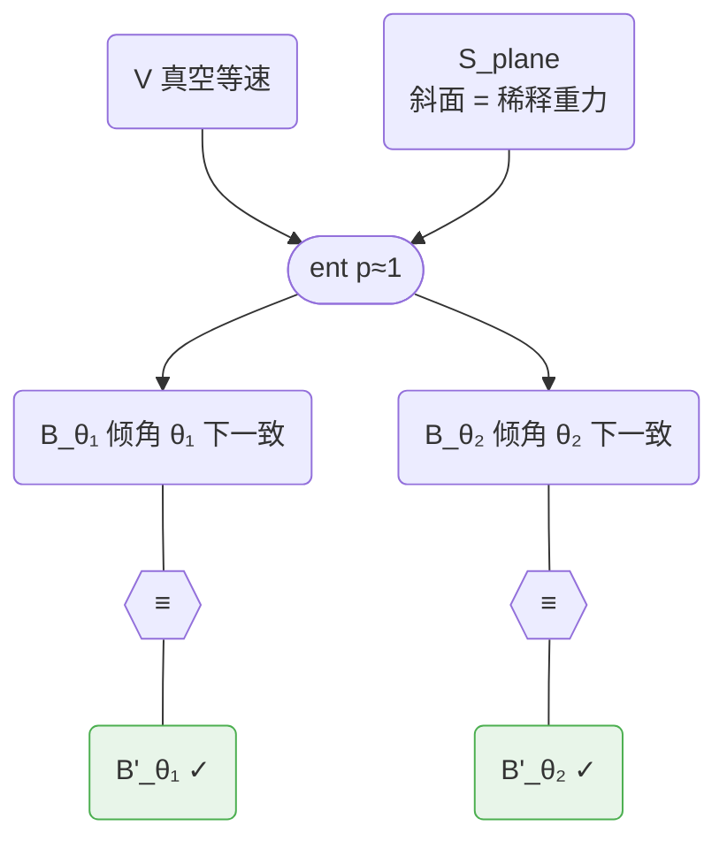
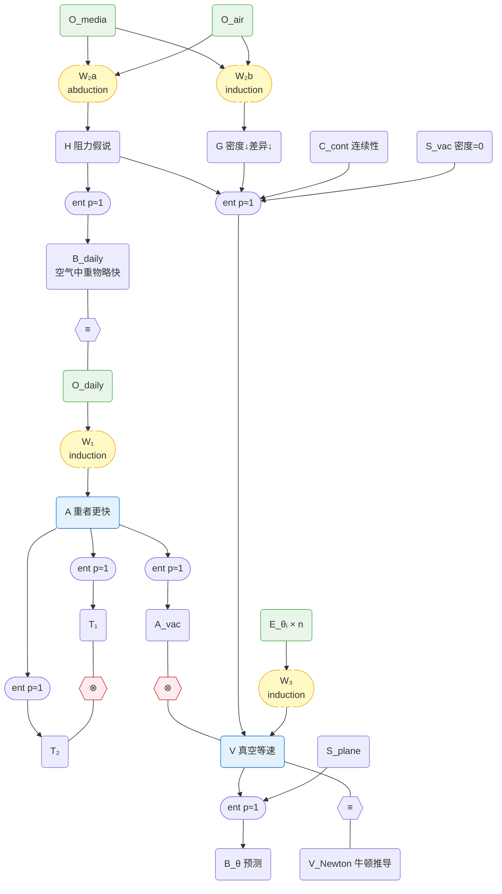

# 科学知识的形式化 — 从自然语言到推理超图

> **Status:** Target design — foundation baseline
>
> 本文档定义如何将科学论述形式化为推理超图，并论证形式化后的条件概率 p 可以趋向客观。
> 前置依赖：
> - [plausible-reasoning.md](plausible-reasoning.md) — 为什么用概率（Cox 定理、Jaynes 框架）
> - [reasoning-hypergraph.md](reasoning-hypergraph.md) — 推理超图的结构（命题、算子、因子图）
> - [belief-propagation.md](belief-propagation.md) — 如何在超图上计算信念（noisy-AND、BP 算法）

## 1. 问题：p 是唯一的主观参数

BP 文档（参见 [belief-propagation.md](belief-propagation.md)）指出，整个推理系统中唯一的主观判断是作者给出的**条件概率 p** — "这条推理有多强"。其他一切要么由理论唯一确定（noisy-AND 模型、Cromwell 下界 ε），要么随网络证据积累而递减（节点先验 π），要么由知识内容本身决定（图结构）。

这引出一个根本问题：**p 能否客观化？** 如果不能，那么整个系统的输出就依赖于个人判断，与传统的专家打分无异。如果能，Gaia 就是一个从科学文本到客观信念的机械推理系统。

本文档论证：通过充分的形式化，所有推理链最终归约为 entailment（p ≈ 1）+ equivalence + contradiction，从而消除 p 作为自由参数。

## 2. Formalization 方法论

形式化分为三步。每一步产生一张图，后一步的图比前一步更精细。

### 2.1 Step 1 — 提取 conclusion 与推理过程

从科学家的自然语言论述（论文、专著、实验报告）中提取：

- **Conclusion（结论节点）**：作者最终要论证的核心断言
- **推理过程中的 claim（变量节点）**：观测、假说、中间推断等。**每个 claim 必须 self-contained** — 不依赖其他 claim 的上下文，单独阅读就能理解

这一步只做提取 — 把自然语言拆成离散的 claim 节点，标注哪些是 conclusion、哪些是中间 claim。同时记录自然语言级别的粗推理脉络（"A 从 B 推出""C 支撑 D"），但不急于确定推理关系的正式类型或布线方向。

### 2.2 Step 2 — 识别弱点，构建粗因子图

对 Step 1 得到的推理过程逐链检查。对于每个 conclusion，找出推理中的**弱点** — 隐含假设、归纳跳跃、溯因猜测等逻辑蕴含之外的步骤。

对每个弱点：

1. **写成独立的 self-contained claim** — 可判真假，不依赖上下文
2. **判断与 conclusion 的依赖关系**：如果这个 claim 为假，conclusion 是否必然不成立？
   - **是** → 标记为 **premise**（前提）。premise 通过 entailment（p ≈ 1）连接到 conclusion
   - **否** → 标记为 **weakpoint**（因子图中的一个 factor node，p < 1）。推理过程中存在尚未充分分解的支撑关系，将在 Step 3 进一步细化

完成这一步后，**粗因子图**已经成形：

- Conclusion 与 premise 之间有 entailment 因子（p ≈ 1）
- Contradiction 和 equivalence 关系已经就位
- 但 weakpoint 处的推理尚未展开 — 从原始证据到 premise 的路径上，存在 p 显著小于 1 的因子

粗因子图忠实反映了当前的形式化程度：conclusion 的 belief 已经部分由网络结构决定，但 weakpoint 意味着部分信念仍依赖于未分解的主观判断。

### 2.3 Step 3 — 细化弱点，消除主观 p

对 Step 2 中的 weakpoint（以及任何 p 显著小于 1 的因子），使用**子图模式**进一步分解。每种弱点对应一个可复用的子图模式，由 entailment + observation + equivalence 组合而成。分解后所有链的 p ≈ 1，不确定性从"推理链的强度"转移到"命题是否为真"。

#### Abduction 模式（溯因）

认识论上，溯因是"观测到 B'，推断最佳解释 A"。在因子图中分解为：

- A：假说（self-contained claim）
- B：从 A 推导出的理论预测（self-contained claim）
- B'：实际观测到的事实（self-contained claim）
- A→B 是 entailment，p ≈ 1（"假说为真时，预期此观测"几乎是假说定义的一部分）
- B 和 B' 内容相近但表述独立，通过 equivalence 连接

BP 效果：B' 的高 belief 通过 equivalence 传递给 B，再通过 entailment 的**反向消息**提升 A 的 belief。

如果存在竞争假说 A'，也会通过 A'→B'' + B''≡B' 连接到同一组观测。BP 的 explaining away 自动处理竞争 — 能解释更多观测的假说获得更高 belief。

#### Induction 模式（归纳）

归纳是"从多个实例推断一般规律"。本质上是**重复的 abduction** — 一般规律是"假说"，每个实例是一个"预测+观测"对：

每个 Bᵢ 和 B'ᵢ 都是 self-contained claim。BP 效果：每个 equivalence 贡献一条反向消息支撑 G。实例越多，G 的 belief 越高。如果某个实例失败（B'ₖ 的 belief 低），对应的 equivalence 不再支撑 G — 系统自动处理反例。

#### Analogy 模式（类比）

类比是"源域的规律外推到目标域"。分解为两部分：

**Part a — Induction 建立模式**：从源域的多个实例归纳出一般模式 G（同上）。

**Part b — Entailment 外推到目标域**：

- **G**: 在不同密度的介质中，密度越低，不同重量物体的下落速度差异越小（一般模式）
- **C_cont**: 物理量随参数连续变化的趋势在极限处保持（显式连续性假设）
- **S_target**: 真空的介质密度为零（目标域条件，setting）
- **V**: 在真空中，不同重量的物体以相同速率下落（目标域结论）

关键：连续性假设 `C_cont` 被显式化为一个独立的 claim。它本身可以被其他证据支撑或质疑 — 有些物理量在极限处不连续（如相变），但在本例中大量证据支持连续外推。不再是一个隐含在 p 值中的模糊判断。

### 2.4 组装：noisy-AND 主链 + 约束

Step 3 的子图输出（A、G、V 等）作为后续推理链的 premise，汇入 noisy-AND 结构的因子图。再加上：

- **Contradiction**：互斥命题之间的约束
- **Equivalence**：不同路径得出相同结论时的约束（包括跨包引用）
- **多条独立路径**：同一命题被多条路径支撑

当所有链的 p ≈ 1 后，系统中剩余的自由度只有原子命题的先验 π。Cox 定理保证：给定网络结构和 p 值，存在唯一的一致性 belief 赋值。当 equivalence 和 contradiction 足够多时，π 的初始选择变得无关紧要（参见 [belief-propagation.md](belief-propagation.md) §5）。

因此：**充分形式化 + 充分约束 → 客观信念**。

## 3. 走通例子：伽利略的落体

### 3.1 原文

**亚里士多德**，*De Caelo* I.6（Stocks 译）：

> "A given weight moves a given distance in a given time; a weight which is as great and more moves the same distance in a less time, the times being in inverse proportion to the weights. For instance, if one weight is twice another, it will take half as long over a given movement."
>
> 一个给定的重量在给定时间内移动给定的距离；一个更大的重量在更短的时间内移动同样的距离，时间与重量成反比。例如，如果一个重量是另一个的两倍，它通过同样的运动所需时间就是一半。

**伽利略**，*Discorsi e Dimostrazioni Matematiche intorno a due nuove scienze*（1638），连球悖论（Crew & de Salvio 译）：

> "If then we take two bodies whose natural speeds are different, it is clear that on uniting the two, the more rapid one will be partly retarded by the slower, and the slower will be somewhat hastened by the swifter. [...] But if this is true, and if a large stone moves with a speed of, say, eight while a smaller moves with a speed of four, then when they are united, the system will move with a speed less than eight; but the two stones when tied together make a stone larger than that which before moved with a speed of eight. Hence the heavier body moves with less speed than the lighter; an effect which is contrary to your supposition."
>
> 如果我们取两个自然速度不同的物体，显然将二者结合后，较快的会被较慢的部分拖慢，较慢的会被较快的部分加速。[……] 但如果这是对的，而且一块大石头以速度八下落、一块小石头以速度四下落，那么将它们绑在一起后，系统的速度将小于八；然而这两块绑在一起的石头比原来速度为八的那块更重。于是更重的物体反而比更轻的运动得更慢——这与你的假设恰恰相反。

**伽利略**，同上，介质观测：

> "I then began to combine these two facts and to consider what would happen if bodies of different weight were placed in media of different resistances; and I found that the differences in speed were greater in those media which were the more resistant."
>
> 于是我开始把这两个事实结合起来，考虑如果将不同重量的物体放入不同阻力的介质中会怎样；我发现，介质阻力越大，速度差异越大。

> "In a medium of quicksilver, gold not merely sinks to the bottom more rapidly than lead but it is the only substance that will descend at all; all other metals and stones rise to the surface and float. On the other hand the variation of speed in air between balls of gold, lead, copper, porphyry, and other heavy materials is so slight that in a fall of 100 cubits a ball of gold would surely not outstrip one of copper by as much as four fingers. Having observed this I came to the conclusion that in a medium totally devoid of resistance all bodies would fall with the same speed."
>
> 在水银介质中，金不仅比铅下沉得更快，而且是唯一能下沉的物质；所有其他金属和石头都浮到表面。另一方面，金球、铅球、铜球、斑岩球及其他重材料球在空气中的速度差异非常微小，以至于从一百腕尺高处落下，金球领先铜球绝不超过四指。观察到这些之后，我得出结论：在完全没有阻力的介质中，所有物体将以相同的速度下落。

**伽利略**，同上，斜面实验（Third Day）：

> "A piece of wooden moulding or scantling, about 12 cubits long, half a cubit wide, and three finger-breadths thick, was taken; on its edge was cut a channel a little more than one finger in breadth; having made this groove very straight, smooth, and polished, and having lined it with parchment, also as smooth and polished as possible, we rolled along it a hard, smooth, and very round bronze ball."
>
> 取一根木条，约十二腕尺长、半腕尺宽、三指厚；在其边缘切出一道略宽于一指的沟槽；将此沟槽打磨得非常直、光滑且抛光，并衬以同样光滑抛光的羊皮纸，然后沿沟槽滚下一个坚硬、光滑且非常圆的青铜球。

> "Having performed this operation and having assured ourselves of its reliability, we rolled the ball only one-quarter the length of the channel; and having measured the time of its descent, we found it precisely one-half of the former. Next, trying other distances, compared with one another and with that of the whole length, and with other experiments repeated a full hundred times, we always found that the spaces traversed were to each other as the squares of the times, and this was true for all inclinations of the plane."
>
> 完成此操作并确认其可靠性后，我们让球只滚过沟槽的四分之一长度；测量其下降时间，恰好是前者的一半。接着尝试其他距离，彼此比较并与全长比较，实验重复了整整一百次，我们始终发现：所经过的距离之比等于时间之比的平方，对斜面的所有倾角都成立。

### 3.2 Step 1 — 提取 conclusion 与推理过程

**Conclusion：**

| 节点 | 内容（self-contained） | 来源 |
|------|----------------------|------|
| **A** | 物体下落速度与其重量成正比：重物比轻物下落更快 | 亚里士多德 |
| **V** | 在真空（无阻力）环境中，不同重量的物体以相同速率下落 | 伽利略 |

**推理过程中的 claim：**

| 节点 | 内容（self-contained） | 类别 |
|------|----------------------|------|
| **O_daily** | 日常生活中，石头比羽毛下落更快，铁球比木球更快 | 观测 |
| **O_media** | 在不同介质中比较轻重物体的下落，介质越稠密，速度差异越明显；越稀薄，差异越不明显 | 观测 |
| **O_air** | 在空气中，金球、铅球、铜球等重材料球从 100 腕尺落下，金球领先铜球不超过四指 | 观测 |
| **T₁** | 假设重物下落更快，将重球 H 与轻球 L 绑在一起，L 拖拽 H，复合体 HL 的速度应慢于 H 单独下落 | 推导 |
| **T₂** | 假设重物下落更快，复合体 HL 的总重量大于 H，因此 HL 的速度应快于 H 单独下落 | 推导 |
| **E_θᵢ** | 在斜面倾角 θᵢ 下，不同重量的光滑球沿抛光沟槽滚下，所经距离之比等于时间之比的平方，与球的重量无关 | 实验观测 |
| **S_vac** | 真空是完全没有阻力的介质（介质密度为零） | setting |
| **S_plane** | 斜面沟槽经抛光处理，衬以羊皮纸，使用坚硬光滑的青铜球 — 摩擦和空气阻力可忽略 | setting |

**粗推理脉络**（自然语言级别，尚未确定正式推理类型）：

- 亚里士多德认为 O_daily 支撑 A — "a weight which is as great and more moves the same distance in a less time"（*De Caelo* I.6）
- 伽利略从 A 推出 T₁ 和 T₂，指出二者矛盾 — "the heavier body moves with less speed than the lighter; an effect which is contrary to your supposition"（*Discorsi*，连球悖论）
- 伽利略从 O_media + O_air 推出 V — "in a medium totally devoid of resistance all bodies would fall with the same speed"（*Discorsi*，介质观测）
- 伽利略用斜面实验 E_θᵢ 支撑 V — "the spaces traversed were to each other as the squares of the times, and this was true for all inclinations of the plane"（*Discorsi*，斜面实验）
- A 与 V 不兼容

### 3.3 Step 2 — 识别弱点，构建粗因子图

#### Conclusion A（亚里士多德）

| 因子 | 连接 | 推理 | 类型 | p |
|------|------|------|------|---|
| **W₁** | O_daily → A | 日常经验中重物比轻物落得快，因此速度与重量成正比 | **weakpoint** | < 1 |
| f_A→T₁ | A → T₁ | 若重物更快，轻球拖拽重球，复合体应比重球更慢 | entailment | ≈ 1 |
| f_A→T₂ | A → T₂ | 若重物更快，复合体更重，应比重球更快 | entailment | ≈ 1 |
| ⊗ | T₁ ↔ T₂ | 同一复合体不能同时比重球更快和更慢 | contradiction | — |
| f_A→A_vac | A + S_vac → A_vac | 若速度∝重量是普遍规律，应用于真空（S_vac）则重者更快 | entailment | ≈ 1 |
| ⊗ | A_vac ↔ V | "真空中重者更快"与"真空中等速下落"互斥 | contradiction | — |

A_vac（"在真空中也应重者更快"）是将 A 的普遍规律应用于真空的推论。

A 是从日常观测直接归纳的规律，唯一支撑来自 W₁（归纳跳跃）。A 受到两重打击：T₁ ⊗ T₂（连球悖论，纯逻辑反驳）和 A_vac ⊗ V（与伽利略结论冲突，经验反驳）。T₁ ⊗ T₂ 的解决指向需要一个阻力机制 — 这正是 Step 3 中 W₂ 展开后的 H。

#### Conclusion V（伽利略）

V 有两条独立的支撑路径，各包含一个 weakpoint。

| 因子 | 连接 | 推理 | 类型 | p |
|------|------|------|------|---|
| **W₂** | O_media + O_air + S_vac → V | 介质越稀薄速度差异越小，推到极限（S_vac，真空）差异应为零 | **weakpoint** | < 1 |
| **W₃** | E_θᵢ + S_plane → V | 斜面实验中 s∝t² 与球的重量无关，对所有倾角成立 | **weakpoint** | < 1 |

**W₂**（analogy）：从有限密度介质下的观测外推到零密度极限。S_vac（真空=零密度）是 analogy 的目标条件。整体推理的 p < 1，因为内部包含 induction。Step 3 展开后，entailment 步骤会额外引入 C_cont（连续性假设）作为 premise。

**W₃**（induction）：从多组斜面实验归纳支撑 V。S_plane（斜面=稀释重力）是 premise。

A_vac ⊗ V 的矛盾来源已在 Conclusion A 中通过 A_vac 显式推导。

#### 粗因子图

**图例**：椭圆(stadium) = factor node；六边形 = binding（≡/⊗）；圆角矩形 = variable node（claim）。绿色 = 观测；蓝色 = conclusion；黄色虚线 = weakpoint（p < 1，待 Step 3 细化）；红色 = contradiction。

三个 weakpoint 因子（W₁–W₃）的 p < 1 — 这正是 Step 3 要分解的目标。

### 3.4 Step 3 — 细化 weakpoint（将 factor node 展开为子图）

#### W₁：日常观测 → A（Induction 模式）

A 是"假说"，日常观测是它的"预测+观测"对：

BP 效果：两个 observation 的高 belief 通过 equivalence + 反向消息提升 A。但这只有两个实例，支撑有限。

#### W₂：介质观测 → V（Analogy 模式）

W₂ 是一个 analogy — 从有限介质密度下的观测外推到零密度（真空）极限。按 §2.3 的 analogy 模式，分解为 abduction + induction + entailment 三部分。

**Part a — Abduction：O_media + O_air → H**

H（"速度差异由阻力造成"）是假说，介质观测是它的预测+观测对：

BP 效果：O_media 和 O_air 的高 belief 通过 equivalence + 反向消息提升 H。

**Part b — Induction：O_media + O_air → G**

G（"密度↓差异↓"）是一般模式，各介质条件下的观测是实例：

**Part c — Entailment：H + G + C_cont + S_vac → V**

H 和 G 的 belief 被观测提升后，主链完全由 entailment（p≈1）构成：

C_cont 是一个显式前提，而非隐藏在 p 值中的模糊假设。它可以被其他证据支撑（大量物理学连续性先例）或质疑（相变等不连续情况）。

**H 的双重角色 — explaining away O_daily**

W₂ 展开后，H 不仅通过 analogy 支撑 V，还能解释 A 的观测基础 O_daily：

H 预测：在空气中，阻力对轻物的相对影响更大，因此重物下落略快 — 这正是 O_daily 观测到的现象。于是 O_daily 有两个竞争解释：A（速度∝重量，但推出 T₁ ⊗ T₂ 矛盾）和 H（阻力差异，无矛盾且同一假说还支撑 V）。BP 的 explaining away 自动偏好 H — H 解释了 O_daily 为什么看起来支持 A，同时揭示 A 只是表象。

#### W₃：斜面实验 → V（Induction 模式）

V 是"假说"，每个斜面实验条件是一个预测+观测对：

注意 S_plane 是显式前提："斜面是稀释的重力"这个力学关系使得从 V 到具体实验预测的 entailment 成立。没有 S_plane，V 不直接蕴含斜面上的实验结果。

BP 效果：100 次实验 × 所有倾角 × 多种材料 = 大量 equivalence，每个贡献一条反向消息支撑 V。

### 3.5 组装与 belief 收敛

将三个 weakpoint 的子图输出汇入完整的因子图：

**三条独立路径通向 V：**

1. **逻辑路径**：A → T₁ + T₂ → contradiction → A 的 belief 被压低；A → A_vac ⊗ V → A 低则 V 获得间接支撑
2. **观测路径**：W₂ 展开为 abduction(→H) + induction(→G) + entailment(H+G+C_cont+S_vac→V)
3. **实验路径**：W₃ 展开为 induction — 大量斜面实验观测通过反向消息直接支撑 V

**H 的双重角色（explaining away）：**

W₂ 展开后，H 不仅支撑 V（通过 analogy），还通过 H → B_daily ≡ O_daily 解释了日常观测。O_daily 同时被 A 和 H 竞争解释 — A 推出 T₁ ⊗ T₂ 矛盾，H 无矛盾且还支撑 V。BP 自动偏好 H。

**约束关系：**

- **Contradiction**：A_vac ⊗ V — A 的普遍规律在真空中的推论与 V 互斥（先验反驳 T₁ ⊗ T₂ 之外的后验反驳）
- **Equivalence**（跨包）：V ≡ V_Newton — 牛顿从 F=ma + F=mg 推导得 a=g，与伽利略的 V 是同一结论的不同推导路径

**BP 收敛结果：**

- A 被两重打击：T₁ ⊗ T₂（先验逻辑反驳）+ A_vac ⊗ V（后验经验反驳），同时 W₁ 的日常观测被 H explaining away → A 的 belief 趋向 ε
- H 被 W₂a 的介质观测支撑，又通过 explaining away 接管 O_daily → belief 高
- V 被三条独立路径同时支撑 + 跨包 equivalence → belief 趋向 1-ε
- π 的初始值无关紧要 — 多条独立证据链的因子消息远比 π 强

**所有链的 p ≈ 1**。不确定性不在推理链的强度中，而在原子命题的真值中。而原子命题的真值由网络拓扑和约束关系唯一决定。

## 4. 为什么 p 可以客观化

### 4.1 所有推理归约为 entailment + equivalence + contradiction

通过 §2.3 的三种子图模式：

| 原始推理类型 | 归约为 | p 值 |
|------------|-------|------|
| entailment | 不变 | ≈ 1（逻辑蕴含） |
| abduction | entailment + observation + equivalence | ≈ 1（假说→预测是蕴含） |
| induction | 重复 abduction | ≈ 1（规律→实例是蕴含） |
| analogy | induction + entailment（显式连续性前提） | ≈ 1（模式+条件→结论是蕴含） |
| contradiction | 不变 | 结构约束 |
| equivalence | 不变 | 结构约束 |

归约后，p 不再是自由参数 — 它在每条 entailment 链上都接近 1。如果某条 entailment 的 p 确实不接近 1，说明前提中还有隐含假设未显式化。将其显式化为新的 claim 节点，直到 p 真正接近 1。

### 4.2 Cox 定理 + 充分约束 → 唯一 belief

Cox 定理（参见 [plausible-reasoning.md](plausible-reasoning.md)）保证：在满足一致性条件的前提下，给定信息 I，每个命题的合理性 P(A|I) 是唯一确定的。

当推理超图中：

1. **所有推理链的 p ≈ 1**（通过归约为 entailment 实现）
2. **存在足够多的 equivalence 和 contradiction**（科学知识的内在约束）
3. **存在多条独立路径指向同一命题**（科学验证的标准实践）

那么 π 的影响被因子消息淹没（参见 [belief-propagation.md](belief-propagation.md) §5），belief 收敛到由网络拓扑唯一决定的值。**充分的形式化消除了参数选择的任意性，使得 belief 成为知识结构的客观函数。**

### 4.3 与科学实践的对应

| 形式化步骤 | 科学实践 |
|-----------|---------|
| Step 1：提取 conclusion 与 self-contained claim | 要求论文中每个论断清晰、独立、可验证 |
| Step 2：识别弱点，区分 premise 与 weakpoint | 同行评审质疑论证中的薄弱环节，判断哪些是核心假设 |
| Step 2：weakpoint 作为因子图中的 factor node | 审稿人要求论证结构清晰，标注每处推理的确定性 |
| Step 3：分解 weakpoint 为 entailment + equivalence 子图 | 要求作者给出假说的可测预测，并与实际观测对照 |
| Step 3：显式化隐含前提（如连续性假设） | 审稿人要求作者明确假设和适用条件 |
| 添加竞争假说 | 要求讨论替代解释（alternative explanations） |
| 多路径 + contradiction + equivalence | 独立实验室复现、不同方法得到相同结论 |
| π 被因子消息淹没 | 科学共识从证据结构中涌现，而非从个人先验中产生 |

科学进步，在 Gaia 的视角下，就是**持续的 formalization 精炼** — 每一代科学家将上一代遗留的弱点分解为更精细的 entailment + equivalence 结构，添加更多约束关系，使得信念越来越由证据结构决定而非由个人判断决定。

## 参考文献

- Aristotle. *De Caelo*, Book I, Part 6. Trans. J.L. Stocks (Oxford, 1922)
- Aristotle. *Physics*, Book IV, Part 8. Trans. R.P. Hardie & R.K. Gaye (Oxford, 1930)
- Galileo Galilei. *Discorsi e Dimostrazioni Matematiche intorno a due nuove scienze* (1638). Trans. H. Crew & A. de Salvio (Macmillan, 1914)
- Jaynes, E.T. *Probability Theory: The Logic of Science* (2003)
- Cox, R.T. "Probability, Frequency, and Reasonable Expectation" (1946)
