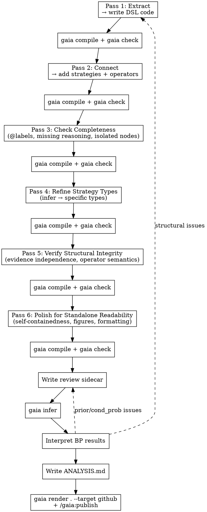
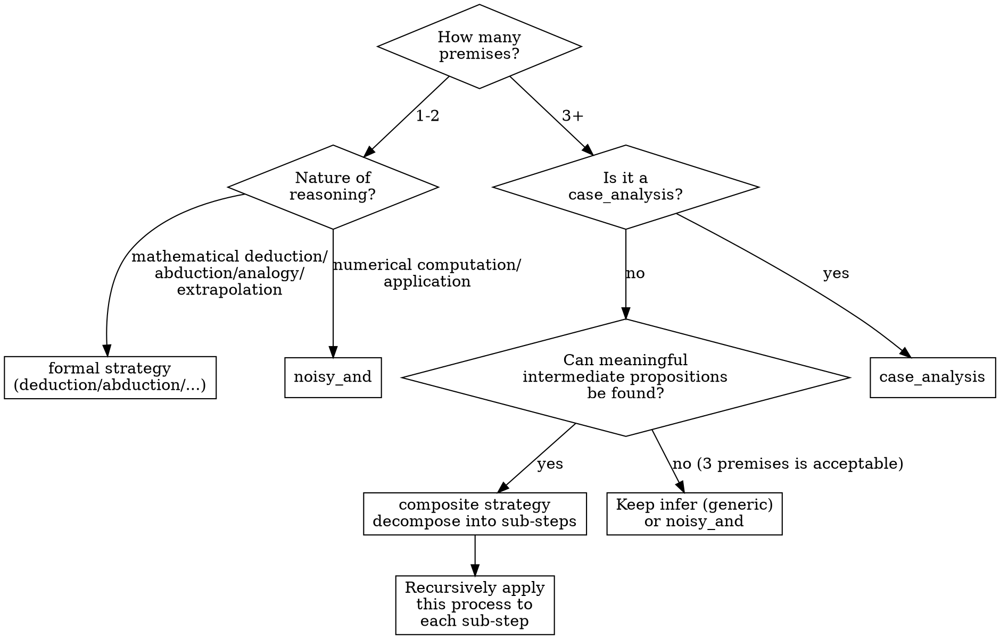

# Knowledge Formalization

Extract the knowledge structure from a source (scientific paper, textbook, technical report, etc.) into a Gaia knowledge package with claims, reasoning strategies, and review sidecars.

**REQUIRED:** Use **gaia-cli** skill for CLI commands (compile, check, infer, register) and **gaia-lang** skill for DSL syntax (claim, setting, strategies, operators).

## Overview

Formalization is a **six-pass** process. Each pass builds on the previous one. Do NOT skip passes or combine them.

**Key principle: Formalization is incremental.** After completing each pass, write code, compile, and check. Do not wait until all passes are done before writing code. Feedback from `gaia compile` and `gaia check` is critical input for the next pass.



| Pass | Focus | Core question |
|------|-------|---------------|
| 1 | Content extraction | Are claims/settings extracted? Atomic? |
| 2 | Reasoning connections | Are strategies, operators, and contradictions modeled? |
| 3 | Content completeness | Any missing premises, orphans, or @label errors? |
| 4 | Strategy precision | Are strategy types correct (noisy_and/abduction/induction/...)? |
| 5 | Structural integrity | Is evidence independent? Are operator semantics correct? |
| 6 | Standalone readability | Can a reviewer understand everything without the original source? |

## Scope

Formalize the **complete** source — not just the main result. A partial formalization leaves reasoning gaps: premises without support, alternatives without comparison, intermediate steps without justification. If the source is too large (e.g., a full textbook), formalize one chapter at a time, each as a separate Gaia package.

## Pass 0: Prepare Artifacts

Copy the original source materials into the package's `artifacts/` directory:

```
my-package-gaia/
├── artifacts/              # Original source materials
│   ├── paper.pdf           # PDF original, or
│   ├── paper.md            # markdown version, or
│   └── chapter3.md         # textbook chapter, etc.
├── src/
│   └── my_package/
│       ├── __init__.py
│       ├── motivation.py
│       └── ...
└── pyproject.toml
```

Note: `gaia init` does not create the `artifacts/` directory. Create it manually: `mkdir artifacts/`

Both PDF and markdown formats are supported. Throughout the formalization process, always refer back to the originals in `artifacts/` to ensure that numbers, formulas, and reasoning steps are consistent with the source material.

## Pass 1: Extract Knowledge Nodes

Read the source **section by section**. For each section, identify:

| Type | Criterion | Examples |
|------|-----------|---------|
| **setting** | Background facts that cannot be questioned | Mathematical definitions, formal setups, fundamental principles |
| **claim** | Propositions that can be questioned or falsified | Computation results, theoretical derivations, predictions, experimental observations |
| **question** | Questions to be answered | Research questions |

### Organizing by Module

Each section corresponds to a Gaia module (Python file):

- Introduction → `motivation.py`
- Section II → `s2_xxx.py`
- ...

The module's docstring serves as the section heading. Each knowledge node should have a `title` parameter.

### Place Knowledge in the Earliest Module

Each knowledge node belongs in the module corresponding to the section where it **first appears** in the source. Content from the Introduction goes into `motivation.py`.

Claims in motivation can be freely referenced as premises or background by later modules — they are not restricted by module membership. Settings and questions are typically referenced via `background=`.

### Setting vs Claim Classification Guide

**Principle: When in doubt between setting and claim, mark it as claim.**

| Category | Type | Examples |
|----------|------|---------|
| Mathematical definitions / formal setups | **setting** | Coordinate system choice, variable decomposition definitions, mathematical form of potentials |
| Established fundamental principles | **setting** | Conservation laws, exclusion principle, laws of thermodynamics |
| Standard approximation/method definitions (without applicability assertions) | **setting** | Mathematical expression of an approximation (definition only, not asserting applicability) |
| Whether applicability conditions hold | **claim** | Whether a certain approximation is applicable to a specific system |
| Theoretical frameworks dependent on conditions | **claim** | Theorem B holds when A is satisfied |
| Theoretical derivation results | **claim** | Renormalization relations, scaling laws, asymptotic behavior |
| Numerical computation results | **claim** | Values obtained from computational methods |
| Experimental observations | **claim** | Experimental measurements |

**Key criterion:** Can this proposition be questioned? If yes → claim. Only mathematical definitions and formal setups qualify as settings.

**Distinguish definitions from assertions:** The mathematical definition of an approximation is a setting, but "this approximation is unreliable under certain conditions" is a claim. "Decompose the variable into high- and low-frequency parts" is a setting (mathematical operation), but "the contribution of the high-frequency part is negligible" is a claim (physical assertion).

**Dependency chains:** If A is a setting and B depends on A being true while containing a physical assertion — B is typically a claim.

Content that the source itself derives — even if the derivation is rigorous — should be a claim, because the derivation process itself may contain errors.

### Content Format

Claim content supports **markdown**. Use it for structure:
- Tables: markdown tables for structured data
- Math: `$...$` for inline, `$$...$$` for display equations
- Lists: bullet points for enumerating conditions or items
- Bold/italic: for emphasis on key values or terms

### Atomicity Principle

Each claim must be an **atomic proposition** — one claim expresses one thing.

**Core rule: Theoretical predictions must be separated from experimental results.**

```python
# BAD: Mixing theory and experiment
result = claim("The model predicts X, the experimental value is Y, deviation Z%.")

# GOOD: Separated into independent claims
prediction = claim("Based on method XX, the model predicts a certain quantity as X.", title="Model prediction")
experiment = claim("The experimental measurement of a certain quantity is Y.", title="Experimental value")
```

Similarly, **method descriptions** and **method application results** should be separated:

```python
# BAD: Method and result mixed together
result = claim("Using method XX to compute YY yields ZZ.")

# GOOD: Separated
method = claim("Method XX employs ... strategy ...", title="Method description")
result = claim("The numerical result for YY is ZZ +/- delta.", title="Numerical result")
```

### Theory-Experiment Comparison → Abduction

**Note:** This pattern is applied during Pass 2 (Connect), not Pass 1. It is documented here because the observation/hypothesis/alternative structure influences how you extract knowledge nodes in Pass 1.

When a theoretical prediction is compared with experimental data, use the **abduction** pattern:

- **observation**: experimental result
- **hypothesis**: prediction from the new theory
- **alternative**: prediction from the conventional/existing theory (alternative explanation)

```python
# abduction must provide an alternative (alternative theory)
_strat = abduction(
    observation=experimental_value,
    hypothesis=new_theory_prediction,
    alternative=old_theory_prediction,  # conventional theory as alternative explanation
    reason="The new theory's deviation is only X%, far better than the old theory's Y% deviation.")
```

**Note:** `abduction()` returns a Strategy (not a Knowledge). You must assign the return value to a variable (e.g., `_strat`) so it can be referenced in the review sidecar.

**`induction` requires explicit `alt_exps`.** When using `induction([obs1, obs2, ...], law)`, always provide the `alt_exps` parameter with one alternative per observation. Without `alt_exps`, the compiler auto-generates anonymous alternatives that are difficult to reference in the review sidecar.

```python
# CORRECT: explicit alternatives for each observation
alt1 = claim("Alternative explanation for obs1")
alt2 = claim("Alternative explanation for obs2")
induction([obs1, obs2], law, alt_exps=[alt1, alt2], reason="...")

# AVOID: auto-generated alternatives are hard to review
induction([obs1, obs2], law, reason="...")
```

**Semantics of pi(Alt) -- critical:** In abduction, the prior pi(Alt) of the `alternative` represents: **"the probability that Alt alone can explain Obs without H"** -- not whether Alt's calculation is correct.

For example: If Obs = "experimental Tc = 1.2K" and Alt = "phenomenological theory predicts Tc = 1.9K", then although Alt's calculation itself is not wrong (the calculation indeed gives 1.9K), 1.9K cannot explain the observation of 1.2K. Therefore pi(Alt) should be **low** (e.g., 0.3), rather than high just because "the calculation is correct."

**Rule of thumb:** If pi(Alt) >= pi(H), it means the alternative theory's explanatory power is no weaker than the hypothesis -- this either means the abduction provides weak support for H, or pi(Alt) has been overestimated. The reviewer should examine carefully.

### Figures and Tables

When the source contains figures or tables with important data:

**Tables:** Use markdown table format in the claim content. The claim must be self-contained — a reviewer should not need to open the original.

```python
tc_data = claim(
    "Measured superconducting transition temperatures:\n\n"
    "| Material | $T_c$ (K) | Pressure (GPa) |\n"
    "|----------|-----------|----------------|\n"
    "| LaH10    | 250       | 200            |\n"
    "| H3S      | 203       | 150            |\n"
    "| YH6      | 224       | 166            |",
    title="Tc measurements",
    metadata={"source_table": "artifacts/paper.pdf, Table 2"},
)
```

**Figures:** Describe the key quantitative information (values, trends, comparisons) in the claim content. Reference the original figure in metadata for traceability.

```python
phase_diagram = claim(
    "The Tc vs pressure curve shows a dome shape with maximum Tc = 250K at 200 GPa, "
    "decreasing to 200K at 250 GPa and 180K at 150 GPa.",
    title="Tc-pressure phase diagram",
    metadata={
        "figure": "artifacts/images/fig3.png",
        "caption": "Fig. 3 | Tc-pressure phase diagram showing dome-shaped dependence.",
    },
)
```

**Key principle:** The claim content carries all information needed for judgment. The metadata figure/table reference is for traceability, not for conveying information.

### Content Must Be Self-Contained

Each node's content must be a complete, independently understandable proposition. A reviewer reading it should not need additional context to make a judgment.

```python
# BAD: Requires context to understand
result = claim("The computed result significantly exceeds conventional estimates.")

# GOOD: Self-contained proposition
result = claim(
    "Using method XX to compute YY under condition ZZ yields A +/- delta, "
    "compared to the estimate B from conventional method WW, a deviation of approximately C-fold.",
    title="Result description",
)
```

### Pass 1 Reflection

After extracting all modules, ask yourself:

- **Theory vs experiment separated?** For every result where the source compares theory to experiment, do I have separate claims for the theoretical prediction and the experimental measurement? If they're mixed in one claim, I can't use abduction in Pass 2.
- **Figures and tables transcribed?** Are all key numerical values from figures and tables written into claim content (not just referenced)?
- **Each claim independently judgeable?** Can a reviewer assess each claim without reading any other claim?
- **Contradictory claims identified?** When the source argues "A succeeds where B fails," or compares competing methods/hypotheses, have I extracted both sides as separate claims? These pairs will become `contradiction()` operators in Pass 2, providing strong BP constraints.

### Marking Exported Conclusions

The source's **core contributions** (new theoretical results, new numerical computation results, new experimental findings, key arguments) should be marked as exported conclusions in `__all__`. These are this knowledge package's external interface -- other packages can reference them.

Criterion: If this result were removed from the source, the source would lose its core value.

### Pass 1 Deliverable

One claim/setting/question list per module.

Pass 1 only extracts atomic, self-contained knowledge nodes. **Do not prejudge which are "derived conclusions"** -- whether a claim is an independent premise or a derived one depends on how reasoning connections are established in Pass 2, not on the claim itself.

## Pass 2: Connect -- Write Infer Strategies

`infer` is the **most general** strategy type in Gaia -- it does not presume any specific reasoning pattern (such as deduction, abduction), and merely expresses "from premises, derive conclusion." Pass 2 uses `infer` as the draft form for all reasoning connections; specific strategy types are refined in Pass 4.

In Pass 4, most `infer` calls should be refined to specific strategy types (`noisy_and`, `deduction`, `abduction`, etc.). If no specific type fits, `infer` can remain as the final type -- but note that `infer` requires a full CPT (2^N conditional probabilities) in the review sidecar, which is more work than `noisy_and` (single value). Prefer `noisy_and` when all premises are jointly necessary.

For each claim "supported by other claims," write an `infer` strategy (which claims need a strategy is determined case-by-case in Pass 2 -- if the source provides an argument for it, it needs one):

1. **Write a detailed reason**: Summarize the derivation process from the source -- not a one-sentence summary, but a complete reasoning chain. The reason should enable a domain reader to understand "why these premises lead to this conclusion."

2. **Identify premises and background**:
   - **Claims** used in the derivation → `premises`
   - **Settings/questions** used in the derivation → `background`

### Use @label References in Reasons

In the reason text, use `@label` syntax to explicitly reference knowledge nodes used in the derivation:

```python
reason=(
    "Based on the XX framework (@framework_claim), under condition YY (@condition_claim), "
    "conclusion ZZ can be derived. The derivation uses the property of WW (@property_setting)."
)
```

Nodes referenced by `@label` must appear in the strategy's `premises` or `background` list. This is verified in Pass 3.

### Key Point for Pass 2: Do Not Miss Implicit Premises

Sources often have implicit premises. When writing the reason, if you discover the derivation depends on a knowledge node already extracted in Pass 1, be sure to add it to premises or background and reference it with `@label` in the reason.

### Model Contradictions and Complements

After writing strategies, model logical constraints between claims using operators. These claim pairs were identified in Pass 1 Reflection; now formalize them.

**Key distinction — get this right, it matters for BP:**

- `contradiction(a, b)` = NOT (A AND B): both cannot be true, but both CAN be false
- `complement(a, b)` = A XOR B: exactly one must be true (exhaustive + mutually exclusive)

**When to use `contradiction()`:** The source argues two claims are incompatible — they cannot both hold. Example: two competing hypotheses about a mechanism, where accepting one rules out the other, but a third option might exist.

```python
# Correct: these are genuinely mutually exclusive
not_both = contradiction(
    claim("The pairing mechanism is phonon-mediated"),
    claim("The pairing mechanism is magnon-mediated"),
    reason="Phonon and magnon mechanisms produce incompatible signatures; the data matches only one.",
)
```

**When to use `complement()`:** Exactly two exhaustive, mutually exclusive options. One MUST be true.

```python
# Correct: exhaustive binary
one_of = complement(
    claim("RFdiffusion outperforms Hallucination on this benchmark"),
    claim("Hallucination outperforms or matches RFdiffusion on this benchmark"),
    reason="On the same benchmark with the same metric, one must be better or equal.",
)
```

**When NOT to use either:** Two claims that are "in tension" but can both be true. Example: "comprehensive improvement across all areas" and "enzyme scaffolding lacks experimental validation" — both can be true (comprehensive improvement does not require every area to have wet-lab validation). Do NOT model these as `contradiction()`. Flag them in the Critical Analysis as unmodeled tensions instead.

Contradictions and complements are especially valuable in BP because they create strong coupling between nodes — when one side's belief goes up, the other must go down. But a **wrong** contradiction silently distorts all downstream beliefs, so always verify semantics in Pass 5.

### Pass 2 Reflection

Before moving to Pass 3, verify:

- **Theory-experiment pairs use abduction?** Every place the source compares a theoretical prediction against an experimental observation should be connected via `abduction(observation=exp, hypothesis=theory, alternative=old_theory)`, not `noisy_and` or `infer`. The relationship is explanatory ("which theory better explains the data?"), not inferential ("premises imply conclusion").
- **Multiple observations → one law use induction?** If several independent observations all support the same general rule, use `induction([obs1, obs2, ...], law)`, not a flat `noisy_and` with all observations as premises.
- **No missing alternatives?** Every abduction should have a meaningful alternative — what would explain the observation if the hypothesis were wrong?
- **Contradictions modeled?** Every contradictory claim pair identified in Pass 1 should now have a `contradiction()` operator. Also check: did any new contradictions emerge while writing strategies?

## Pass 3: Check Completeness

**Prerequisite:** Code from Pass 1-2 has been written and passes `gaia compile` and `gaia check`. Pass 3 combines `gaia check` feedback with manual review.

### 3a. Check @label Reference Consistency

Review each infer strategy's reason one by one:

1. **Re-read the reason**: Carefully read every sentence in the reason
2. **Check @label coverage**: Every `@label` in the reason must appear in premises or background
3. **Reverse check**: Every node in premises/background should be referenced by `@label` in the reason (otherwise, why is it a premise?)
4. **Check if additional knowledge is needed**: If the reason mentions an important fact without a corresponding `@label`, go back to Pass 1 to add it

### 3b. Check for Claims Missing Reasoning

Use the output of `gaia check` to see if any claim should have reasoning support but lacks a strategy:

- `gaia check` reports claims that are not the conclusion of any strategy (i.e., leaf nodes)
- Review each leaf node: Is it truly an independent premise? Or should it have an infer strategy?
- Criterion: If the source provides an argument for this claim (not just a statement), it should have a strategy

### 3c. Check for Isolated Nodes

- Are there claims that are neither a premise/background of any strategy nor a conclusion of any strategy?
- Isolated nodes indicate they do not participate in the reasoning graph -- either they should not exist, or a strategy referencing them was missed

The most common mistake at this step is **assuming certain knowledge does not need explicit references**. In Gaia, if the reasoning process depends on a fact, that fact must be a node in the knowledge graph.

## Pass 4: Refine Strategy Types

Passes 2-3 produce generic `infer` strategies. Pass 4 refines each `infer` into a specific strategy type.

### Complete Strategy Reference

| Strategy | Semantics | When to use | Review needs |
|----------|-----------|-------------|--------------|
| `noisy_and` | All premises jointly support conclusion with probability p | Default for "premises imply conclusion" with uncertainty | `conditional_probability` (single float) |
| `deduction` | If all premises true, conclusion necessarily true | Strict math proofs, logical syllogisms, definitions | None (deterministic) |
| `abduction` | Observation best explained by hypothesis over alternative | Theory-experiment comparison, inference to best explanation | Prior on alternative claim |
| `induction` | Multiple independent observations → general law. Internally a composite of abductions: each observation abduces the law against its own alternative. This is why (a) each observation needs an `alt_exps` entry and (b) observations must be independent (Pass 5). | Repeated experimental confirmations across conditions | Per-observation alternative (`alt_exps`) |
| `analogy` | Source + structural similarity → target | Cross-system reasoning ("works for A, similar to B, so works for B") | None (auto-formalized) |
| `extrapolation` | Source + continuity → target | Predicting beyond measured range | None (auto-formalized) |
| `elimination` | Exhaustive options + excluded candidates → survivor | Process of elimination | None (auto-formalized) |
| `case_analysis` | Exhaustive cases, each implies conclusion → conclusion | Proof by cases | None (auto-formalized) |
| `mathematical_induction` | Base case + inductive step → for-all law | Inductive proofs in mathematics | None (auto-formalized) |
| `composite` | Hierarchical: sub-strategies compose into one argument | Complex reasoning with meaningful intermediate steps | Review leaf sub-strategies only |
| `infer` | General CPT with 2^N entries | Last resort when no specific type fits | `conditional_probabilities` (2^N floats) |

Also available as **operators** (modeled in Pass 2, not strategies):

| Operator | Semantics | When to use |
|----------|-----------|-------------|
| `contradiction(a, b)` | NOT (A AND B) — cannot both be true | Incompatible hypotheses |
| `complement(a, b)` | A XOR B — exactly one true | Exhaustive binary choice |
| `equivalence(a, b)` | A = B — same truth value | Logically equivalent formulations |
| `disjunction(*claims)` | At least one true | Exhaustive possibilities |

### Decision Tree



### Case 1: 1-2 Premises

First determine the nature of reasoning, then choose the strategy type:

| Nature of Reasoning | Strategy | Conditional Probability |
|---------------------|----------|------------------------|
| Strict mathematical derivation (conclusion necessarily follows from premises) | `deduction` | Deterministic (no parameters needed) |
| Numerical computation / application (computational error or empirical uncertainty) | `noisy_and` | Requires conditional_prob |
| Observation → hypothesis | `abduction` | Determined by strategy semantics |
| Source → target analogy | `analogy` | Determined by strategy semantics |
| Extrapolation | `extrapolation` | Determined by strategy semantics |
| Induction (multiple observations → general rule) | `induction` | Determined by sub-abduction semantics |
| Process of elimination (exhaustiveness + excluded candidates → survivor) | `elimination` | Determined by strategy semantics |
| Inductive proof (base case + inductive step → law) | `mathematical_induction` | Determined by strategy semantics |

**Key distinction: deduction vs noisy_and**

`deduction` represents **purely deterministic mathematical derivation** -- the derivation steps themselves are error-free, and uncertainty comes only from whether the premises hold. In BP, the deduction potential is deterministic (conjunction + implication, Cromwell softened), carrying no adjustable parameters.

Criterion: "If all premises are true, does this derivation **necessarily** hold mathematically?"

- **Yes** → `deduction`. Examples: mathematical proofs, logical syllogisms, reading directly from a definition
- **No** → `noisy_and`. Examples: numerical computations with approximation errors, empirical judgments, omitted premises, "usually holds but has exceptions"

Common misjudgments:
- A derivation in the source looks "rigorous" but omits conditions → use `noisy_and` (omitted conditions = implicit uncertainty)
- Conclusion read directly from a definition (e.g., "A is defined as B, therefore A=B") → use `deduction`
- Numerical DFT/MD computation yields a result → use `noisy_and` (the computational method itself has uncertainty)

**Single-premise `noisy_and` is semantically degenerate.** If you have only one premise, consider whether the relationship is better modeled as `abduction` (if there is a natural alternative explanation) rather than a trivial AND-gate with one input.

**Strategy variable naming:** All strategies that need to be referenced in the review sidecar must be assigned to variables (`_strat_xxx = noisy_and(...)`). Deduction does not need parameters and can be called anonymously.

### Case 2: 3+ Premises

**First check**: Is this a `case_analysis` pattern?

**If not case_analysis**: Try decomposing into a `composite` strategy. Intermediate claims introduced during decomposition should be meaningful propositions, not created purely for the sake of splitting. The composite's coarse graph (top-level premises → conclusion) preserves the original `infer`'s perspective, while the fine graph (sub-strategies) provides step-by-step derivation.

**If no meaningful intermediate propositions can be found** (i.e., decomposition would be forced):
- **3 premises**: Acceptable to keep as `infer` or `noisy_and`
- **4+ premises**: Must decompose, otherwise the BP multiplicative effect will severely suppress belief

### Pass 4 Reflection

After refining all strategies, verify:

- **Every abduction has a meaningful alternative?** The alternative should be a real competing explanation, not a placeholder. If there's no natural alternative, consider whether abduction is the right pattern.
- **Abduction alternatives will be reviewed — are they set up correctly?** Each abduction's alternative will need a prior in the review sidecar. Remember: π(Alt) = "Can Alt alone explain Obs?" (explanatory power), NOT "Is Alt correct?". Flag any abduction where this distinction might be tricky for the reviewer.
- **Each induction's sub-abductions independent?** For `induction([obs1, obs2], law)`, each observation should provide independent evidence. If the observations are dependent, consider whether a single abduction with stronger evidence is more appropriate.

### Post-Refinement Check

After refining all strategies, check the **strategy type distribution**:

- If `noisy_and` accounts for more than 70% of strategies, review whether some should be `abduction` (observation → best explanation) or `induction` (multiple independent observations → general law)
- Papers with extensive experimental validation typically have many abductions
- Discussion/conclusion sections that synthesize multiple results often use induction

Also check **reasoning chain depth** (hops from leaf to exported conclusion):

- Maximum recommended depth: **3 hops**
- If a derived conclusion has belief < 0.4, the chain is likely too deep
- Fix by flattening: make intermediate claims into leaf premises, or restructure into wider (more premises per strategy) rather than deeper (more strategies in series)

### Operator Usage

For operator semantics and syntax, see the **gaia-lang** skill.

## Pass 5: Verify Structural Integrity

**Prerequisite:** Pass 4 is complete — all strategy types are finalized. This pass checks that the factor graph correctly represents the source's reasoning structure. It must happen after Pass 4 because strategy type refinement (especially induction) changes the graph topology.

**Background:** Gaia uses Junction Tree (exact inference). There is no algorithmic double-counting — given any factor graph, JT computes correct posteriors. All issues in this pass are about whether the **model** correctly represents reality: each factor (strategy/operator) should represent a genuinely independent constraint, and each operator's logical semantics should match the actual relationship.

### 5a. Verify Operator Semantics

Check operators first — if the graph's hard constraints are wrong, everything downstream is wrong too.

Review every `contradiction()`, `complement()`, `equivalence()`, and `disjunction()` operator:

**`contradiction(a, b)` = NOT (A AND B)**: Both cannot be true, but both CAN be false.

```python
# WRONG: these can both be true — no contradiction!
contradiction(
    claim("RFdiffusion succeeds at designing large proteins"),
    claim("Hallucination fails at designing large proteins"),
)

# CORRECT: these cannot both be true
contradiction(
    claim("RFdiffusion is inferior to Hallucination on this task"),
    claim("RFdiffusion outperforms Hallucination on this task"),
)
```

**`complement(a, b)` = A XOR B**: Exactly one must be true. Stronger than contradiction.

**Three-question checklist for each operator:**
1. Can both claims be true simultaneously? If yes → not a `contradiction`, remove it
2. Can both claims be false simultaneously? If no → should be `complement` (XOR), not `contradiction` (NAND)
3. Is this just "in tension" rather than logically exclusive? Informal tension should NOT be modeled as `contradiction` — flag in Critical Analysis instead

### 5b. Eliminate Double Counting

Each factor in the factor graph represents an **independent constraint**. If the same argument appears as two factors, the model claims two independent constraints exist when there is only one. This inflates beliefs — not because JT miscalculates, but because the model is wrong.

**The unified principle:** every factor must bring genuinely new information that no other factor already provides. When implicit dependencies exist, make them explicit as variables in the graph so JT can correctly reason about them.

**Pattern 1 — Redundant strategies (same reasoning expressed twice):**

```python
# 1a. Exact duplicate: standalone abduction + induction's internal sub-abduction
abduction(obs, law, alt, ...)                          # reasoning: obs → law
induction([obs, other], law, alt_exps=[alt, alt2], ...) # internally also creates: obs → law
# FIX: remove the standalone abduction

# 1b. Transitive shortcut: A→B→C chain + A→C that is just the chain compressed
noisy_and([A], B, ...)
noisy_and([B], C, ...)
noisy_and([A], C, reason="A implies B implies C")  # redundant with the chain
# FIX: remove the shortcut, OR confirm it represents a genuinely different argument

# 1c. Derived premise redundancy: A→B, then noisy_and([A, B], C) where A supports C only through B
noisy_and([A], B, ...)
noisy_and([A, B], C, reason="A leads to B which leads to C")
# FIX: remove A from C's premises → noisy_and([B], C, ...)
```

**Pattern 2 — Hidden evidence in reason text:**

Two strategies with identical premises but different `reason` text. The different reasoning contains evidence not captured as premises — extract it.

```python
# BEFORE: same premises, different reasoning angles
noisy_and([sample, obs_R], law, reason="Zero resistance = hallmark of SC")
noisy_and([sample, obs_R], law, reason="Transition width < 0.5K = bulk SC")
# The "transition width < 0.5K" is evidence hidden in the reason text

# AFTER: extract hidden evidence as a claim
transition_sharpness = claim("Resistivity transition width < 0.5K")
noisy_and([sample, obs_R], law, reason="Zero resistance = hallmark of SC")
noisy_and([sample, transition_sharpness], law, reason="Sharp transition = bulk SC")
```

**Pattern 3 — Unmodeled shared dependencies:**

Two observations share a common cause (same sample, same instrument) but the cause isn't in the graph. The model treats them as unconditionally independent, losing their correlation.

```python
# BEFORE: shared sample quality is implicit — correlation lost
obs_R = claim("Sample A: Tc = 39K by resistivity")
obs_chi = claim("Sample A: Tc = 39K by susceptibility")
induction([obs_R, obs_chi], law, ...)

# AFTER: extract shared dependency — correlation preserved
sample_quality = claim("Sample A is high-quality single crystal, confirmed by XRD")
noisy_and([sample_quality], obs_R, reason="Resistivity depends on @sample_quality")
noisy_and([sample_quality], obs_chi, reason="Susceptibility depends on @sample_quality")
induction([obs_R, obs_chi], law, ...)  # conditionally independent given sample_quality
```

You cannot create new experiments — you formalize what the paper provides. The table below guides the modeling choice:

| Observation relationship | Modeling approach |
|--------------------------|-------------------|
| Truly independent (different samples, different labs) | `induction` directly |
| Partially independent (shared dependency + independent components) | Extract shared dependency as explicit claim |
| Completely redundant (same data rephrased) | Merge into a single claim |

**Pattern 4 — Equivalence + separate strategies:**

`equivalence(a, b)` couples two claims. If both sides have strategies to the same target, check whether each strategy brings information beyond what equivalence already propagates.

```python
equivalence(claim_A, claim_B)
noisy_and([claim_A], law, reason="argument from A's perspective")
noisy_and([claim_B], law, reason="argument from B's perspective")

# Ask: does the B→law strategy add information that A→law + equivalence doesn't already provide?
# If NO: remove B→law
# If YES: extract the additional information as a new premise
```

**How to check (procedure):**
1. List every claim with 2+ incoming strategies
2. For each pair of strategies: "does each bring genuinely independent new information?"
3. For each `induction`: "do the observations share unmodeled dependencies?"
4. For each `equivalence`: "do both sides need their own strategies to the same target?"
5. For all strategies: "does the reason text contain evidence not captured as premises?"

### 5c. Re-compile and Verify

After any structural changes in Pass 5, run `gaia compile` + `gaia check` + `gaia infer` and compare beliefs to before. A significant belief drop after removing a strategy suggests the previous value was inflated by double counting.

## Pass 6: Polish for Standalone Readability

**Prerequisite:** The knowledge graph is structurally correct (Pass 5 complete). Pass 6 ensures that every claim, reason, and metadata entry is independently understandable without access to the original source.

### 6a. Claim Self-Containedness

Review every claim for standalone readability:

**Symbols must be self-explanatory:**
- Every mathematical symbol must have a brief explanation on its first appearance in that claim
- Example: Do not write "$\alpha \ll 1$"; write "the parameter $\alpha$ (ratio of XX to YY) is much less than 1"
- The physical meaning of subscripts/superscripts must be explicit

**Abbreviations must be expanded:**
- Every abbreviation must be expanded on its first appearance in that claim
- Example: Do not write "XXX computes $\lambda$"; write "the such-and-such method (XXX) computes the coupling constant $\lambda$"
- Even if an abbreviation has been expanded in another claim, each claim is independent and must expand it again

**No comparative assertions without reference:**
- Do not write "significantly larger than X" -- the reader does not know what is being compared
- Do not write "nearly exact agreement" -- the reader does not know what it agrees with
- Numerical comparisons must provide both values

**Sufficient detail:**
- Can a reader understand what this claim says by reading only this one claim?
- Are conditions and applicable ranges clear?
- Do numerical values include units and error bars?

### 6b. Data Formatting

- Tabular data should use markdown tables in claim content
- Key numerical values from figures must be transcribed into the claim text (not just referenced)
- Trends described in prose should include specific data points

### 6c. Reason Standalone Readability

Review every strategy's `reason` text:

- The reason should be a complete reasoning chain, not "see Section 3 of the paper"
- Specific numbers, method names, and conditions should be stated, not implied
- Every `@label` reference should have enough surrounding context that a reader unfamiliar with the label can follow the argument

### 6d. Figure and Table References

Add `metadata={"figure": "...", "caption": "..."}` to every claim whose content comes from a specific figure or table:

1. **Coverage**: Check each module against the source for missing references
2. **Path validity**: Verify each file path exists in `artifacts/`
3. **Caption accuracy**: Copy the figure caption from the source (abbreviated OK, but figure number and key content must be correct)
4. **Strategy metadata**: Strategies whose `reason` references figure data should also carry `metadata`

### 6e. Format Consistency

- Metadata format should be consistent across all claims (same key names, same path conventions)
- Titles should follow a consistent naming style
- Cross-module import patterns should be uniform

## Write DSL Code

After completing each pass, write code, compile, and check. For DSL syntax, see the **gaia-lang** skill.

## Write Review Sidecar

The review sidecar assigns priors to claims and conditional probabilities to strategies.

For how to write review sidecars, assign priors, and evaluate strategy parameters, see the **review** skill.

**Do NOT set priors for derived claims.** The inference engine automatically assigns uninformative priors (0.5) to derived claims. Their beliefs are determined entirely by BP propagation from leaf premises. Setting an explicit prior on a derived claim double-counts evidence: the reviewer's judgment and the reasoning chain both reflect the same underlying data. Only set priors for independent (leaf) claims that are not the conclusion of any strategy.

**Abduction review deserves special attention.** The most common and consequential mistake in review is setting π(Alt) based on whether the alternative's calculation is correct, rather than whether it explains the observation. Before finalizing the review sidecar, go through every abduction and ask: "Does this alternative's prediction actually match the observation?" If not, π(Alt) should be low regardless of the alternative's theoretical validity.

## Generate GitHub Presentation

Run `gaia infer .` then:
- `gaia render . --target github` + `/gaia:publish` to generate the README with narrative and reasoning graph
- `gaia render . --target docs` to generate per-module detailed reasoning graphs in `docs/detailed-reasoning.md`

See the **gaia-cli** and **publish** skills for details.

## Interpret BP Results

After compiling and running inference, check:

| Check | Normal | Abnormal |
|-------|--------|----------|
| Independent premises | belief approx prior (small change) | belief significantly pulled down → downstream constraint conflict |
| Derived conclusions | belief > 0.5 (pulled up) | belief < 0.5 → see below |
| Contradiction | One side high, one side low ("picks a side") | Both sides low → prior assignment issue |

If results are clearly wrong (e.g., a well-supported conclusion has belief < 0.3, or a contradiction doesn't pick a side), go back and check:

1. **Structural issue?** (→ revisit Pass 1-5) Missing premises, wrong strategy type, missing abduction alternative, evidence double-counting
2. **Parameter issue?** (→ revisit review sidecar) Priors too low/high, conditional_probability miscalibrated, π(Alt) reflecting correctness instead of explanatory power

For detailed BP troubleshooting, see the **review** skill.

## Critical Analysis

After BP results stabilize, produce a **critical analysis** of the source. This is the analytical payoff of formalization — by building the knowledge graph, you now understand the argument's structure well enough to identify its strengths and weaknesses.

### Weak Points

Identify claims and reasoning steps that are structurally vulnerable:

| Signal | What it means |
|--------|---------------|
| Derived conclusion with low belief (< 0.5) | Weak premise support or fragile reasoning chain |
| Long reasoning chain (4+ hops from leaf to conclusion) | Multiplicative effect — small uncertainties compound |
| Abduction where π(Alt) ≈ π(H) | Alternative is equally plausible — evidence doesn't distinguish |
| Leaf claim with low prior and many downstream dependents | A single weak foundation supporting many conclusions |
| `noisy_and` with low conditional_probability | Reviewer flagged this reasoning step as unreliable |
| Claim marked as setting that could be questioned | Hidden assumption not subject to BP updating |

### Evidence Gaps

Identify where additional evidence would most strengthen the argument:

- **Unsupported leaf claims**: Claims with no reasoning support that the source takes as given — what evidence could back them up?
- **Weak abductions**: Where the alternative nearly matches the hypothesis in explanatory power — what new observation could break the tie?
- **Missing comparisons**: Theoretical predictions without experimental validation — what experiment could test them?
- **Single-observation inductions**: Laws supported by only one observation — what additional observations would strengthen the induction?

### Output

Write the critical analysis as `ANALYSIS.md` in the package root. This is a **required deliverable** — do not skip it. Include:

1. **Package statistics**: Knowledge graph counts, strategy type distribution, claim classification, figure reference coverage, BP result summary
2. **Summary**: One paragraph on the argument's overall structure and strength
3. **Weak points**: Table with columns: claim, belief, issue. Include all derived claims with belief < 0.8 and any alternative explanations with belief > 0.25
4. **Evidence gaps**: Tables covering (a) missing experimental validations, (b) untested conditions, (c) competing explanations not fully resolved
5. **Contradictions**: (a) explicit contradictions modeled with `contradiction()` and how BP resolved them (which side won), (b) internal tensions in the source that were not modeled as formal contradictions but are worth flagging
6. **Confidence assessment**: Tier the exported claims into confidence levels (very high / high / moderate / tentative) with belief ranges

The critical analysis is the analytical payoff of formalization — it transforms a qualitative reading of the paper into a quantitative structural assessment. Every knowledge package should ship with one.

## Common Mistakes

| Mistake | Consequence | Fix |
|---------|-------------|-----|
| Theoretical prediction and experimental result mixed in one claim | Cannot model the verification relationship with abduction | Separate into two claims + abduction |
| Abduction without providing an alternative | Missing comparison with alternative theory | Provide existing theory as alternative |
| Abduction alternative's prior reflects "computational correctness" instead of "explanatory power" | pi(Alt) too high, weakens abduction's support for H | pi(Alt) should answer "Can Alt independently explain Obs?", not "Is Alt's calculation correct?" |
| Reason written too briefly (one sentence) | Reasoning process is untraceable | Summarize derivation steps in detail, reference with @label |
| 4+ premise flat noisy_and | Severe BP multiplicative effect | Use composite to decompose into sub-steps with 3 or fewer premises |
| Content not self-contained (symbols/abbreviations unexplained) | Reviewer cannot judge independently | Each claim must independently explain all symbols and abbreviations |
| Marking a questionable proposition as setting | That proposition cannot be updated via BP | When in doubt, mark as claim; only mathematical definitions are settings |
| Marking a condition-dependent theoretical framework as setting | Framework does not participate in BP | Condition-dependent conclusions should be claims |
| Using noisy_and for mathematical deduction | Deterministic derivation should not have probability parameters | Use deduction (purely deterministic, no cond_prob needed) |
| Using deduction for numerical computation/approximate reasoning | Computation has uncertainty, but deduction is purely deterministic | Use noisy_and (needs cond_prob to express reasoning strength) |
| Using deduction for "seemingly rigorous" derivation | Source omits premises or conditions | Omitted premises = implicit uncertainty → use noisy_and |
| Anonymous strategy call | Review sidecar cannot reference it | Assign to `_strat_xxx` variable |
| Missing prior for orphaned claim | `gaia infer` errors | All claims (including orphaned) need priors |
| Missing implicit premises in reasoning | Knowledge graph is incomplete | Use `gaia check` + manual review in Pass 3 |
| Not verifying numerical values | Data errors | Cross-check every value against the source |
| Same claim in multiple paths to same conclusion | Evidence double-counted, inflated belief | Ensure each leaf enters a conclusion through exactly one path (Pass 5) |
| Induction with non-independent observations | Overcounted evidence | Extract shared dependencies as explicit claims (Pass 5) |
| Wrong contradiction (claims can both be true) | BP forced to suppress one side incorrectly | Verify operator semantics in Pass 5 |
| Setting prior on derived claim | Double-counts evidence | Do not set priors for derived claims; inference engine defaults to 0.5 |

## Reference

- **gaia-lang** skill -- DSL syntax, knowledge types, operators, and API reference
- **gaia-cli** skill -- CLI commands (compile, check, infer, register) and review sidecar API
