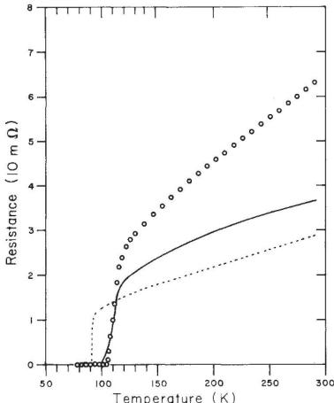
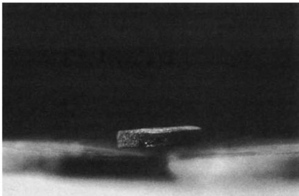
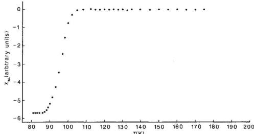
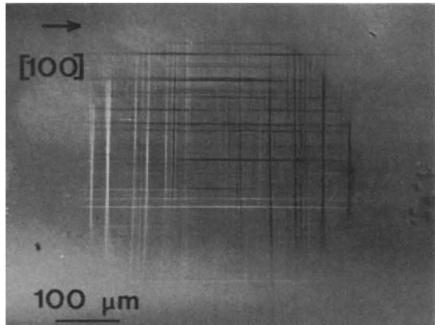

# Bulk superconductivity at 120 K in the Tl–Ca/Ba–Cu–O system

Z. Z. Sheng & A. M. Hermann

Department of Physics, University of Arkansas, Fayetteville, Arkansas 72701, USA

The discovery of 30-K superconductivity in the La-Ba-Cu-O system \( ^{1} \)  and 90-K superconductivity in the Y-Ba-Cu-O system \( ^{2} \)  stimulated a worldwide search for even higher-temperature superconductors. Unfortunately, most of the higher-temperature transitions reported in the past year have proved to be unstable, irreproducible, or not due to bulk superconductivity \( ^{3-7} \) . Recently, we and co-workers \( ^{8,9} \)  reported superconductivity above 90 K in a new Tl-Ba-Cu-O system, and pointed out that elemental substitutions in this system may lead to even higher-temperature superconductivity. Here we report stable and reproducible bulk superconductivity with an onset at 120 K and zero resistance above 100 K in the Tl-Ca/Ba-Cu-O system. This transition temperature is much higher than those observed for typical rare-earth-containing superconductors, and the onset temperatures are comparable to that in the Bi-Ca/Sr-Cu-O system, as reported in refs 10 and 11 (received after submission of this paper).

A typical procedure for preparing Tl-Ca/Ba-Cu-O samples is as follows. Appropriate amounts of  \( Tl_{2}O_{3} \) , CaO and  \( BaCu_{3}O_{4} \)  for a certain nominal composition (for example,  \( Tl_{2}CaBaCu_{3}O_{8+x} \) ), were completely mixed, ground and pressed into a pellet with a diameter of 7 mm and a thickness of 2–3 mm. The pellet was then put into a tube furnace, which had been heated to 880–910 °C, and was heated for 3–5 min in flowing oxygen. The sample was then taken from the furnace and quenched to room temperature in air. Some heated samples were furnace-cooled to room temperature, and some quenched samples were subsequently annealed at 450 °C in flowing oxygen for several hours. We use  \( BaCu_{3}O_{4} \)  as a starting material because it has the lowest melting point among the Ba-Cu oxides, and molten  \( BaCu_{3}O_{4} \)  is extremely fluid \( ^{12} \) ; we believe that melt-solid reactions take place more completely than do typical solid-state reactions. The  \( BaCu_{3}O_{4} \)  used in this experiment was prepared according to the procedure described in refs 8, 9 and 11.

Resistance was measured by the standard four-probe technique, with silver paste contacts. Rectangular bars of typical

Fig. 1 Resistance versus temperature for  \( Tl_{2}Ca_{1.5}BaCu_{3}O_{8.5+x} \)  (circles) and  \( Tl_{1.86}CaBaCu_{3}O_{7.8+x} \)  (solid line), compared with  \( EuBa_{2}Cu_{3}O_{7-x} \)  (dashed line).

Fig. 2 A Tl-Ca/Ba-Cu-O sample levitating over a magnet after immersion in liquid nitrogen.

size  \( 7 \times 3 \times 1 \)  mm were cut from the pellets for resistance measurements. The resistance of the Tl–Ca/Ba–Cu–O samples usually starts to drop sharply at  \( \sim 120 \)  K, and reaches zero at  \( \sim \) 100 K. The midpoint of the superconducting transition is at  \( \sim 110 \)  K. We estimate the onset temperature as the temperature at which the curvature in the resistance versus temperature plot changes most rapidly \( ^{13} \) . In our data this is in approximate agreement with the onset as determined by the intersection of the slopes in the transition region and in the normal region well above the transition. Figure 1 shows resistance plotted against temperature for a furnace-cooled  \( Tl_{2}Ca_{1.5}BaCu_{3}O_{8.5+x} \)  sample (open circles) and a  \( Tl_{1.86}CaBaCu_{3}O_{7.8+x} \)  sample annealed at  \( 450^{\circ}C \)  (solid line). For comparison, Fig. 1 also shows the behaviour of a  \( EuBa_{2}Cu_{3}O_{7-x} \)  sample (dashed line) which was carefully prepared using a typical solid-state sinter reaction technique. The transition midpoint and zero-resistance temperatures for the  \( Tl_{2}Ca_{1.5}BaCu_{3}O_{8.5+x} \)  sample are 112 K and 103 K, which are the highest among the Tl–Ca/Ba–Cu–O samples prepared so far, and are much higher than those observed for high-quality rare-earth-containing samples (see, for example, refs 13 and 14), and the zero-resistance temperature is higher than those attained so far in the Bi–Sr/Ca–Ca–O system \( ^{10,11} \) . The superconducting transition of the Tl–Ca/Ba–Cu–O samples is rather broad (usually  \( >20 \)  K), suggesting that zero resistance could be reached at higher temperature by improvement of the preparation procedure.

Qualitative magnetic examinations of Tl-Ca/Ba-Cu-O samples showed strong diamagnetic repulsion. Figure 2 shows a sample with a nominal composition of  \( Tl_{2}Ca_{2}BaCu_{3}O_{9+x} \)  levitating over a magnetic field of  \( \sim5,000 \)  G after immersion in liquid nitrogen. Figure 3 shows the temperature dependence of the a.c. susceptibility of a sample of nominal composition  \( Tl_{2}Ca_{1.5}BaCu_{3}O_{8.5+x} \) , as determined by the technique of Norton \( ^{15} \) . The onset temperature as determined by the deviation

Fig. 3 Temperature dependence of the a.c. susceptibility of a  \( Tl_{2}Ca_{1.5}BaCu_{3}O_{8.5+x} \)  sample.
 

from zero slope is somewhat lower than that of the initial drop in resistance—behaviour which was often seen in non-stoichiometric rare-earth superconductors (see, for example, ref. 16). Quantitative d.c. magnetization measurements are in progress.

The superconducting behaviour of the Tl-Ca/Ba-Cu-O samples depends on the preparation conditions, but not as strongly as for the Tl-Ba-Cu-O samples. Annealing at  \( 450^{\circ} \) C in flowing oxygen depresses or destroys the superconducting transition of the latter whereas it slightly improves the superconductivity of the former. Variation of the Ca/Ba ratio does influence the superconducting behaviour of samples. Tl-Ca-Cu-O samples prepared under similar conditions are semiconductor-like down to liquid-nitrogen temperature, whereas Tl-Ba-Cu-O samples have zero resistance just above liquid-nitrogen temperature \( ^{8,9} \) . Experiments to find an optimum Ca/Ba ratio are underway. Note that a 50% substitution of calcium for barium in  \( YBa_{2}Cu_{3}O_{7-x} \)  depresses transition temperature, whereas a similar substitution in the  \( LaBa_{2}Cu_{3}O_{7-x} \)  compound increases the superconducting transition temperature \( ^{13} \) .

We thank Mark J. Dreiling of the Phillips Petroleum Company for providing the low-frequency a.c. susceptibility data.

Received 9 February; accepted 26 February 1988.

1. Bednorz, J. G. & Müller, K. A. Z. Phys. B64, 189–193 (1986).

2. Wu, M. K. et al. Phys. Rev. Lett. 58, 908–910 (1987).

3. Chen, J. T., Wenger, L. E., McEwan, C. J. & Logothetis, E. M. Phys. Rev. Lett. 58, 1972–1975 (1987).

4. Ovshinsky, S. R., Young, R. T., Allred, D. D., DeMaggio, G. & Van der Leeden, G. A. Phys. Rev. Lett. 58, 2579–2581 (1987).

5. Cai, X., Joynt, R. & Larbalestier, D. G. Phys. Rev. Lett. 58, 2798–2801 (1987).

6. Bhargava, R. N., Herko, S. P. & Osborne, N. Phys. Rev. Lett. 59, 1468–1471 (1987).

7. Huang, C. Y. et al. Nature 328, 403–404 (1987).

8. Sheng, Z. Z. & Hermann, A. M. Nature 332, 55–58 (1988).

9. Sheng, Z. Z. et al. Phys. Rev. Lett. (in the press).

10. Maeda, H., Tanaka, Y., Fukutomi, M. & Asano, T. Jap. J. appl. Phys. Lett. (submitted).

11. Chu, C. W. et al. Phys. Rev. Lett. (submitted).

12. Hermann, A. M. & Sheng, Z. Z. Appl. Phys. Lett. 51, 1854–1856 (1987).

13. Murphy, D. et al. Phys. Rev. Lett. 58, 1888–1890 (1987).

14. Hor, P. H. et al. Phys. Rev. Lett. 58, 1891–1894 (1987).

15. Norton, N. L. J. Phys. E 19, 268–270 (1986).

16. Dietrich, M. R., Fietz, W. H., Ecke, J., Odest, B. & Politis, C. Z. Phys. B66, 284–287 (1987).

# Multiple slip in diamond due to a nominal contact pressure of 10 GPa at 1,000 °C

C. A. Brookes, V. R. Howes & A. R. Parry

Department of Engineering Design and Manufacture, University of Hull, Hull HU6 7RX, UK

From studies of anisotropy in Knoop hardness \( ^{1} \)  and transmission electron microscopy of the deformation beneath indentations \( ^{2} \) , it is widely accepted that some dislocation movement is possible in diamond at room temperature. Three-point bend tests were used earlier to identify a brittle-to-ductile transition temperature of  \( 1,500^{\circ} \) C (ref. 3), and extensive dislocation movement was considered unlikely at lower temperatures. Here we show, however, that multiple slip can occur in diamond as a result of the pressure transmitted by the point-loading of a softer material, namely a cubic boron nitride cone at  \( 1,000^{\circ} \) C. The method enables specimens to be prepared for electron microscopy and X-ray topography that have a controlled density of dislocations introduced at homologous temperatures below  \( 0.3T_{m} \) , where  \( T_{m} \)  is the melting point. Furthermore, it underlines the importance of microplasticity in the application and performance of crystalline engineering ceramics.

In the deformation of hard ceramic crystals at low homologous temperatures, catastrophic brittle fracture often dominates

Fig. 1 Slip steps produced on the (001) surface of magnesium oxide subjected to a mean pressure of 0.7 GPa at room temperature as a result of a flattened copper cone.

because dislocation mobility is usually very limited. Although the mechanisms of slip and brittle fracture are competitive, they are not mutually exclusive. Thus, restricted dislocation movement can cause fracture on  \( \{110\} \)  planes, rather than on the normal  \( \{100\} \)  cleavage planes in magnesium oxide \( ^{4} \) . Also, the suggestion that limited dislocation movement can control the mechanical behaviour of these crystals is supported by the high degree of correlation between their markedly anisotropic Knoop hardness and models based on resolved shear stresses on active slip systems \( ^{5,6} \) .

Encouraging plastic deformation, rather than fracture, in the covalent crystals is more difficult than in most ionic, and in all metal, crystals for a number of reasons. First, the nature of the crystal bonding and its pronounced directionality leads to high Peierls' stresses which resist dislocation motion. Thus, their critical resolved shear stresses are likely to be in the region of  \( 10^{-2}G \)  (where G is the bulk shear modulus), rather than the  \( 10^{-5}G \)  typical of metals. Second, the critical resolved shear stress for a given covalent crystal is much more dependent on the strain rate than it is in other solids—for example, in silicon it is increased by a factor of 2 for a change in strain rate of a factor of 10. Third, and directly related to the comparative difficulty of dislocation movement, they have low-fracture toughness. Nevertheless, there is generally a critical temperature above which dislocation mobility is significantly increased, and this temperature has been determined using indentation techniques in conjunction with dislocation etch pitting and X-ray topography. By both methods it was shown that the critical temperature for enhanced dislocation expansion beneath Vickers indentations was  \( \sim350^{\circ}C \)  for undoped germanium crystals. In contrast, dislocation etch pit patterns around indentations in germanium have recently been found to enlarge more gradually with temperature, but the extent of radial cracks on the surface decreased sharply at the same temperature. Similarly, the threshold temperature necessary for the spontaneous expansion of dislocation rosettes around room-temperature indentations that have been subsequently annealed has been identified for germanium ( \( 300^{\circ}C \) ), silicon ( \( 400^{\circ}C \) ) and cubic boron nitride ( \( 900^{\circ}C \) ). It has been suggested that the threshold temperature for diamond is below  \( 1,100^{\circ}C \) , on the basis of slip step formation around indentations, but the brittle-to-ductile transition temperature of  \( 1,500^{\circ}C \)  from three-point bend tests has generally been recognized as the minimum temperature for multiple slip in diamond.

A novel method of encouraging dislocation movement, rather than brittle fracture, has been exploited recently to demonstrate that hard crystals like magnesium oxide and titanium carbide
 
