ARTICLE

https://doi.org/10.1038/s41467-021-25372-2

OPEN

# Superconductivity up to 243 K in the yttrium-hydrogen system under high pressure

Panpan Kong \( ^{1,7} \) , Vasily S. Minkov \( ^{1,7,} \) , Mikhail A. Kuzovnikov \( ^{2,7} \) , Alexander P. Drozdov \( ^{1} \) , Stanislav P. Besedin \( ^{1} \)  Shirin Mozaffari \( ^{3} \) , Luis Balicas \( ^{3} \)  Fedor Fedorovich Balakirev \( ^{4} \) , Vitali B. Prakapenka \( ^{5} \) , Stella Chariton \( ^{5} \)  Dmitry A. Knyazev \( ^{6} \) , Eran Greenberg \( ^{5} \)  & Mikhail I. Eremets \( ^{1} \) 

The discovery of superconducting  \( H_{3}S \)  with a critical temperature  \( T_{c}\sim200~K \)  opened a door to room temperature superconductivity and stimulated further extensive studies of hydrogen-rich compounds stabilized by high pressure. Here, we report a comprehensive study of the yttrium-hydrogen system with the highest predicted  \( T_{c} \) s among binary compounds and discuss the contradictions between different theoretical calculations and experimental data. We synthesized yttrium hydrides with the compositions of  \( YH_{3} \) ,  \( YH_{4} \) ,  \( YH_{6} \)  and  \( YH_{9} \)  in a diamond anvil cell and studied their crystal structures, electrical and magnetic transport properties, and isotopic effects. We found superconductivity in the 1m-3m  \( YH_{6} \)  and  \( P6_{3}/mmc \)   \( YH_{9} \)  phases with maximal  \( T_{c} \) s of  \( \sim220~K \)  at 183 GPa and  \( \sim243~K \)  at a 201 GPa, respectively. 1m-3m  \( YH_{10} \)  with the highest predicted  \( T_{c}>300~K \)  was not observed in our experiments, and instead,  \( YH_{9} \)  was found to be the hydrogen-richest yttrium hydride in the studied pressure and temperature range up to record 410 GPa and 2250 K.
 

High-temperature superconductivity (HTSC) is of great interest and importance because superconductors operating under ambient or technologically accessible pressure and temperature conditions can vastly improve many areas of technology. The conventional theories of Bardeen–Cooper–Schrieffer \( ^{1} \)  and Migdal–Eliashberg \( ^{2,3} \)  indicate that superconductivity, even at room temperature, cannot be excluded. However, for a long time, the critical temperature of conventional superconductors has been limited to  \( T_{c}=39 \)  K in  \( MgB_{2}^{4} \) . The discovery of unconventional superconductivity in the cuprates family has provided a strong motivation to further search for superconducting materials at even higher temperatures. Despite great efforts, superconductivity soon reached its limit in  \( T_{c} \)  at  \( \sim133 \)  K \( ^{5} \)  ( \( \sim164 \)  K under pressure \( ^{6} \) ). A microscopic theory of high- \( T_{c} \)  unconventional superconductors is still lacking, which hampers further advances in this field.

The breakthrough and tremendous progress for reaching HTSC came with the discovery of the "Earth temperature superconductivity" at 203 K ( \( -70^{\circ}C \) ) in  \( H_{3}S \)  at  \( \sim150 \)  GPa \( ^{7} \) . This achievement was based on the general assumption by Ashcroft, who suggested that hydrogen-dominant materials are promising candidates for HTSC \( ^{8} \) , which has then been greatly supported by modern ab initio computational methods for predicting the crystal structure and properties of novel materials \( ^{9-11} \) . This work showed a clear route towards room-temperature superconductivity and initiated extensive high-pressure studies of hydrides, which are conventional phonon-mediated superconductors. Soon  \( T_{c} \)  reached 252 K in  \( LaH_{10} \)  at 170 GPa \( ^{12} \)  ( \( T_{c}=260 \)  K was claimed in Somayazulu et al. \( ^{13} \) ), and very recently,  \( T_{c}=287 \)  K was reported for the ternary carbon–sulfur–hydrogen system \( ^{14} \) . In addition, many other superconductors with high  \( T_{c} \) s were found (see Review \( ^{15} \)  and the many refs. within).

While the claim of room-temperature superconductivity \( ^{14} \)  is waiting for its verification and clarification of the composition and crystal structure of the phase responsible for such high  \( T_{c} \) , the superconductivity in  \( H_{3}S \)  and  \( LaH_{10} \)  compounds has been independently reproduced by several groups. For instance, the superconducting transitions in  \( H_{3}S \)  were confirmed with reported  \( T_{c} \) s between  \( \sim183 \)  and  \( 200\,K^{16-19} \) , and superconductivity in  \( LaH_{10} \)  was verified in close agreement at  \( \sim250\,K^{13,20,21} \) .

Binary hydrides remain the most promising system for fruitful synergy between theory and experiment. Nevertheless, there is a discrepancy between the measured and predicted  \( T_{c} \) s and phase diagrams, and new experimental data are crucial for further improvement of the computational methods. Recent theoretical reports provide convincing predictions for HTSC in the yttrium-hydrogen system. According to the calculations,  \( T_{c} \)  should be as high as 303 K at 400 GPa \( ^{22} \)  or 305–326 K at 250 GPa \( ^{23} \)  in face-centred cubic (fcc)  \( YH_{10} \) . In addition to  \( YH_{10,} \)  there are other phases with high calculated  \( T_{c} \) s, which are predicted to be stable at lower pressures, e.g., hexagonal close packed (hcp)  \( YH_{9} \)  with a  \( T_{c} \)  of 253–276 K stable at 200 GPa \( ^{22} \)  and body-centred cubic (bcc)  \( YH_{6} \)  with a  \( T_{c} \)  of 251–264 K stable at 110 GPa \( ^{24} \) .

In the present work, we report an experimental study of the yttrium-hydrogen system at high pressures and two superconducting  \( bcc-YH_{6} \)  and  \( hcp-YH_{9} \)  phases. Both phases have the same crystal structures as those predicted by the calculations \( ^{22-24} \) ; however, the observed  \( T_{c} \) s are significantly lower than the calculated values by  \( \sim30 \)  K. We could not synthesise  \( fcc-YH_{10} \) , which has the highest computed  \( T_{c} \)  among the predicted yttrium hydrides. Instead, we revealed that  \( hcp-YH_{9} \)  is the persistent hydrogen-richest yttrium hydride in the wide pressure-temperature domain up to 410 GPa and 2250 K – under the same conditions where the thermodynamic stability of the  \( fcc-YH_{10} \)  phase was predicted \( ^{22} \) . Here, we also discuss the contradictions between different experimental data for the yttrium-hydrogen system. Our preliminary report \( ^{25} \)  and the present more comprehensive data are in good agreement with the data from Troyan et al. \( ^{26} \)  but evidently contradict the claim of  \( T_{c}=262 \)  K at 182 GPa reported by Snider et al. \( ^{27} \) .

## Results and discussion

Synthesis of samples. We prepared various yttrium hydrides in a diamond anvil cell (DAC) by compressing either yttrium metal in  \( H_{2}/D_{2} \)  (9 samples), yttrium trihydride  \( YH_{3}/YD_{3} \)  in  \( H_{2}/D_{2} \)  (9 samples), or  \( YH_{3} \)  with  \( NH_{3}BH_{3} \)  (7 samples). The details for the 31 different samples synthesised and analysed in the present study are summarised in Supplementary Table 1.

In our experiments, yttrium metal reacted with the surrounding hydrogen fluid at 17 GPa at room temperature, which was the lowest pressure at which X-ray diffraction patterns were collected (samples 26 and 27; Supplementary Fig. 1). This chemical reaction occurs even at lower pressures of  \( \sim \) 1 GPa according to refs. 28,29.

Yttrium hydrides with a higher hydrogen content require much higher pressures for their formation. We synthesised body-centred tetragonal  \( (bct) \)   \( YH_{4}/YD_{4} \)  and bcc- \( YH_{6}/YD_{6} \)  within a pressure range of 160–175 GPa (Figs. 1 and 2) after heating  \( YH_{7}/YD_{3} \)  in  \( H_{2}/D_{2} \)  at  \( \sim \) 1500 K with the aid of a pulsed laser (samples 5, 7 and 24). Both phases can also be formed by exposing the reactants to higher pressures of  \( \sim \) 200–244 GPa at room temperature for several weeks (samples 1, 2, 6, 9 and 10).

Both  \( bct-YH_{4}/YD_{4} \)  and  \( bcc-YH_{6}/YD_{6} \)  were observed within a wide pressure range of  \( \sim160-395 \)  GPa (Fig. 2). Laser heating of these phases with excess  \( H_{2}/D_{2} \)  at pressures above 185 GPa results in the formation of the  \( hcp-YH_{9}/YD_{9} \)  phase (samples 1, 2, 3, 6, 7, 10, 17–19 and 21–23).

X-ray diffraction studies. The crystal structures of novel yttrium hydrides were determined by X-ray powder diffraction. The Rietveld refinements for the typical powder diffraction patterns of the 14/mmm YH_{4}, 1m-3m YH_{6} and P6_{3}/mmc YH_{9} phases are shown in Fig. 1. The lattice parameters of these phases were determined at 135–410 GPa for a series of different samples and are listed in Supplementary Tables 1–5. The volumes of the crystal lattices of the synthesised yttrium hydrides are summarised in Fig. 2a as a function of pressure and are well approximated by the Vinet \( ^{30} \)  equation of state (fitting parameters are given in Supplementary Table 6). The lattice volumes of bct-YH_{4}, bcc-YH_{6} and hcp-YH_{9} (Fig. 2a) and the c/a ratios of bct-YH_{4} and hcp-YH_{9} (Fig. 2b) agree well with the theoretical predictions \( ^{22-24,26,31,32} \) , which justifies the assignment of compositions for the hydrides with H/Y > 3.

We also independently estimated the compositions of new yttrium hydrides from the X-ray diffraction data by analysing the hydrogen-induced volume expansion  \( V_{H} \) . In contrast to the lanthanum-hydrogen system \( ^{12} \) , in which the  \( V_{H} \)  of  \( \sim1.8\ \AA^{3}/H(D) \)  atom is nearly identical in all lanthanum hydrides at approximately 150 GPa, the corresponding volume expansion is anomalously large in  \( YH_{3} \)  and differs from that in the yttrium hydrides with higher hydrogen content. As a result,  \( bct-YH_{4}/YD_{4} \)  and  \( fcc-YH_{3}/YD_{3} \)  have almost the same lattice volumes within a pressure range of  \( \sim150-250 \)  GPa. Using the extrapolated equation of state for pure yttrium \( ^{33} \) , the value of  \( V_{H} \)  in  \( bct-YH_{4}(YD_{4}) \)  is  \( \sim1.7-1.8\ \AA^{3}/H(D) \)  atom at 180–200 GPa and is comparable with the values measured in other hydrogen-rich metal hydrides \( ^{12,34-37} \) . The derived values provide the estimation for compositions of the new bcc and hcp phases as  \( YH_{5.7(3)} \)  and  \( YH_{8.5(5)} \) .

The synthesis of  \( YH_{10} \) , which, according to theory, is the most promising candidate for the highest  \( T_{c} \)  of 305–326 K \( ^{23} \) , was of particular interest for the present study. The calculations on the stability of  \( fcc-YH_{10} \)  provide contradictory results. Some
 
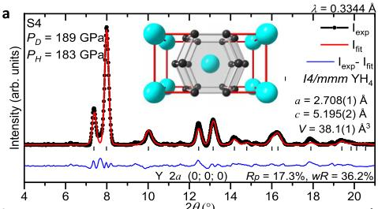

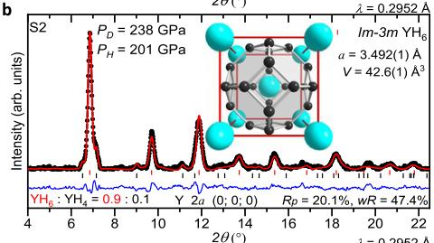

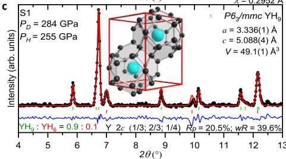

Fig. 1 X-ray powder diffraction patterns of the synthesised yttrium hydrides. a 14/\(mm\) YH\(_{4}\) phase in sample 4 (S4) after pulsed laser heating at P\(_{H}\) = 183 GPa; b 1m-3m YH\(_{6}\) phase in unheated sample 2 (S2) at P\(_{H}\) = 201 GPa with a T\(_{c}\) of ~211 K; c P\(_{6}\)/mmc YH\(_{6}\) phase in sample 1 (S1) after pulsed laser heating at P\(_{H}\) = 255 GPa with a T\(_{c}\) = 235 K. See Supplementary Table 1 for details. P\(_{H}\) and P\(_{D}\) correspond to the pressures estimated by H\(_{2}\) (D\(_{2}\)) vibron scale\(^{-54}\) and diamond scale\(^{-55}\), respectively. The black circles and red and blue curves correspond to the experimental data, Rietveld refinement fits and residues, respectively. The black, red and green ticks indicate the calculated peak positions for the 14/\(mm\) YH\(_{4}\), 1m-3m YH\(_{6}\) and P\(_{6}\)/mmc YH\(_{9}\) phases, respectively. The weight fractions for the phases, refined lattice parameters and coordinates for Y atoms are shown for each refinement. The fragments of the crystal structure with the characteristic YH\(_{18}\), YH\(_{24}\) and YH\(_{29}\) coordination polyhedra (cages) are shown as insets. The large cyan and small black spheres show the positions of the Y and H atoms in the crystallographic unit cells according to Peng et al.\(^{22}\).

predictions show that this phase becomes stable at 250 GPa \( ^{23} \) , which is an apparent contradiction with our observations. Other calculations suggest that at T=0 K, YH \( _{10} \)  is thermodynamically unstable at any pressure \( ^{22} \) . However, the difference in the Gibbs free energies between fcc-YH \( _{10} \)  and hcp-YH \( _{9} \)  should decrease at higher temperatures, and fcc-YH \( _{10} \)  should become more favourable at temperatures above 1500 K at 375 GPa or above 1100 K at 400 GPa \( ^{22} \) .

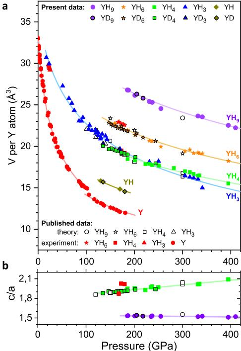

Fig. 2 Volume of various synthesised yttrium hydrides as a function of pressure. a The experimental data for the  \( P6_{3}/mmc \)  YH \( _{9} \) , 1m-3m YH \( _{6} \) , 14/ \( mmm \)  YH \( _{4} \) , Fm-3m YH \( _{3} \)  and Fm-3m YH phases are shown as filled violet circles, orange stars, green squares, blue triangles and dark yellow rhombuses, respectively. The data for the corresponding yttrium deuterides are outlined in black. Open black circles, stars, squares and triangles correspond to the theoretically predicted structures for YH \( _{9} \)  \( ^{22} \) , YH \( _{6} \)  \( ^{222-24,26} \) , YH \( _{4} \)  \( ^{222-24,26} \)  and YH \( _{3} \)  \( ^{31,32} \) , respectively. Experimental data for pure Y \( _{33,63} \) , YH \( _{59} \) , YH \( ^{46} \)  \( ^{26} \)  and YH \( _{26} \)  \( ^{46} \)  taken from the literature are depicted by the red symbols. Solid curves correspond to the Vinet \( ^{30} \)  equation of state fitting. The pressure was estimated from the frequency of the H \( _{2} \)  (D \( _{2} \) ) vibron \( ^{54} \)  for the samples with excess H \( _{2} \)  (D \( _{2} \) ) and from the high-frequency edge of the Raman line from the stressed diamond anvil \( ^{55} \)  for the remainder of our samples. b The pressure dependence for the lattice parameter ratio c/a in the P6 \( _{3} \) /mmc and 14/ \( mmm \)  phases with linear fits.

Guided by these calculations, we prepared samples of  \( YH_{3} \)  with  \( NH_{3}BH_{3} \)  to study the yttrium-hydrogen system at very high pressures of  \( \sim325-410 \)  GPa (see Supplementary Table 1). We did not observe  \( fcc-YH_{10} \)  in the final quenched products after pulsed laser heating of the samples up to 1600–2250 K. There was no hint of the  \( fcc-YH_{10} \)  phase immediately during pulsed laser heating; only the temperature-induced thermal expansion of the crystal structure of the  \( hcp-YH_{9} \)  phase at 410 GPa and 2250(10) K was detected (Fig. 3). Notably, excess  \( H_{2} \)  is hard to control in experiments with  \( NH_{3}BH_{3} \)  as the source of hydrogen. Nonetheless, it is evident that excess  \( H_{2} \)  was realised in sample 17 because the initial  \( YH_{3} \)  completely transformed into single-phase  \( P6_{3}/mmc \)   \( YH_{9} \)  after laser heating (Fig. 3). It is possible that the predicted  \( YH_{10} \)  exists at even higher pressures and temperatures,
 
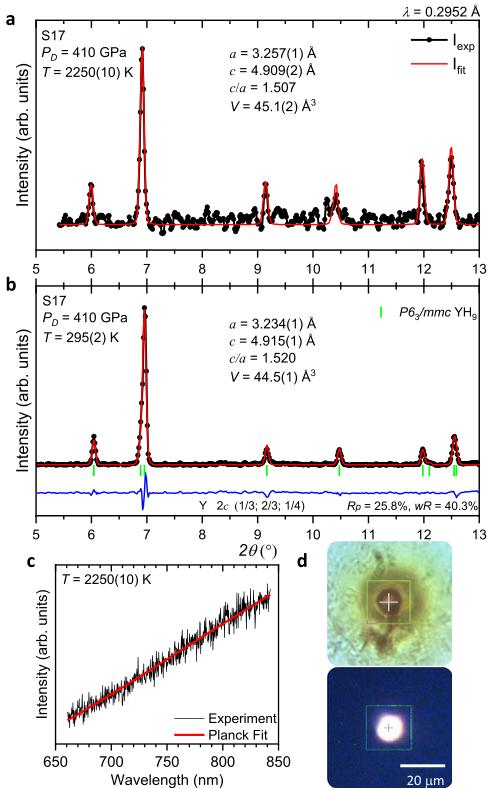

Fig. 3 X-ray diffraction study of the yttrium-hydrogen system at extreme pressure and temperature conditions. a X-ray powder diffraction pattern collected from sample 17 (S17)  \( \left(\mathrm{YH}_{3} + \mathrm{NH}_{3}\mathrm{BH}_{3}\right) \)  at 410 GPa directly at the moment of pulsed laser heating at 2250(10) K (black circles) and Le Bail refinement (red curve). b X-ray powder diffraction pattern of sample 17 at 410 GPa after subsequent quenching to ambient temperature, corresponding to the pure  \( P6_{3}/mmc \)   \( YH_{9} \)  phase. Black circles, red and blue curves correspond to the experimental data, Rietveld refinement fits and residues, respectively. Green ticks indicate the calculated peak positions for the  \( P6_{3}/mmc \)   \( YH_{9} \)  phase. c The thermal radiation spectrum measured during pulsed laser heating (black curve) and the fit to Planck's radiation law (red curve). d Photos of the sample at ambient temperature (top) and during pulsed laser heating (bottom).

but an experiment at such extreme conditions is currently challenging.

Superconductivity. The electrical resistance measurements of new yttrium hydrides revealed superconductivity with high  \( T_{c} \) s (Fig. 4). The observed superconducting transitions were unambiguously assigned to either hcp- \( YH_{9}/YD_{9} \)  or bcc- \( YH_{6}/YD_{6} \)  by analysing the phase content in several of the prepared samples (see details in Supplementary Table 1). According to the X-ray diffraction data, some samples contained variable amounts of lower hydrides, namely, fcc- \( YH_{3} \)  and bct- \( YH_{4} \) , originating from the areas near the electrical leads. These areas were relatively poorly heated on purpose by the pulsed laser to prevent the failure of the electrical leads on the samples. The presence of these impurities does not alter the observed HTSC in our samples (see below).

The  \( T_{c} \)  of hcp- \( YH_{9} \)  is higher than that of the bcc- \( YH_{6} \)  phase, as follows from the electrical measurements for sample 2 (the black and red curves in Fig. 4a). Prior to laser heating, the sample contained bcc- \( YH_{6} \)  and exhibited a superconducting transition with a  \( T_{c} \)  of  \( \sim211 \)  K at 201 GPa. After heating at 2000(10) K, most of the bcc- \( YH_{6} \)  phase transformed into hcp- \( YH_{9} \) , and the superconducting transition shifted to a higher temperature of  \( \sim243 \)  K (the X-ray diffraction patterns of sample 2 are shown in Supplementary Fig. 2d, e). Identical behaviour was observed for the deuterides in sample 6 at 202 GPa (the black and red curves in Fig. 4b); i.e., the initial bcc- \( YD_{6} \)  phase had a  \( T_{c} \)  of 165 K, and hcp- \( YD_{9} \) , which formed after laser heating, exhibited a higher  \( T_{c} \)  of 172 K (the X-ray diffraction patterns of sample 6 are presented in Supplementary Fig. 3).

The pressure dependencies of  \( T_{c} \)  for  \( YH_{9} \)  and  \( YH_{6} \)  have a "dome-like" shape with the highest measured  \( T_{c} \)  of 243 K at 201 GPa and 224 K at 166 GPa, respectively (Fig. 4e). Similar maxima at the  \( T_{c}(P) \)  dependence were previously observed in  \( H_{3}S^{7} \)  and  \( LaH_{10}^{12} \)  at  \( \sim150 \)  GPa. The decrease in  \( T_{c} \)  with increasing pressure in the bcc- \( YH_{6} \)  and hcp- \( YH_{9} \)  phases is likely due to either the pressure-induced stiffening of the phonon frequencies similar to that in bcc- \( H_{3}S^{38,39} \)  or the presence of a flat region on the Fermi surface and the appearance of a two-gap structure similar to that in fcc- \( LaH_{10}^{40,41} \) . The data for bcc- \( YH_{6} \)  and  \( YD_{6} \)  independently measured by Troyan et al. \( ^{26} \)  agree with this trend. The sharp drop in  \( T_{c} \)  for  \( YH_{9} \)  and  \( YH_{6} \)  at pressures below  \( \sim195 \)  and  \( \sim165 \)  GPa, respectively, should be associated with the structural distortions and phase transformations between the high-pressure high-symmetry and low-pressure low-symmetry phases, as was recently demonstrated for  \( H_{3}S^{18,42} \)  and  \( LaH_{10}^{21,43} \) .

It should be noted that some samples synthesised by keeping reactants at room temperature for several weeks without laser heating (samples 1, 2, 6 and 10) exhibit  \( T_{c} \) s that are lower by  \( \sim5-10 \)  K in comparison to the samples prepared via laser heating-assisted synthesis (the corresponding symbols are outlined by the red circles in Fig. 4e, f). This effect should be attributed to the poorer crystallinity and homogeneity of the superconducting phase in the non-annealed samples, which manifested in the broadening of the Bragg reflections in the X-ray diffraction powder patterns (Supplementary Figs. 2 and 3). Similar behaviour was previously shown in  \( H_{3}S^{7,18} \) .

Isotope effect. The substitution of hydrogen by deuterium in the samples resulted in a pronounced shift in  \( T_{c} \)  to lower temperatures. The transition temperature shifted to  \( \sim168 \)  K for  \( YD_{6} \)  in sample 7 at 173 GPa and  \( \sim172 \)  K for  \( YD_{9} \)  in sample 6 at 205 GPa (Fig. 4c, d). This isotope effect supports the conventional phonon-assisted mechanism of superconductivity. Using the  \( T_{c} \)  values measured for hcp- \( YH_{9}/YD_{9} \)  and bcc- \( YH_{6}/YD_{6} \)  within the pressure range of 183–205 GPa (samples 2, 4, 6 and 7), we calculated the isotope effect coefficient,  \( \alpha = -\frac{dlnT_{c}}{dlnM} \) , where M is the atomic mass, to be 0.39 for the bcc- \( YH_{6}/YD_{6} \)  phase and 0.50 for the hcp- \( YH_{9}/YD_{9} \)  phase. The isotope coefficient value for bcc- \( YH_{6}/YD_{6} \)  is smaller than the maximal expected BCS value of 0.5 for a harmonic case. This result likely stems from the anharmonic effects and the contribution of acoustic phonons to electron-phonon coupling.

Resistance measurements under high magnetic fields. In addition to the observed drops in the resistance to a zero value and the isotope effect, the onset of superconducting order was
 
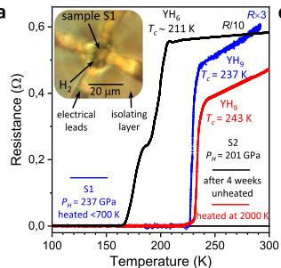

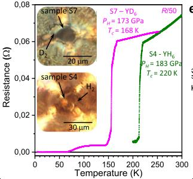

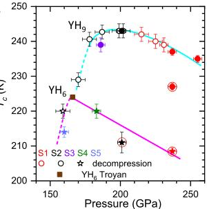

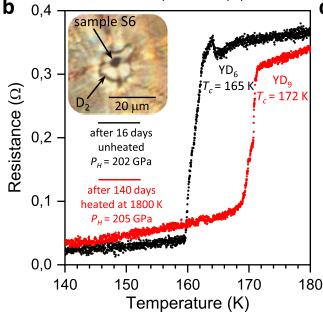

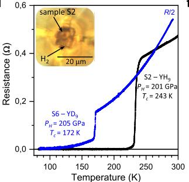

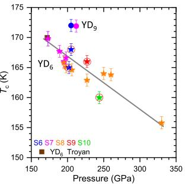

Fig. 4 Superconducting transitions in the synthesised yttrium hydrides and deuterides. a, b The temperature dependencies of the resistance of the yttrium-hydrogen and yttrium-deuterium samples measured with a four-probe technique in a van der Pauw geometry, demonstrating the shift in  \( T_{c} \)  to higher temperatures after pulsed laser heating of the samples. In a, Black and red curves correspond to the temperature dependence of the resistance of the  \( Im-3m\ YH_{6} \)  phase, which was formed after exposing  \( YH_{3} \)  to  \( H_{2} \)  at  \( P_{H}=201 \)  GPa for 3 weeks, and the  \( P_{63}/mmc\ YH_{9} \)  phase, which was synthesised after subsequent heating at 2000(10) K, in sample 2. The blue curve corresponds to the  \( P_{63}/mmc\ YH_{9} \)  phase synthesised at  \( P_{H}=237 \)  GPa in sample 1 (S1). In b, similarly,  \( T_{c} \)  increases from 165 K for  \( Im-3m\ YD_{6} \)  to 172 K for  \( P_{63}/mmc\ YD_{9} \)  in sample 6 (S6) at  \( P_{H}\sim205 \)  GPa. c, d The temperature dependencies of the resistance of  \( Im-3m\ YH_{6} \)  (YD \( _{6} \) ) and  \( P_{63}/mmc\ YH_{9} \)  (YD \( _{9} \) ) synthesised in samples 2, 4, 6 and 7 (S2, S4, S6, S7) demonstrate the shift in the superconducting transitions with isotopic substitution. The absolute resistance values for some samples were multiplied by the specified constant factors for better presentation. The insets show photos of the samples and arrangements for electric transport measurements. e, f The pressure dependence of  \( T_{c} \)  for the superconducting transitions in  \( Im-3m\ YH_{6} \)  (stars) and  \( P_{63}/mmc\ YH_{9} \)  (circles) phases and the corresponding deuterides, respectively. Different colours represent different samples. Open symbols are the data obtained on subsequent decompression. Symbols marked by red circles are the data for unheated samples. Cyan, magenta and grey curves are the guides for the eye. Brown squares depict the data from Troyan et al. \( ^{26} \) . Error bars are defined the same as in Drozdov et al. \( ^{12} \) . The horizontal and vertical error bars correspond to the uncertainty in the precise value of the pressure (inherent error bars of the method used) and in the determination of the correct value of  \( T_{c} \)  (criteria-dependent), respectively.

independently verified by the magneto-transport measurements under magnetic fields up to 9T. While the magnetic field has a negligible effect on the resistance of the normal metal,  \( T_{c} \)  is strongly reduced as the magnetic field increases, and superconductivity is completely suppressed at fields above the upper critical field  \( H_{c2} \) .  \( H_{c_{2}} \)  is the most direct probe of the coherence length of the superconducting order parameter  \( \xi = \sqrt{\frac{\phi_{0}}{3\pi^{2}H_{c2}}} \) , where  \( \phi_{0} \)  is the magnetic flux quantum. Figure 5a, b show the dependence of the superconducting transition in samples 5 and 6 as a function of external magnetic field. To estimate the  \( H_{c2} \)  and  \( \xi \)  at zero temperature, we plotted the dependence of  \( T_{c} \)  on the applied external magnetic field, following the criterion of 90% of the resistance in the metallic state (Fig. 5c). The temperature dependence of  \( H_{c2} \)  can be approximated by the Ginzburg–Landau (GL) equation \( ^{44} \)  for  \( \frac{T_{c}-T}{T_{c}}\ll1 \)  and more accurately by the Werthamer–Helfand–Hohenberg (WHH) \( ^{45} \)  model for all temperatures. The light and dark curves in Fig. 5c show the results of the fits for the experimental values of  \( H_{c2}(T) \)  to the GL and WHH relations. These fits yield  \( H_{c2}^{\mathrm{WHH}}(0\mathrm{K})=60\mathrm{T}\left(H_{c2}^{\mathrm{GL}}(0\mathrm{K})=46\mathrm{T}\right) \)  for  \( hcp-YD_{9} \)  and  \( H_{c2}^{\mathrm{WHH}}(0\mathrm{K})=157\mathrm{T}\left(H_{c2}^{\mathrm{GL}}(0\mathrm{K})=107\mathrm{T}\right) \)  for  \( hcc-YH_{6} \) . The latter values are in good agreement with the estimate of  \( H_{c2}(0\mathrm{K})=116-158\mathrm{T} \)  by Troyan et al. \( ^{26} \) . The corresponding coherence length  \( \xi(0\mathrm{K}) \)  in  \( hcc-YH_{6} \)  and  \( hcp-YD_{9} \)  are 1.45–1.75 nm and 2.3–2.7 nm, respectively.

We estimated  \( H_{c2}^{WHH} \)  (0 K) = 120 T ( \( H_{c2}^{GL} \)  (0 K) = 92 T) for hcp-YH \( _{9} \)  using the relation of  \( H_{c2} \sim \left(\frac{T_{c}}{T_{2}}\right)^{2} \)  and assuming the same Fermi velocities  \( v_{F} \)  in YH \( _{9} \)  and YD \( _{9} \) , counterparts. Generally, higher  \( T_{c} \)  values correlate with higher  \( H_{c2} \) (0 K) values in the studied hydride superconductors, e.g.  \( H_{c2} = 144 \)  T and  \( T_{c} = 250 \)  K were observed in LaH \( _{10} \)  \( ^{12,21} \) ,  \( H_{c2} = 88 \)  T and  \( T_{c} = 197 \)  K in H \( _{3} \) S \( ^{16} \) ,  \( H_{c2} = 45 \)  T and  \( T_{c} = 153 \)  K in ThH \( _{10} \)  and  \( H_{c2} = 38 \)  T and  \( T_{c} = 145 \)  K in ThH \( _{36} \) ,  \( H_{c2} = 29 \)  T and  \( T_{c} = 98 \)  K in CeH \( _{10} \)  \( ^{46} \) , and  \( H_{c2} = 11 \)  T and  \( T_{c} = 68 \)  K in SnH \( _{x} \)  \( ^{47} \) . Conversely, the hcp-YH \( _{9} \)  phase has higher  \( T_{c} = 243 \)  K but lower  \( H_{c2} \)  comparing with bcc-YH \( _{6} \)  phase. This is likely caused by the difference in electronic band structure in these phases, and further theoretical calculations are required to explain this anomaly.
 
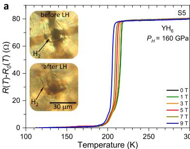

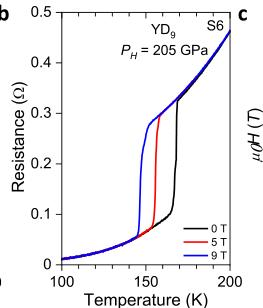

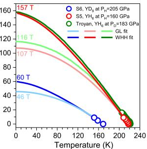

Fig. 5 Temperature dependence of the resistance for the Im-3m YH₆ and P6₃/mmc YD₉ phases under external magnetic field. a, b DC field measurements for the Im-3m YH₆ phase at Pₕ = 160 GPa in sample 5 (S5) and the P₆₃/mmc YD₉ phase at Pₕ = 205 GPa in sample 6 (S6), respectively. c Fits of the superconducting upper critical field H₂c to the Wetherham-Helfand-Hohenberg (WHH) and Ginzburg-Landau (GL) formalisms. Red and blue circles denote the H₂c₅ measured for Im-3m YH₆ at Pₕ = 160 GPa and P₆₃/mmc YD₉ phase at Pₕ = 205 GPa, respectively. The dark and light curves are the WHH and GL fits to the experimental data. Green circles and green curves are the data for Im-3m YH₆ phase at Pₕ = 183 GPa from Troyan et al.²⁶.

We found that despite a substantial difference in the  \( H_{\mathrm{c2}}(0\mathrm{K}) \)  values for  \( YD_{9} \)  and  \( YH_{6} \)  samples, the Fermi velocities  \( v_{F} \)  estimated via the BCS relation:  \( \xi = 0.18 \frac{h v_{F}}{k_{\mathrm{B}} T_{c}} \)  are quite similar, i.e.  \( 2.85 \times 10^{5} \)  and  \( 2.3 \times 10^{5} \)  m/s, respectively. Similar  \( v_{F} \)  values were reported for other superconductors of so-called “superhydride” family including  \( SnH_{x}^{47} \)  and  \( LaH_{10}^{21} \) . This indicates that the dispersion of the charge carriers contributing to the superconductivity does not significantly change between different superconducting hydrides. Interestingly, nearly constant values of  \( v_{F} \)  were also revealed for various unconventional high-temperature superconductors of the cuprates family \( ^{48} \) .

Stability range of yttrium hydrides. The predicted crystal structures of the  \( YH_{3} \) ,  \( YH_{4} \) ,  \( YH_{6} \)  and  \( YH_{9} \)  compositions are in excellent agreement with the experimental results. To assess the accuracy of the calculations, we compared the predicted formation pressures for these novel hydrides with our experimental observations. The problem of determining the equilibrium pressure in experiments is often exacerbated by the presence of large baric hysteresis between the formation and decomposition pressures. It is generally accepted that the equilibrium pressure in most metal-hydrogen systems is much closer to the decomposition pressure of the high-pressure phase \( ^{49,50} \) . Decreasing pressure in sample 2 resulted in the decomposition of  \( YH_{9} \)  into  \( bcc-YH_{6} \)  at 159 GPa (Supplementary Fig. 2f), which is considerably higher than the predicted  \( YH_{9} \)  equilibrium formation pressure of 100 GPa \( ^{22} \) . The sharp drop in  \( T_{c} \)  for  \( hcp-YH_{9} \)  at  \( \sim185 \)  GPa (open black star in Fig. 4e) indicates that this phase is dynamically unstable below this pressure. Decreasing pressure in sample 24 resulted in a decomposition of  \( bcc-YD_{6} \)  at  \( \sim135 \)  GPa, whereas  \( bct-YD_{4} \)  was stable down to at least  \( \sim135 \)  GPa (Supplementary Tables 1 and 3). This result is in reasonable agreement with the predicted equilibrium formation pressure of 110 GPa for both phases \( ^{24} \) .

The predicted  \( T_{c} \) s of 251–264 K for  \( bcc-YH_{6} \)  \( ^{24} \)  and 253–276 K \( ^{22} \)  for the hcp-YH \( _{9} \)  phase are  \( \sim \) 30 K higher than the present experimental values. Recent calculations \( ^{26} \)  for the bcc-YH \( _{6} \)  phase, which accounted for the anharmonicity, demonstrate a  \( T_{c} \)  of 236–247 K, which is still significantly higher than the experimental value. In addition, we did not observe superconductivity in fcc-YH \( _{3} \)  upon cooling down to 5 K in the pressure range of 15–180 GPa or in bct-YH \( _{4} \)  upon cooling down to 78 K at 250 GPa (Supplementary Fig. 4), while both phases were predicted to be superconductors with  \( T_{c} \) s of 40 K \( ^{51} \)  and 84–95 K \( ^{24,32} \) , respectively.

Comparison with other works. In the recent report, Snider et al \( ^{27} \) . claimed a significantly higher maximum  \( T_{c}=262 \)  K at 182(8) GPa in the yttrium-hydrogen system. Their values of  \( T_{c} \) s measured in the pressure range of  \( \sim134-187 \)  GPa and the pressure dependence of  \( T_{c} \)  contradict the results of both the present work and Troyan et al. \( ^{26} \)  (Supplementary Fig. 5). This strong disagreement raises a question about the material studied in Snider et al. \( ^{27} \) . Unfortunately, the lack of any X-ray structural characterisation of the samples in Snider et al. \( ^{27} \)  makes the direct comparison impossible. The superconductivity was putatively assigned to  \( P6_{3}/mmc \)   \( YH_{9} \)  based on a comparison of the measured and computed Raman spectra \( ^{27} \) . However, Raman spectroscopy is not a reliable method for the identification of a crystal structure. Moreover, bct- \( YH_{4} \) , bcc- \( YH_{6} \)  and hcp- \( YH_{9} \)  are good metals and could not account for the observed Raman spectra. Presently, we observed Raman spectra only for mixtures with a hydrogen-depleted fcc phase with a composition close to  \( YH_{1}/YD_{1} \) , which was formed during the compression of the initial  \( YH_{2,92(5)} \)  and  \( YD_{2,87(5)} \)  above  \( \sim100 \)  GPa (see Methods section for details and Supplementary Fig. 6). Furthermore, the superconducting transitions measured in Snider et al. \( ^{27} \)  below  \( \sim185 \)  GPa cannot be assigned either to hcp- \( YH_{9}/YD_{9} \)  because it is unstable in this pressure range or to bcc- \( YH_{6} \)  because this phase has a significantly lower  \( T_{c} \) .

Summary. We report on the superconductivity in hcp-YH \( _{9} \)  with a maximum  \( T_{c} \)  of 243 K at 201 GPa, which is the second highest  \( T_{c} \)  measured for the family of transition element superhydrides, and bcc-YH \( _{6} \)  with a  \( T_{c} \)  of 220 K at 183 GPa. At higher pressure, both phases demonstrate a decrease in  \( T_{c} \) . The decrease in  \( T_{\mathrm{c}} \)  under external magnetic fields additionally confirms the superconductivity in novel yttrium superhydrides, and the isotopic shift in the superconducting transition in deuterides to lower temperatures supports the conventional phonon-assisted mechanism of superconductivity. We found good agreement between the predicted and experimental crystal structures and the  \( V(P) \)  dependencies of the synthesised hydrides. However, the measured  \( T_{c} \) s for bcc-YH \( _{6} \)  and hcp-YH \( _{9} \)  are markedly lower than the computed values of 251–264 K for YH \( _{6} \)  \( ^{24} \)  and 253–276 K for YH \( _{9} \)  \( ^{22} \) . We did not find the fcc-YH \( _{10} \)  phase despite extensive trials at pressures up to 410 GPa and temperatures up to 2250 K.
 

## Methods

Diamond anvil cell. Typically, DACs have diamonds beveled at  \( 8^{\circ} \)  to a diameter of  \( \sim250\ \mu m \)  with a culet size of  \( \sim15-35\ \mu m \) . The diamond anvils had a toroidal profile for the samples pressurised over  \( \sim200\ GPa \) , which was machined by a focused beam of xenon ions (FERA3, Tescan). Four tantalum or tungsten leads covered by gold were deposited onto the surface of one diamond anvil in a van der Pauw geometry. A metallic gasket (T301 stainless steel) was thoroughly isolated from the sputtered leads by a non-conducting layer prepared from a mixture of low-viscosity epoxy resin and a fine powder of either  \( CaF_{2} \) , CaO, MgO,  \( CaSO_{4} \) , cBN or  \( Al_{2}O_{3} \) . The insulating gasket was pressed to a thickness of  \( 3-5\ \mu m \) , and a hole with a diameter of  \( \sim2/3 \)  of the culet size was drilled by a pulsed ultraviolet laser.

Preparation of samples. Yttrium hydrides were synthesised in situ in a DAC via a direct reaction between either metallic yttrium (99.9%, Sigma Aldrich)) and  \( H_{2} \)  (99.999%) (D2, 99.75%, Spectra Gases) or, alternatively,  \( YH_{3} \)  (YD \( _{3} \) ) and  \( H_{2} \)  (D \( _{2} \) ) at pressures up to  \( \sim250 \)  GPa. As an alternative source of hydrogen,  \( NH_{3}BH_{3} \)  (97%, Sigma Aldrich) was used at pressures of 250–410 GPa. The Y or  \( YH_{3} \)  (YD \( _{3} \) ) pieces were typically 5–15  \( \mu \) m in diameter and 1–2  \( \mu \) M thick. The samples were handled in an inert Ar or  \( N_{2} \)  atmosphere with residual  \( O_{2} \)  and  \( H_{2}O \)  contents of <0.1 ppm to prevent oxidation. The procedure of hydrogen gas clamping and laser heat-affected synthesis was the same as that for lanthanum hydrides \( ^{12} \) . One-side heating of the sample was performed with the aid of a pulsed YAG laser. Elevated temperatures accelerate the diffusion of hydrogen into the metal; however, hot hydrogen can easily break diamond anvils by penetrating deep into microcracks at the surface of diamond. We avoided this by the rigorous polishing and etching of diamonds.

All samples synthesised and studied in the present work are summarised in Supplementary Table 1.

The  \( YH_{3} \)  and  \( YD_{3} \)  samples used as the initial materials in the DAC experiments were synthesised using bulk yttrium metal that was preliminarily annealed in a vacuum of  \( \sim10^{-3} \)  Torr at  \( 400^{\circ}C \)  and then exposed to  \( H_{2}(D_{2}) \)  gas at a pressure of  \( \sim100 \)  bars at  \( 400^{\circ}C \)  for 4 h and then at  \( 200^{\circ}C \)  for 24 h in a high-pressure Sievert-type apparatus \( ^{52} \) . According to a weighting method, the products were  \( YH_{2.925(S)} \)  and  \( YD_{2.87(5)} \) . The samples were powdered and analysed with an Empyrean X-ray diffractometer in an inert atmosphere under ambient conditions. These materials consisted of pure single-phase hcp- \( YH^{-3} \)  and  \( YD^{-3} \)  (Supplementary Fig. 7). The lattice parameters of both products were in agreement with published data \( ^{53} \) . For brevity, these materials are referred to as  \( YH_{3} \)  and  \( YD_{3} \)  throughout the paper.

Electrical transport measurements. DC electrical measurements were performed on cooling and warming cycles with an electrical current of  \( 10^{-5}-10^{-3} \)  A (Keithley 6220 and 2000). The present data were taken upon warming as it yields a more accurate temperature reading; that is, the cell was warmed up slowly (0.2 K min \( ^{-1} \) ) in a quasi-isothermal environment without coolant flow. The temperature was measured with an accuracy of  \( \sim1 \)  K by a Si diode thermometer (Lakeshore DT-470) attached to the DAC body. The  \( T_{c} \)  was determined from the onset of superconductivity at the point of the apparent deviation of the temperature dependence of the resistance from the normal metallic behaviour.

Alongside the standard stainless steel DACs, special types of DACs with external diameters of 20 mm and 8.8 mm made of non-magnetic materials were used for measurements under external magnetic fields using a 9T Quantum Design Physical Property Measurement System (PPMS).

Estimation of pressure. The pressure in the DACs was estimated using the  \( H_{2} \)  ( \( D_{2} \) ) vibron scale \( ^{54} \)  if the corresponding vibron could be observed in the Raman spectra or diamond scale \( ^{35} \)  based on the shift of the Raman line edge of stressed diamond and marked throughout the text as  \( P_{H} \)  and  \( P_{D} \) , respectively. Typically, the second scale provides overestimated pressure values by  \( \sim5-40 \)  GPa, which is a result of a large pressure gradient between the soft  \( H_{2}/D_{2} \)  medium and the surrounding harder gasket. Unless otherwise stated, the pressure values displayed in the figures were estimated using the  \( H_{2} \)  ( \( D_{2} \) ) vibron scale. Additionally, the pressure in samples 22, 26 and 27 was estimated using the equation of state of MgO \( ^{56} \) , which served as a gasket material.

X-ray diffraction measurements. X-ray diffraction data were collected at beamline 13-IDD at GSCEARS, Advanced Photon Source, using  \( \lambda_{1}=0.2952 \)  Å and  \( \lambda_{2}=0.3344 \)  Å, a beam spot size of  \( \sim2.5\times2.5 \)  μm \( ^{2} \) , and a Pilatus 1 M CdTe detector. A typical exposure time varied between 10 and 300 s. To examine the formation of new yttrium hydrides at 325–410 GPa at high temperatures, we collected X-ray powder diffraction patterns in situ at high temperature. Each pattern was collected by accumulating  \( 5\times10^{5} \)  shots with a duration of 1 μs, which were synchronised with laser heating pulses. The temperature was determined by the thermal emission from the sample measured with a PI-MAX3 detector. Primary processing and integration of the powder patterns were performed using Dioptas software \( ^{57} \) . The indexing of powder patterns and refinement of the crystal structures were done with the GSAS and EXPGUI packages \( ^{58} \) .

 \( YH_{3} \)  and other phases formed under hydrogen deficiency. In separate experiments, we characterised  \( YH_{3} \)  and  \( YD_{3} \) , which were the starting materials for the synthesis of higher hydrides in our study, during compression up to 180 GPa.  \( H_{cp}-YH_{3} \)  is the yttrium hydride with the highest hydrogen content under ambient conditions. It is a black narrow-bandgap semiconductor with a metallic lustre. At increasing pressure,  \( hcp-YH_{3} \)  undergoes a continuous phase transition at  \( \sim10-25 \)  GPa into  \( fcc-YH_{3} \)  \( ^{52,59,60} \) . A further pressure increase results in continuous metallisation, which is accompanied by a disappearance of the Raman spectrum at  \( \sim80 \)  GPa and a significant decrease in electrical resistance from  \( \sim50 \)  Ω at 16 GPa to  \( \sim0.12 \)  Ω at 81 GPa (Supplementary Fig. 8). This behaviour agrees well with previous measurements \( ^{61} \) .  \( YH_{3} \)  and  \( YD_{3} \)  retain the fcc metal sublattice upon compression up to  \( \sim150 \)  GPa (samples 12–13 and 26–30), in agreement with theoretical calculations \( ^{31} \) . However, we observed the formation of another fcc phase in addition to  \( fcc-YH_{3}(YD_{3}) \)  at pressures above  \( \sim100 \)  GPa during the compression of the initial  \( YH_{2.925(S)} \)  and  \( YD_{2.875(S)} \)  samples (Supplementary Fig. 6). The formation of this new phase is accompanied by the appearance of a strong Raman spectrum. Its lattice volume is smaller by  \( \sim5 \)  Å \( ^{3} \)  per Y atom than that of  \( YH_{3}/YD_{3} \) , likely indicating a reduced hydrogen content close to  \( YH_{1}/YD_{1} \) . We did not observe this hydrogen-depleted phase in samples compressed in  \( H_{2} \)  or  \( D_{2} \)  medium (samples 25, 27–29). Thus, the formation of the fcc- \( YH_{1}/YD_{1} \)  phase is likely driven by the non-stoichiometric composition of the initial materials. A similar phenomenon was previously observed in substoichiometric  \( LaH_{2.3} \)  upon compression in an inert medium, and it was attributed to a disproportionation reaction into the hydrogen-enriched stoichiometric  \( LaH_{3} \)  and hydrogen-depleted solid solution \( ^{62} \) .

In addition to the  \( 14/mm^{3} \)   \( H_{9} \) ,  \( 1m-3m \)   \( H_{6} \) , and  \( P6_{3}/mmc \)   \( YH_{9} \)  phases discussed in detail in the main text, we observed some unidentified impurity phases with complex X-ray powder diffraction patterns. Typical X-ray diffraction powder patterns of unidentified impurities are plotted in Supplementary Fig. 9a, Since such phases were found in samples with an evident deficiency of  \( H_{2} \)  ( \( D_{2} \) ) or in the poorly heated areas of samples, their H/Y ratio is likely  \( \sim9 \) . Troyan et al. \( ^{26} \)  also found some new phases at pressures of 165–180 GPa and assigned them to the  \( YH_{7} \)  and  \( Y_{2}H_{15} \)  hydrides. None of these phases fit the reflections from the unidentified phases observed in the present study.

In sample 28 at a lower pressure of 105 GPa, we found a new bcc phase with a composition close to  \( YH_{4} \)  (Supplementary Fig. 9b, c).

## Data availability

The data that support the findings of this study are available from the corresponding author upon reasonable request.

Received: 23 March 2021; Accepted: 4 August 2021;

Published online: 20 August 2021

## References

1. Bardeen, J., Cooper, L. N. & Schrieffer, J. R. Theory of superconductivity. Phys. Rev. 108, 1175–1204 (1957).

2. Migdal, A. Interaction between electrons and lattice vibrations in a normal metal. Sov. Phys. JETP 7, 996–1001 (1958).

3. Eliashberg, G. Interactions between electrons and lattice vibrations in a superconductor. Sov. Phys. JETP 11, 696–702 (1960).

4. Nagamatsu, J., Nakagawa, N., Muranaka, T., Zenitani, Y. & Akimitsu, J. Superconductivity at 39 K in magnesium diboride. Nature 410, 63 (2001).

5. Schilling, A., Cantoni, M., Guo, J. & Ott, H. Superconductivity above 130 K in the Hg–Ba–Ca–Cu–O system. Nature 363, 56–58 (1993).

6. Gao, L. et al. Superconductivity up to 164 K in  \( HgBa_{2}Ca_{1-x}Cu_{x}O_{2m+2+\delta} \)  (m=1, 2, and 3) under quasihydrostatic pressures. Phys. Rev. B 50, 4260–4263 (1994).

7. Drozdov, A. P., Eremets, M. I., Troyan, I. A., Ksenofontov, V. & Shylin, S. I. Conventional superconductivity at 203 K at high pressures. Nature 525, 73 (2015).

8. Ashcroft, N. W. Hydrogen dominant metallic alloys: high temperature superconductors? Phys. Rev. Lett. 92, 187002 (2004).

9. Pickard, C. J. & Needs, R. J. Ab initio random structure searching. J. Phys. Condens. Matter 23, 053201 (2011).

10. Oganov, A. R. & Glass, C. W. Crystal structure prediction using evolutionary algorithms: principles and applications. J. Chem. Phys. 124, 244704 (2006).

11. Wang, Y., Lv, J., Zhu, L. & Ma, Y. Crystal structure prediction via particle-swarm optimization. Phys. Rev. B 82, 094116 (2010).

12. Drozdov, A. P. et al. Superconductivity at 250 K in lanthanum hydride under high pressures. Nature 569, 528 (2019).

13. Somayazulu, M. et al. Evidence for superconductivity above 260 K in lanthanum superhydride at megabar pressures. Phys. Rev. Lett. 122, 027001 (2019).

14. Snider, E. et al. Room-temperature superconductivity in a carbonaceous sulfur hydride. Nature 586, 373–377 (2020).

15. Flores-Livas, J. A. et al. A perspective on conventional high-temperature superconductors at high pressure: methods and materials. Phys. Rep. 856, 1–78 (2020).

16. Mozaffari, S. et al. Superconducting phase diagram of  \( H_{3}S \)  under high magnetic fields. Nat. Commun. 10, 2522 (2019).
 

17. Nakao, H. et al. Superconductivity of pure  \( H_{3}S \)  synthesized from elemental sulfur and hydrogen. J. Phys. Soc. Jpn 88, 123701 (2019).

18. Minkov, V. S., Prakapenka, V. B., Greenberg, E. & Eremets, M. I. Boosted  \( T_{c} \)  of 166 K in superconducting  \( D_{3}S \)  synthesized from elemental sulfur and hydrogen. Angew. Chem. Int. Ed. 59, 1–6 (2020).

19. Huang, X. et al. High-temperature superconductivity in sulfur hydride evidenced by alternating-current magnetic susceptibility. Natl Sci. Rev. 6, 713–718 (2019).

20. Hong, F. et al. Superconductivity of lanthanum superhydride investigated using the standard four-probe configuration under high pressures. Chin. Phys. Lett. 37, 107401 (2020).

21. Sun, D. et al. High-temperature superconductivity on the verge of a structural instability in lanthanum superhydride. arXiv:2010.00160 (2020).

22. Peng, F. et al. Hydrogen clathrate structures in rare earth hydrides at high pressures: possible route to room-temperature superconductivity. Phys. Rev. Lett. 119, 107001 (2017).

23. Liu, H., Naumov, I. I., Hoffmann, R., Ashcroft, N. W. & Hemley, R. J. Potential high- \( T_{c} \)  superconducting lanthanum and yttrium hydrides at high pressure. Proc. Natl Acad. Sci. USA 114, 6990 (2017).

24. Li, Y. et al. Pressure-stabilized superconductivity yttrium hydrides. Sci. Rep. 5, 9948 (2015).

25. Kong, P. et al. Superconductivity up to 243 K in yttrium hydrides under high pressure. arXiv:1909.10482 (2019).

26. Troyan, I. A. et al. Anomalous high-temperature superconductivity in  \( YH_{6} \) . Adv. Mater. 33, 2006832 (2021).

27. Snider, E. et al. Synthesis of yttrium superhydride superconductor with a transition temperature up to 262 K by catalytic hydrogenation at high pressures. Phys. Rev. Lett. 126, 117003 (2021).

28. Ohmura, A. et al. Infrared spectroscopic study of the band-gap closure in  \( YH_{3} \)  at high pressure. Phys. Rev. B 73, 104105 (2006).

29. Kume, T. et al. High-pressure study of  \( YH_{3} \)  by Raman and visible absorption spectroscopy. Phys. Rev. B 76, 024107 (2007).

30. Vinet, P., Ferrante, J., Rose, J. H. & Smith, J. R. Compressibility of solids. J. Geophys. Res. Solid Earth 92, 9319–9325 (1987).

31. Li, Y. & Ma, Y. Crystal structures of  \( YH_{3} \)  under high pressure. Solid State Commun. 151, 388 (2011).

32. Liu, L. L., Sun, H. J., Wang, C. Z. & Lu, W. C. High-pressure structures of yttrium hydrides. J. Phys. Condens. Matter 29, 325401 (2017).

33. Pace, E. J. et al. Structural phase transitions in yttrium up to 183 GPa. Phys. Rev. B 102, 094104 (2020).

34. Pépin, C. M., Dewaele, A., Geneste, G. & Loubeyre, P. New iron hydrides under high pressure. Phys. Rev. Lett. 113, 265504 (2014).

35. Pépin, C. M., Geneste, G., Dewaele, A., Mezouar, M. & Loubeyre, P. Synthesis of  \( FeH_{5} \) : a layered structure with atomic hydrogen slabs. Science 357, 382 (2017).

36. Semenok, D. V. et al. Superconductivity at 161 K in thorium hydride  \( ThH_{10} \) : synthesis and properties. Mater. Today 33, 36–44 (2020).

37. Li, X. et al. Polyhydride  \( CeH_{9} \)  with an atomic-like hydrogen clathrate structure. Nat. Commun. 10, 1–7 (2019).

38. Duan, D. et al. Pressure-induced metallization of dense  \( (\mathrm{H}_{2}\mathrm{S})_{2}\mathrm{H}_{2} \)  with high- \( T_{c} \)  superconductivity. Sci. Rep. 4, 6968 (2014).

39. Akashi, R., Kawamura, M., Tsuneyuki, S., Nomura, Y. & Arita, R. First-principles study of the pressure and crystal-structure dependences of the superconducting transition temperature in compressed sulfur hydrides. Phys. Rev. B 91, 224513 (2015).

40. Kruglov, I. A. et al. Superconductivity of  \( LaH_{10} \)  and  \( LaH_{16} \)  polyhydrides. Phys. Rev. B 101, 024508 (2020).

41. Song, H., Duan, D., Cui, T. & Kresin, V. Z. High- \( T_{c} \)  state of lanthanum hydrides. Phys. Rev. B 102, 014510 (2020).

42. Goncharov, A. F., Lobanov, S. S., Prakapenka, V. B. & Greenberg, E. Stable high-pressure phases in the HS system determined by chemically reacting hydrogen and sulfur. Phys. Rev. B 95, 140101 (2017).

43. Geballe, Z. M. et al. Synthesis and stability of lanthanum superhydrides. Angew. Chem. Int. Ed. 57, 688–692 (2018).

44. Ginzburg, V. L. & Landau, L. D. On the theory of superconductivity. Zh. Eksp. Teor. Fiz. 20, 1064–1082 (1950).

45. Werthamer, N., Helfand, E. & Hohenberg, P. Temperature and purity dependence of the superconducting critical field,  \( H_{c2} \) . III. Electron spin and spin-orbit effects. Phys. Rev. 147, 295 (1966).

46. Chen, W. et al. High-Temperature Superconductivity in Cerium Superhydrides. arXiv:2101.01315 (2021).

47. Hong, F. et al. Superconductivity at  \( \sim \) 70 K in tin hydride  \( SnH_{x} \)  under high pressure. arXiv:2101.02846. (2021).

48. Zhou, X. J. et al. Universal nodal Fermi velocity. Nature 423, 398 (2003).

49. Antonov, V. E., Latynin, A. I. & Tkacz, M. T–P phase diagrams and isotope effects in the Mo–H/D systems. J. Phys. Condens. Matter 16, 8387–8398 (2004).

50. Antonov, V. E., Ivanov, A. S., Kuzovnikov, M. A. & Tkacz, M. Neutron spectroscopy of nickel deuteride. J. Alloy. Compd 580, S109–S113 (2013).

51. Kim, D. Y., Scheicher, R. H. & Ahuja, R. Predicted high-temperature superconducting state in the hydrogen-dense transition-metal hydride  \( YH_{3} \)  at 40 K and 17.7 GPa. Phys. Rev. Lett. 103, 077002 (2009).

52. Palasyuk, T. & Tkacz, M. Hexagonal to cubic phase transition in  \( YH_{3} \)  under high pressure. Solid State Commun. 33, 477 (2005).

53. Fedotov, V. K., Antonov, V. E., Bashkin, I. O., Hansen, T. & Natkaniec, I. Displacive ordering in the hydrogen sublattice of yttrium trihydride. J. Phys. Condens. Matter 18, 1593–1599 (2006).

54. Eremets, M. I. & Troyan, I. A. Conductive dense hydrogen. Nat. Mater. 10, 927 (2011).

55. Eremets, M. I. Megabar high-pressure cells for Raman measurements. J. Raman Spectrosc. 34, 515 (2003).

56. Dorfman, S., Prakapenka, V., Meng, Y. & Duffy, T. Intercomparison of pressure standards (Au, Pt, Mo, MgO, NaCl and Ne) to 2.5 Mbar J. Geophys. Res. Solid Earth 117, B08210 (2012).

57. Prescher, C. & Prakapenka, V. B. DIOPTAS: a program for reduction of two-dimensional X-ray diffraction data and data exploration. High Press Res. 35, 223 (2015).

58. Toby, B. H. EXPGUI, a graphical user interface for GSAS. J. Appl. Crystallogr. 34, 210 (2001).

59. Machida, A. et al. X-ray diffraction investigation of the hexagonal–fcc structural transition in yttrium trihydride under hydrostatic pressure. Solid State Commun. 138, 436–440 (2006).

60. Machida, A., Ohmura, A., Watanuki, T., Aoki, K. & Takemura, K. Long-period stacking structures in yttrium trihydride at high pressure. Phys. Rev. B 76, 052101 (2007).

61. Nguyen, H., Chi, Z., Matsuoka, T., Kagayama, T. & Shimizu, K. Pressure-induced metallization of yttrium trihydride,  \( YH_{3} \) . J. Phys. Soc. Jpn 81, SB041 (2012).

62. Machida, A., Watanuki, T., Kawana, D. & Aoki, K. Phase separation of lanthanum hydride under high pressure. Phys. Rev. B 83, 054103 (2011).

63. Grosshans, W. & Holzapfel, W. Atomic volumes of rare-earth metals under pressures to 40 GPa and above. Phys. Rev. B 45, 5171 (1992).

## Acknowledgements

M.I.E. is thankful to the Max Planck community for invaluable support and Prof. Dr. U. Pöschl for constant encouragement. The authors thank Prof. Dr. M. Tkacz for his help in the synthesis of the initial  \( YH_{3} \)  and  \( YD_{3} \)  samples. L.B. is supported by DOE-BES through award DE-SC0002613. S.M. acknowledges support from the FSU Provost Postdoctoral Fellowship Program. The NHMFL acknowledges support from the U.S. NSF Cooperative Grant No. DMR-1644779, and the State of Florida. Portions of this work were performed at GeoSoilEnviro CARS (The University of Chicago, Sector 13), Advanced Photon Source (APS), Argonne National Laboratory. GeoSoilEnviro CARS is supported by the National Science Foundation- Earth Sciences (EAR-1634415) and Department of Energy-GeoSciences (DE-FG02-94ER14466). This research used resources of the Advanced Photon Source, a U.S. Department of Energy (DOE) Office of Science User Facility operated for the DOE Office of Science by Argonne National Laboratory under Contract No. DE-AC02-06CH11357.

## Author contributions

M.I.E. guided the work. P.K., V.S.M., M.A.K., A.P.D. and S.P.B. prepared the samples and measured the superconducting transition. V.S.M., M.A.K. and V.B.P. performed X-ray diffraction studies with the assistance of S.C. and E.G.; the data were processed by V.S.M. and M.A.K.; S.M. L.B. and F.B.F. performed studies under external magnetic fields. D.A.K assisted in the preparation of diamond anvils. V.S.M., M.I.E. and M.A.K wrote the manuscript with input from all co-authors.

## Funding

Open Access funding enabled and organized by Projekt DEAL.

## Competing interests

The authors declare no competing interests

## Additional information

Supplementary information The online version contains supplementary material available at https://doi.org/10.1038/s41467-021-25372-2.

Correspondence and requests for materials should be addressed to M.I.E.

Peer review information Nature Communications thanks the anonymous reviewer(s) for their contribution to the peer review of this work.

Reprints and permission information is available at http://www.nature.com/reprints

Publisher's note Springer Nature remains neutral with regard to jurisdictional claims in published maps and institutional affiliations.
 

Open Access This article is licensed under a Creative Commons Attribution 4.0 International License, which permits use, sharing, adaptation, distribution and reproduction in any medium or format, as long as you give appropriate credit to the original author(s) and the source, provide a link to the Creative Commons license, and indicate if changes were made. The images or other third party material in this article are included in the article's Creative Commons license, unless indicated otherwise in a credit line to the material. If material is not included in the article's Creative Commons license and your intended use is not permitted by statutory regulation or exceeds the permitted use, you will need to obtain permission directly from the copyright holder. To view a copy of this license, visit http://creativecommons.org/licenses/by/4.0/.

© The Author(s) 2021
 
