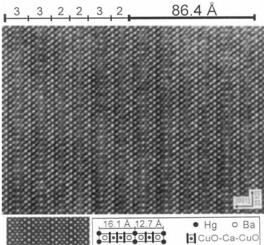
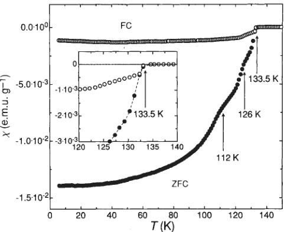
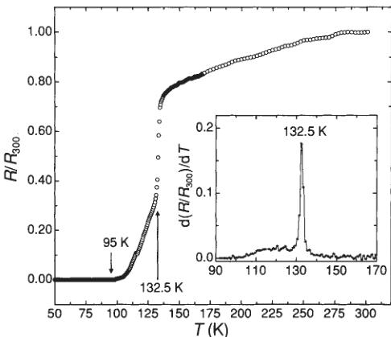
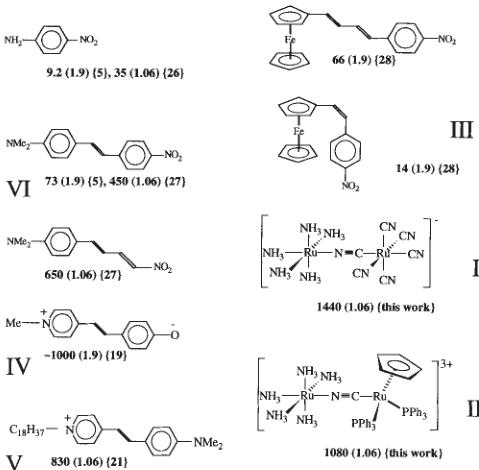

from the apparent size of the knots which for this electron density yields a mass about 1.5 orders of magnitude larger. Both figures should be raised. Iron will be depleted in the gas phase because it is preferentially incorporated in the dust grains within the molecular cloud \( ^{23} \) . If the grains are not decomposed in the shock, the mass derived by the first technique may be raised one or two orders of magnitude. Additionally, the core of each knot may not emit [Fe II]. We thus regard  \( 10^{-5} M_{\odot} \)  as a minimum mass.

Using the velocities of ref. 10, the present kinetic energy of all the knots is about  \( 10^{44} \)  erg, and initially would have been greater because the knots must have decelerated since ejection. It represents the luminous output of IRc2 ( \( 5 \times 10^{4} \)  solar luminosity,  \( L_{\odot} \) ) over at least a week \( ^{24} \) . This is large by comparison with most HH objects, but only  \( 10^{-3} \)  of the kinetic energy of the CO-emitting gas \( ^{12} \) .

Only a small fraction of the emitting  \( H_{2} \)  comes from the well-defined bow shocks in our images. The kinetic energy in the knots is only an order of magnitude greater than the internal energy stored in hot  \( H_{2} \)  (100  \( L_{\odot} \) , cooling in one year \( ^{25} \) ), so cannot provide the energy source for the bulk of the  \( H_{2} \)  emission. However, we cannot tell from our images whether the brighter  \( H_{2} \)  emission (bottom of Fig. 1) comprises many overlapping bows; if it does the knots there must be slower-moving to produce no [Fe II] emission. Hence we cannot rule out a wind-driven shock to maintain the bulk of the hot  \( H_{2} \) .

The outermost knots require less than 1,000 yr to traverse the distance from the centre of ejection. If deceleration occurs the time will be reduced. As the lifetime of stars like IRc2 is  \( \sim10^{7} \)  yr, we are privileged to see this phenomenon, and expect it to be rare elsewhere (although more evolved examples may be identified). We cannot say over what period the ejection took place. The images suggest an explosive event, ejecting debris with a range of velocities.

A possible origin for the ejection is an FU Orionis-type (Fouro) eruption. Fuors are young stars undergoing decadelong increases in luminosity, attributed to accretion disk instabilities \( ^{26} \) . Each event liberates  \( 10^{45-46} \)  erg of radiant energy. A conversion efficiency to kinetic energy approaching 100% would thus be required to produce the ejection in OMC-1, but we may speculate that scaled-up events accompany massive star formation.

A supernova offers an alternative explanation. Occurring deep within the molecular cloud, its evolution and characteristics would differ from typical remnants. Most of the expansion energy would be quickly radiated through infrared atomic fine structure and molecular cooling lines. A supernova model was considered by Chevalier \( ^{27} \)  to explain the broad  \( H_{2} \)  line emission \( ^{28} \)  in OMC-1. He postulated that  \( H_{2} \)  emission arose from many fast ( \( \sim100~km~s^{-1} \) ), dense ( \( \sim3\times10^{7}~cm^{-3} \) ) knots, but rejected the model after estimating that the bulk momentum in the CO-emitting gas \( ^{12} \)  was at least an order of magnitude less than the  \( \sim10^{4}~M_{\odot}~km~s^{-1} \)  estimated for a supernova remnant. These estimates are fairly uncertain. The momentum in the [Fe II] knots is 4–5 orders of magnitude smaller again.

Whether molecular shocks are excited through hydrodynamic jump-shocks or magnetically mediated continuous-shocks has been much debated \( ^{29,30} \) . Some form of bow-shock model \( ^{31} \)  is necessary to account for the constancy of  \( H_{2} \)  line ratios with position \( ^{32} \)  and the  \( \sim150~km~s^{-1} \)  wide profiles \( ^{28} \) . Discussion \( ^{33,34} \)  has focused on the brighter emission regions where bow shocks, if present, must overlap. Spatially resolved profile and line ratio measurements in the outer bows should resolve this debate.

It would be dangerous to infer from this single example that all HH objects associated with young outflows require explosive ejection. There is strong evidence that some HH objects form when jets from young stars impinge on ambient cloud material. Rather, this discovery highlights the need to search other star-forming regions to establish the statistics on such events.

Received 21 December 1992; accepted 18 March 1993.

1. Schwartz, R. D. Astrophys. J. 195, 631–642 (1975).
2. Schwartz, R. D. Rev. Astr. Astrophys. 21, 209–237 (1983).
3. Norman, C. A. & Silk, J. Astrophys. J. 228, 197–205 (1979).
4. Schwartz, R. D. Astrophys. J. 223, 884–900 (1978).
5. Cantó, J. & Rodríguez, L. F. Astrophys. J. 239, 982–987 (1980).
6. Becklin, E. E. & Neugebauer, G. Astrophys. J. 147, 799–802 (1967).
7. Downes, D., Genzel, R., Becklin, E. E. & Wynn-Williams, C. G. Astrophys. J. 244, 869–883 (1981).
8. Beckwith, S., Persson, S. E., Neugebauer, G. & Becklin, E. E. Astrophys. J. 223, 464–470 (1978).
9. Taylor, K. N. R., Storey, J. W. V., Sandell, G., Williams, P. M. & Zealey, W. J. Nature 311, 236–237 (1984).
10. Axon, D. J. & Taylor, K. Mon. Not. R. astr. Soc. 207, 241–261 (1984).
11. Taylor, K., Dyson, J. E., Axon, D. J. & Hughes, S. Mon. Not. R. astr. Soc. 221, 155–168 (1986).
12. Baily, J. & Lada, C. J. Astrophys. J. 265, 824–847 (1983).
13. Mundt, R. in Formation of Low Mass Stars (eds Dupree, A. K. & Lago, M. T. V. T.) 257–279 (Kluwer, Dordrecht, 1988).
14. Hartigan, P., Raymond, J. & Hartmann, L. Astrophys. J. 316, 323–348 (1987).
15. Mundt, R. in Protostars and Planets II (eds Black, D. C. & Matthews, M. S.) 414–433 (Univ. of Arizona, Tucson, 1985).
16. Graham, J. R., Wright, G. S. & Longmore, A. J. in Infrared Spectroscopy in Astronomy, Proc. 22nd ESLAB Symp. (ed. Kalediech, B.) 169–175 (ESA SP-290, 1989).
17. Kwan, J. Astrophys. J. 216, 713–723 (1977).
18. Draine, B. T., Roberge, W. G. & Dalgarno, A. Astrophys. J. 264, 485–507 (1983).
19. Hester, J. J. et al. Astrophys. J. 369, 175–178 (1991).
20. O'Dell, C. R., Wen, Z. & Hu, X. Astrophys. J. (in the press).
21. Cantó, J., Goudis, C., Johnson, P. G. & Meaburn, J. Astr. Astrophys. 85, 128–134 (1980).
22. Taylor, K. & Munch, G. Astr. Astrophys. 70, 359–366 (1978).
23. Harris, A. W. G. Cry. & Bromage, G. E. Astrophys. J. 284, 157–160 (1984).
24. Thronson, H. A. et al. Astr. J. 91, 1350–1356 (1986).
25. Burton, M. G. & Puxley, P. in The ISM in External Galaxies (eds Hollenbach, D. J. & Thronson, H. A.) 238–240 (NASA CP-3084 1990).
26. Hartmann, L. & Kenyon, S. J. Astrophys. J. 299, 462–478 (1985).
27. Chevalier, R. A. Astrophys. Lett. 21, 57–61 (1980).
28. Nadeau, D. & Geballe, T. R. Astrophys. J. 230, L169–L173 (1979).
29. Hollenbach, D. J., Chernoff, D. F. & McKee, C. F. in Infrared Spectroscopy in Astronomy, Proc. 22nd ESLAB Symp. (ed. Kalediech, B.) 245–258 (ESA SP-290, 1989).
30. Burton, M. G. Aust. J. Phys. 45, 462–485 (1992).
31. Smith, M. D. Mon. Not. R. astr. Soc. 253, 175–183 (1991).
32. Brand, P. W. J. L. et al. Mon. Not. R. astr. Soc. 236, 929–934 (1989).
33. Burton, M. G., Brand, P. W. J. L., Moorhouse, A. & Geballe, T. R. in Infrared Spectroscopy in Astronomy, Proc. 22nd ESLAB Symp. (ed. Kalediech, B.) 281–285 (ESA SP-290, 1989).
34. Brand, P. W. J. L., Toner, M. P., Geballe, T. R. & Webster, A. S. Mon. Not. R. astr. Soc. 237, 1009–1018 (1989).

# Superconductivity above 130 K in the Hg–Ba–Ca–Cu–O system

A. Schilling, M. Cantoni, J. D. Guo & H. R. Ott

Laboratorium für Festkörperphysik, ETH Hönggerberg, 8093 Zürich, Switzerland

THE recent discovery \( ^{1} \)  of superconductivity below a transition temperature ( \( T_{c} \) ) of 94 K in HgBa \( _{2} \) CuO \( _{4+\delta} \)  has extended the repertoire of high- \( T_{c} \)  superconductors containing copper oxide planes embedded in suitably structured (layered) materials. Previous experience with similar compounds containing bismuth and thallium instead of mercury suggested that even higher transition temperatures might be achieved in mercury-based compounds with more than one CuO \( _{2} \)  layer per unit cell. Here we provide support for this conjecture, with the discovery of superconductivity above 130 K in a material containing HgBa \( _{2} \) Ca \( _{2} \) Cu \( _{3} \) O \( _{1+x} \)  (with three CuO \( _{2} \)  layers per unit cell), HgBa \( _{2} \) CaCuO \( _{2} \)  \( _{0.6+x} \)  (with two CuO \( _{2} \)  layers) and an ordered superstructure comprising a defined sequence of the unit cells of these phases. Both magnetic and resistivity measurements confirm a maximum transition temperature of  \( \sim \) 133 K, distinctly higher than the previous established record value of 125–127 K observed in Tl \( _{2} \) Ba \( _{2} \) Ca \( _{2} \) Cu \( _{3} \) O \( _{10} \)  (refs 2, 3).

The structural similarity of  \( HgBa_{2}CuO_{4+\delta} \)  (Hg-120; ref. 1) to a member of the thallium-containing family of copper oxides,  \( TlBa_{2}CuO_{5} \)  (Tl-1201), suggests the existence of compounds with the general composition  \( HgBa_{2}Ca_{n-1}Cu_{n}O_{2n+2+\delta} \) . The transition temperatures of the thallium-containing analogues,  \( TlBa_{2}Ca_{n-1}Cu_{n}O_{2n+3} \) , range from  \( <10~K \)  (n=1, ref. 4) to  \( \sim110~K \)  (n=3, ref. 5). In this sense, transition temperatures exceeding 100 K may be expected also in the Hg-Ba-Ca-Cu-O
 

(HBCCO) system. Although the successful synthesis of  \( HgBa_{2}RCu_{2}O_{6+x} \)  (Hg-1212) with R being (Eu, Ca) has been reported, no superconductivity was found in that system \( ^{6} \) .

We prepared the samples following the procedure described in ref. 1 for Hg-1201. A precursor material with the nominal composition  \( Ba_{2}CaCu_{2}O_{5} \)  was obtained from a well ground mixture of the respective metal nitrates, sintered at  \( 900^{\circ}C \)  in  \( O_{2} \) . After regrinding and mixing with powdered HgO, the pressed pellets were sealed in evacuated quartz tubes. These tubes were placed horizontally in tight steel containers and held at  \( 800^{\circ}C \)  for 5 hours. On opening the containers, we found that the quartz tubes were broken. It was not possible to reconstruct at which stage of the heating, cooling or opening procedure this happened. Some of the pellets were finally annealed for 5 hours at  \( 300^{\circ}C \)  in flowing oxygen. During the preparation and the characterization of the samples, all possible measures were taken to avoid any contamination with toxic mercury or mercury-containing compounds.

After annealing, the resulting black material was characterized by X-ray diffraction using the Guinier technique, by energy-dispersive X-ray spectrometry (EDS), and by selected-area electron-diffraction techniques (SAED) and high-resolution transmission electron microscopy (HRTEM). The EDX analysis showed that the samples are composites of isolated grains of  \( BaCuO_{2} \)  ( \( \sim30\% \) ),  \( CuO \)  ( \( \approx30\% \) ), an unidentified oxide containing Hg, Ca and Cu ( \( \sim15\% \) ), an oxide with Ca and Cu ( \( <5\% \) ), and  \( \sim5\% \)  impurities with unspecified composition. About 15% of the total sample volume consisted of plate-like grains containing Hg, Ba, Ca and Cu. Some of these were investigated in detail by SAED and HRTEM techniques on a Phillips CM 30-ST transmission electron microscope. Both techniques showed clearly that these identified grains consist mostly of pure  \( HgBa_{2}Ca_{2}Cu_{3}O_{8+x} \)  (Hg-1223), disordered mixtures of Hg-1223 and Hg-1212, and a periodic stacking sequence of the latter unit cells. We found no grains or intergrowths associated with the Hg-1201 structure. As the volume fraction of the phases of interest is fairly small, we could not measure the lattice parameters precisely with the X-ray Guinier technique. Nevertheless, from the SAED patterns, we deduce the lattice constants  \( c=12.7(2)\mathring{A} \)  and  \( c=16.1(3)\mathring{A} \)  for the tetragonal Hg-1212 and Hg-1223 units, respectively, and  \( a=3.93(7)\mathring{A} \) , valid for both types.

FIG. 1 HRTEM image of a grain in [100] orientation, containing layers of Hg-1212 and Hg-1223. Here, they are stacked in a periodic sequence forming a supercell with  \( c \approx 86.4 \AA \)  (see text). A contrast simulation ( \( c_{s} = 1.1 \)  mm,  \( E = 300 \)  keV, defocus -870 Å, specimen thickness 23 Å) is inserted. The stacking sequence in terms of the number of Cu-O planes and an enlarged schematic drawing of the involved unit cells are included.

of compounds. The results for Hg-1212 are in good agreement with the values obtained in ref. 6. Figure 1 is a representative HRTEM image showing, as an example, a stacking containing both Hg-1212 and Hg-1223 layers. The stacking sequence 1223/1223/1212/1212/1223/1213 with a supercell c-axis  \( c \approx 86.4 \AA \)  extends beyond 2,000 Å, thus qualifying this superstructure as a proper phase. HRTEM images as well as SAED patterns gave no evidence for the presence of HgO-double layers.

We measured the magnetic susceptibility of the specimens using a SQUID-magnetometer (Quantum Design). Figure 2 shows the result obtained for an oxygen-annealed sample. In an external field  \( H = 27 \, Oe \) , the zero-field cooling susceptibility (ZFC) amounts to  \( \sim 100\% \)  of  \( 1/4\pi \)  at temperature  \( T = 6 \, K \) , indicating complete magnetic screening. For this estimate, we

FIG. 2 Zero-field cooling (ZFC) and field cooling (FC) susceptibilities  \( \chi(T) \)  of one of the investigated oxygen-annealed HBCCO samples, measured in  \( H=27~Oe \) . The ZFC curve indicates the presence of several different superconducting phases.

FIG. 3 Resistivity  \( R(T) \)  of an annealed HBCCO specimen, normalized with respect to the resistance value  \( R(300) \approx 0.10 \Omega \) . The inset displays the temperature derivative  \( dR/dT \)  to show the maximum resistivity drop at  \( T \approx 132.5 K \) . Zero resistance is attained at  \( T = 95 K \) .
 

assumed an average density  \( \rho\approx6~g~cm^{-3} \) . The field-cooling (FC) susceptibility reaches  \( \sim10\% \)  of the maximum possible value. This value represents a lower-bound value for the true superconducting volume fraction in the sample, indicating the bulk nature of superconductivity. The onset temperature of diamagnetism is  \( T_{c}\approx133.5~K \) , seen both in FC and ZFC experiments (see Fig. 2, inset). The FC susceptibility reaches  \( \sim60\% \)  of its full low-temperature value at 125 K, strongly indicating that the phase with  \( T_{c}\approx133.5~K \)  dominates all other superconducting phases. In the ZFC curves, additional features are seen at 126 K and 112 K, which we ascribe to different superconducting phases with lower transition temperatures.

The resistivity R as a function of temperature T of an annealed sample is shown in Fig. 3. At  \( T \approx 132.5 \, K \) ,  \( R(T) \)  drops sharply with a maximum in the differential dR/dT, and reaches zero at  \( T = 95 \, K \)  within the resolution of the four-probe a.c.-resistance bridge used. This temperature is still considerably higher than the zero-resistance temperature  \( T \approx 35 \, K \) , reported for Hg-1201 (ref. 1). The final oxygen treatment was very effective in increasing the critical temperature; the as-sintered samples showed a maximum  \( T_{c} \)  of only  \( \sim 117 \, K \) .

## Large second-order optical polarizabilities in mixed-valency metal complexes

W. M. Laidlaw \( ^{*} \) , R. G. Denning \( ^{*} \)  \( ^{\ddagger} \) , T. Verbiest \( ^{\dagger} \) , E. Chauchard \( ^{\ddagger} \)  & A. Persoons \( ^{\dagger} \) 
* Inorganic Chemistry Laboratory, South Parks Road, Oxford, OX1 3QR, UK
† Laboratory of Chemical and Biological Dynamics, University of Leuven, Celestijnenlaan 200D, 3001 Leuven, Belgium

THE potential development of optoelectronic devices based on the nonlinear polarization of molecular materials has aroused much recent interest \( ^{1,2} \) . The search for large second-order electric susceptibilities (that is, proportional to the square of an applied electric field) has concentrated on acentric organic or organometallic chromophores with an organic  \( \pi \) -electron system coupling electron donor and acceptor groups \( ^{3-6} \) . It is conceivable that mixed-valence compounds characterized by an intervalence charge-transfer (IVCT) transition \( ^{7} \) , in which the donor and acceptor centres are both metal atoms, might also have the potential to provide a large second-order response \( ^{8} \) , but this possibility has not been widely explored. Here we report the first hyperpolarizability,  \( \beta \) , of a bimetallic complex ion,  \( [(CN)_{5}Ru-\mu-CN-Ru(NH_{3})_{5}]^{2-} \)  (I in Fig. 1), and a novel organometallic analogue,  \( [(η^{5}-C_{5}H_{5})Ru(PPh_{3})_{2}-\mu-CN-Ru(NH_{3})_{5}]^{3+} \)  (II). Measurements of  \( \beta \)  (which is related to the bulk second-order response) in solution at a wavelength of 1,064 nm using the newly developed hyper-Rayleigh scattering technique \( ^{9,10} \)  give values greater than  \( 10^{-27} \)  e.s.u., which are among the largest reported for solution species. The ease with which the energy of the IVCT transition can be modified suggests that there may be considerable potential for this class of chromophore in nonlinear optical devices.

The polarization induced by an intense laser beam includes components that are nonlinear in the optical field \( ^{11} \) . In molecular materials, the susceptibility tensor  \( \chi^{(2)} \) , which determines the second-order response, can be related to underlying molecular hyperpolarizability tensors,  \( \beta \) . There are important applications for materials with large values of  \( \chi^{(2)} \) , such as the frequency-doubling of red III–V semiconductor lasers to provide compact blue sources for high-density optical storage \( ^{12} \) , and the electro-optical modulation and switching of telecommunications signals \( ^{13} \) ; both applications require waveguide device structures.
At present we cannot relate the different superconducting phases to crystallographic phases. There is no unambiguous proof that the occurrence of superconductivity in our samples stems from the  \( HgBa_{2}Ca_{n-1}Cu_{n}O_{2n+2+\delta} \)  phases. In analogy with the thallium- and bismuth-based copper oxides \( ^{5} \) , however, we suggest that in the HBCO system  \( T_{c} \)  also increases with the number of Cu-O planes per unit cell, and conclude that Hg-1223 is responsible for superconductivity at  \( \sim133 \)  K. This would be consistent with the large relative superconducting volume fraction at 125 K, in view of the dominance of Hg-1223 observed in the grains investigated microscopically.

Received 14 April; accepted 15 April 1993.
1. Putilin, S. N., Antipov, E. V., Chmaissem, O. & Marezio, M. Nature 362, 226–228 (1993).
2. Kaneko, T., Yamauchi, H. & Tanaka, S. Physica C178, 377–382 (1991).
3. Parkin, S. S. P. et al. Phys. Rev. Lett. 60, 2539–2542 (1988).
4. Gopalakrishnan, I. K., Yakhmii, J. V. & Iyer, R. M. Physica C175, 183–186 (1991).
5. Parkin, S. S. P. et al. Phys. Rev. Lett. 63, 750–753 (1988).
6. Putilin, S. N., Bryntse, I. & Antipov, E. V. Mat. Res. Bull. 26, 1299–1307 (1991).

ACKNOWLEDGEMENTS. We thank S. Ritsch for his help in the structural characterization. This work was supported in part by the Schweizerische Nationalfonds zur Förderung der wissenschaftlichen Forschung.

In centrosymmetric molecules  \( \beta \)  is zero, but even for non-centrosymmetric molecules with large hyperpolarizability the bulk susceptibility  \( \chi^{(2)} \)  vanishes unless the distribution of molecular orientations is also acentric \( ^{11} \) . A large value of  \( \beta \)  is, therefore, the first priority in an efficient molecular material, whether it be organic, organometallic or inorganic, but to maximize  \( \chi^{(2)} \)  it is also essential to establish the appropriate molecular alignment. To achieve this in crystalline materials, whilst also defining a waveguide structure of high optical quality,

FIG. 1 The first number near each molecule is the magnitude of  \( \beta \)  in units of  \( 10^{-30} \)  e.s.u. The wavelength of measurement in  \( \mu \) m is shown in parentheses. References are enclosed in brackets. The complex anion I was purified by first cation and then anion exchange chromatography, and recrystallized from aqueous methanol. The product is the lithium trihydrate salt,  \( \left[\left(\mathrm{CN}\right)_{5}\mathrm{Ru}-\mu-\mathrm{CN}-\mathrm{Ru}\left(\mathrm{NH}_{3}\right)_{5}\right]\mathrm{Li}\cdot3\mathrm{H}_{2}\mathrm{O} \) . Analysis for  \( C_{6}H_{12}L_{11}N_{11}O_{8}Ru_{2}(M_{s}=504.1) \)  gives the following results. Found% (Calc. %): C=14.6(14.3), H=4.1(4.2), N=30.3(30.6). The tris-trifluoromethanesulphonate salt of II was prepared by reacting  \( \left[\left(\eta^{5}-C_{6}H_{5}\right)\mathrm{Ru}\left(\mathrm{PPh}_{3}\right)_{2}\mathrm{CN}\right] \)  with  \( \left[\mathrm{Ru}\left(\mathrm{NH}_{3}\right)_{5}\left(\mathrm{OSO}_{2}C_{7}\mathrm{F}\right)_{3}\right]\left(\mathrm{CF}_{3}\mathrm{SO}_{3}\right)_{2} \)  in acetone, followed by recrystallization from a mixture of dichloromethane and diethylether, to give  \( \left[\left(\eta^{5}-C_{6}H_{5}\right)\mathrm{Ru}\left(\mathrm{PPh}_{3}\right)_{2}-\mu-\mathrm{CN}-\mathrm{Ru}\left(\mathrm{NH}_{3}\right)_{5}\right]\left(\mathrm{CF}_{3}\mathrm{SO}_{3}\right)_{3} \) . Analysis for  \( C_{4}H_{5}O_{5}F_{9}N_{5}O_{9}P_{2}Ru_{2}S_{3} \)  ( \( M_{r}=1350.16 \) ) gives found% (Calc. %): C=40.0(40.0), H=3.7(3.7), N=6.0(6.2).
 
